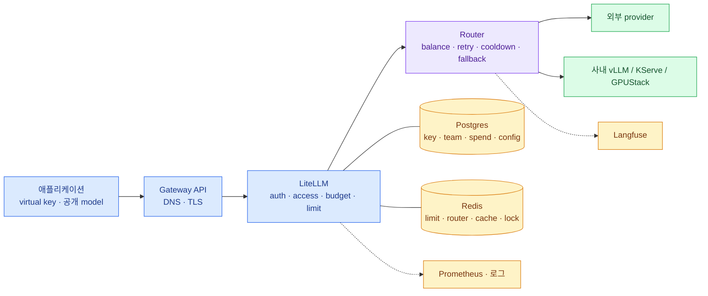

import { LinkCard } from '@astrojs/starlight/components';

> LiteLLM 운영을 한 문장으로 줄이면 **공개 모델 계약을 공유 상태와 검증된 실패 정책으로 지키는 일**이다

## 전체 지도

이 그림에서 장애를 읽는 순서는 왼쪽에서 오른쪽이다. 연결이 됐는지, 정책을 통과했는지, 어느 deployment를
골랐는지, upstream이 응답했는지, 사후 기록이 도착했는지 확인한다.

## 설계 결정 열 가지

1. 중앙 운영 대상은 LiteLLM **Proxy**이며 Python SDK와 혼합하지 않는다.
2. 애플리케이션은 provider가 아니라 **공개 `model_name` 계약**을 본다.
3. 같은 group의 deployment 분산과 다른 group으로 가는 fallback을 구분한다.
4. master key는 관리자만 쓰고 production workload마다 scoped identity를 준다.
5. LiteLLM Pod는 worker 1개로 수평 확장한다.
6. Postgres와 Redis를 각각 영속 기록과 분산 coordination으로 운영한다.
7. migration은 serving Pod가 아니라 별도 Job 한 곳만 실행한다.
8. internal-only 요청은 외부 fallback으로 데이터 경계를 넘지 않는다.
9. Prometheus·로그와 Langfuse, spend ledger가 답하는 질문을 구분한다.
10. release와 정책 변경을 실제 실패 주입·streaming까지 포함해 검증한다.

## production 준비 체크리스트

### 모델 계약

- [ ] 공개 model마다 endpoint·streaming·tool·context·data zone·cost 등급이 문서화됐다.
- [ ] 실제 deployment와 fallback이 같은 계약 또는 승인된 계약 변경을 지킨다.
- [ ] 사내 vLLM과 외부 provider를 각각 직접·gateway 경로로 시험했다.

### 접근과 상태

- [ ] workload별 virtual key/JWT, team, model access, RPM·TPM·budget이 있다.
- [ ] master key와 provider key가 애플리케이션 Secret에 없다.
- [ ] Postgres backup 복원과 salt key 동시 복구를 시험했다.
- [ ] Redis failover 뒤 전역 limit·cooldown·key invalidation을 시험했다.

### Kubernetes

- [ ] 정확한 chart/image version과 digest, signature를 고정했다.
- [ ] 2개 이상 replica, anti-affinity/topology spread와 PDB가 있다.
- [ ] liveness·readiness와 graceful drain이 실제 rollout에서 동작한다.
- [ ] HPA max replica 기준으로 DB·Redis·provider 상한을 계산했다.
- [ ] migration Job 실패가 serving rollout을 중단한다.

### 보안과 관측

- [ ] TLS와 private CA가 모든 필요한 hop에서 검증된다.
- [ ] provider·Langfuse egress가 승인된 목적지로 제한된다.
- [ ] prompt·response·user/key 정보의 redaction과 retention이 정해졌다.
- [ ] RED, DB·Redis, retry/fallback과 callback failure alert가 있다.
- [ ] synthetic 요청이 LiteLLM 2xx, spend와 Langfuse trace까지 한 바퀴 돈다.

## 장애 대응 카드

| 증상 | 첫 확인 | 하지 않을 것 |
|---|---|---|
| readiness 503 | Postgres 연결·migration | liveness까지 provider 호출로 바꾸기 |
| 401/403 급증 | key·model access·config 수렴 | master key를 앱에 배포해 우회 |
| 429 불일치 | Redis·process 수·limit 주체 | replica만 늘려 해결 |
| p99 급증 | in-flight·attempt별 latency·DB/Redis | timeout과 retry를 함께 무작정 늘리기 |
| 특정 model 5xx | selected deployment·upstream | 모든 model을 같은 외부 fallback으로 보내기 |
| Langfuse trace 유실 | callback failure·DNS/TLS/Secret | LLM 요청도 실패했다고 단정 |

## 이 덱 다음

LiteLLM의 요청 경로를 이해했으면 다음은 Langfuse에서 **한 LLM 호출이 어떤 trace·observation·generation으로
저장되고, 그 데이터를 어떤 저장소와 retention으로 운영하는가**를 보는 순서다. 두 제품을 붙일 때는
9장의 correlation contract와 content logging 경계를 출발점으로 삼는다.

## 다시 볼 장

- [1. 요청의 일생](/litellm/01-request-life/) — 장애가 멈춘 순서를 다시 잡을 때
- [4. Routing과 신뢰성](/litellm/04-routing-reliability/) — retry·fallback 정책을 바꿀 때
- [5. Kubernetes 운영 구조](/litellm/05-k8s-architecture/) — replica와 상태 배치를 검토할 때
- [9. 관측과 Langfuse 연동](/litellm/09-observability/) — trace 유실과 민감정보 경계를 다룰 때
- [11. 장애 진단](/litellm/11-troubleshooting/) — 실제 incident에서 진단 사다리가 필요할 때

<LinkCard
  title="LiteLLM 개요로 돌아가기"
  description="덱의 구성과 다른 운영 덱과의 경계를 다시 본다."
  href="/litellm/"
/>
