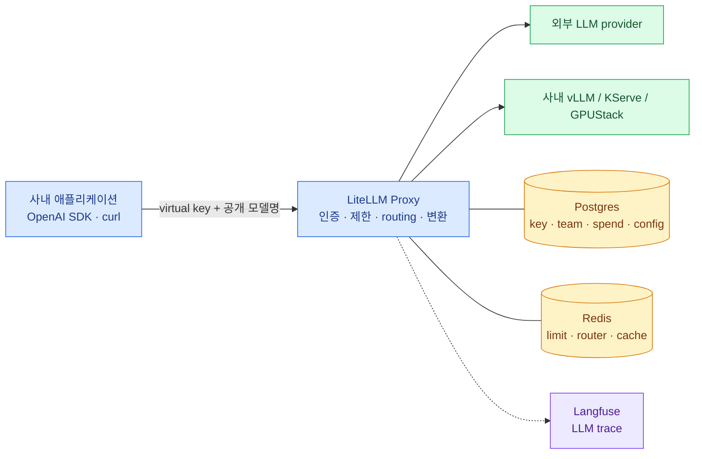

import { LinkCard, LinkButton } from '@astrojs/starlight/components';
import DeckMap from '../../../components/docs/DeckMap.astro';

> LiteLLM은 모델을 실행하는 서버가 아니다 — **모델을 쓰는 모든 요청이 거치는 정책 집행 지점**이다

서비스마다 OpenAI·Anthropic·사내 vLLM의 주소와 key를 직접 들고 있으면 모델 하나를 바꿀 때마다
여러 애플리케이션을 고쳐야 한다. 누가 얼마를 썼는지, provider가 막혔을 때 어디로 보낼지,
민감한 prompt가 어느 관측 도구로 나갔는지도 한곳에서 답하기 어렵다.

LiteLLM Proxy를 사이에 두면 애플리케이션은 **안정된 API 주소와 공개 모델명**만 본다.
플랫폼 팀은 그 뒤에서 인증·모델 접근·budget·rate limit·load balancing·fallback·provider 변환을 관리한다.
이 덱은 기능 목록보다 한 요청이 지나가는 순서와 그 순서가 의존하는 상태를 중심으로 읽는다.

**2026년 8월 18일 기준** 공식 문서를 확인했다. 릴리스가 잦은 제품이므로 기능명보다 운영 원칙을
앞에 두고, version은 실제 도입 때 image digest와 chart version을 함께 검증하는 것을 전제로 한다.

<LinkButton href="/litellm/00-position/" icon="right-arrow">첫 장부터 읽기</LinkButton>

## 구성

<DeckMap
  steps={[
    { label: '0~1장', href: '/litellm/00-position/', title: '자리와 요청의 일생', tone: 'key',
      desc: 'Proxy와 SDK의 경계 · 인증부터 provider 응답 이후까지',
      note: 'LiteLLM은 요청의 어느 순간에 무엇을 결정하는가' },
    { label: '2~4장', href: '/litellm/02-model-config/', title: '제어 정책', tone: 'zone',
      desc: '공개 모델명과 실제 deployment · key·team·budget · routing·fallback',
      note: '누가 무엇을 얼마나 쓰며 실패하면 어디로 가는가' },
    { label: '5~7장', href: '/litellm/05-k8s-architecture/', title: '온프렘 Kubernetes', tone: 'warn',
      desc: 'Pod·Service·Gateway · Helm 배포 · Postgres·Redis·migration',
      note: '여러 replica가 하나의 gateway처럼 동작하려면 무엇을 공유해야 하는가' },
    { label: '8~11장', href: '/litellm/08-security/', title: '운영', tone: 'bad',
      desc: 'secret·egress·사내 CA · metrics·Langfuse · upgrade·장애 진단',
      note: '평소 무엇을 보고, 장애 때 어느 경계부터 가르는가' },
    { label: '12~13장', href: '/litellm/12-glossary/', title: '마무리', tone: 'mute',
      desc: '용어 사전 · 전체 지도 · 운영 체크리스트' },
  ]}
/>

## 전체를 관통하는 두 문장

**공개 모델명은 계약이고 deployment는 구현이다.** 애플리케이션이 `chat-general`만 요청해도 그 뒤에는
외부 provider 두 곳과 사내 vLLM이 있을 수 있다. 실제 endpoint가 바뀌어도 계약을 유지하는 것이 gateway의
첫 번째 가치다. 그래서 모델 등록은 "어떤 API를 붙일까"보다 "이용자에게 어떤 안정된 이름과 품질을
약속할까"에서 시작한다.

**고가용성은 Pod 수가 아니라 공유 상태에서 완성된다.** replica를 세 개로 늘려도 Redis 없이 각각
rate limit을 세면 이용자는 세 배의 한도를 받는다. Postgres migration을 모든 Pod가 동시에 실행하면 rollout이
schema 경쟁이 된다. LiteLLM Pod는 수평 확장하기 쉽지만, 하나처럼 행동하게 만드는 Postgres·Redis·migration
경계를 먼저 설계해야 한다.

## 다른 덱과의 경계

- 모델 Pod와 GPU 배치는 [GPUStack](/gpustack/) 또는 [온프렘 GPU 플랫폼](/gpu-platform/)이 맡는다.
- Gateway API·TLS·DNS·SSO·Postgres 기반은 [온프렘 쿠버네티스](/onprem/)이 맡는다.
- Prometheus·Loki·Tempo·Grafana 운용은 [관측](/observability/)이 맡는다.
- Langfuse는 이 덱의 9장에서 callback과 데이터 경계까지만 다루고 별도 덱으로 이어 간다.

<LinkCard
  title="0. LiteLLM의 자리"
  description="Proxy와 SDK, API gateway와 model serving 사이의 경계를 먼저 긋는다."
  href="/litellm/00-position/"
/>
