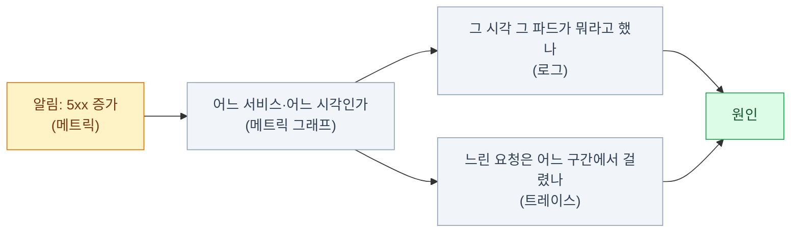
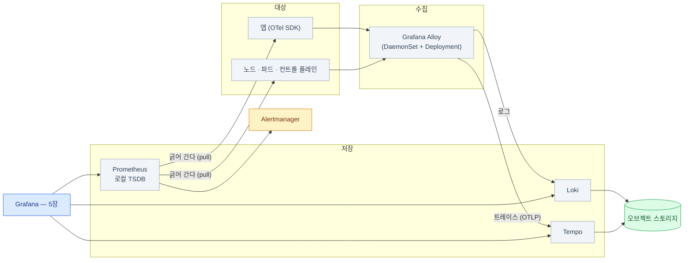

import { Tabs, TabItem, LinkCard } from '@astrojs/starlight/components';
import TermIntro from '../../../components/docs/TermIntro.astro';

> 셋을 따로 두면 셋 다 반쪽이다 — **이어 붙이는 장치**가 이 덱의 진짜 주제다

<TermIntro
  terms={[
    ['메트릭 · 로그 · 트레이스', 'Metrics · Logs · Traces', '관측의 세 신호. 각각 **얼마나 · 무슨 일이 · 어디서 느렸나**에 답한다.'],
  ]}
/>

## 문제 — `kubectl logs`로는 안 된다

클러스터에 서비스가 몇 개만 넘어가도 이런 일이 벌어진다.

| 상황 | `kubectl` 만으로 |
|---|---|
| "어제 새벽에 느렸다는데요" | 파드가 재시작됐으면 **로그가 없다** |
| "어느 서비스가 문제죠?" | 파드를 하나씩 열어 본다 |
| "언제부터 이랬죠?" | 알 수 없다 — 지난 값이 없다 |
| "이 API가 왜 3초씩 걸리죠?" | 어느 구간에서 걸리는지 안 보인다 |
| "디스크 언제 찹니까" | 지금 값만 보인다. 추세가 없다 |

공통점은 **지금·여기밖에 못 본다**는 것이다. 관측 스택은 그 셋을 각각 채운다 —
**과거를 남기고, 전체를 모으고, 구간을 가른다.**

## 세 신호 — 무엇에 답하나

| 신호 | 답하는 질문 | 형태 | 비용 | 이 덱 |
|---|---|---|---|---|
| **메트릭** | 얼마나? 언제부터? 추세는? | 시간 × 숫자 | 싸다 (집계된 값) | [2장](/observability/02-prometheus/) |
| **로그** | 정확히 무슨 일이 있었나? | 시각 + 텍스트 | 중간 (양이 많다) | [3장](/observability/03-loki/) |
| **트레이스** | 한 요청이 **어디서** 느렸나? | 요청 하나의 구간 트리 | 비싸다 (샘플링한다) | [4장](/observability/04-tempo/) |

### 같은 사건을 셋으로 보면

새벽 3시 12분, 주문 API의 실패가 늘었다. **같은 사건이 세 신호에서 이렇게 보인다.**

<Tabs>
<TabItem label="메트릭 — 얼마나">

```text
http_requests_total{service="orders", method="POST", status="500"}

  03:00  → 12042
  03:05  → 12043
  03:10  → 12044
  03:12  → 12190      ← 여기서부터 급격히 는다
  03:15  → 12604
```

**숫자 하나가 시간축을 따라 늘어선 것**이 전부다. 어느 서비스에서 몇 건이 언제부터
늘었는지는 정확히 알 수 있지만, **왜인지는 이 안에 없다.**
그래프에서 읽어 낼 수 있는 것은 딱 세 가지다 — **크기 · 시점 · 추세.**

</TabItem>
<TabItem label="로그 — 무슨 일이">

```text
03:12:07  orders-7d9f-x8k2p  ERROR  {"msg":"order failed","order_id":"A-8821",
                                     "err":"inventory: context deadline exceeded",
                                     "trace_id":"4bf92f3577b34da6"}
```

**메트릭이 못 주는 문장이 여기 있다** — `inventory` 호출이 타임아웃됐다.
대신 이 한 줄만으로는 **이게 평소보다 많은 건지** 알 수 없다.
초당 3건이 원래 그런 서비스일 수도 있다.

끝의 `trace_id`를 눈여겨본다. **이 값 하나가 다음 탭으로 가는 문**이다.

</TabItem>
<TabItem label="트레이스 — 어디서">

```text
trace 4bf92f3577b34da6                                 총 3.2s
├─ orders  POST /orders                       3.20s
│  ├─ auth  verify                            0.01s
│  ├─ inventory  GET /stock                   2.85s   ← 여기
│  │  └─ postgres  SELECT ... FOR UPDATE      2.80s   ← 진짜 여기
│  └─ payments  POST /charge                  0.30s
```

**3.2초 중 2.8초가 재고 DB의 잠금 대기**였다. 이건 메트릭으로도 로그로도 못 본다 —
로그로 하려면 서비스마다 시각을 찍고 사람이 눈으로 맞춰야 하는데,
초당 수백 요청이면 **어느 로그가 어느 요청인지부터** 문제다.

</TabItem>
</Tabs>

:::tip[핵심 — 조사는 셋을 순서대로 밟는다]
**메트릭이 "언제·얼마나"로 범위를 좁히고 → 로그가 "무슨 일"로 문장을 주고 →
트레이스가 "어디서"로 지점을 찍는다.**
셋 중 하나가 없으면 그 단계에서 조사가 추측으로 바뀐다.
:::



### 한 신호만 있으면 어디서 막히나

셋 중 하나만 세우고 나머지를 미뤘을 때 실제로 부딪히는 벽이다.

| 가진 것 | 답할 수 있다 | 막히는 자리 |
|---|---|---|
| 메트릭만 | "03:12부터 5xx가 늘었다" | **왜** 늘었는지 — 에러 메시지가 없다 |
| 로그만 | "`connection reset`이 찍혔다" | 이게 **평소보다 많은 건지** — 기준선이 없다 |
| 메트릭 + 로그 | 대부분의 장애 | 서비스 여러 개를 건너는 지연 — **어느 홉인지** |
| 셋 다 | 위 전부 | 앱 안의 함수 단위 (→ 프로파일링의 영역) |

**메트릭 + 로그까지가 운영의 8할**이고, 트레이스는 서비스가 서로 많이 부르기 시작할 때
값이 급격히 오른다. 도입 순서를 정하는 근거가 이 표다.

## 셋을 잇는 장치 셋

<TermIntro
  title="이 절에서 처음 나오는 말"
  terms={[
    ['exemplar', '표본 링크', '메트릭 한 점에 **대표 트레이스 ID를 하나 매다는 것**. 그래프의 튄 점에서 실제 요청 하나로 건너간다.'],
  ]}
/>

위 탭에서 로그의 `trace_id` 하나가 트레이스로 가는 문이 됐다.
**그 문이 세 개 있고, 이 덱의 결론은 그 셋을 설정하는 것**이다.

| 장치 | 어디서 어디로 | 무엇이 필요한가 | 비용 |
|---|---|---|---|
| **로그의 `trace_id`** | 로그 → 트레이스 | 앱이 로그에 trace ID를 한 필드 더 찍는다 | **가장 싸다.** 여기서 시작한다 |
| **exemplar** | 메트릭 → 트레이스 | 앱이 히스토그램에 대표 trace ID를 매단다 + Prometheus 설정 | 중간 |
| **trace to logs** | 트레이스 → 로그 | Grafana 데이터소스 설정만 | 설정 한 번 |

셋 다 [5장](/observability/05-grafana/)에서 실제로 연결한다.
**저장소 셋을 세우는 것보다 이 셋을 잇는 것이 어렵고, 그래서 값지다.**

## 스택 전체 그림

<TermIntro
  title="그림을 읽기 위한 말"
  terms={[
    ['수집기', 'Collector · Agent', '앱과 노드에서 신호를 모아 저장소로 보내는 중간 프로세스. 이 덱에서는 Grafana Alloy가 맡는다.'],
    ['스크랩', 'Scrape', 'Prometheus가 대상의 `/metrics`를 **주기적으로 긁어 오는 것**. 로그·트레이스가 밀어 넣는 방식과 방향이 반대다.'],
  ]}
/>

이 덱이 쓰는 조합이다. **Grafana Labs 스택으로 통일하는 이유는 저장소가 하나로 모이기 때문**이다 —
Loki도 Tempo도 오브젝트 스토리지에 쓴다. 저장소를 한 종류로 줄이는 건 큰 이득이다.



| 자리 | 무엇 | 왜 그것 |
|---|---|---|
| 수집 | **Grafana Alloy** | 로그·트레이스·메트릭을 한 에이전트로. **Promtail은 2026-03 EOL** |
| 메트릭 | **Prometheus** | pull 모델과 쿠버네티스 생태계의 사실상 표준. 3.13이 LTS |
| 로그 | **Loki** | 인덱스가 라벨뿐이라 가볍고, **chunk를 오브젝트 스토리지에** 둔다 |
| 트레이스 | **Tempo** | 마찬가지로 **블록을 오브젝트 스토리지에**. 트레이스 ID 조회에 인덱스가 필요 없다 |
| 조회 | **Grafana** | 셋을 한 창에서 오가게 하는 것이 핵심 가치 |
| 알림 | **Alertmanager** | 라우팅·중복 제거·억제·침묵 |

:::caution[함정 — 저장소가 이 그림의 급소다]
Loki와 Tempo는 **오브젝트 스토리지가 없으면 아예 못 뜬다.** "나중에 붙이지"가 안 되는
전제라서, 스택을 세우는 순서에서 이게 맨 앞이다. 그 저장소를 **어디에** 두느냐 —
특히 감시 대상과 같은 클러스터에 두면 안 되는 이유 — 는
[온프렘 덱 6장](/onprem/06-minio/)과 [8장](/onprem/08-observability/)에 있다.
:::

### 수집기를 하나로 통일한다

에이전트가 신호마다 따로면 DaemonSet이 세 개가 되고, 설정도 업그레이드도 세 배가 된다.

| 후보 | 성격 | 고를 때 |
|---|---|---|
| **Grafana Alloy** | OTel 컬렉터 기반 + Grafana 스택 통합이 매끄럽다 | LGTM 스택을 쓴다면 기본값 |
| **OpenTelemetry Collector** | 벤더 중립 원본 | 나중에 백엔드를 갈아탈 여지를 크게 두고 싶을 때 |
| ~~Promtail~~ | 로그 전용 | **2026-03-02 EOL. 새로 쓰지 않는다** |

:::caution[함정]
검색으로 나오는 Loki 설치 가이드는 **대부분 아직 Promtail 기준**이다.
그대로 따라 하면 EOL된 에이전트를 새로 배포하게 된다.
Loki 문서의 Alloy 마이그레이션 도구가 Promtail 설정을 자동 변환해 주니,
**기존 설정이 있으면 변환부터** 한다.
:::

:::tip[핵심 — 메트릭만 경로가 다르다]
그림을 다시 보면 **메트릭 화살표만 방향이 반대**다. 로그·트레이스는 Alloy가 **밀어 넣지만**,
Prometheus는 대상을 **긁으러 간다.** 그래서 "긁으러 갔는데 없더라"(`up == 0`)가
그 자체로 신호가 되고, 방화벽 방향도 반대다 ([2장](/observability/02-prometheus/)).
:::

## 라벨 조합이 너무 많아지는 문제 — 카디널리티

<TermIntro
  title="이 문제의 이름"
  terms={[
    ['시계열', 'Time Series', '이름과 라벨 조합 하나에 붙은 (시각, 값) 수열. **라벨 조합이 하나 늘면 시계열이 하나 는다.**'],
    ['카디널리티', 'Cardinality', '라벨 조합의 가짓수. 사용자 ID처럼 값이 계속 생기는 것을 라벨에 넣으면 이 수가 폭발한다.'],
  ]}
/>

**관측 스택을 죽이는 건 데이터 양이 아니라 라벨 조합의 가짓수다.**
라벨 조합 하나가 시계열 하나(Prometheus)이자 스트림 하나(Loki)이기 때문이다.

```text
http_requests_total{service="api", method="GET", status="200"}     → 시계열 1개
http_requests_total{service="api", method="GET", user_id="8213"}   → 사용자 수만큼
```

`user_id` · `request_id` · `pod_ip` 같은 값을 라벨에 넣으면 시계열이 수십만 개가 되고,
Prometheus는 메모리로, Loki는 인덱스로 무너진다. 하루 100GB 로그는 견디는 스택이
라벨 하나 때문에 죽는다.

| 라벨에 넣는다 | 넣지 않는다 | 대신 |
|---|---|---|
| `namespace` · `app` · `container` | `pod`(단명하면 계속 새로 생긴다) | `deployment` · `service` 단위로 |
| `env`(prod/stage) · `cluster` | `user_id` · `request_id` · `trace_id` | 로그 본문 · 트레이스 속성에 |
| `status`(2xx/4xx/5xx) | URL 전체 (`/orders/12345`) | 경로 템플릿 (`/orders/:id`) |
| `level`(값이 몇 개뿐일 때) | IP 주소 · 타임스탬프가 섞인 무엇이든 | 본문에 두고 질의할 때 파싱 |

:::tip[핵심 — 원칙 한 줄]
**라벨은 "값의 종류가 유한하고 미리 셀 수 있는 것"만.**
나머지는 로그 본문이나 트레이스 속성에 넣고, 필요할 때 `| json`으로 꺼낸다.
이 이야기는 2장(relabel로 잘라 내기)과 3장(스트림 폭발)에서 각각 다시 나온다.
:::

## 처음에 정해야 하는 값 넷

<TermIntro
  title="여기서 쓰는 말"
  terms={[
    ['리텐션 · 보존', 'Retention', '데이터를 며칠 들고 있을지. **저장소 크기와 직결**되고, 정하지 않으면 관측 스택이 먼저 디스크를 채운다.'],
  ]}
/>

관측 스택은 **정하지 않으면 조용히 디스크를 다 먹고 자기가 먼저 죽는다.**
시작할 때 **메트릭 리텐션 · 로그 보존 · 트레이스 보존+샘플링 · 스크랩 간격** 넷을 정한다.

| 값 | 정하지 않으면 | 어디서 정하나 |
|---|---|---|
| 메트릭 리텐션 | Prometheus PVC가 찬다 | [2장](/observability/02-prometheus/) 리텐션 절 |
| 로그 보존 | 버킷이 차서 **쓰기가 멈춘다** | [3장](/observability/03-loki/) 배포 모드와 보존 절 |
| 트레이스 보존 + 샘플링 | 가장 빨리 용량을 먹는다 | [4장](/observability/04-tempo/) 샘플링 절 |
| 스크랩 간격 | 짧을수록 시계열 수와 디스크가 비례해 는다 | [2장](/observability/02-prometheus/) |

**얼마로 잡나(어림 기준)와 이 넷이 왜 특히 급한가**는 온프렘의 용량 판단이라
[온프렘 덱 8장](/onprem/08-observability/)이 맡는다 — 오토스케일이 없고 디스크가
물리적으로 유한한 환경의 이야기다.

## 무엇부터 만드나

한 번에 다 세우려 하면 대개 대시보드만 예쁘게 만들다 끝난다. 순서는 이렇다.

| 순서 | 무엇 | 이 단계에서 답할 수 있게 되는 질문 |
|---|---|---|
| 1 | **Prometheus + 노드·쿠버네티스 메트릭** | "노드·파드가 정상인가, 디스크는 언제 차나" |
| 2 | **Alertmanager + 알림 열 개** | "터졌을 때 사람이 알게 되는가" |
| 3 | **Loki + Alloy** | "그 시각에 무슨 일이 있었나" |
| 4 | **Grafana에서 둘을 연결** | "그래프에서 로그로 두 번의 클릭에 가는가" |
| 5 | **Tempo + 앱 계측** | "한 요청이 어디서 느렸나" |

:::tip[핵심]
**3번까지만 해도 운영의 8할이 된다.** 트레이스는 앱 코드에 계측을 넣어야 해서
진입 장벽이 다른 둘과 다르다 — 서비스가 서로 많이 부르기 시작할 때 도입해도 늦지 않다.

그리고 **2번을 건너뛰지 않는다.** 그래프만 있고 알림이 없는 스택은
사고가 난 뒤에 보는 부검 자료일 뿐이다.
:::

## 1장 요약

- 관측의 목적은 대시보드가 아니라 **"뭐가 문제냐"에서 원인까지의 시간 단축**이다
- 세 신호는 계층이 아니라 역할 분담이다 — **얼마나(메트릭) · 무슨 일이(로그) · 어디서 느렸나(트레이스)**
- 조사는 **메트릭으로 범위를 좁히고 → 로그로 문장을 얻고 → 트레이스로 지점을 찍는** 순서다
- 셋을 잇는 장치는 **로그의 `trace_id` · exemplar · trace to logs** 셋뿐이다.
  그중 **로그의 `trace_id`가 가장 싸다**
- 이 스택으로 통일하는 이유는 **저장소가 오브젝트 스토리지 하나로 모이기** 때문이다
- 수집기는 **Grafana Alloy** 하나로. **Promtail은 EOL**이라 새로 쓰지 않는다.
  다만 **메트릭만 pull이라 경로가 반대**다
- **카디널리티가 1번 사인**이다. 라벨은 값의 종류를 미리 셀 수 있는 것만
- 시작할 때 **리텐션 · 보존 · 샘플링 · 스크랩 간격** 넷을 정한다
- 도입은 **메트릭 → 알림 → 로그 → 연결 → 추적** 순. **3번까지가 운영의 8할**이다

<LinkCard
  title="2. 메트릭 — Prometheus와 알림"
  description="메트릭의 생김새와 타입 넷, PromQL 다섯 형태, RED와 USE, 그리고 반드시 걸어야 하는 알림 목록."
  href="/observability/02-prometheus/"
/>
