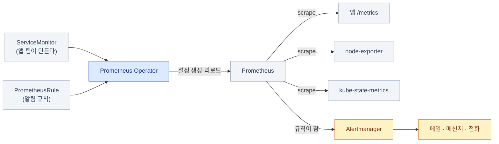

import { Tabs, TabItem, LinkCard } from '@astrojs/starlight/components';
import TermIntro from '../../../components/docs/TermIntro.astro';
import SourceFigure from '../../../components/docs/SourceFigure.astro';

> 알림이 없는 메트릭은 **사고가 난 뒤에 보는 부검 자료**다 — 이 장의 절반이 알림인 이유다

<TermIntro
  terms={[
    ['pull 모델', '', 'Prometheus가 대상에 **직접 접속해 긁어 오는(scrape)** 방식. 대상이 보내 주는(push) 방식과 반대다. "긁으러 갔는데 없더라"로 **죽은 것도 알 수 있다**는 게 큰 차이다.'],
    ['카운터 · 게이지 · 히스토그램', 'Counter · Gauge · Histogram', '메트릭의 세 가지 성격. **늘기만 하는 것 · 오르내리는 것 · 분포를 담는 것**이다. 성격을 모르고 질의하면 그래프가 조용히 거짓말을 한다.'],
    ['PromQL', 'Prometheus Query Language', '메트릭 질의 언어. **`rate()`로 속도를 내고 `sum by()`로 묶는** 두 동작이 전체의 8할이다.'],
  ]}
/>

## 왜 pull인가

Prometheus는 대상이 보내 주기를 기다리지 않고 **직접 긁으러 간다.** 이 선택이
운영 감각을 꽤 바꾼다.

| | pull (Prometheus) | push |
|---|---|---|
| 대상이 죽으면 | **긁기 실패가 곧 신호**다 — `up == 0` | 안 오는 건지 죽은 건지 구분이 어렵다 |
| 대상 목록 | Prometheus가 안다 (서비스 디스커버리) | 대상이 주소를 알아야 한다 |
| 방화벽 | Prometheus → 대상 방향만 열면 된다 | 반대 |
| 배치 작업 | **곤란하다** — 짧게 살다 죽으면 못 긁는다 → Pushgateway | 자연스럽다 |

:::tip[핵심]
`up` 메트릭 하나가 "이 대상이 살아 있나"를 그대로 알려 준다.
**대부분의 온프렘 알림은 결국 `up == 0`과 디스크·인증서 만료 세 가지에서 시작한다.**
:::

<SourceFigure
  src="/images/observability/prometheus-architecture.svg"
  alt="Prometheus가 서비스와 익스포터의 메트릭을 직접 긁고, 저장한 시계열을 Grafana와 Alertmanager에 제공하는 공식 구성도"
  width={1351}
  height={811}
  caption="지금은 가운데 Prometheus에서 왼쪽 대상들로 향하는 pull 화살표만 본다. 나머지 구성 요소는 이 장 뒤에서 하나씩 만난다."
  sourceHref="https://prometheus.io/docs/introduction/overview/"
  sourceLabel="Prometheus 공식 문서 — Overview"
/>

## 메트릭은 어떻게 생겼나

Prometheus가 긁어 오는 것은 결국 **텍스트 몇 줄**이다.
앱의 `/metrics` 주소를 그냥 `curl`하면 이게 나온다.

```text
# HELP http_requests_total 처리한 HTTP 요청 수
# TYPE http_requests_total counter
http_requests_total{method="POST",path="/orders",status="200"} 12044
http_requests_total{method="POST",path="/orders",status="500"} 37

# HELP process_resident_memory_bytes 프로세스가 쓰고 있는 메모리
# TYPE process_resident_memory_bytes gauge
process_resident_memory_bytes 4.1943e+08
```

한 줄의 구조는 **`이름{라벨=값, ...} 숫자`** 다. 여기서 두 가지가 따라 나온다.

- **저장되는 건 숫자 하나뿐이다.** 에러 메시지도, 어느 사용자였는지도 여기 없다 —
  그건 로그와 트레이스의 몫이다
- **라벨 조합 하나가 시계열 하나다.** 위 예에서 `status`만 다른 두 줄은
  **서로 다른 시계열 둘**이고, Prometheus는 각각에 대해 (시각, 값) 수열을 따로 쌓는다

### 타입 넷 — 성격을 모르면 그래프가 거짓말을 한다

같은 숫자라도 **어떻게 변하는 값인지**에 따라 읽는 법이 다르다. 이걸 타입이라 부른다.

| 타입 | 성격 | 예 | 어떻게 읽나 |
|---|---|---|---|
| **counter** | **늘기만 한다.** 프로세스가 재시작하면 0으로 돌아간다 | `http_requests_total` · `..._errors_total` | **절대 그냥 보지 않는다.** `rate()`로 **속도**를 낸다 |
| **gauge** | 오르내린다 | `..._memory_bytes` · `kube_pod_status_ready` | 그대로 본다. 추세는 `deriv()`(초당 변화율)·`predict_linear()`(추세를 연장한 예측값) |
| **histogram** | 관측값을 **구간별로 센다** | `http_request_duration_seconds` | `histogram_quantile()`로 p95·p99를 뽑는다 |
| **summary** | 앱이 **미리 계산한 분위수** | 일부 라이브러리의 기본값 | 파드가 여럿이면 **합칠 수 없다.** 아래 함정 |

이름 규칙이 타입을 알려 준다 — **`_total`로 끝나면 counter**, `_bytes`·`_seconds`로
끝나는 현재값은 대개 gauge, `_bucket`·`_sum`·`_count` 세 쌍이 보이면 histogram이다.

:::caution[함정 — counter를 그냥 그리면 계단만 보인다]
`http_requests_total`을 그래프로 그리면 **끝없이 올라가는 선** 하나가 나온다.
"지금 초당 몇 건인가"는 그 선의 **기울기**이지 값이 아니다.
그래서 counter는 언제나 `rate()`나 `increase()`를 씌운다.

그리고 이 함수들은 **재시작으로 값이 0으로 떨어진 것을 알아서 보정**한다 —
직접 빼기(`a - a offset 5m`)로 구현하면 파드가 재시작할 때마다 커다란 음수가 튄다.
:::

### 히스토그램이 특별한 이유

지연 시간은 평균이 거의 쓸모없다. 평균 200ms인데 **100명 중 1명이 5초**를 겪고 있으면
그 1명이 문제다. 그래서 지연은 **분포**로 저장한다.

```text
# 히스토그램 하나는 실제로 이렇게 여러 줄로 나온다
http_request_duration_seconds_bucket{le="0.1"}   9800    # 0.1초 이하가 9800건
http_request_duration_seconds_bucket{le="0.5"}   9950
http_request_duration_seconds_bucket{le="1"}     9990
http_request_duration_seconds_bucket{le="+Inf"} 10000    # 전체
http_request_duration_seconds_sum              1240.5    # 걸린 시간 합
http_request_duration_seconds_count             10000    # 건수
```

`le`는 "less or equal", 즉 **누적 구간**이다. 이 구조 덕분에 파드가 열 개여도
버킷끼리 그냥 더하면 전체 분포가 되고, **거기서 p99를 다시 계산할 수 있다.**

:::caution[함정 — summary는 합쳐지지 않는다]
summary는 앱이 자기 안에서 이미 p99를 계산해 숫자 하나로 내준다.
파드 셋의 p99가 각각 1.0 · 1.2 · 5.0초일 때, **이 셋을 평균 내도 전체 p99가 아니다** —
분포 정보가 이미 버려졌기 때문에 되살릴 방법이 없다.

**여러 인스턴스로 도는 서비스의 지연은 histogram으로 낸다.** 라이브러리가 summary를
기본값으로 주면 바꿔 둔다. (버킷을 미리 정하지 않아도 되는 **네이티브 히스토그램**이
3.x 계열에서 자리를 잡아 가는 중이니, 새로 설계한다면 성숙도를 문서에서 확인하고 고른다.)
:::

### 라벨과 카디널리티

라벨 조합 하나가 시계열 하나이므로, **라벨 설계가 곧 용량 설계다.**
`method`(5종) × `path`(20종) × `status`(6종)이면 시계열 600개 — 괜찮다.
여기에 `user_id`가 붙으면 사용자 수만큼 곱해진다.

| 하면 안 되는 라벨 | 대신 |
|---|---|
| `user_id` · `request_id` · `trace_id` | 로그·트레이스에 넣는다 ([3장](/observability/03-loki/) · [4장](/observability/04-tempo/)) |
| `pod_ip` · 파드 이름(단명 파드) | `deployment`·`service` 단위로 |
| URL 전체 (`/orders/12345`) | 경로 템플릿 (`/orders/:id`) |

이미 들어오는 라벨은 **긁는 단계에서 잘라 낸다.** 앱 배포를 기다릴 필요가 없다.

```yaml
# ServiceMonitor의 endpoints 아래
metricRelabelings:
  - action: labeldrop
    regex: "id|uuid|request_id"
```

### 옆 신호로 건너가기 — exemplar

`trace_id`를 라벨에 넣지 못한다면, 메트릭에서 트레이스로는 어떻게 건너가나.
그 자리를 맡는 것이 **exemplar**다 — 히스토그램 관측값에 **대표 trace ID 하나를
매달아 두는 것.** 시계열의 라벨이 아니라 옆에 붙는 표본이라 **카디널리티를 늘리지 않으면서**,
그래프에서 튄 지점의 "실제로 느렸던 요청 하나"로 바로 갈 수 있게 한다.

```text
# OpenMetrics 노출 형식 — 값 뒤의 # {...}가 exemplar다
http_request_duration_seconds_bucket{le="1"} 9990 # {trace_id="4bf92f3577b3..."} 0.94
```

연결에는 세 조각이 필요하다 — ① 앱(OTel SDK)이 관측값에 trace ID를 매달고,
② Prometheus가 exemplar 저장을 켜고(`--enable-feature=exemplar-storage`),
③ Grafana 데이터소스가 그 ID를 Tempo로 잇는다. ③의 설정과
"점이 안 보일 때 어디부터 보나"는 [5장](/observability/05-grafana/)에 있다.

## PromQL — 다섯 형태면 대부분 쓴다

PromQL은 문법이 넓지만, 실전에서 쓰는 모양은 사실상 다섯 개다.
**이 다섯을 조합하는 것이 전부**이고, 남의 대시보드에 있는 긴 쿼리도 대개 이것의 겹침이다.

<Tabs>
<TabItem label="① 고르기">

```text
up{job="node-exporter"}                       # 라벨로 고른다
up{job=~"node.*"}                             # =~ 정규식, != 부정, !~ 정규식 부정
node_filesystem_avail_bytes{fstype!~"tmpfs|overlay"}
```

이렇게 고른 결과가 **순간 벡터** — "지금 시점의 값들"이다.
그래프에 그대로 그릴 수 있는 건 gauge뿐이라는 걸 기억한다.

</TabItem>
<TabItem label="② 속도 내기">

```text
rate(http_requests_total[5m])                 # 초당 몇 건인가 (5분 창의 평균)
increase(http_requests_total[1h])             # 1시간 동안 몇 건 늘었나
```

`[5m]`이 붙으면 **범위 벡터** — "지난 5분치 값들"이다.
범위 벡터는 그래프에 못 그리고, 반드시 `rate` 같은 함수를 통과해야 한다.

**창 크기는 스크랩 간격의 4배 이상**으로 준다. 스크랩이 30초인데 `[30s]`를 주면
창 안에 점이 하나뿐이라 값이 비거나 요동친다. 30초 스크랩이면 `[2m]` 이상이 안전하다.

</TabItem>
<TabItem label="③ 묶기">

```text
sum by (service) (rate(http_requests_total[5m]))          # 서비스별 합계
sum without (pod, instance) (rate(...))                    # 이 라벨들만 지우고 합친다
topk(5, sum by (namespace) (rate(...)))                    # 상위 5개만
count by (node) (kube_pod_info)                            # 노드별 파드 수
```

`by`는 **남길 라벨**, `without`은 **지울 라벨**이다.
파드처럼 계속 바뀌는 라벨은 `without`으로 지우는 편이 대시보드가 안 깨진다.

</TabItem>
<TabItem label="④ 비율 내기">

```text
# 에러율 = 5xx 속도 / 전체 속도
  sum by (service) (rate(http_requests_total{status=~"5.."}[5m]))
/
  sum by (service) (rate(http_requests_total[5m]))
```

**나눗셈은 양쪽 라벨 집합이 같아야 짝이 맞는다.** 결과가 비어 있으면
십중팔구 한쪽에만 있는 라벨(`status` 같은) 때문이니, 양쪽 다 같은 `by`로 묶는다.

</TabItem>
<TabItem label="⑤ 분위수와 예측">

```text
# p99 지연 — 안쪽부터 읽는다: rate → sum by(le) → quantile
histogram_quantile(0.99,
  sum by (le, service) (rate(http_request_duration_seconds_bucket[5m])))

# 24시간 안에 디스크가 빌 것 같은가 (6시간 추세를 외삽)
predict_linear(node_filesystem_avail_bytes{mountpoint="/"}[6h], 24*3600) < 0
```

`histogram_quantile`은 **`by`에 `le`를 반드시 남긴다** — 버킷 경계 라벨이 사라지면
분포를 복원할 수 없어 결과가 빈다. 가장 흔한 실수다.

`predict_linear`는 온프렘에서 특히 값을 한다. **"찼다"가 아니라 "찰 것 같다"** 를
알려 주니 노드 증설 리드타임을 벌 수 있다.

</TabItem>
</Tabs>

### 자주 하는 실수 다섯

| 쓴 것 | 무슨 일이 벌어지나 | 이렇게 |
|---|---|---|
| `sum(http_requests_total)` | counter 원값의 합 — **계단만 올라간다** | `sum(rate(...[5m]))` |
| `rate(sum(...))` | 합친 뒤 속도를 내서 **재시작 보정이 깨진다** | **`rate`가 먼저, `sum`이 나중** |
| `avg(p99_latency)` | 분위수의 평균은 **아무 의미가 없다** | 히스토그램 버킷을 합친 뒤 `histogram_quantile` |
| `histogram_quantile(0.99, sum by (service) (...))` | `le`가 없어 **결과가 빈다** | `sum by (le, service)` |
| `up{job="x"} == 0` | 대상이 **아예 사라지면** 시계열도 없어 알림이 안 뜬다 | `absent(up{job="x"})`를 함께 건다 |

:::tip[핵심 — 순서 하나만 외운다]
**`rate` → `sum by` → (필요하면) `histogram_quantile`.**
안쪽에서 바깥쪽으로 이 순서면 대시보드 쿼리의 대부분이 맞는다.
:::

## 무엇을 재나 — RED와 USE

<TermIntro
  title="이 절에서 처음 나오는 말"
  terms={[
    ['RED', 'Rate · Errors · Duration', '서비스를 **요청 수 · 에러 · 지연**으로 보는 관례. 사용자가 겪는 증상이라 알림의 출발점이다.'],
    ['USE', 'Utilization · Saturation · Errors', 'CPU·디스크 같은 자원을 **사용률 · 포화 · 오류**로 보는 관례. 원인을 파고들 때 쓴다.'],
  ]}
/>

메트릭을 낼 수 있다고 아무거나 내면 시계열만 는다.
**무엇을 재야 하는지에는 검증된 관례 둘이 있다** — 대상이 다르다.

| | **RED** — 요청을 처리하는 것 | **USE** — 자원 |
|---|---|---|
| 대상 | API · 서비스 · 큐 컨슈머 | CPU · 메모리 · 디스크 · 네트워크 |
| 무엇을 | **R**ate 요청 수 · **E**rrors 에러 · **D**uration 지연 | **U**tilization 사용률 · **S**aturation 포화 · **E**rrors 오류 |
| 답하는 것 | **사용자가 지금 아픈가** | **왜 아픈가 (어디가 모자란가)** |
| 알림을 건다면 | **여기에 건다** — 증상이다 | 조사용. 알림으로 걸면 시끄럽다 |

```text
# RED — 서비스 하나에 이 셋이면 충분하다
sum by (service) (rate(http_requests_total[5m]))                                  # Rate
sum by (service) (rate(http_requests_total{status=~"5.."}[5m]))
  / sum by (service) (rate(http_requests_total[5m]))                              # Errors
histogram_quantile(0.99,
  sum by (le, service) (rate(http_request_duration_seconds_bucket[5m])))           # Duration

# USE — 자원 하나에 이 셋
100 - (avg by (instance) (rate(node_cpu_seconds_total{mode="idle"}[5m])) * 100)   # Utilization
node_load5 / on(instance) count by (instance) (node_cpu_seconds_total{mode="idle"})  # Saturation
rate(node_network_receive_errs_total[5m])                                          # Errors
```

:::tip[핵심 — 알림은 RED에, 대시보드는 둘 다]
**"노드 CPU 90%"는 알림이 아니다.** CPU가 90%여도 사용자가 멀쩡하면 깨울 이유가 없고,
CPU가 40%인데 DB 잠금으로 전부 실패하는 상황은 그 알림이 못 잡는다.

**증상(RED)으로 깨우고, 원인(USE)은 깨어난 뒤에 본다.** 예외는 되돌릴 수 없는 것 —
디스크가 100% 차면 그 뒤에 벌어지는 일을 못 막으니 이건 USE라도 알림 대상이다.
:::

## 세우기 — kube-prometheus-stack

<TermIntro
  title="설정에 들어가기 전에"
  terms={[
    ['exporter', '익스포터', '노드나 시스템의 상태를 Prometheus가 읽을 수 있는 메트릭으로 내주는 작은 프로그램.'],
    ['ServiceMonitor · PodMonitor', '', '"이 Service·Pod를 긁어라"를 선언하는 쿠버네티스 리소스. Prometheus 설정 파일을 직접 고치지 않게 해 준다.'],
  ]}
/>

| 방식 | 성격 |
|---|---|
| **kube-prometheus-stack** (Helm) | Prometheus Operator + Prometheus + Alertmanager + Grafana + node-exporter + kube-state-metrics + 기본 대시보드·규칙 한 벌. **온프렘의 기본 출발점** |
| Prometheus Operator 단독 | 위 묶음이 과할 때 |
| 바이너리·단독 컨테이너 | 쿠버네티스 밖 대상을 긁을 때 |

이걸 쓰면 **긁을 대상과 알림 규칙을 CRD로 추가**하게 된다 — 설정 파일을 손대지 않는다.



기본 묶음에 들어오는 exporter 둘이 사실상 클러스터 감시의 바닥을 깐다 —
**`node-exporter`가 노드(CPU·메모리·디스크·네트워크)**, **`kube-state-metrics`가
쿠버네티스 오브젝트 상태(파드 Ready인가, Deployment 몇 개 떴나)** 를 낸다.
`kube_pod_status_ready` 같은 이름이 보이면 후자에서 온 것이다.

<Tabs>
<TabItem label="긁을 대상 추가">

```yaml
apiVersion: monitoring.coreos.com/v1
kind: ServiceMonitor
metadata:
  name: my-app
  namespace: prod
  labels:
    release: kube-prometheus-stack     # Prometheus가 고르는 라벨 — 안 맞으면 조용히 무시된다
spec:
  selector:
    matchLabels:
      app: my-app                      # 이 라벨을 가진 Service를
  endpoints:
    - port: http-metrics               # 포트 "이름"이다. 번호가 아니다
      path: /metrics
      interval: 30s
```

</TabItem>
<TabItem label="알림 규칙">

```yaml
apiVersion: monitoring.coreos.com/v1
kind: PrometheusRule
metadata:
  name: platform-basics
  namespace: observability
  labels:
    release: kube-prometheus-stack
spec:
  groups:
    - name: platform
      rules:
        - alert: TargetDown
          expr: up == 0
          for: 10m                     # 10분 이상 지속돼야 발화 (깜빡임 무시)
          labels: { severity: critical }
          annotations:
            summary: "{{ $labels.job }} 대상이 10분째 응답 없음"
            runbook: "https://wiki.example.internal/runbooks/target-down"

        - alert: NodeDiskFillingUp
          expr: |
            predict_linear(node_filesystem_avail_bytes{fstype!~"tmpfs|overlay"}[6h], 24*3600) < 0
          for: 30m
          labels: { severity: warning }
          annotations:
            summary: "{{ $labels.instance }}:{{ $labels.mountpoint }} 24시간 내 디스크 소진 예상"
```

</TabItem>
<TabItem label="기록 규칙">

```yaml
        - record: service:request_error_rate:ratio5m
          expr: |
            sum by (service) (rate(http_requests_total{status=~"5.."}[5m]))
              / sum by (service) (rate(http_requests_total[5m]))
```

무거운 쿼리를 **미리 계산해 새 메트릭으로 저장**하는 것이 기록 규칙(recording rule)이다.
대시보드 여러 개가 같은 계산을 반복하거나 알림 표현식이 길어지면 여기로 뺀다.
이름은 `수준:메트릭:연산` 관례를 따르면 나중에 알아보기 쉽다.

</TabItem>
</Tabs>

:::caution[함정 — ServiceMonitor를 만들었는데 안 긁는다]
가장 흔한 원인 셋이다.
1. **`release` 라벨이 안 맞다.** Prometheus 리소스의 `serviceMonitorSelector`가 고르는 라벨과 같아야 한다
2. **`port`에 번호를 썼다.** Service의 포트 **이름**이어야 한다
3. **네임스페이스가 감시 대상이 아니다.** `serviceMonitorNamespaceSelector` 확인

확인은 Prometheus UI의 `Status → Targets` 또는:

```bash
kubectl -n observability port-forward svc/kube-prometheus-stack-prometheus 9090:9090
# → http://localhost:9090/targets 에서 대상이 목록에 있는지, 있는데 왜 실패인지
```
:::

### Prometheus 3.x에서 달라진 것

**3.13이 LTS**다 (2026-07). 2.x 설정은 대체로 그대로 통하지만, 새로 얻은 게 있다.

| 항목 | 내용 | 온프렘에서 |
|---|---|---|
| **OTLP 수신** | OpenTelemetry 프로토콜로 들어오는 메트릭을 직접 받는다 | 앱이 OTel로 계측돼 있으면 exporter 없이 바로 ([4장](/observability/04-tempo/)) |
| **UTF-8 라벨** | 라벨 이름·값에 UTF-8 허용 | OTel 속성 이름을 그대로 쓸 수 있다 |
| 새 UI | 쿼리·타겟 화면 개편 | |
| remote write 2.0 | 장기 저장소로 보낼 때 효율 개선 | 장기 저장을 붙일 때 |

## 리텐션 — 언제 장기 저장이 필요한가

Prometheus는 시계열을 자체 저장 엔진(**TSDB**, Time Series Database)에 담는데,
이게 **로컬 디스크에만** 있다. 그래서 보존 기간은 PVC 크기와 직결된다.

```yaml
spec:
  retention: 30d
  retentionSize: 180GB          # 둘 중 먼저 닿는 쪽으로 지운다 — 둘 다 주는 게 안전하다
  storage:
    volumeClaimTemplate:
      spec:
        storageClassName: standard
        resources: { requests: { storage: 200Gi } }
```

`retentionSize`를 PVC의 80~90% 선으로 잡아 둔다. 기간만 주면
시계열이 늘었을 때 **디스크가 먼저 차고, 그때 Prometheus가 죽는다.**

| 필요 | 답 |
|---|---|
| 15~30일이면 충분 | **로컬 TSDB 그대로.** 대부분 여기서 끝난다 |
| 몇 달~몇 년 보존 | **Thanos** 또는 **Mimir** — 압축된 블록을 오브젝트 스토리지에 ([온프렘 덱 6장](/onprem/06-minio/)) |
| 클러스터 여러 개를 한 화면에 | 마찬가지로 Thanos/Mimir. 또는 Grafana에서 데이터소스를 여러 개 |
| HA (Prometheus 자체 이중화) | 같은 설정으로 **2벌을 돌리고** Alertmanager가 중복을 제거하게 한다 |

:::tip[핵심]
**장기 저장은 필요해지기 전에 넣지 않는다.** Thanos·Mimir는 그 자체로 운영 대상이 하나 더
느는 일이다. "3개월 전 값이 필요한 상황"이 실제로 몇 번 생겼는지 세어 보고 결정한다.
:::

## 알림 설계 — 이 장의 핵심

<TermIntro
  title="알림 경로의 마지막 조각"
  terms={[
    ['Alertmanager', '', 'Prometheus가 발견한 알림을 **묶고 · 중복을 없애고 · 담당자에게 보내는** 별도 컴포넌트.'],
  ]}
/>

**규칙 200개짜리 대시보드보다 잘 고른 알림 20개가 낫다.** 원칙 넷.

| 원칙 | 뜻 |
|---|---|
| **사람이 행동할 수 있는 것만** | 받고도 할 일이 없는 알림은 다음부터 무시된다 |
| **증상으로 건다** | "노드 CPU 90%"보다 "요청 실패율 증가"가 낫다 — 위 RED·USE 절 |
| **`for`를 넉넉히** | 깜빡임은 사람을 깨울 이유가 없다 |
| **runbook 링크를 단다** | 새벽 3시에 처음 보는 알림에서 제일 필요한 건 "그래서 뭘 하지"다 |

### 온프렘에서 반드시 있어야 하는 알림

클라우드가 콘솔에서 알려 주던 것들이다. **없으면 아무도 안 알려 준다.**

| 알림 | 대략의 조건 | 왜 |
|---|---|---|
| 대상 다운 | `up == 0` (10m) | 가장 기본 |
| 노드 NotReady | `kube_node_status_condition{condition="Ready",status="true"} == 0` | |
| **디스크 소진 예측** | `predict_linear(...[6h], 24h) < 0` | 온프렘은 증설에 시간이 걸린다 |
| PVC 사용률 | `kubelet_volume_stats_available_bytes / ..._capacity_bytes < 0.1` | Prometheus·Loki 자신이 여기 걸린다 |
| **인증서 만료 임박** | `certmanager_certificate_expiration_timestamp_seconds - time() < 14*86400` | [온프렘 덱 4장](/onprem/04-tls-dns/). 조용히 만료돼 전면 장애가 된다 |
| etcd 이상 | `etcd_server_has_leader == 0`, fsync 지연 | 클러스터 전체가 느려지는 원인 |
| **CNPG 백업 실패 · 복제 지연** | 백업 나이, `pg_stat_replication` 지연 | [온프렘 덱 7장](/onprem/07-cnpg/). WAL이 쌓이면 DB가 멈춘다 |
| 오브젝트 스토리지 용량 | 스토리지 exporter 기준 | 차면 **로그와 백업이 동시에** 멈춘다 |
| 파드 재시작 반복 | `rate(kube_pod_container_status_restarts_total[15m]) > 0` | |
| 서비스 에러율 | RED의 E — `> 0.05` (5m) | **사용자가 아픈 것을 직접 재는 유일한 줄** |
| **관측 스택 자체** | Prometheus TSDB 용량, Loki 인입 실패 | 감시자가 조용히 죽는다 |
| **Watchdog** | 항상 참인 규칙 | 아래 |

:::caution[함정 — 알림이 안 오는 것을 어떻게 아나]
Alertmanager가 죽거나 메일 서버가 막히면 **알림이 안 오는데, 그 사실 자체를 아무도 모른다.**
그래서 **항상 발화하는 알림 하나(Watchdog)** 를 만들고, 그게 **외부 시스템에 주기적으로
도착하는지**를 그쪽에서 감시한다. kube-prometheus-stack에는 `Watchdog` 규칙이 이미 들어 있으니,
그걸 외부 채널로 라우팅해 두면 된다.
:::

### Alertmanager 라우팅

Prometheus는 "규칙이 참이다"까지만 하고 **누구에게 어떻게 보낼지는 전부 여기**서 정한다.

```yaml
route:
  receiver: default
  group_by: [alertname, namespace]
  group_wait: 30s          # 첫 알림 전 대기 — 관련된 것들이 같이 오게
  group_interval: 5m       # 같은 묶음에 새 알림이 붙었을 때 다시 보내는 간격
  repeat_interval: 4h      # 안 고쳐졌을 때 다시 깨우는 주기
  routes:
    - matchers: [ severity="critical" ]
      receiver: oncall-phone
    - matchers: [ alertname="Watchdog" ]
      receiver: external-heartbeat      # 죽은 스위치 감시용
      repeat_interval: 5m

inhibit_rules:
  # 노드가 통째로 죽었으면 그 위 파드 알림은 묻는다
  - source_matchers: [ alertname="NodeDown" ]
    target_matchers: [ severity="warning" ]
    equal: [ node ]
```

`inhibit_rules`가 실전에서 특히 중요하다 — **노드 하나가 죽었을 때 알림 40개가 오면
아무도 안 읽는다.** 계획된 작업 중에는 `silence`로 잠시 끄되,
**만료 시각을 반드시 넣는다** — 영구 침묵은 알림을 지운 것과 같다.

## 점검

```bash
# ① 대상이 다 잡혔나
kubectl -n observability port-forward svc/kube-prometheus-stack-prometheus 9090:9090
#   http://localhost:9090/targets   — DOWN인 대상의 Error 열을 본다

# ② 규칙이 로드됐나 (PrometheusRule 라벨이 틀리면 조용히 무시된다)
#   http://localhost:9090/rules

# ③ 지금 발화 중인 알림
curl -s http://localhost:9090/api/v1/alerts | jq '.data.alerts[] | {name:.labels.alertname, state}'

# ④ Alertmanager까지 실제로 가나 — 테스트 알림을 직접 쏴 본다
kubectl -n observability port-forward svc/kube-prometheus-stack-alertmanager 9093:9093
curl -XPOST http://localhost:9093/api/v2/alerts -H 'Content-Type: application/json' -d '[{
  "labels": {"alertname":"SmokeTest","severity":"critical"},
  "annotations": {"summary":"알림 경로 점검"}
}]'
#   → 실제 채널(메신저·메일)에 도착하는지 확인

# ⑤ 무엇이 시계열을 많이 먹고 있나
#   http://localhost:9090/tsdb-status  — 시계열 수와 라벨 카디널리티 상위
```

| 증상 | 흔한 원인 | 확인 |
|---|---|---|
| 대상이 목록에 아예 없다 | `release` 라벨 · NS 셀렉터 불일치 | `kubectl get servicemonitor -o yaml`의 labels |
| 대상이 DOWN이다 | 포트 이름 오타 · NetworkPolicy · `/metrics` 경로 | `/targets`의 Error 열, 파드에서 직접 `curl` |
| 그래프가 계단처럼 올라간다 | **counter를 그냥 그렸다** | `rate(...[5m])`를 씌운다 |
| `histogram_quantile` 결과가 빈다 | `by`에서 `le`가 빠졌다 | `sum by (le, ...)` |
| 나눗셈 결과가 빈다 | 양쪽 라벨 집합이 다르다 | 양쪽을 같은 `by`로 묶는다 |
| 알림이 안 뜬다 | 규칙 미로드 · 대상이 사라져 시계열 자체가 없음 | `/rules`, `absent()` 추가 |
| 알림이 뜨는데 안 온다 | receiver 설정 · inhibit · silence | ④의 테스트 알림, Alertmanager UI |
| 메모리가 계속 는다 | **카디널리티 폭발** | `/tsdb-status` 상위, `metricRelabelings`로 labeldrop |
| 디스크가 찬다 | `retentionSize` 미설정 | PVC의 80~90% 선으로 넣는다 |

## 2장 요약

- 메트릭 한 줄은 **`이름{라벨} 숫자`** 가 전부다. **라벨 조합 하나 = 시계열 하나**
- 타입을 알아야 읽는 법이 정해진다 — **counter는 `rate()`, gauge는 그대로,
  지연은 histogram**. summary는 파드가 여럿이면 합쳐지지 않는다
- PromQL은 **고르기 · 속도 · 묶기 · 비율 · 분위수** 다섯이면 대부분 된다.
  순서는 언제나 **`rate` → `sum by` → `histogram_quantile`**
- 무엇을 잴지는 **RED(서비스)와 USE(자원)**. **알림은 RED에 걸고 USE는 조사용**이다
- 트레이스로는 **exemplar로 건너간다** — `trace_id`는 라벨이 아니라 exemplar에 싣는다
- **pull 모델**이라 `up == 0` 하나로 "죽었다"를 안다 — 온프렘 알림의 출발점
- **kube-prometheus-stack**으로 시작하고, 대상은 **ServiceMonitor**로 추가한다.
  안 긁히면 `release` 라벨 · 포트 **이름** · 네임스페이스 셀렉터 셋을 본다
- 보존은 **로컬 TSDB로 15~30일**이 기본. `retention`과 `retentionSize`를 **둘 다** 준다
- 알림은 **행동 가능한 것만, 증상으로, `for`를 넉넉히, runbook과 함께**.
  필수 목록에 **디스크 소진 예측 · 인증서 만료 · CNPG 백업 실패**가 들어간다
- **Watchdog을 외부로 라우팅**한다 — 알림이 안 오는 것을 알아채는 유일한 방법이다

<LinkCard
  title="3. 로그 — Loki"
  description="인덱스가 라벨뿐인 로그 저장소. 라벨 설계가 전부인 이유, LogQL 네 단계, Alloy 수집."
  href="/observability/03-loki/"
/>
