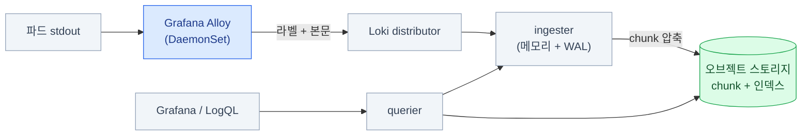

import { Tabs, TabItem, LinkCard, Steps } from '@astrojs/starlight/components';
import TermIntro from '../../../components/docs/TermIntro.astro';
import SourceFigure from '../../../components/docs/SourceFigure.astro';

> Loki에서 잘못 고른 라벨 하나가 **클러스터 전체 로그를 못 쓰게 만든다**

<TermIntro
  terms={[
    ['Loki', '', 'Grafana Labs의 로그 저장소. **로그 본문을 인덱싱하지 않고 라벨만 인덱싱**해서 가볍다. 본문 검색은 그때그때 훑는다(grep과 비슷하다).'],
    ['스트림', 'Stream', '**라벨 조합 하나 = 스트림 하나**. `{namespace="prod", app="api"}`가 한 스트림이고, 로그는 스트림 단위로 뭉쳐 저장된다.'],
    ['LogQL', 'Log Query Language', 'Loki의 질의 언어. **스트림 선택 → 라인 필터 → 파싱 → 집계** 네 단계로 읽는다. PromQL과 닮았고, 로그에서 메트릭도 뽑는다.'],
  ]}
/>

## 문제 — 로그는 파드와 함께 사라진다

```bash
kubectl logs api-7d9f-x8k2p --previous
# Error from server: previous terminated container not found
```

파드가 두 번 재시작하면 문제가 났던 그 로그는 이미 없다. 노드가 교체되면 더 확실히 없다.
게다가 서비스가 열 개면 **어느 파드를 봐야 하는지부터** 문제다.

로그 저장소가 채워야 하는 건 셋이다 — **파드 밖에 오래 남기고, 여러 파드를 한 번에 훑고,
시각으로 자를 수 있게** 하는 것.

## Loki는 무엇을 저장하나

<TermIntro
  title="저장 구조를 읽기 위한 말"
  terms={[
    ['chunk', '청크', '한 스트림의 로그를 시간·크기 단위로 모아 압축한 덩어리. **본문은 이 덩어리째 오브젝트 스토리지로 간다.**'],
    ['인덱스', 'Index', '원하는 청크가 어디 있는지 가리키는 목차. Loki는 **로그 본문이 아니라 라벨만** 이 목차에 넣는다.'],
  ]}
/>

Elasticsearch 계열은 **로그 본문을 전부 역색인**한다. 검색은 빠르지만 인덱스가
원본보다 커지는 일이 흔하고, 온프렘에서 그 디스크와 메모리를 감당하기 어렵다.

Loki는 반대로 간다.

| | Elasticsearch 계열 | **Loki** |
|---|---|---|
| 인덱싱 | 본문 전체 | **라벨만** |
| 저장 | 자체 클러스터 디스크 | **오브젝트 스토리지에 압축 chunk** |
| 검색 | 임의 단어를 즉시 | 라벨로 범위를 좁힌 뒤 **본문을 훑는다** |
| 비용 | 높다 | 낮다 |
| 대가 | — | **라벨을 잘못 짜면 아무것도 못 찾는다** |

### 저장되는 단위는 "스트림"이다

Loki에 들어가는 로그 한 줄은 이 모양이다.

```text
스트림 라벨 (인덱싱된다)                       │ 시각            │ 본문 (인덱싱 안 된다)
──────────────────────────────────────────────┼─────────────────┼───────────────────────────
{namespace="prod", app="orders",              │ 03:12:07.441Z   │ {"level":"error",
 container="server", cluster="dc1"}           │                 │  "msg":"order failed",
                                              │                 │  "order_id":"A-8821",
                                              │                 │  "trace_id":"4bf92f35..."}
```

**왼쪽 칸만 인덱스에 들어간다.** 오른쪽은 압축돼 오브젝트 스토리지에 통째로 얹힌다.
그래서 `trace_id`로 검색할 수는 있지만 — **라벨로 범위를 좁힌 뒤 본문을 훑는 방식**이고,
범위를 안 좁히면 며칠치를 전부 읽게 된다.

<SourceFigure
  src="/images/observability/loki-chunks-index.png"
  alt="Loki가 라벨과 시간 범위를 인덱스에 두고, 실제 로그 줄은 압축한 청크에 저장하는 공식 데이터 구조 그림"
  width={859}
  height={531}
  caption="위쪽 인덱스는 라벨과 시간 범위만 가리키고, 아래쪽 청크에 실제 로그 줄이 들어간다. ‘라벨로 먼저 좁힌다’는 원칙이 이 구조에서 나온다."
  sourceHref="https://grafana.com/docs/loki/latest/get-started/architecture/"
  sourceLabel="Grafana Loki 공식 문서 — Architecture"
/>



:::tip[핵심 — 라벨이 곧 검색 범위다]
LogQL 질의는 **반드시 라벨 선택으로 시작한다.** `{namespace="prod"}`로 좁힌 다음에야
본문을 훑는다. 그래서 **"나중에 이걸로 찾을 것 같다" 싶은 축이 라벨에 없으면
그 축으로는 검색이 사실상 불가능**하다 — 라벨 설계가 전부라는 말은 이 뜻이다.
:::

### 본문은 구조화해서 찍는다

<TermIntro
  title="이 절에서 쓰는 말"
  terms={[
    ['구조화 로그', 'Structured Logging', '사람이 읽는 문장 대신 **JSON처럼 필드를 꺼낼 수 있는 형식**으로 찍는 로그. 라벨을 늘리지 않고도 검색하게 해 준다.'],
  ]}
/>

라벨을 절제하려면 **나머지 축을 본문에서 꺼낼 수 있어야** 한다.
그 전제가 구조화 로그다.

```text
# 이렇게 찍으면 — 사람은 읽기 좋지만 기계는 못 꺼낸다
2026-08-11 03:12:07 ERROR order A-8821 failed after 2841ms: inventory timeout

# 이렇게 찍으면 — `| json` 한 줄로 모든 필드가 꺼내진다
{"ts":"2026-08-11T03:12:07Z","level":"error","msg":"order failed",
 "order_id":"A-8821","duration_ms":2841,"err":"inventory timeout",
 "trace_id":"4bf92f3577b34da6"}
```

**앱에 한 번 부탁해서 얻는 것 중 이게 제일 값이 크다.** 로그를 JSON으로 바꾸고
`trace_id`를 한 필드 넣으면, 라벨을 늘리지 않고도 `order_id`로 필터하고
트레이스로 건너뛸 수 있다 ([5장](/observability/05-grafana/)).

## 라벨 설계 — 이 장에서 제일 중요한 것

라벨 조합 하나가 스트림 하나다. **스트림이 많아지면 Loki가 무너진다** —
chunk가 잘게 쪼개져 압축이 안 되고, 인덱스가 커지고, ingester 메모리가 터진다.

| 라벨에 넣는다 | 절대 넣지 않는다 |
|---|---|
| `cluster` · `namespace` · `app` · `container` | `pod`(단명하면 스트림이 계속 새로 생긴다) |
| `env`(prod/stage) | `request_id` · `trace_id` · `user_id` |
| `level`(info/error) — 값이 몇 개뿐일 때만 | IP 주소 · URL 전체 |
| `node`(노드 수가 적을 때) | 타임스탬프·랜덤 값이 섞인 무엇이든 |

:::caution[함정 — 카디널리티 폭발]
`pod` 라벨은 특히 조심해야 한다. Deployment가 하루에 수십 번 롤링되면
**파드 이름마다 새 스트림**이 생기고, 한 달이면 스트림이 수만 개가 된다.
증상은 이렇게 나타난다.

- 질의가 타임아웃되거나 "too many streams" 오류
- ingester 파드가 OOM으로 재시작 반복
- chunk가 작게 쪼개져 오브젝트 스토리지 요청 수가 폭증

**필요하면 본문에 넣고 나중에 파싱한다** — 아래 LogQL 절의 `| json` · `| logfmt`가 그 용도다.
:::

## LogQL — 네 단계로 읽는다

LogQL 질의는 아무리 길어도 **왼쪽에서 오른쪽으로 이 네 단계**다.
남의 쿼리를 볼 때도 이 경계로 끊어 읽으면 된다.

```text
{namespace="prod", app="orders"}  |= "error"  | json  | duration_ms > 1000
└──────── ① 스트림 선택 ────────┘ └② 라인필터┘ └③파서┘ └──── ④ 라벨 필터 ────┘
```

<Steps>

1. **① 스트림 선택** — 필수다. 여기서 읽을 chunk의 범위가 정해진다

2. **② 라인 필터** — 본문 문자열로 후보를 확 줄인다. `|=` 포함, `!=` 제외, `|~` 정규식

3. **③ 파서** — 남은 줄에서 필드를 꺼낸다. `| json` · `| logfmt` · `| pattern` · `| regexp`

4. **④ 꺼낸 필드로 필터·가공·집계** — `| duration_ms > 1000`, `| line_format`, `rate()`

</Steps>

:::tip[핵심 — 순서가 곧 속도다]
**라인 필터(②)를 파서(③)보다 먼저 둔다.** 파싱은 줄마다 비용이 드는 작업이라,
1억 줄을 파싱한 뒤 거르는 것과 `|= "error"`로 10만 줄로 줄이고 파싱하는 것은
체감 속도가 수십 배 차이 난다. **질의가 느리면 대개 이 순서 문제**이거나
시간 범위가 너무 넓은 것이다.
:::

<Tabs>
<TabItem label="찾기">

```text
{namespace="prod", app="orders"} |= "error" != "healthcheck"
```

가장 많이 쓰는 형태다. `|=` 포함, `!=` 제외, `|~` 정규식, `!~` 정규식 부정.
**여러 개를 이어 붙일 수 있고**, 앞에 둘수록 빨리 줄어든다.

</TabItem>
<TabItem label="파싱해서 필터">

```text
{namespace="prod", app="orders"} |= "error"
  | json
  | status >= 500 and duration_ms > 1000
  | line_format "{{.method}} {{.path}} {{.status}} {{.duration_ms}}ms"
```

파서는 로그 형식에 맞춰 고른다.

| 파서 | 대상 형식 |
|---|---|
| `\| json` | `{"k":"v"}` — 중첩 필드는 `k_sub`로 평탄화된다 |
| `\| logfmt` | `level=error msg="..." dur=2841` |
| `\| pattern` | 고정 위치 텍스트 — `\| pattern "<ip> - <_> [<ts>] \"<method> <path>\""` |
| `\| regexp` | 나머지 전부. 이름 있는 그룹이 라벨이 된다 |

`line_format`은 **출력을 다시 조립**한다. 긴 JSON에서 필요한 필드만 남기면
사고 중에 화면이 훨씬 잘 읽힌다.

</TabItem>
<TabItem label="로그에서 메트릭">

```text
# 에러 로그의 초당 발생 속도 (앱별)
sum by (app) (rate({namespace="prod"} |= "error" [5m]))

# 5분간 몇 줄이었나
sum by (app) (count_over_time({namespace="prod"} |= "error" [5m]))
```

**로그를 세어 그래프로 만든다.** 앱이 메트릭을 안 내줄 때 임시 대안이 되고,
Grafana에서 메트릭 패널과 나란히 놓을 수 있다.
바깥 문법이 PromQL과 같아서 `sum by`·`topk`가 그대로 통한다.

</TabItem>
<TabItem label="숫자 필드로 집계">

```text
# 로그에 찍힌 duration_ms로 p99를 낸다
quantile_over_time(0.99,
  {namespace="prod", app="orders"} | json | unwrap duration_ms [5m])

# 응답 바이트 합계
sum by (app) (sum_over_time({namespace="prod"} | json | unwrap bytes [5m]))
```

`unwrap`은 **파싱해서 꺼낸 필드를 숫자로 취급**하라는 지시다.
앱이 히스토그램 메트릭을 안 내줘도 로그만 있으면 지연 분포를 볼 수 있다 —
다만 **모든 줄을 읽어야 해서 비싸다.** 상시 대시보드보다는 조사용으로 쓴다.

</TabItem>
<TabItem label="트레이스로 건너뛰기">

```text
{namespace="prod", app="orders"} | json | trace_id != ""
```

로그에 `trace_id`가 실려 있으면 Grafana의 derived field가 **Tempo로 가는 링크**를 만들어 준다
([5장](/observability/05-grafana/)). 앱 로그에 trace ID를 넣는 것이
[4장](/observability/04-tempo/)에서 가장 값싸게 얻는 이득이다.

</TabItem>
</Tabs>

## 수집 — Grafana Alloy

<TermIntro
  title="수집기에 붙는 이름"
  terms={[
    ['Grafana Alloy', '', '노드와 앱에서 로그·메트릭·트레이스를 모으는 에이전트. **Promtail은 EOL**이라 새 로그 수집은 Alloy로 시작한다.'],
  ]}
/>

Alloy 설정은 **컴포넌트를 파이프로 잇는** 모양이다. 아래 넷이 한 줄기가 된다 —
**대상을 찾고(discovery) → 라벨을 정하고(relabel) → 읽어서(source) → 보낸다(write).**

```hcl
// ① 쿠버네티스에서 파드를 찾는다
discovery.kubernetes "pods" {
  role = "pod"
}

// ② 라벨은 여기서 결정된다 — 이 목록이 곧 검색 축이다
discovery.relabel "pods" {
  targets = discovery.kubernetes.pods.targets

  rule {
    source_labels = ["__meta_kubernetes_namespace"]
    target_label  = "namespace"
  }
  rule {
    source_labels = ["__meta_kubernetes_pod_label_app_kubernetes_io_name"]
    target_label  = "app"
  }
  rule {
    source_labels = ["__meta_kubernetes_pod_container_name"]
    target_label  = "container"
  }
  // pod 이름은 일부러 라벨로 안 만든다 (카디널리티)
}

// ③ 로그를 읽어서
loki.source.kubernetes "pods" {
  targets    = discovery.relabel.pods.output
  forward_to = [loki.write.default.receiver]
}

// ④ Loki로 보낸다
loki.write "default" {
  endpoint {
    url = "http://loki-gateway.observability.svc/loki/api/v1/push"
    // 멀티테넌시를 쓰면: tenant_id = "platform"
  }
}
```

**Alloy는 자기 UI에 이 파이프라인을 그림으로 보여 준다**(`/graph`).
로그가 안 들어올 때 제일 먼저 여는 화면이 거기다 — 어느 컴포넌트에서 대상 수가
0이 됐는지 눈으로 보인다.

:::caution[함정 — Promtail 기준 문서]
검색으로 나오는 Loki 수집 설정은 대부분 **Promtail의 `scrape_configs`** 형식이다.
Promtail은 2026-03-02에 EOL됐다. 기존 Promtail 설정이 있으면
Loki 문서의 **Alloy 마이그레이션 도구**가 한 번에 변환해 준다 — 손으로 옮기지 않는다.
:::

## 배포 모드와 보존

<TermIntro
  title="여러 팀의 로그를 나눈다면"
  terms={[
    ['테넌트', 'Tenant', '데이터를 격리하는 단위. Loki는 `X-Scope-OrgID` 값으로 팀이나 환경의 로그를 가른다.'],
  ]}
/>

| 모드 | 모양 | 언제 |
|---|---|---|
| **monolithic** (SingleBinary) | 한 프로세스에 전부 | 하루 수십 GB 이하. 온프렘 소규모의 기본값 |
| **simple scalable** (SSD) | read / write / backend 셋으로 | 하루 수백 GB. **대부분 여기서 멈춰도 된다** |
| **microservices** | 컴포넌트별 파드 | 아주 큰 규모. 운영 부담이 확 는다 |

:::tip[핵심]
**monolithic으로 시작해서 필요할 때 simple scalable로 간다.**
어느 모드든 **chunk는 오브젝트 스토리지에** 있으므로, 모드를 바꿔도 데이터는 그대로다.
처음부터 microservices로 가면 컴포넌트 열 개를 이해하다 시간을 다 쓴다.
:::

```yaml
# Helm values 발췌 — 저장소는 어느 모드든 이 모양이다
loki:
  storage:
    type: s3
    bucketNames:
      chunks: loki-chunks
      ruler: loki-ruler
    s3:
      endpoint: https://s3.example.internal
      s3ForcePathStyle: true       # 온프렘 — 온프렘 덱 6장
      region: us-east-1
      accessKeyId: ${LOKI_ACCESS_KEY}
      secretAccessKey: ${LOKI_SECRET_KEY}
  limits_config:
    retention_period: 720h                # 30일
    ingestion_rate_mb: 20                 # 테넌트별 인입 제한 — 폭주 앱이 전체를 못 죽이게
    max_global_streams_per_user: 10000    # 카디널리티 방어선 (테넌트별 전역 한도)
    max_query_length: 721h                # 실수로 1년치를 훑는 질의를 막는다
  compactor:
    retention_enabled: true               # 이게 꺼져 있으면 보존 기간이 적용되지 않는다
```

:::caution[함정 — 보존을 두 군데서 정하지 않는다]
로그가 안 지워지는 원인 1번은 **`loki.compactor.retention_enabled`가 꺼져 있는 것**이다.
`retention_period`만 적어 두고 안심하면 버킷이 조용히 계속 찬다.
자리도 잘 틀린다 — Helm 차트 **최상위의 `compactor:`는 컴포넌트 배포 설정**(replicas 등)이라,
거기에 `retention_enabled`를 적으면 조용히 무시된다. **`loki:` 밑에** 둬야 한다.

반대로 **Loki의 보존과 버킷 라이프사이클을 둘 다 켜면** 라이프사이클이 먼저
객체를 지워 Loki가 "있어야 할 chunk가 없다"고 실패한다.
**둘 중 하나로 통일한다** — Loki 쪽이 스트림 단위 세밀 조정이 되므로 대개 이쪽이다.
:::

:::caution[함정 — Helm 차트가 이사했다]
Loki Helm 차트는 **2026-03-16부터 `grafana-community/helm-charts`** 에 있다.
옛 저장소를 가리키는 `helm repo add` 명령이 담긴 가이드가 아직 많다.
차트를 못 찾거나 오래된 버전이 설치되면 이걸 의심한다.
:::

## 운영에서 부딪히는 것들

| 항목 | 내용 |
|---|---|
| **순서가 뒤집힌 로그** | 노드 시계가 어긋나면 거부된다. NTP를 맞추고, 필요하면 out-of-order 허용 창을 준다 |
| **ingester 재시작 시 유실** | WAL을 켜고 PVC를 준다. chunk가 flush되기 전 데이터가 메모리에 있다 |
| **폭주하는 앱 하나** | `ingestion_rate_mb`·`per_stream_rate_limit`으로 막는다. 안 막으면 그 앱이 전체 로그를 밀어낸다 |
| **멀티테넌시** | `X-Scope-OrgID`로 팀별 격리. 처음엔 단일 테넌트로 두고, 팀이 늘면 나눈다 |
| **감사 로그는 따로** | 규정상 보존 기간이 다르면 **별도 테넌트·별도 버킷**으로. 30일 로그와 섞으면 3년치를 다 들고 있게 된다 |
| **로그 기반 알림** | Loki의 ruler가 LogQL 메트릭 질의로 규칙을 평가해 Alertmanager로 보낸다 — 알림 경로를 [2장](/observability/02-prometheus/)과 하나로 유지할 수 있다 |

## 점검

```bash
# ① 인입되고 있나
kubectl -n observability logs deploy/loki-write | grep -i -m5 'err\|refus'
kubectl -n observability port-forward svc/loki-gateway 3100:80
curl -s "http://localhost:3100/loki/api/v1/labels" | jq
#   라벨 목록이 나오면 인입은 되고 있다

# ② 어떤 스트림이 몇 개인가 (카디널리티 점검)
curl -s "http://localhost:3100/loki/api/v1/label/app/values" | jq

# ③ 실제 질의
curl -sG "http://localhost:3100/loki/api/v1/query_range" \
  --data-urlencode 'query={namespace="prod"} |= "error"' \
  --data-urlencode 'limit=5' | jq '.data.result | length'

# ④ 오브젝트 스토리지에 chunk가 쌓이나 (여기가 비어 있으면 저장이 안 되는 것이다)
mc ls store/loki-chunks/ --recursive | tail

# ⑤ 수집 쪽 — Alloy 파이프라인에서 대상 수가 0이 된 곳 찾기
kubectl -n observability port-forward ds/alloy 12345:12345
#   http://localhost:12345/graph
```

| 증상 | 흔한 원인 | 확인 |
|---|---|---|
| 로그가 하나도 안 보임 | Alloy가 대상을 못 찾음 · 라벨 이름 불일치 | Alloy UI(`/graph`), `api/v1/labels` |
| 특정 앱만 안 들어옴 | relabel 규칙이 그 앱 라벨과 안 맞음 | Alloy `/graph`에서 그 대상이 목록에 있나 |
| `too many streams` | **카디널리티 폭발** | `max_global_streams_per_user`, 라벨에 `pod`·ID가 없는지 |
| 질의가 타임아웃 | 범위가 넓다 · **파서가 라인 필터보다 앞** | 시간 범위를 좁히고 `\|=`를 앞으로 |
| 필드로 필터가 안 걸림 | 파서를 안 붙였다 · 로그가 비구조화 | `\| json`을 넣고, 앱 로그 형식부터 본다 |
| 오래된 로그가 안 지워짐 | `retention_enabled: false` | compactor 설정 |
| 있어야 할 chunk가 없다 | Loki 보존과 **버킷 라이프사이클이 겹침** | 둘 중 하나로 통일 |
| 인입이 429로 거부됨 | rate limit | `limits_config`와 폭주 앱 확인 |
| chunk가 안 올라감 | S3 자격증명·path-style·CA | [온프렘 덱 6장](/onprem/06-minio/) 함정 넷 |

## 3장 요약

- Loki는 **본문을 인덱싱하지 않고 라벨만** 인덱싱한다 — 그래서 싸고, 그래서 **라벨 설계가 전부**다
- 저장 단위는 **스트림**이다. 라벨 조합 하나가 스트림 하나이고, chunk가 오브젝트 스토리지로 간다
- 라벨에는 **미리 셀 수 있는 축만.** `pod`·ID·URL은 넣지 않고 `| json`으로 나중에 파싱한다
- 그 전제가 **구조화 로그**다. 앱 로그를 JSON으로 바꾸고 `trace_id`를 넣는 게 가장 값이 크다
- LogQL은 **스트림 선택 → 라인 필터 → 파서 → 집계** 네 단계다.
  **라인 필터를 파서보다 앞에** 두는 것이 속도의 전부다
- 수집은 **Grafana Alloy** — 찾고 · 라벨 붙이고 · 읽고 · 보낸다. 막히면 `/graph`를 본다
- 배포는 **monolithic → simple scalable** 순. chunk는 어느 모드든 오브젝트 스토리지에 있다
- **`retention_enabled`가 꺼져 있으면 보존 기간이 안 먹는다.** 반대로 버킷 라이프사이클과
  겹쳐 켜면 chunk가 먼저 사라진다 — **하나로 통일한다**

<LinkCard
  title="4. 추적 — Tempo와 OpenTelemetry"
  description="스팬의 생김새, 계측이라는 진입 장벽, 샘플링, TraceQL, 그리고 Tempo 3.0의 큰 변화."
  href="/observability/04-tempo/"
/>
