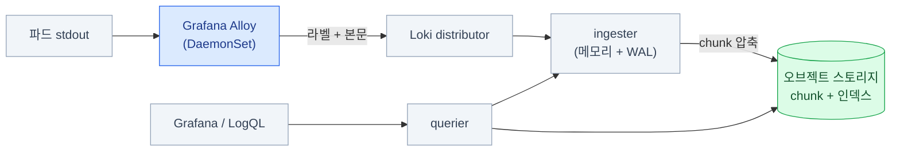

import { Tabs, TabItem, LinkCard } from '@astrojs/starlight/components';
import TermIntro from '../../../components/TermIntro.astro';

> Loki에서 잘못 고른 라벨 하나가 **클러스터 전체 로그를 못 쓰게 만든다**

<TermIntro
  terms={[
    ['Loki', '', 'Grafana Labs의 로그 저장소. **로그 본문을 인덱싱하지 않고 라벨만 인덱싱**해서 가볍다. 본문 검색은 그때그때 훑는다(grep과 비슷하다).'],
    ['스트림', 'Stream', '**라벨 조합 하나 = 스트림 하나**. `{namespace="prod", app="api"}`가 한 스트림이고, 로그는 스트림 단위로 뭉쳐 저장된다.'],
    ['chunk', '청크', '한 스트림의 로그를 시간·크기 단위로 뭉쳐 압축한 덩어리. **이 덩어리가 오브젝트 스토리지로 간다**(온프렘 덱 6장).'],
    ['LogQL', 'Log Query Language', 'Loki의 질의 언어. **`{라벨 선택} |= "문자열" | 파싱 | 필터`** 형태다. PromQL과 닮았고, 로그에서 메트릭도 뽑는다.'],
    ['Grafana Alloy', '', '로그·메트릭·트레이스를 모으는 에이전트. **Promtail은 2026-03-02 EOL**이라 지금은 이쪽을 쓴다.'],
    ['테넌트', 'Tenant', '데이터를 격리하는 단위. Loki는 `X-Scope-OrgID` 헤더로 테넌트를 가른다 — 팀별로 로그를 나눌 때 쓴다.'],
  ]}
/>

## 문제 — 로그는 파드와 함께 사라진다

```bash
kubectl logs api-7d9f-x8k2p --previous
# Error from server: previous terminated container not found
```

파드가 두 번 재시작하면 문제가 났던 그 로그는 이미 없다. 노드가 교체되면 더 확실히 없다.
게다가 서비스가 열 개면 **어느 파드를 봐야 하는지부터** 문제다.

로그 저장소가 채워야 하는 건 셋이다 — **파드 밖에 오래 남기고, 여러 파드를 한 번에 훑고,
시각으로 자를 수 있게** 하는 것.

## Loki의 선택 — 본문을 인덱싱하지 않는다

Elasticsearch 계열은 **로그 본문을 전부 역색인**한다. 검색은 빠르지만 인덱스가
원본보다 커지는 일이 흔하고, 온프렘에서 그 디스크와 메모리를 감당하기 어렵다.

Loki는 반대로 간다.

| | Elasticsearch 계열 | **Loki** |
|---|---|---|
| 인덱싱 | 본문 전체 | **라벨만** |
| 저장 | 자체 클러스터 디스크 | **오브젝트 스토리지에 압축 chunk** |
| 검색 | 임의 단어를 즉시 | 라벨로 범위를 좁힌 뒤 **본문을 훑는다** |
| 비용 | 높다 | 낮다 |
| 대가 | — | **라벨을 잘못 짜면 아무것도 못 찾는다** |



:::tip[핵심 — 라벨이 곧 검색 범위다]
LogQL 질의는 **반드시 라벨 선택으로 시작한다.** `{namespace="prod"}`로 좁힌 다음에야
본문을 훑는다. 그래서 **"나중에 이걸로 찾을 것 같다" 싶은 축이 라벨에 없으면
그 축으로는 검색이 사실상 불가능**하다 — 라벨 설계가 전부라는 말은 이 뜻이다.
:::

## 라벨 설계 — 이 장에서 제일 중요한 것

라벨 조합 하나가 스트림 하나다. **스트림이 많아지면 Loki가 무너진다** —
chunk가 잘게 쪼개져 압축이 안 되고, 인덱스가 커지고, ingester 메모리가 터진다.

| 라벨에 넣는다 | 절대 넣지 않는다 |
|---|---|
| `cluster` · `namespace` · `app` · `container` | `pod`(단명하면 스트림이 계속 새로 생긴다) |
| `env`(prod/stage) | `request_id` · `trace_id` · `user_id` |
| `level`(info/error) — 값이 몇 개뿐일 때만 | IP 주소 · URL 전체 |
| `node`(노드 수가 적을 때) | 타임스탬프·랜덤 값이 섞인 무엇이든 |

:::caution[함정 — 카디널리티 폭발]
`pod` 라벨은 특히 조심해야 한다. Deployment가 하루에 수십 번 롤링되면
**파드 이름마다 새 스트림**이 생기고, 한 달이면 스트림이 수만 개가 된다.
증상은 이렇게 나타난다.

- 질의가 타임아웃되거나 "too many streams" 오류
- ingester 파드가 OOM으로 재시작 반복
- chunk가 작게 쪼개져 오브젝트 스토리지 요청 수가 폭증

**필요하면 본문에 넣고 나중에 파싱한다** — 아래 LogQL 절의 `| json` · `| logfmt`가 그 용도다.
:::

## 수집 — Grafana Alloy

```hcl
// 쿠버네티스 파드를 찾고, 로그를 읽어, Loki로 보낸다
discovery.kubernetes "pods" {
  role = "pod"
}

discovery.relabel "pods" {
  targets = discovery.kubernetes.pods.targets

  // 라벨은 여기서 결정된다 — 이 목록이 곧 검색 축이다
  rule {
    source_labels = ["__meta_kubernetes_namespace"]
    target_label  = "namespace"
  }
  rule {
    source_labels = ["__meta_kubernetes_pod_label_app_kubernetes_io_name"]
    target_label  = "app"
  }
  rule {
    source_labels = ["__meta_kubernetes_pod_container_name"]
    target_label  = "container"
  }
  // pod 이름은 일부러 라벨로 안 만든다 (카디널리티)
}

loki.source.kubernetes "pods" {
  targets    = discovery.relabel.pods.output
  forward_to = [loki.write.default.receiver]
}

loki.write "default" {
  endpoint {
    url = "http://loki-gateway.observability.svc/loki/api/v1/push"
    // 멀티테넌시를 쓰면: tenant_id = "platform"
  }
}
```

:::caution[함정 — Promtail 기준 문서]
검색으로 나오는 Loki 수집 설정은 대부분 **Promtail의 `scrape_configs`** 형식이다.
Promtail은 2026-03-02에 EOL됐다. 기존 Promtail 설정이 있으면
Loki 문서의 **Alloy 마이그레이션 도구**가 한 번에 변환해 준다 — 손으로 옮기지 않는다.
:::

## 배포 모드 — 규모에 맞게

| 모드 | 모양 | 언제 |
|---|---|---|
| **monolithic** (SingleBinary) | 한 프로세스에 전부 | 하루 수십 GB 이하. 온프렘 소규모의 기본값 |
| **simple scalable** (SSD) | read / write / backend 셋으로 | 하루 수백 GB. **대부분 여기서 멈춰도 된다** |
| **microservices** | 컴포넌트별 파드 | 아주 큰 규모. 운영 부담이 확 는다 |

:::tip[핵심]
**monolithic으로 시작해서 필요할 때 simple scalable로 간다.**
어느 모드든 **chunk는 오브젝트 스토리지에** 있으므로, 모드를 바꿔도 데이터는 그대로다.
처음부터 microservices로 가면 컴포넌트 열 개를 이해하다 시간을 다 쓴다.
:::

```yaml
# Helm values 발췌 — 저장소는 어느 모드든 이 모양이다
loki:
  storage:
    type: s3
    bucketNames:
      chunks: loki-chunks
      ruler: loki-ruler
    s3:
      endpoint: https://s3.example.internal
      s3ForcePathStyle: true       # 온프렘 — 온프렘 덱 6장
      region: us-east-1
      accessKeyId: ${LOKI_ACCESS_KEY}
      secretAccessKey: ${LOKI_SECRET_KEY}
  limits_config:
    retention_period: 720h         # 30일
    ingestion_rate_mb: 20          # 테넌트별 인입 제한 — 폭주 앱이 전체를 못 죽이게
    max_streams_per_user: 10000    # 카디널리티 방어선
compactor:
  retention_enabled: true          # 이게 꺼져 있으면 보존 기간이 적용되지 않는다
```

:::caution[함정 — Helm 차트가 이사했다]
Loki Helm 차트는 **2026-03-16부터 `grafana-community/helm-charts`** 에 있다.
옛 저장소를 가리키는 `helm repo add` 명령이 담긴 가이드가 아직 많다.
차트를 못 찾거나 오래된 버전이 설치되면 이걸 의심한다.
:::

## LogQL — 실전에서 쓰는 형태 넷

<Tabs>
<TabItem label="찾기">

```text
{namespace="prod", app="api"} |= "error" != "healthcheck"
```

`|=` 포함, `!=` 제외, `|~` 정규식. **라벨 선택 → 문자열 필터** 순서가 항상 먼저다.

</TabItem>
<TabItem label="파싱해서 필터">

```text
{namespace="prod", app="api"}
  | json
  | status >= 500
  | line_format "{{.method}} {{.path}} {{.status}} {{.duration}}"
```

JSON 로그면 `| json`, key=value 형식이면 `| logfmt`.
**라벨에 안 넣은 축은 여기서 꺼내 쓴다** — 라벨을 절제할 수 있는 이유가 이것이다.

</TabItem>
<TabItem label="로그에서 메트릭">

```text
sum by (app) (rate({namespace="prod"} |= "error" [5m]))
```

**로그를 세어 그래프로 만든다.** 앱이 메트릭을 안 내줄 때 임시 대안이 되고,
Grafana에서 메트릭 패널과 나란히 놓을 수 있다.

</TabItem>
<TabItem label="트레이스로 건너뛰기">

```text
{namespace="prod", app="api"} | json | trace_id != ""
```

로그에 `trace_id`가 실려 있으면 Grafana의 derived field가 **Tempo로 가는 링크**를 만들어 준다
([5장](/observability/05-grafana/)). 앱 로그에 trace ID를 넣는 것이
[4장](/observability/04-tempo/)에서 가장 값싸게 얻는 이득이다.

</TabItem>
</Tabs>

## 운영에서 부딪히는 것들

| 항목 | 내용 |
|---|---|
| **보존이 안 지워진다** | `compactor.retention_enabled: true`가 아니면 `retention_period`가 무시된다. 버킷 라이프사이클과 **둘 중 하나로 통일**한다 |
| **순서가 뒤집힌 로그** | 노드 시계가 어긋나면 거부된다. NTP를 맞추고, 필요하면 out-of-order 허용 창을 준다 |
| **ingester 재시작 시 유실** | WAL을 켜고 PVC를 준다. chunk가 flush되기 전 데이터가 메모리에 있다 |
| **폭주하는 앱 하나** | `ingestion_rate_mb`·`per_stream_rate_limit`으로 막는다. 안 막으면 그 앱이 전체 로그를 밀어낸다 |
| **멀티테넌시** | `X-Scope-OrgID`로 팀별 격리. 처음엔 단일 테넌트로 두고, 팀이 늘면 나눈다 |
| **감사 로그는 따로** | 규정상 보존 기간이 다르면 **별도 테넌트·별도 버킷**으로. 30일 로그와 섞으면 3년치를 다 들고 있게 된다 |

## 점검

```bash
# ① 인입되고 있나
kubectl -n observability logs deploy/loki-write | grep -i -m5 'err\|refus'
kubectl -n observability port-forward svc/loki-gateway 3100:80
curl -s "http://localhost:3100/loki/api/v1/labels" | jq
#   라벨 목록이 나오면 인입은 되고 있다

# ② 어떤 스트림이 몇 개인가 (카디널리티 점검)
curl -s "http://localhost:3100/loki/api/v1/label/app/values" | jq

# ③ 실제 질의
curl -sG "http://localhost:3100/loki/api/v1/query_range" \
  --data-urlencode 'query={namespace="prod"} |= "error"' \
  --data-urlencode 'limit=5' | jq '.data.result | length'

# ④ 오브젝트 스토리지에 chunk가 쌓이나 (여기가 비어 있으면 저장이 안 되는 것이다)
mc ls store/loki-chunks/ --recursive | tail
```

| 증상 | 흔한 원인 | 확인 |
|---|---|---|
| 로그가 하나도 안 보임 | Alloy가 대상을 못 찾음 · 라벨 이름 불일치 | Alloy UI(`/graph`), `api/v1/labels` |
| `too many streams` | **카디널리티 폭발** | `max_streams_per_user`, 라벨에 `pod`·ID가 없는지 |
| 질의가 타임아웃 | 범위가 너무 넓다 · 라벨 선택이 헐겁다 | 시간 범위를 좁히고 라벨을 더 준다 |
| 오래된 로그가 안 지워짐 | `retention_enabled: false` | compactor 설정 |
| 인입이 429로 거부됨 | rate limit | `limits_config`와 폭주 앱 확인 |
| chunk가 안 올라감 | S3 자격증명·path-style·CA | [온프렘 덱 6장](/onprem/06-minio/) 함정 넷 |

## 3장 요약

- Loki는 **본문을 인덱싱하지 않고 라벨만** 인덱싱한다 — 그래서 싸고, 그래서 **라벨 설계가 전부**다
- 라벨에는 **미리 셀 수 있는 축만.** `pod`·ID·URL은 넣지 않고 `| json`으로 나중에 파싱한다
- 수집은 **Grafana Alloy**. Promtail은 EOL이니 기존 설정은 변환 도구로 옮긴다
- 배포는 **monolithic → simple scalable** 순. chunk는 어느 모드든 오브젝트 스토리지에 있다
- **`retention_enabled`가 꺼져 있으면 보존 기간이 안 먹는다** — 온프렘에서 디스크가 차는 흔한 경로
- 앱 로그에 **`trace_id`를 실어 두면** Grafana에서 트레이스로 바로 건너뛴다

<LinkCard
  title="4. 추적 — Tempo와 OpenTelemetry"
  description="한 요청이 어디서 느렸나. 계측이라는 진입 장벽, 샘플링, 그리고 Tempo 3.0의 큰 변화."
  href="/observability/04-tempo/"
/>
