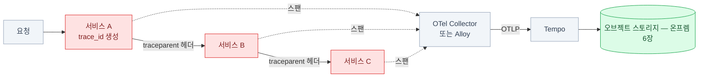

import { Tabs, TabItem, LinkCard, Steps } from '@astrojs/starlight/components';
import TermIntro from '../../../components/TermIntro.astro';

> 추적은 앞의 둘과 성격이 다르다 — **앱 코드를 건드려야 시작된다**

<TermIntro
  terms={[
    ['트레이스 · 스팬', 'Trace · Span', '요청 하나의 전체 여정이 트레이스, 그 안의 구간 하나가 스팬이다. `API 호출 3초` 아래 `DB 질의 2.8초`처럼 **트리로 쌓인다**.'],
    ['컨텍스트 전파', 'Context Propagation', '서비스 A가 B를 부를 때 **트레이스 ID를 HTTP 헤더에 실어 넘기는 것**. 이게 끊기면 트레이스가 조각난다. 표준 헤더는 `traceparent`(W3C).'],
    ['OTLP', 'OpenTelemetry Protocol', 'OpenTelemetry의 전송 프로토콜. 지금은 **트레이스·메트릭·로그 모두** 이걸로 보낸다 — 백엔드를 바꿔도 계측은 그대로다.'],
    ['샘플링', 'Sampling', '모든 요청을 저장하지 않고 **일부만 남기는 것**. head(시작할 때 결정)와 tail(끝나고 결과를 보고 결정) 두 방식이 있다.'],
    ['TraceQL', '', 'Tempo의 트레이스 질의 언어. `{ duration > 2s && resource.service.name = "api" }` 같은 조건으로 **느린 트레이스만 골라낸다**.'],
    ['서비스 그래프', 'Service Graph', '트레이스에서 자동 생성한 "누가 누구를 부르나" 지도. 문서에 없는 실제 호출 관계가 드러난다.'],
  ]}
/>

## 문제 — 로그로는 "어디서" 느린지 못 찾는다

```
[api]      POST /orders  →  3.2s
```

3.2초가 어디서 갔을까. 인증 확인? DB? 결제 서비스 호출? 그 결제 서비스 안의 또 다른 호출?
로그로 하려면 서비스마다 시각을 찍고 사람이 눈으로 맞춰야 하는데,
**요청이 초당 수백 개면 어느 로그가 어느 요청인지부터** 문제다.

| 신호 | 이 질문에 |
|---|---|
| 메트릭 | "p99가 3초다" — **얼마나 느린지**는 안다 |
| 로그 | "그 시각에 이런 에러가" — **무슨 일이 있었는지**는 안다 |
| **트레이스** | "3.2초 중 2.8초가 재고 서비스의 DB 질의" — **어디서 갔는지**를 안다 |

## 진입 장벽이 다르다 — 앱을 고쳐야 한다

메트릭과 로그는 앱이 가만히 있어도 어느 정도 모인다(노드 exporter, stdout).
**추적은 다르다.** 요청이 서비스를 건널 때 트레이스 ID를 이어 주는 코드가 필요하다.



빨간 부분 — **각 서비스에 계측이 들어가야 하는 자리**다. 방법은 셋.

| 방법 | 어떻게 | 대가 |
|---|---|---|
| **자동 계측** | 에이전트를 붙이면 HTTP·DB 호출을 알아서 잡는다 (Java 에이전트, Python `opentelemetry-instrument` 등) | 코드 수정이 거의 없다. 대신 세밀한 구간은 안 잡힌다 |
| **SDK로 수동** | 코드에서 스팬을 직접 연다 | 비즈니스 구간까지 볼 수 있다. 개발 공수 |
| **사이드카·메시** | 서비스 메시가 프록시 레벨에서 | 서비스 간 호출은 잡히지만 **앱 안은 안 보인다** |

:::caution[함정 — 헤더 하나만 안 넘겨도 끊긴다]
자동 계측을 넣었는데 트레이스가 조각조각 나뉜다면, 대개 **중간 어딘가에서
`traceparent` 헤더가 사라진 것**이다. 흔한 범인은 자체 HTTP 클라이언트 래퍼,
메시지 큐를 거치는 구간, 그리고 헤더를 화이트리스트로 걸러 내는 프록시다.
게이트웨이·프록시가 그 헤더를 통과시키는지부터 확인한다.
:::

:::tip[핵심 — 제일 싼 첫걸음]
전면 도입 전에 **로그에 `trace_id`를 찍는 것**부터 한다. 계측을 넣으면 SDK가 현재
trace ID를 알고 있으니 로그 포맷에 한 줄 넣으면 끝이고, 그것만으로도
[3장](/observability/03-loki/)의 로그에서 트레이스로 건너뛸 수 있다.
Grafana의 derived field가 그 링크를 만들어 준다 ([5장](/observability/05-grafana/)).
:::

## 샘플링 — 전부 저장할 수는 없다

트레이스는 세 신호 중 **가장 빨리 용량을 먹는다.** 요청 하나가 스팬 수십 개다.

| 방식 | 언제 정하나 | 장점 | 단점 |
|---|---|---|---|
| **head 샘플링** | 요청 시작할 때 (예: 1%) | 단순하다. 부하가 예측 가능 | **문제가 난 요청이 안 뽑힐 수 있다** |
| **tail 샘플링** | 요청이 끝난 뒤 결과를 보고 | 에러·느린 요청을 **골라서** 남긴다 | 컬렉터가 트레이스를 잠시 들고 있어야 한다(메모리) |

```yaml
# OTel Collector / Alloy의 tail 샘플링 — 온프렘에서 이 조합이 실용적이다
tail_sampling:
  decision_wait: 10s
  policies:
    - name: errors            # 에러는 전부 남긴다
      type: status_code
      status_code: { status_codes: [ERROR] }
    - name: slow              # 느린 것도 전부
      type: latency
      latency: { threshold_ms: 1000 }
    - name: baseline          # 나머지는 1%만
      type: probabilistic
      probabilistic: { sampling_percentage: 1 }
```

:::caution[함정 — "그 요청"이 없다]
사용자가 "3시 12분에 주문이 실패했어요"라고 하는데 샘플링에 안 걸려 트레이스가 없는 일이
자주 생긴다. **에러와 느린 요청은 100%로 남기는 tail 정책**이 그래서 필요하고,
그래도 없을 때를 대비해 **로그의 `trace_id`** 가 최후의 연결 고리가 된다.
:::

## Tempo — 트레이스 저장소

Tempo도 Loki처럼 **오브젝트 스토리지에 블록을 쓴다.** 그리고 특이한 성질이 하나 있다 —
**트레이스 ID로 찾을 때는 인덱스가 필요 없다.** ID에서 위치를 계산할 수 있어서다.
그래서 저장 비용이 아주 낮다.

```yaml
# Tempo 저장소 설정 — 온프렘 덱 6장의 그 엔드포인트
storage:
  trace:
    backend: s3
    s3:
      bucket: tempo-traces
      endpoint: s3.example.internal
      forcepathstyle: true
      insecure: false
```

### Tempo 3.0 — 구조가 바뀌었다

:::caution[함정 — 2.x 기준 운영 문서는 안 통한다]
Tempo 3.0은 **인입과 질의를 분리한 새 아키텍처**로 갈아엎었다.

- **ingester · compactor · local-blocks 프로세서 · v2 블록 포맷 · scalable-single-binary 타깃이 제거**됐다
- metrics-generator가 distributor에서 gRPC로 스팬을 받지 않고 **Kafka에서 직접 소비**한다
- **3.0에서 2.x로 내려가는 경로가 없다** — 업그레이드 전에 반드시 백업하고 리허설한다
- 설정은 `tempo-cli migrate config`로 변환한다

즉 "ingester 메모리를 튜닝한다", "compactor를 늘린다" 같은 2.x 운영 지식이
그대로는 안 통한다. 새로 올린다면 3.0 문서만 보고, 운영 중이면 **업그레이드를 계획된 작업으로** 다룬다.
:::

### 배포 판단

| 상황 | 답 |
|---|---|
| 처음 도입, 트레이스 양이 적다 | 단일(monolithic) 구성으로 시작 |
| 서비스가 많고 지속적으로 들어온다 | 분리 구성 + tail 샘플링을 컬렉터에서 |
| 메트릭 생성(서비스 그래프·스팬 메트릭)을 쓰겠다 | 3.0에서는 **Kafka가 인입 경로에 들어온다** ([Kafka 덱](/kafka/)) — 도입 비용을 먼저 따진다 |

## 트레이스에서 얻는 부산물 — 서비스 그래프와 스팬 메트릭

Tempo는 트레이스를 보고 **메트릭을 만들어 낼 수 있다.**

| 산출물 | 내용 | 쓸모 |
|---|---|---|
| **서비스 그래프** | 누가 누구를 부르는지의 지도 | **문서에 없는 실제 의존 관계**가 드러난다. 장애 전파 경로 파악 |
| **스팬 메트릭** | 서비스·오퍼레이션별 요청 수·지연·에러율 | 앱이 메트릭을 안 내줘도 RED 지표를 얻는다 |

이 메트릭들은 Prometheus로 흘러가므로 [2장](/observability/02-prometheus/)의 알림 규칙에 그대로 쓸 수 있다.

## 세 신호를 잇기 — 이 장의 진짜 값


<Steps>

1. **메트릭 → 트레이스**: 앱이 히스토그램에 exemplar를 붙이면, Grafana 그래프에서
   튄 점을 클릭해 그 순간의 트레이스로 간다. Prometheus에서 exemplar 저장을 켜야 한다.

2. **로그 → 트레이스**: 로그에 `trace_id`가 있으면 Grafana derived field가 링크를 만든다.
   **가장 싸고 가장 자주 쓰인다.**

3. **트레이스 → 로그**: 트레이스 화면에서 해당 서비스·시각의 로그로 이동한다.
   Tempo 데이터소스의 "trace to logs" 설정이 그것이다.

4. 셋 다 [5장](/observability/05-grafana/)에서 실제로 연결한다.

</Steps>

## 점검

```bash
# ① 컬렉터가 스팬을 받고 있나
kubectl -n observability logs deploy/alloy | grep -i -m5 'trace\|otlp'

# ② Tempo가 저장하고 있나
kubectl -n observability port-forward svc/tempo 3200:3200
curl -s http://localhost:3200/api/echo        # 살아 있나
curl -s http://localhost:3200/metrics | grep -E 'tempo_distributor_spans_received_total|tempo_ingester'

# ③ 오브젝트 스토리지에 블록이 쌓이나
mc ls store/tempo-traces/ --recursive | tail

# ④ 트레이스 ID로 직접 조회 (로그에서 하나 골라서)
curl -s "http://localhost:3200/api/traces/<trace_id>" | jq '.batches | length'

# ⑤ 앱이 헤더를 넘기나 — 서비스 경계에서 확인
kubectl -n prod exec deploy/api -- \
  sh -c 'curl -s -D- http://downstream.prod.svc:8080/health -o /dev/null' | grep -i traceparent
```

| 증상 | 흔한 원인 | 확인 |
|---|---|---|
| 트레이스가 조각남 | `traceparent` 전파 끊김 | 프록시·클라이언트 래퍼·큐 구간 |
| 트레이스가 아예 없음 | OTLP 엔드포인트 오설정 · 샘플링 0% | 컬렉터 로그, SDK 환경변수 |
| "그 요청"이 안 남음 | head 샘플링만 씀 | tail 샘플링에 에러·지연 정책 추가 |
| 저장은 되는데 조회 실패 | S3 접근 · 블록 포맷 | Tempo 로그, [온프렘 덱 6장](/onprem/06-minio/) 함정 넷 |
| 업그레이드 후 기동 실패 | **3.0 구조 변경** | `tempo-cli migrate config`, 제거된 컴포넌트 확인 |

## 4장 요약

- 추적은 **"어디서 느렸나"** 에 답하고, 그 대가로 **앱 계측**이 필요하다 — 진입 장벽이 다른 둘과 다르다
- 계측의 급소는 **컨텍스트 전파**다. `traceparent` 헤더 하나가 끊기면 트레이스가 조각난다
- **가장 싼 첫걸음은 로그에 `trace_id`를 찍는 것**이다
- 샘플링은 **tail로 — 에러·느린 요청은 100%, 나머지는 1%**. head만 쓰면 정작 필요한 요청이 없다
- Tempo는 블록을 오브젝트 스토리지에 두고, 트레이스 ID 조회에는 인덱스가 필요 없다
- **Tempo 3.0은 구조가 바뀌었고 2.x로 되돌릴 수 없다** — 업그레이드는 계획된 작업으로
- 트레이스에서 **서비스 그래프와 스팬 메트릭**이 부산물로 나온다

<LinkCard
  title="5. Grafana — 하나의 창"
  description="세 데이터소스를 한 화면에서 오가게 만들기, 대시보드를 코드로 관리하기, SSO와 HA."
  href="/observability/05-grafana/"
/>
