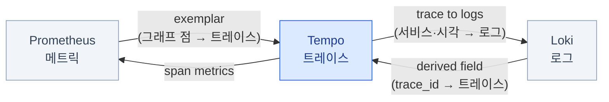

import { Tabs, TabItem, LinkCard, Steps } from '@astrojs/starlight/components';
import TermIntro from '../../../components/docs/TermIntro.astro';

> Grafana의 값은 그래프가 아니라 **메트릭에서 로그로, 로그에서 트레이스로 두 번 클릭에 가는 것**이다

<TermIntro
  terms={[
    ['데이터소스', 'Data Source', 'Grafana가 붙는 저장소 하나. Prometheus · Loki · Tempo · PostgreSQL이 각각 하나씩이다. **uid**로 서로를 참조한다.'],
    ['프로비저닝', 'Provisioning', '데이터소스·대시보드를 **파일이나 CRD로 미리 넣어 두는 것**. UI에서 만든 것과 달리 파드가 사라져도 남고, Git으로 관리된다.'],
    ['derived field', '파생 필드', '로그 한 줄에서 정규식으로 값을 뽑아 **다른 데이터소스로 가는 링크**를 만드는 기능. `trace_id` → Tempo 링크가 대표적이다.'],
    ['Explore', '탐색', '대시보드가 아니라 **질의 한 줄을 그때그때 던지는 화면**. 조사는 대부분 여기서 하고, 반복되는 것만 대시보드로 굳힌다.'],
    ['템플릿 변수', 'Template Variable', '대시보드 위쪽의 드롭다운. `$service` 하나로 **대시보드 100개를 1개로 줄이는** 장치다.'],
    ['Unified Alerting', '통합 알림', 'Grafana가 자체적으로 알림 규칙을 평가·발송하는 기능. Alertmanager와 **역할이 겹쳐서** 어느 쪽에 둘지 정해야 한다.'],
  ]}
/>

## 문제 — 창이 세 개면 아무도 안 본다

Prometheus UI, Loki 조회, Tempo — 각각 따로 열면 조사할 때마다 이런 일을 한다.

<Steps>

1. 알림을 받는다. Prometheus UI를 열어 언제부터인지 확인한다 — **03:12**

2. 로그 화면으로 옮겨 시각을 **다시 입력**하고, 네임스페이스와 앱 이름을 **다시 입력**한다

3. 느린 요청의 trace ID를 로그에서 **복사**해 Tempo 화면에 **붙여 넣는다**

4. 그 사이 5분이 지났고, 원인은 아직이다

</Steps>

이 이동을 없애는 것이 Grafana를 쓰는 이유다. **대시보드가 예쁜 건 부수적이다.**

## 데이터소스와 상관 관계 — 먼저 이것부터 설정한다



프로비저닝 파일 하나로 셋을 다 넣는다. **UI에서 손으로 만들지 않는다** — 아래 절 참고.

```yaml
apiVersion: 1
datasources:
  - name: Prometheus
    type: prometheus
    uid: prom                       # 다른 데이터소스가 이 uid로 참조한다
    url: http://kube-prometheus-stack-prometheus.observability.svc:9090
    isDefault: true
    jsonData:
      exemplarTraceIdDestinations:
        - name: trace_id
          datasourceUid: tempo      # 메트릭 → 트레이스

  - name: Loki
    type: loki
    uid: loki
    url: http://loki-gateway.observability.svc
    jsonData:
      derivedFields:
        - name: TraceID
          matcherRegex: '"trace_id":"(\w+)"'   # 로그 형식에 맞춘다
          url: '$${__value.raw}'
          datasourceUid: tempo                 # 로그 → 트레이스

  - name: Tempo
    type: tempo
    uid: tempo
    url: http://tempo.observability.svc:3200
    jsonData:
      tracesToLogsV2:
        datasourceUid: loki                    # 트레이스 → 로그
        tags: [{ key: 'service.name', value: 'app' }]
        spanStartTimeShift: '-5m'
        spanEndTimeShift: '5m'
      serviceMap:
        datasourceUid: prom                    # 서비스 그래프
```

`tracesToLogsV2`의 `tags`가 하는 일을 알아 두면 디버깅이 쉽다 —
**트레이스의 `service.name`을 로그의 `app` 라벨에 대응시켜** 로그 질의를 자동으로 만든다.
이름이 다르면 여기서 매핑해 주면 되고, 매핑이 틀리면 "트레이스에서 로그로 갔는데 비어 있다"가 된다.

:::tip[핵심 — 이 설정 하나가 조사 시간을 절반으로 줄인다]
대시보드를 100개 만드는 것보다 **derived field 한 줄**이 실전에서 더 자주 쓰인다.
로그에서 `trace_id` 옆에 링크 버튼이 생기고, 누르면 그 요청의 전체 여정이 바로 열린다.
[4장](/observability/04-tempo/)에서 "가장 싼 첫걸음"이라고 한 게 여기서 값을 한다.
:::

## Explore — 실제 조사는 여기서 한다

대시보드는 **미리 알고 있던 질문**에 답한다. 사고는 대개 **몰랐던 질문**으로 시작하고,
그때 여는 화면이 Explore다. 앞 장들이 쌓아 온 것이 여기서 한 줄기로 이어진다.

<Steps>

1. **알림에서 시작** — `severity=critical`, orders 서비스 에러율.
   알림의 runbook 링크에 **이 조사를 여는 Explore 링크를 넣어 두면** 여기서 시간이 는다

2. **메트릭으로 범위를 좁힌다** ([2장](/observability/02-prometheus/))

   ```text
   sum by (service) (rate(http_requests_total{status=~"5.."}[5m]))
   ```

   03:12부터, orders만. **여기서 시간 범위를 03:05~03:30으로 좁혀 둔다** —
   이 범위가 다음 단계로 그대로 따라간다

3. **분할 화면으로 로그를 연다** (`Split` 버튼) ([3장](/observability/03-loki/))

   ```text
   {namespace="prod", app="orders"} |= "error" | json | line_format "{{.msg}} {{.err}}"
   ```

   왼쪽 그래프와 오른쪽 로그가 **같은 시간축**을 쓴다. 그래프에서 드래그해 범위를 줄이면
   로그도 같이 줄어든다 — 창을 따로 띄웠을 때와 가장 크게 갈리는 지점이다

4. **로그 한 줄을 펼쳐 `TraceID` 링크를 누른다** — 3장에서 넣은 `trace_id`와
   위에서 설정한 derived field가 만나는 자리다. 트레이스가 열린다

5. **어느 스팬이 시간을 먹었는지 본다** ([4장](/observability/04-tempo/)).
   그 스팬에서 다시 **`Logs for this span`** 을 누르면 그 서비스의 그 시각 로그로 간다

</Steps>

:::tip[핵심 — 조사가 끝나면 두 가지를 남긴다]
Explore 화면에는 **Share 링크**가 있다. 조사가 끝나면
**① 그 링크를 사고 기록에 붙이고, ② 같은 조사를 또 하게 될 것 같으면 대시보드 패널로 굳힌다.**

대시보드는 이렇게 **사후에 자라야** 쓸모 있는 것만 남는다.
처음부터 "필요할 것 같은 그래프"를 늘어놓으면 아무도 안 보는 200개가 된다.
:::

## 대시보드 — 늘리지 않는 것이 설계다

### 계층을 셋으로 고정한다

| 층 | 무엇이 있나 | 누가 언제 |
|---|---|---|
| **개요** | 클러스터 전체 상태 한 화면 — 노드·핵심 서비스 RED·발화 중인 알림 | 모니터에 띄워 두는 것. 하나만 만든다 |
| **층별** | 노드 · DB · 게이트웨이 · 관측 스택 자신 | 원인을 찾을 때 (USE 지표) |
| **서비스별** | RED 한 벌 + 그 서비스 로그 | **변수로 하나만 만든다** — 아래 |

### 서비스마다 대시보드를 만들지 않는다

서비스가 30개면 대시보드도 30개가 되는 게 가장 흔한 실패다.
**템플릿 변수 하나면 1개로 끝난다.**

```text
변수 정의 (Dashboard settings → Variables)
  name  : service
  type  : Query
  query : label_values(http_requests_total, service)     # 실제 값에서 목록을 만든다
  multi : true                                            # 여러 개 동시 선택 허용

패널 쿼리에서
  sum by (service) (rate(http_requests_total{service=~"$service"}[5m]))
                                            └── 정규식 매칭이라 multi 선택이 그대로 통한다
```

같은 방식으로 `$namespace` · `$cluster`도 만든다.
**변수는 로그 패널에도 그대로 쓰인다** — `{namespace="$namespace", app="$service"}` —
그래서 한 대시보드 안에서 메트릭과 로그가 같은 대상을 가리킨다.

### 패널은 질문에 맞춰 고른다

| 무엇을 알고 싶나 | 패널 |
|---|---|
| 시간에 따른 변화 | **Time series** — 기본값. 대부분 이것 |
| 지금 값 하나 (에러율 · 가동률) | **Stat** — 크게 하나. 개요 대시보드 맨 위 |
| 상위 N개 목록 (시계열 많은 메트릭, 재시작 많은 파드) | **Table** |
| 지연 **분포** | **Heatmap** — 히스토그램 버킷을 그대로 그린다. p99 선 하나보다 훨씬 많이 말한다 |
| 상태가 언제 바뀌었나 (Ready → NotReady) | **State timeline** |
| 로그 | **Logs** — 대시보드 안에 그대로 넣을 수 있다 |
| 서비스 호출 관계 | **Node graph** — Tempo의 서비스 그래프 ([4장](/observability/04-tempo/)) |

:::caution[함정 — 단위를 안 정하면 그래프가 거짓말을 한다]
패널의 Unit을 `short`(기본값)로 두면 `0.043`이 그냥 `0.043`으로 나온다.
에러율은 `percentunit`, 시간은 `s`, 크기는 `bytes(IEC)`로 바꾼다.

그리고 **Threshold를 색으로 걸어 둔다** — 에러율 5%부터 빨강처럼.
새벽에 깬 사람이 판단해야 할 것을 화면이 대신 판단해 주는 게 대시보드의 값이다.
:::

### 대시보드를 코드로

UI에서 만든 대시보드는 **파드가 새로 뜨거나 DB를 옮기면 사라진다.**
그리고 누가 언제 무엇을 바꿨는지 알 수 없다.

<Tabs>
<TabItem label="ConfigMap sidecar (Helm 기본)">

```yaml
apiVersion: v1
kind: ConfigMap
metadata:
  name: dashboard-platform-overview
  namespace: observability
  labels:
    grafana_dashboard: "1"          # sidecar가 이 라벨을 보고 집어 간다
data:
  platform-overview.json: |
    { "title": "Platform Overview", "panels": [ ... ] }
```

가장 단순하다. Argo CD로 관리하면 대시보드가 **Git에서 리뷰를 거쳐** 들어온다 ([온프렘 덱 9장](/onprem/09-gitops/)).

</TabItem>
<TabItem label="Grafana Operator">

```yaml
apiVersion: grafana.integreatly.org/v1beta1
kind: GrafanaDashboard
metadata:
  name: platform-overview
  namespace: observability
spec:
  instanceSelector:
    matchLabels: { dashboards: "grafana" }
  url: https://grafana.com/api/dashboards/1860/revisions/latest/download
```

공개 대시보드 ID로 가져오거나 JSON을 직접 넣는다. 데이터소스·폴더도 CR로 관리된다.

</TabItem>
</Tabs>

**만드는 방법은 UI에서 만들고 JSON을 내보내는 것**이 현실적이다.
JSON을 손으로 쓰지 않는다 — UI에서 맞춘 뒤 `Export → Save to file`로 꺼내
ConfigMap에 넣고, 다음부터는 그 파일이 원본이다.

:::tip[핵심 — 대시보드 폭발을 막는 규칙]
- **"이 대시보드로 어떤 결정을 하나"** 를 설명에 적는다. 못 적으면 지운다
- 사람이 만든 것은 **개인 폴더**에, 공용은 **프로비저닝된 것만**
- 분기마다 조회수 0인 대시보드를 정리한다 (Grafana 사용 통계로 확인된다)
:::

## 배포 — Grafana 자신의 상태는 어디에 두나

Grafana는 대시보드·사용자·알림 규칙을 **자기 DB**에 저장한다. 기본값은 SQLite다.

| 저장소 | 결과 |
|---|---|
| SQLite (기본) | **replica를 2개로 못 늘린다.** 파드가 옮겨 다니면 PVC에 묶인다 |
| **PostgreSQL** ([온프렘 덱 7장](/onprem/07-cnpg/)) | HA 가능. 백업이 CNPG 체계에 들어온다 |

```yaml
# Helm values 발췌
grafana.ini:
  database:
    type: postgres
    host: platform-pg-rw.database.svc:5432      # CNPG의 쓰기 서비스 (온프렘 덱 7장)
    name: grafana
    user: grafana
    ssl_mode: require
replicas: 2
persistence:
  enabled: false        # DB로 옮겼으면 PVC는 필요 없다
```

:::caution[함정 — 순환 의존을 만들지 않는다]
Grafana가 CNPG를 쓰고, CNPG 장애를 Grafana로 보고, Grafana 로그인은 Keycloak을 거치고,
Keycloak도 같은 CNPG를 쓴다면 — **DB 하나가 죽을 때 원인을 볼 창까지 같이 죽는다.**
최소한 다음 둘은 확보해 둔다.
- Grafana의 **로컬 관리자 계정**(깨진 유리, [온프렘 덱 5장](/onprem/05-identity/))
- DB 없이도 볼 수 있는 경로 — Prometheus UI 직접 접근(포트포워딩)이면 충분하다
:::

## SSO — Keycloak 붙이기

[온프렘 덱 5장](/onprem/05-identity/)의 패턴 ①이다. Grafana는 OIDC를 내장 지원하고,
**그룹으로 역할까지 매핑**된다.

```ini
[auth.generic_oauth]
enabled = true
name = Keycloak
client_id = grafana
client_secret = $__file{/etc/secrets/oauth_secret}
scopes = openid profile email groups
auth_url = https://sso.example.internal/realms/corp/protocol/openid-connect/auth
token_url = https://sso.example.internal/realms/corp/protocol/openid-connect/token
api_url = https://sso.example.internal/realms/corp/protocol/openid-connect/userinfo
# 그룹 → Grafana 역할
role_attribute_path = contains(groups[*], 'platform-admins') && 'Admin' || contains(groups[*], 'platform-editors') && 'Editor' || 'Viewer'
role_attribute_strict = true

[auth.anonymous]
enabled = false          # 기본으로 꺼 둔다

[users]
auto_assign_org_role = Viewer
```

| 확인할 것 | 왜 |
|---|---|
| `groups` claim이 실제로 오는가 | 안 오면 전원이 Viewer가 된다 → [Keycloak 덱 7장](/keycloak/07-apps/) |
| 사내 CA를 Grafana가 믿는가 | Keycloak이 사내 인증서면 토큰 교환이 실패한다 ([온프렘 덱 4장](/onprem/04-tls-dns/)) |
| `root_url`이 실제 주소와 같은가 | 리다이렉트 URI 불일치의 단골 원인 |
| 로컬 admin이 남아 있는가 | 깨진 유리 계정 ([온프렘 덱 5장](/onprem/05-identity/)) |

## 알림을 어디에 두나 — Grafana vs Alertmanager

둘 다 알림을 보낼 수 있어서 **섞으면 이중 발송이나 사각지대가 생긴다.** 하나로 정한다.

| | **Alertmanager 중심** (권장) | Grafana Unified Alerting 중심 |
|---|---|---|
| 규칙이 사는 곳 | `PrometheusRule` CRD — **Git으로 관리** | Grafana DB (프로비저닝하면 파일로도) |
| 여러 데이터소스 | Prometheus 메트릭만 | **Loki·SQL 등 여러 소스에 걸쳐** 규칙을 짤 수 있다 |
| Grafana가 죽으면 | 알림은 계속 간다 | **알림도 멈춘다** |
| 언제 | 인프라 알림 전부 | 로그 기반 알림처럼 Prometheus로 못 짜는 것만 |

:::tip[핵심]
**인프라 알림은 Alertmanager에 두고, Grafana는 조회 전용으로 쓴다.**
"관측 창이 죽어도 알림은 간다"가 훨씬 중요하다. 로그 기반 알림이 꼭 필요하면
Loki의 ruler(역시 Alertmanager로 보낸다)를 쓰는 편이 일관적이다.
:::

## 점검

```bash
# ① 데이터소스가 다 붙었나 (Grafana UI: Connections → Data sources → Test)
kubectl -n observability port-forward svc/grafana 3000:80
curl -s -u admin:<pw> http://localhost:3000/api/datasources | jq '.[] | {name, uid, type}'

# ② 상관 링크가 실제로 뜨나 — 눈으로 확인해야 하는 항목
#   Explore → Loki에서 trace_id 있는 로그 한 줄 → 우측에 TraceID 링크 버튼이 보이는가
#   그 버튼을 눌러 Tempo로 넘어가는가
#   Tempo 스팬에서 "Logs for this span"이 비어 있지 않은가

# ③ 대시보드가 프로비저닝됐나
curl -s -u admin:<pw> "http://localhost:3000/api/search?type=dash-db" | jq '.[].title'

# ④ SSO 로그인 흐름 (브라우저에서)
#   /login → Keycloak → 돌아온 뒤 우상단 프로필의 Role이 기대한 값인가
kubectl -n observability logs deploy/grafana | grep -i 'oauth\|role'
```

| 증상 | 흔한 원인 | 확인 |
|---|---|---|
| 데이터소스 Test 실패 | 서비스 주소 오타 · NetworkPolicy | 파드에서 직접 `curl` |
| 로그에 트레이스 링크가 없음 | `matcherRegex`가 실제 로그 형식과 불일치 | 로그 한 줄을 보고 정규식 수정 |
| 링크는 뜨는데 트레이스가 없음 | 그 요청이 **샘플링에서 빠졌다** | [4장](/observability/04-tempo/) tail 정책 |
| 트레이스 → 로그가 비어 있음 | `tracesToLogsV2`의 태그 매핑 불일치 | `service.name` ↔ 로그 라벨 이름 확인 |
| exemplar가 안 보임 | 앱이 exemplar를 안 내보냄 · Prometheus 설정 미비 | `/metrics`에 `# {trace_id=...}` 주석이 있나 |
| 변수 드롭다운이 비어 있음 | `label_values()` 대상 메트릭이 없음 | Explore에서 그 메트릭을 직접 질의 |
| 전원이 Viewer | `groups` claim 미도착 | ID 토큰 디코드 ([온프렘 덱 5장](/onprem/05-identity/)) |
| 대시보드가 사라짐 | UI에서 만들었고 파드가 재생성됨 | 프로비저닝으로 옮긴다 |
| 알림이 두 번 옴 | Grafana와 Alertmanager 양쪽에 규칙 | 한쪽으로 통일 |

## 5장 요약

- Grafana의 값은 대시보드가 아니라 **세 신호 사이의 이동을 없애는 것**이다
- **derived field · exemplar · trace to logs** 셋을 먼저 설정한다. 대시보드보다 먼저다
- 조사는 **Explore의 분할 화면**에서 한다 — 메트릭과 로그가 같은 시간축을 쓰는 것이 핵심이고,
  끝나면 링크를 사고 기록에 남긴다
- 대시보드는 **계층 셋 + 템플릿 변수**로 개수를 억누른다.
  서비스마다 만들지 말고 **`$service` 하나**로 돌려 쓴다
- 대시보드는 **코드로**(ConfigMap 또는 Operator). UI에서 만들어 Export하는 것이 현실적이다
- Grafana 자신의 DB는 **PostgreSQL(CNPG)** 로 — SQLite면 HA가 안 된다.
  대신 **순환 의존**을 만들지 않도록 깨진 유리 경로를 남긴다
- SSO는 그룹 → 역할 매핑까지. `groups` claim이 안 오면 전원이 Viewer가 된다
- **인프라 알림은 Alertmanager에.** Grafana가 죽어도 알림은 가야 한다

<LinkCard
  title="6. 용어 사전"
  description="세 신호와 네 도구에서 나온 말들을 신호별로 다시 모은다."
  href="/observability/06-glossary/"
/>
