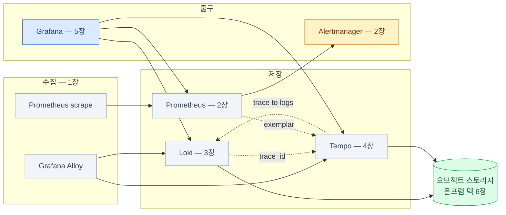

import { LinkCard, CardGrid, Card, Steps } from '@astrojs/starlight/components';
import TermIntro from '../../../components/TermIntro.astro';

> 관측은 도구 넷을 아는 일이 아니라 **알림에서 원인까지 가는 길을 아는 일**이다

<TermIntro
  title="이 장의 사용법"
  terms={[
    ['전체 지도', '', '세 신호와 그 사이의 연결. **한 장으로 다시 보는 그림**이다.'],
    ['도입 체크리스트', '', '처음 세울 때의 순서. 각 단계가 다음 단계의 전제다.'],
    ['사고 대응 카드', '', '급할 때 보는 첫 수 모음. 자세한 건 각 장의 점검 절에 있다.'],
  ]}
/>

## 전체 지도



점선 셋이 이 덱의 결론이다 — **저장소 셋을 세우는 것보다 그 셋을 잇는 것이 어렵고 값지다.**

## 장별 한 문장

| 장 | 한 문장 |
|---|---|
| [0](/observability/00-intro/) | 세 신호는 **역할 분담**이고, 값은 **이동**에서 나오며, 스택은 **카디널리티**로 죽는다 |
| [1](/observability/01-signals/) | 얼마나 · 무슨 일이 · 어디서 — 그리고 **저장소는 오브젝트 스토리지 하나로** 모인다 |
| [2](/observability/02-prometheus/) | **알림이 없는 메트릭은 부검 자료**다. Watchdog을 외부로 라우팅한다 |
| [3](/observability/03-loki/) | Loki는 **라벨만 인덱싱**한다 — 그래서 싸고, 그래서 **라벨 설계가 전부**다 |
| [4](/observability/04-tempo/) | 추적은 **앱을 고쳐야** 시작된다. 가장 싼 첫걸음은 **로그에 `trace_id`** |
| [5](/observability/05-grafana/) | Grafana의 값은 대시보드가 아니라 **신호 사이의 이동을 없애는 것**이다 |

## 도입 체크리스트 — 처음 세울 때

<Steps>

1. **전제 확인** ([1장](/observability/01-signals/))
   - **오브젝트 스토리지가 있는가** — 없으면 Loki도 Tempo도 못 뜬다 ([온프렘 덱 6장](/onprem/06-minio/))
   - 관측 스택을 **감시 대상과 다른 노드에** 둘 수 있는가 ([온프렘 덱 8장](/onprem/08-observability/))
   - 리텐션 · 보존 · 샘플링 · 스크랩 간격 **네 값을 먼저 적는다**

2. **메트릭** ([2장](/observability/02-prometheus/))
   - kube-prometheus-stack 설치 → `/targets`에서 노드·kube-state가 다 UP인가
   - `retention`과 `retentionSize`를 **둘 다** 준다
   - 앱은 `ServiceMonitor`로 추가. 안 긁히면 **`release` 라벨 · 포트 이름 · NS 셀렉터**

3. **알림** ([2장](/observability/02-prometheus/)) — **여기를 건너뛰지 않는다**
   - 필수 목록부터 열 개: `up == 0` · 노드 NotReady · **디스크 소진 예측** · PVC 사용률 ·
     **인증서 만료** · etcd · 파드 재시작 반복 · 오브젝트 스토리지 용량 · 관측 스택 자체
   - 알림마다 **runbook 링크**를 단다
   - `inhibit_rules`로 노드 하나 죽을 때 알림 40개가 오는 걸 막는다
   - **Watchdog을 외부 채널로 라우팅** — 알림이 안 오는 것을 알아채는 유일한 방법
   - 테스트 알림을 실제로 쏴서 **사람 손까지 도착하는지** 확인한다

4. **로그** ([3장](/observability/03-loki/))
   - 버킷 + 전용 사용자 + **라이프사이클**, `compactor.retention_enabled: true`
   - Loki는 **monolithic으로 시작**. Alloy는 DaemonSet
   - **라벨은 최소로** — `namespace` · `app` · `container`까지. `pod`는 넣지 않는다
   - `ingestion_rate_mb` · `max_streams_per_user`로 폭주 앱 방어선을 친다

5. **연결** ([5장](/observability/05-grafana/)) — **대시보드보다 먼저**
   - 데이터소스 셋을 **프로비저닝 파일로** (UI에서 만들지 않는다)
   - 앱 로그를 JSON으로 바꾸고 **`trace_id`를 찍게** 한다
   - `derivedFields` → 로그에서 트레이스 링크가 실제로 뜨는지 눈으로 확인
   - Grafana DB를 PostgreSQL로, SSO 연결, **로컬 admin은 남긴다**

6. **대시보드** ([5장](/observability/05-grafana/))
   - 계층 셋 고정 — 개요 → 층별 → 서비스별
   - ConfigMap 또는 Operator로 **코드에서** 들어오게
   - 대시보드마다 "이걸로 어떤 결정을 하나"를 설명에 적는다

7. **추적** ([4장](/observability/04-tempo/)) — 서비스 간 호출이 늘어난 뒤에
   - 자동 계측부터. **`traceparent`가 프록시·클라이언트 래퍼를 통과하는지** 먼저 확인
   - tail 샘플링 — **에러·느린 요청은 100%**, 나머지는 1%
   - `trace to logs` · `serviceMap` 연결까지 해야 값이 난다

8. **운영으로 넘기기**
   - 관측 스택 자신에 대한 알림 (TSDB 용량 · Loki 인입 실패 · Tempo S3 오류)
   - 분기마다 **조회수 0인 대시보드**와 **울린 적 없는 알림**을 정리한다
   - 카디널리티 상위 10개를 주기적으로 본다

</Steps>

:::tip[핵심]
**3번(알림)과 5번(연결)을 미루면 나머지가 값을 못 한다.**
그래프만 있는 스택은 아무도 안 보고, 이어지지 않은 저장소 셋은 창을 세 개 띄우게 만든다.
:::

## 사고 대응 카드

급할 때 순서대로. 자세한 건 각 장의 점검 절에 있다.

<CardGrid>
<Card title="관측이 안 보인다" icon="warning">
1. **스택 자체가 살아 있나** — 그래프가 평평한 것과 정상은 다르다

2. Prometheus `/targets` — DOWN 급증 ([2장](/observability/02-prometheus/))

3. 오브젝트 스토리지가 찼나 — **차면 로그와 트레이스가 동시에 멈춘다**

4. Alloy 파드 상태 · Loki 인입 429
</Card>
<Card title="로그가 안 들어온다" icon="warning">
1. `api/v1/labels`에 라벨이 나오나 — 나오면 인입은 되는 중 ([3장](/observability/03-loki/))

2. Alloy UI(`/graph`)에서 **대상을 찾았나**

3. `too many streams`면 **카디널리티 폭발** — 라벨에 `pod`·ID가 없는지

4. chunk가 버킷에 쌓이나 — 안 쌓이면 S3 자격증명·path-style·CA
</Card>
<Card title="알림이 안 온다" icon="warning">
1. **Watchdog이 외부에 도착하고 있었나** — 여기가 첫 질문이다

2. `/rules`에 규칙이 로드됐나 — **`PrometheusRule` 라벨이 틀리면 조용히 무시된다**

3. Alertmanager에 테스트 알림을 직접 쏴 본다 ([2장](/observability/02-prometheus/))

4. `inhibit_rules`나 silence에 묻히고 있지 않나
</Card>
<Card title="트레이스가 조각나거나 없다" icon="warning">
1. **`traceparent` 전파** — 프록시·클라이언트 래퍼·큐 구간을 의심한다 ([4장](/observability/04-tempo/))

2. 아예 없으면 OTLP 엔드포인트 오설정 · 샘플링 0%

3. "그 요청"만 없으면 **head 샘플링만 쓰는 것** — tail에 에러·지연 정책 추가

4. 업그레이드 후 기동 실패면 **Tempo 3.0 구조 변경**
</Card>
</CardGrid>

## 처음 인수인계 받았다면 — 30분 파악

```bash
# 무엇이 깔려 있나
kubectl -n observability get pods
helm list -n observability

# 무엇이 감시되고 있나 (규칙이 0개인 클러스터가 생각보다 흔하다)
kubectl -n observability get prometheusrule -o name | wc -l
kubectl -n observability get servicemonitor -A -o name | wc -l

# 알림이 실제로 어디로 가나 — 여기가 제일 중요하다
kubectl -n observability get secret alertmanager-kube-prometheus-stack-alertmanager \
  -o jsonpath='{.data.alertmanager\.yaml}' | base64 -d | grep -A3 'receiver\|webhook\|email'

# 얼마나 들고 있나
kubectl -n observability get prometheus -o jsonpath='{.items[*].spec.retention}{"\n"}'
kubectl -n observability get cm -o name | grep -i loki      # limits_config의 retention_period

# 저장소는 어디에
kubectl -n observability get secret | grep -i 's3\|loki\|tempo'

# 지금 안 좋은 것
kubectl -n observability get pods --field-selector=status.phase!=Running
#   Prometheus UI /targets 의 DOWN, /tsdb-status 의 카디널리티 상위
```

## 여기서 더 파려면

| 방향 | 무엇 | 이 덱과의 관계 |
|---|---|---|
| 밑에 깔리는 인프라 | [온프렘 덱](/onprem/) | 오브젝트 스토리지 · DB · SSO · 배치 판단 |
| 쿠버네티스 자체 | [CKA 덱](/cka/) · [CKA 실습 덱](/cka-udemy/) | 이 덱이 전제한 기초 |
| 리눅스 로그 | [서버 관리 덱](/server/) | 노드 안에서 벌어지는 일 |
| 메시징 | [Kafka 덱](/kafka/) | Tempo 3.0의 인입 경로에 등장한다 |
| 규모 확장 | Thanos · Mimir · 멀티 클러스터 조회 | 로컬 TSDB로 부족해진 다음 |
| 프로파일링 | Pyroscope · continuous profiling | 트레이스가 **함수 단위**까지 못 갈 때 |
| 신뢰성 공학 | SLO · 에러 버짓 · 번 레이트 알림 | 알림 설계의 다음 단계 |
| 이벤트 | 쿠버네티스 이벤트 수집 · 감사 로그 파이프라인 | 이 덱이 다루지 않은 네 번째 신호 |

## 마지막 한 장

**잘 굴러가는 관측 스택과 그렇지 않은 스택의 차이는 도구 선택이 아니다.**
알림이 사람 손까지 도착하는가, 그래프에서 로그로 두 번의 클릭에 가는가,
그리고 **라벨에 무엇을 넣지 않기로 했는가** — 이 셋이다.

도구는 바뀐다. 이 덱을 쓰는 동안에도 Promtail이 EOL됐고 Tempo가 구조를 갈아엎었다.
바뀌지 않는 건 **세 신호의 역할 분담**과 **셋을 잇는 장치 셋**이다.
새 도구가 나오면 "이건 어느 질문에 답하나, 옆 신호로 어떻게 건너가나"를 물으면 된다.

<LinkCard
  title="처음으로 — 덱 개요"
  description="전체 구성과 두 문장을 다시 본다."
  href="/observability/"
/>
