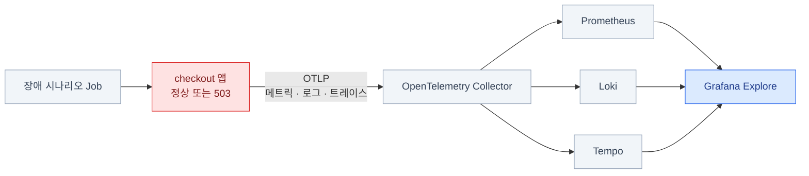

import { LinkCard, Steps } from '@astrojs/starlight/components';
import TermIntro from '../../../components/docs/TermIntro.astro';

> 이 장의 목표는 제품 넷을 운영 수준으로 설치하는 것이 아니라, **한 장애를 끝까지 조사할 작은 세계를 준비하는 것**이다

<TermIntro
  terms={[
    ['kind', 'Kubernetes IN Docker', 'Docker 컨테이너를 노드로 쓰는 로컬 쿠버네티스. 실습이 끝나면 클러스터째 지울 수 있다.'],
    ['LGTM', 'Loki · Grafana · Tempo · Mimir/Prometheus', 'Grafana 관측 스택을 짧게 부르는 이름. 이 실습은 메트릭 저장소로 Prometheus를 쓴다.'],
    ['OTLP', 'OpenTelemetry Protocol', '앱이 메트릭·로그·트레이스를 수집기로 보내는 공통 전송 규약. **신호 셋의 입구를 하나로 만든다.**'],
  ]}
/>

다음 장에서 일부러 `checkout` 서비스의 재고 예약을 느리게 만들고 503을 발생시킨다.
여기서는 그 사건이 메트릭·로그·트레이스 셋으로 동시에 남도록 환경만 세운다.



## 이 실습에서 단순화한 것

실습 스택은 Grafana의 **개발·데모용 `grafana/otel-lgtm` 이미지**다. 한 Pod 안에서
OpenTelemetry Collector, Prometheus, Loki, Tempo, Grafana가 함께 돌고 데이터는 `emptyDir`에 둔다.

| 실습 | 운영 환경 |
|---|---|
| 스택 전체가 **Pod 하나** | 제품별 배포와 복제본 · 장애 도메인 분리 |
| 데이터가 `emptyDir` | PVC 또는 오브젝트 스토리지 |
| 로컬 `admin` 로그인 | SSO · RBAC · 비밀 관리 |
| 리텐션·HA 없음 | 용량 계획 · 리텐션 · 백업 · 고가용성 |
| 모든 트레이스를 저장 | 비용에 맞춘 샘플링 |

:::caution[운영에 쓰지 않는다]
`grafana/otel-lgtm`은 제품 사용법과 신호 연결을 배우는 이미지다. **이 매니페스트를 운영 설치의
출발점으로 복사하지 않는다.** 운영 배포 판단은 [2장](/observability/02-prometheus/),
[3장](/observability/03-loki/), [4장](/observability/04-tempo/)이 맡는다.
:::

## 사전 준비

Docker 런타임에 **CPU 4개 · 메모리 6 GiB 이상**을 할당한다. 이미지와 클러스터를 합쳐
디스크 여유 공간도 약 10 GiB가 필요하다. `make up`은 메모리가 6 GiB보다 작으면 시작 전에 멈춘다.

필요한 명령은 셋이다.

```bash
docker version
kind version
kubectl version --client
```

macOS에서 아직 없다면:

```bash
brew install kind kubectl
```

Colima를 쓴다면 메모리를 늘린 뒤 시작한다. 이미 작은 설정으로 실행 중이면 먼저 `colima stop`한다.

```bash
colima start --cpu 4 --memory 8 --disk 60 --kubernetes=false
docker info --format 'CPUs={{.NCPU}} Memory={{.MemTotal}}'
```

Docker Desktop은 **Settings → Resources**에서 CPU와 메모리를 조정한다. Linux의 Docker Engine은
호스트 자원을 쓰므로 `docker info`로 보이는 메모리가 6 GiB 이상인지 확인한다.

## 실습 파일 받기

저장소가 없다면 clone하고, 이미 이 저장소 안이라면 `cd`만 한다.

```bash
git clone https://github.com/mechurak/study-starlight.git
cd study-starlight/labs/observability/first-investigation
```

파일은 역할별로 나뉜다.

```text
first-investigation/
├── Makefile             # up · status · scenario · down 진입점
├── app/                 # 세 신호를 OTLP로 내보내는 작은 Flask 앱
└── k8s/
    ├── namespace.yaml   # 실습 전용 namespace
    ├── lgtm.yaml        # 학습용 관측 스택
    ├── app.yaml         # checkout Deployment와 Service
    └── scenario.yaml    # 다음 장의 정상 → 장애 → 회복 트래픽
```

`Makefile`의 모든 `kubectl` 명령은 context를 `kind-observability-lab`으로 고정한다.
현재 사용 중인 다른 클러스터에 잘못 적용하지 않는다.

## 스택 띄우기

<Steps>

1. **클러스터와 앱을 만든다**

   ```bash
   make up
   ```

   처음에는 kind 노드와 LGTM 이미지를 받으므로 몇 분 걸릴 수 있다. 이 명령은 순서대로
   전용 kind 클러스터 생성 → 앱 이미지 빌드 → 노드에 이미지 적재 → 매니페스트 적용 → 준비 대기를 한다.

2. **Pod 둘이 준비됐는지 본다**

   ```text
   pod/checkout-…   1/1   Running
   pod/lgtm-…       1/1   Running
   ```

   다시 보고 싶을 때는 다음 명령만 실행한다.

   ```bash
   make status
   ```

3. **Grafana로 터널을 연다**

   ```bash
   make port-forward
   ```

   이 터미널은 점유된다. 그대로 두고 브라우저에서 [http://localhost:3000](http://localhost:3000)을 연다.
   로그인은 `admin` / `lab-admin`이다.

4. **데이터소스 셋을 확인한다**

   Grafana 왼쪽 메뉴에서 **Connections → Data sources**를 열면 Prometheus·Loki·Tempo가 보인다.
   각 데이터소스를 만들 필요는 없다. LGTM 이미지가 신호 사이의 링크까지 미리 프로비저닝한다.

</Steps>

🔎 **관찰 포인트**: 아직 장애 시나리오를 실행하지 않았으므로 앱 데이터는 거의 없다.
스택이 떴다는 것과 조사할 사건이 있다는 것은 다른 상태다. 다음 장에서 사건을 만든다.

## 안 뜰 때 어디를 보나

| 증상 | 먼저 볼 것 |
|---|---|
| `Docker에 메모리를 6GiB 이상` | Docker Desktop/Colima의 VM 할당량을 늘리고 다시 `make up` |
| `ImagePullBackOff` | 인터넷 연결과 `docker pull grafana/otel-lgtm:0.30.2` |
| LGTM rollout timeout | `kubectl --context kind-observability-lab -n observability-lab logs deploy/lgtm` |
| checkout가 `ErrImageNeverPull` | `make build load deploy wait`로 로컬 이미지를 노드에 다시 적재 |
| 3000 포트가 사용 중 | 점유 프로세스를 끄거나 Makefile의 port-forward를 `3001:3000`으로 직접 실행 |

지금은 `make down`을 실행하지 않는다. 다음 장이 이 클러스터를 그대로 사용한다.

## 참고 자료

- [Grafana `docker-otel-lgtm`](https://github.com/grafana/docker-otel-lgtm) — 이미지의 목적, 포함된 백엔드, Kubernetes 실행과 OTLP 기본값
- [kind Quick Start](https://kind.sigs.k8s.io/docs/user/quick-start/) — 클러스터 생성, 로컬 이미지 적재, 삭제
- [OpenTelemetry OTLP exporter 설정](https://opentelemetry.io/docs/specs/otel/protocol/exporter/) — 한 endpoint에서 신호별 `/v1/*` 경로를 만드는 규칙

<LinkCard
  title="9. 첫 장애 조사"
  description="정상 → 장애 → 회복 트래픽을 만들고 메트릭·로그·트레이스를 직접 오간다."
  href="/observability/09-first-investigation/"
/>
