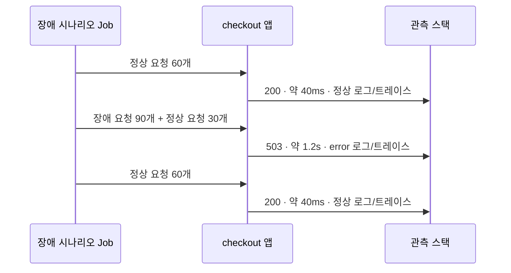

import { LinkCard, Steps } from '@astrojs/starlight/components';
import TermIntro from '../../../components/docs/TermIntro.astro';

> 이 장의 성공 조건은 쿼리 셋을 외우는 것이 아니라 **숫자에서 문장으로, 문장에서 느린 지점으로 이동하는 것**이다

<TermIntro
  terms={[
    ['장애 구간', 'incident window', '정상선에서 벗어나 에러와 지연이 생긴 시간 범위. **다음 신호로 넘길 첫 단서**다.'],
    ['상관 관계', 'correlation', '같은 요청의 메트릭·로그·트레이스를 시간이나 `trace_id`로 이어 보는 것.'],
    ['exemplar', '표본 링크', '메트릭 한 점에 매달린 대표 `trace_id`. 그래프에서 트레이스로 바로 건너가게 한다.'],
  ]}
/>

[8장](/observability/08-lab-setup/)에서 만든 클러스터와 Grafana port-forward가 열려 있어야 한다.
이번 시나리오는 60초 동안 **정상 15초 → 요청의 75%가 503인 장애 30초 → 정상 15초**를 만든다.



## 실습 1 — 사건 만들기

Grafana 터널과 다른 터미널에서 실행한다.

```bash
cd study-starlight/labs/observability/first-investigation
make scenario
```

약 1분 뒤 다음 결과가 나온다.

```text
[baseline] 200=60, 503=0, connection_error=0
[incident] 200=30, 503=90, connection_error=0
[recovery] 200=60, 503=0, connection_error=0
시나리오 완료 — Grafana에서 최근 5분을 조사하세요.
```

브라우저에서 Grafana 오른쪽 위 시간 범위를 **Last 5 minutes**로 바꾼다. 조사가 늦어 데이터가
범위 밖으로 나갔다면 `make scenario`를 다시 실행해도 된다. 기존 Job은 안전하게 지우고 새로 만든다.

## 실습 2 — 메트릭으로 언제·얼마나인지 찾기

<Steps>

1. Grafana 왼쪽 메뉴에서 **Explore**를 열고 데이터소스를 **Prometheus**로 고른다.

2. **Code** 모드에서 503 비율을 묻는다.

   ```text
   sum(rate(http_server_duration_milliseconds_count{
     service_name="checkout-lab", http_status_code=~"5.."
   }[1m]))
   /
   sum(rate(http_server_duration_milliseconds_count{
     service_name="checkout-lab"
   }[1m]))
   ```

   **Run query**를 누르고 그래프 표시를 켠다.

3. 두 번째 query를 추가해 p99 지연을 초 단위로 본다.

   ```text
   histogram_quantile(0.99,
     sum by (le) (
       rate(http_server_duration_milliseconds_bucket{
         service_name="checkout-lab"
       }[1m])
     )
   ) / 1000
   ```

</Steps>

🔎 **관찰 포인트**

- 에러 비율은 0에서 올라가 장애 구간에 정점을 만들고 다시 0으로 내려간다. `[1m]` 이동창 때문에
  시나리오의 75%가 그래프에서 정확히 `0.75`로 평평하게 보이지는 않는다.
- p99도 같은 구간에 뛴다. 정상 요청은 약 40ms, 오류 요청은 약 1.2초지만 히스토그램은
  버킷으로 추정하므로 그래프 값은 그보다 크게 보일 수 있다.
- 두 그래프의 시각이 겹친다. 이제 **checkout 하나에서 에러와 지연이 동시에 생긴 구간**까지 좁혔다.

:::tip[왜 counter 이름이 길까]
앱이 OpenTelemetry의 HTTP server duration 히스토그램을 OTLP로 보냈고, Prometheus가
`*_bucket` · `*_sum` · `*_count` 시계열로 저장했다. 에러율의 분모·분자에는 요청 수 역할을 하는
`_count`를, p99에는 분포를 가진 `_bucket`을 쓴다 ([2장](/observability/02-prometheus/)).
:::

## 실습 3 — 로그에서 무슨 일이었는지 읽기

Explore에서 **Split**을 눌러 오른쪽 pane을 만들고 데이터소스를 **Loki**로 바꾼다.
두 pane은 같은 시간 범위를 보므로 메트릭에서 찾은 장애 구간을 그대로 가져갈 수 있다.

```text
{service_name="checkout-lab"} |= "inventory reservation timed out"
```

**Run query**를 누르면 다음 모양의 로그가 모인다.

```text
inventory reservation timed out order_id=lab-0177
```

🔎 로그 한 줄을 펼쳐 다음 단서를 찾는다.

| 위치 | 지금 얻은 단서 |
|---|---|
| 필드 `severity_text` | `ERROR` — 오류 로그만 골랐다는 확인 |
| 본문 `order_id` | 개별 주문 — 문자열 검색은 되지만 인덱스 라벨은 아니다 |
| 필드 `trace_id` | 이 로그를 만든 요청의 트레이스로 가는 열쇠 |
| 필드 `span_id` | 그 트레이스 안에서 로그를 남긴 정확한 스팬 |

여기서 카디널리티 원칙도 확인한다. `service_name`은 값의 종류가 작아서 스트림을 고르는 라벨이고,
매 요청마다 바뀌는 `order_id`는 본문에, `trace_id`는 구조화 메타데이터에 있으며 둘 다 인덱스 라벨이 아니다
([3장](/observability/03-loki/)).

## 실습 4 — 로그의 Trace 링크로 느린 지점 찾기

<Steps>

1. 오류 로그 한 줄을 펼쳐 `trace_id` 옆의 **Trace** 링크를 누른다.
   Grafana가 데이터소스를 Loki에서 Tempo로 바꾸고 그 ID를 조회한다.

2. 트레이스 워터폴에서 root span `GET /checkout`을 연다. 전체 시간이 약 1.2초이고
   상태가 error인지 본다.

3. child span `inventory.reserve`를 연다. 이 스팬이 전체 시간 대부분을 차지하고
   `error.type=inventory_timeout`, `inventory.warehouse=seoul-1` 속성을 갖는다.

4. 스팬 상세의 **Logs for this span**을 누른다. 같은 `service.name`·`trace_id`를 가진 Loki 로그가
   다시 열린다. 이것이 [5장](/observability/05-grafana/)의 trace to logs다.

</Steps>

처음에는 메트릭으로 **언제·얼마나**를 좁혔고, 로그로 **재고 예약 timeout이라는 문장**을 얻었으며,
트레이스로 **`inventory.reserve`가 1.2초를 쓴 지점**을 찍었다. 도구 이름이 아니라 질문이 바뀔 때
신호를 바꿨다.

## 실습 5 — exemplar로 메트릭에서 바로 건너가기

메트릭 Explore pane으로 돌아가 p99 query의 **Exemplars** 표시를 켠다. 그래프 위 표본 점을 누르면
`trace_id`와 **Trace** 링크가 보인다. 오류 구간의 점을 골라 Tempo로 이동한다.

이 링크는 앱이 히스토그램 관측값에 `trace_id` exemplar를 함께 보냈고, Prometheus가 exemplar 저장을,
Grafana 데이터소스가 `trace_id → Tempo` 연결을 켰기 때문에 생긴다. 로그를 읽어 사건의 문장을
얻는 길을 생략하므로, **느린 요청 하나를 바로 보고 싶을 때** 쓴다.

:::tip[이번 조사에서 완성한 이동]
**메트릭 → 같은 시간의 로그 → `trace_id`로 트레이스 → 같은 스팬의 로그**, 그리고
**메트릭 exemplar → 트레이스**를 직접 확인했다. 저장소 셋이 따로 있으면 이 이동은 시간과 ID를
복사해 창 셋에 붙이는 작업이 된다.
:::

## 스스로 해볼 과제

1. Loki query에서 문자열 필터를 빼고 `{service_name="checkout-lab"}`만 실행한다. 정상 로그와 오류
   로그의 양 차이를 보고, 라인 필터가 검색량을 얼마나 줄이는지 확인한다.
2. PromQL의 `[1m]`을 `[5m]`으로 바꾼다. 장애 정점이 낮아지고 회복 뒤에도 값이 오래 남는 이유를
   이동창으로 설명해 본다.
3. Tempo Explore에서 TraceQL `{ resource.service.name = "checkout-lab" && status = error }`를 직접
   실행한다. `trace_id`를 몰라도 오류 트레이스를 찾을 수 있는지 확인한다.
4. 아무 오류 로그 하나와 다른 오류 로그 하나를 연다. `order_id`·`trace_id`는 다르지만
   `inventory.reserve`라는 원인 지점은 같은지 비교한다.

## 안 보일 때 어디를 보나

| 증상 | 확인 |
|---|---|
| query 결과 없음 | 시간 범위를 Last 5 minutes로 바꾸고 `make scenario` 재실행 |
| 메트릭만 없음 | 앱 로그에서 `Failed to export metrics` 확인: `kubectl --context kind-observability-lab -n observability-lab logs deploy/checkout` |
| 로그에 Trace 링크 없음 | 로그 한 줄 상세에 `trace_id`가 있는지 먼저 확인 |
| 링크를 눌러도 트레이스 없음 | Tempo Explore에서 그 `trace_id`를 직접 검색하고 LGTM 로그 확인 |
| p99가 1.2초보다 큼 | 실제 측정값이 아니라 히스토그램 버킷 사이를 보간한 값인지 확인 |
| exemplar 점이 안 보임 | Prometheus query의 Exemplars 표시와 장애 시간 범위를 확인 |

## 마무리 — 실습 환경 지우기

port-forward 터미널에서 `Ctrl+C`를 누른 뒤 실행한다.

```bash
make down
```

`observability-lab` kind 클러스터 전체가 삭제되며 `emptyDir`의 메트릭·로그·트레이스도 복구할 수 없게
사라진다. 다른 kind 클러스터와 Docker 이미지는 건드리지 않는다. 다시 시작하려면 `make up`부터 한다.
[실습 환경 덱의 보존과 폐기 구분](/lab-environment/01-kind/#실습을-멈출까-지울까)처럼, 이 실습은
다시 쓸 상태를 보존하는 종료가 아니라 **전용 클러스터를 폐기하는 cleanup**을 선택한다.

## 참고 자료

- [Grafana `docker-otel-lgtm` 데이터소스 설정](https://github.com/grafana/docker-otel-lgtm/blob/v0.30.2/docker/grafana-datasources.yaml) — exemplar, derived field, trace to logs의 실제 프로비저닝
- [OpenTelemetry Python zero-code instrumentation](https://opentelemetry.io/docs/zero-code/python/) — Flask 앱에 자동 계측과 OTLP exporter를 붙이는 방식
- [Prometheus exemplars](https://prometheus.io/docs/prometheus/latest/feature_flags/#exemplars-storage) — 메트릭 관측값과 대표 트레이스를 연결하는 저장 기능

<LinkCard
  title="처음으로 — 덱 개요"
  description="전체 구성과 두 문장을 다시 보고, 필요한 개념 장을 참조한다."
  href="/observability/"
/>
