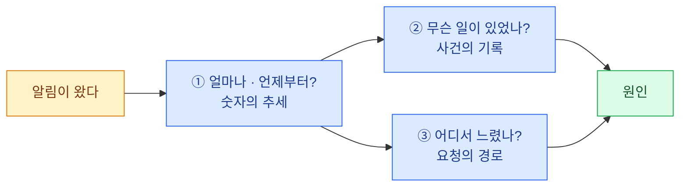

import { LinkCard, LinkButton } from '@astrojs/starlight/components';
import DeckMap from '../../../components/docs/DeckMap.astro';

> 관측 스택의 목적은 대시보드가 아니다 — **"지금 뭐가 문제냐"에서 원인까지 가는 시간을 줄이는 것**이다

새벽에 알림이 온다. "5xx가 늘었습니다." 여기서 원인까지 가는 데 5분이 걸리는 팀과
50분이 걸리는 팀의 차이는 그래프의 개수가 아니라 **신호 사이를 얼마나 빨리 건너가느냐**다.

이 덱은 그 길에 필요한 **단서 세 종류**를 먼저 익히고, 각 단서를 맡는 도구를 나중에 붙인다.
제품 이름부터 외울 필요는 없다. 먼저 아래 세 질문만 잡으면 된다.

| 질문 | 단서의 이름 | 맡는 저장소 |
|---|---|---|
| 얼마나 · 언제부터? | **메트릭** | Prometheus |
| 무슨 일이 있었나? | **로그** | Loki |
| 어디서 느렸나? | **트레이스** | Tempo |

Grafana는 네 번째 단서를 만드는 도구가 아니다. **위 셋을 같은 시간축에서 보고 서로 오가는 창**이다.
이 한 바퀴가 큰 그림이고, 뒤의 제품명과 질의 언어는 각 칸을 구현하는 수단이다.

각 장은 같은 순서로 간다 — **데이터가 어떻게 생겼나 → 어떻게 묻나(PromQL · LogQL · TraceQL) →
어떻게 세우나 → 안 될 때 어디를 보나.** 질의 언어 셋은 경험을 전제하지 않고 여기서 쌓는다.

쿠버네티스 기초는 [CKA 덱](/cka/) 수준을 전제한다. 오브젝트 스토리지·DB·SSO 같은
**밑에 깔리는 것들**과 온프렘 고유의 제약은 [온프렘 덱](/onprem/)이 맡는다 —
이 덱은 그 덱의 관측 부분이 커져서 독립한 것이다.

<LinkButton href="/observability/00-intro/" icon="right-arrow">첫 장부터 읽기</LinkButton>

## 구성

<DeckMap
  steps={[
    { label: '0장', href: '/observability/00-intro/', title: '시작하기 전에', tone: 'key',
      desc: '범위와 기준 시점 · 2026년의 관측 지형',
      note: '무엇이 끝났고 무엇으로 갈아타는가' },
    { label: '1장', href: '/observability/01-signals/', title: '세 신호', tone: 'zone',
      desc: '같은 사건을 셋으로 나란히 보기 · 스택 전체 그림 · 카디널리티',
      note: '무엇이 무엇에 답하고, 셋은 어떻게 이어지는가' },
    { label: '2장', href: '/observability/02-prometheus/', title: '메트릭 — Prometheus', tone: 'warn',
      desc: '메트릭 타입 넷 · PromQL 다섯 형태 · RED와 USE · 알림 설계',
      note: '얼마나 · 언제부터 · 그리고 누가 사람을 깨우는가' },
    { label: '3장', href: '/observability/03-loki/', title: '로그 — Loki', tone: 'ok',
      desc: '스트림과 chunk · 라벨 설계 · LogQL 네 단계 · Alloy 수집',
      note: '그 시각에 정확히 무슨 일이 있었는가' },
    { label: '4장', href: '/observability/04-tempo/', title: '추적 — Tempo', tone: 'bad',
      desc: '스팬의 생김새 · 컨텍스트 전파 · 샘플링 · TraceQL · Tempo 3.0',
      note: '한 요청이 어디서 느렸는가' },
    { label: '5장', href: '/observability/05-grafana/', title: '조회 — Grafana', tone: 'key',
      desc: '상관 관계 설정 · Explore 조사 흐름 · 대시보드 설계 · SSO',
      note: '셋 사이를 두 번의 클릭으로 오갈 수 있는가' },
    { label: '6~7장', href: '/observability/06-glossary/', title: '마무리', tone: 'mute',
      desc: '용어 사전과 질의 언어 요약 · 조사 흐름 · 도입 순서와 사고 대응 카드' },
    { label: '8~9장', href: '/observability/08-lab-setup/', title: '따라 하기', tone: 'ok',
      desc: '로컬 스택 준비 · 정상-장애-회복 트래픽 · 첫 통합 조사',
      note: '메트릭 → 로그 → 트레이스를 내 손으로 한 바퀴 도는가' },
  ]}
/>

## 전체를 관통하는 두 문장

**셋을 따로 두면 값을 못 한다.** 메트릭에서 시각을 확인하고, 로그 화면으로 가서 시각을
다시 입력하고, 파드 이름을 찾아 넣는 수동 이동이 매번 생긴다. 이어 붙이는 장치는 셋뿐이다 —
로그에 실린 `trace_id`, 메트릭에 매달린 **exemplar**, 트레이스에서 로그로 가는 링크.
**대시보드를 100개 만드는 것보다 이 셋을 설정하는 것이 먼저**다
([5장](/observability/05-grafana/)).

**스택을 죽이는 건 데이터 양이 아니라 카디널리티다.** `user_id` · `request_id` · `pod_ip`처럼
값이 무한한 것을 라벨에 넣으면 시계열이 수십만 개가 되고, Prometheus는 메모리로,
Loki는 인덱스로 무너진다. 원칙 하나만 기억하면 된다 —
**라벨은 "값의 종류가 유한하고 미리 셀 수 있는 것"만.** 나머지는 로그 본문이나 트레이스 속성에
넣고 질의할 때 파싱한다. 이 이야기는 1 · 2 · 3장에서 각각 다른 얼굴로 다시 나온다.

## 기준 시점

**2026년 8월 기준**으로 쓰였다 — Prometheus 3.13 LTS · Grafana 13.1 · Loki 3.7 · Tempo 3.0.
특히 **Promtail EOL과 Tempo 3.0 구조 변경** 때문에 검색으로 찾은 옛 설정이 그대로 맞지 않을 수 있다.
무엇이 바뀌었는지는 [0장](/observability/00-intro/)에서 먼저 정리한다.

<LinkCard
  title="0. 시작하기 전에"
  description="이 덱의 대상과 범위, 그리고 2026년 8월의 관측 지형 — 무엇이 끝났고 무엇으로 갈아타는가."
  href="/observability/00-intro/"
/>
