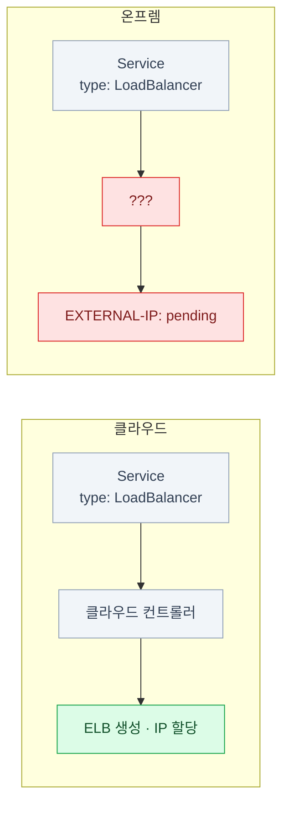
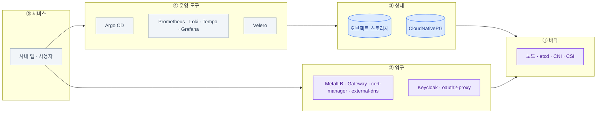

import { Card, CardGrid, LinkCard } from '@astrojs/starlight/components';
import TermIntro from '../../../components/TermIntro.astro';

> 온프렘에서 안 되는 것들은 전부 **"그 일을 하던 컨트롤러가 없다"** 는 한 가지 이유로 설명된다

<TermIntro
  terms={[
    ['관리형 서비스', 'Managed Service', '클라우드 사업자가 설치·패치·백업·가용성까지 책임지고 **API만 빌려주는** 서비스. RDS · S3 · ELB가 그 예다.'],
    ['컨트롤 플레인', 'Control Plane', '"원하는 상태"를 받아 실제 상태를 거기에 맞추는 쪽. 클라우드에서는 이 역할의 상당 부분을 사업자의 컨트롤러가 대신 했다.'],
    ['클라우드 컨트롤러 매니저', 'CCM, Cloud Controller Manager', '쿠버네티스가 클라우드 사업자의 자원(LB · 디스크 · 노드)을 만들도록 다리를 놓는 컴포넌트. **온프렘에는 이게 없거나 벤더 것을 따로 깐다** — `type: LoadBalancer`가 안 되는 직접적인 이유다.'],
    ['CSI', 'Container Storage Interface', '쿠버네티스가 스토리지 벤더의 디스크를 붙일 때 쓰는 표준 인터페이스. 온프렘에서는 벤더 CSI를 직접 골라 설치한다(2장).'],
    ['SLO', 'Service Level Objective', '"이 서비스는 이 정도로 동작한다"고 스스로 정한 목표치(가용률 · 지연 등). 관리형이면 사업자가 약속하지만, 온프렘에서는 **내가 약속하고 내가 지킨다**.'],
  ]}
/>

## 문제 — 같은 매니페스트가 여기서는 안 돈다

클라우드에서 잘 돌던 매니페스트를 사내 클러스터에 그대로 넣으면 이런 일이 벌어진다.

| 넣은 것 | 클라우드에서 | 온프렘에서 |
|---|---|---|
| `Service type: LoadBalancer` | 몇 초 뒤 `EXTERNAL-IP`에 IP가 박힌다 | **영원히 `<pending>`** |
| `Ingress` (TLS 지정) | 관리형 LB가 인증서를 물고 뜬다 | 컨트롤러도 인증서도 없다 |
| `PersistentVolumeClaim` | 기본 StorageClass가 디스크를 만든다 | **기본 StorageClass 자체가 없을 수 있다** |
| 앱이 `s3://bucket/...`에 씀 | IAM 역할로 조용히 성공 | 엔드포인트도 자격증명도 없다 |
| 앱이 RDS에 붙음 | 붙는다 | DB가 없다. 만들어도 페일오버·백업이 없다 |
| CloudWatch에서 로그 조회 | 콘솔에 있다 | `kubectl logs`가 전부다 — 파드가 죽으면 같이 사라진다 |

**공통점은 하나다.** 매니페스트가 틀린 게 아니라, 그 선언을 받아 **실제 자원을 만들어 주던
쪽이 없어진 것**이다. 클라우드에서 `type: LoadBalancer`를 성립시킨 건 쿠버네티스가 아니라
사업자의 클라우드 컨트롤러였다.

## 해법 — 빈칸을 세고 하나씩 채운다

그래서 온프렘 플랫폼 설계는 **"어떤 자리가 비어 있나"** 를 세는 것에서 시작한다.
아래가 그 목록이고, **이 덱의 목차와 같다.**

| 클라우드에서 | 비는 자리 | 온프렘의 대체 | 장 |
|---|---|---|---|
| ELB · NLB | 외부 IP 할당·광고 | **MetalLB** (L2 또는 BGP) | [3장](/onprem/03-gateway/) |
| ALB · 관리형 Ingress | HTTP(S) 라우팅·TLS 종료 | **Gateway API 구현체** (Envoy Gateway 등) | [3장](/onprem/03-gateway/) |
| ACM | 인증서 발급·갱신 | **cert-manager** (ACME DNS-01 또는 사내 CA) | [4장](/onprem/04-tls-dns/) |
| Route 53 | 이름 → IP 등록 | **external-dns** + 사내 DNS | [4장](/onprem/04-tls-dns/) |
| IAM · Cognito | 사람 인증·SSO | **Keycloak** + **oauth2-proxy** | [5장](/onprem/05-identity/) |
| S3 | 오브젝트 스토리지 | **MinIO 또는 대안** (RustFS · SeaweedFS · Ceph RGW) | [6장](/onprem/06-minio/) |
| RDS · Aurora | 관계형 DB의 HA·백업 | **CloudNativePG** | [7장](/onprem/07-cnpg/) |
| EBS · EFS CSI | 블록·파일 볼륨 | **벤더 CSI · Ceph(Rook) · Longhorn · NFS** | [2장](/onprem/02-foundation/) |
| CloudWatch Metrics | 메트릭 수집·알림 | **Prometheus** + Alertmanager | [9장](/onprem/09-prometheus/) |
| CloudWatch Logs | 로그 수집·검색 | **Loki** (+ Grafana Alloy) | [10장](/onprem/10-loki/) |
| X-Ray | 분산 추적 | **Tempo** (+ OpenTelemetry) | [11장](/onprem/11-tempo/) |
| CloudWatch 대시보드 | 조회·시각화 | **Grafana** | [12장](/onprem/12-grafana/) |
| ECR | 컨테이너 이미지 저장 | **사내 레지스트리** (Harbor 등) | [13장](/onprem/13-gitops/) |
| AWS Backup · 스냅샷 | 백업·복구 | **Velero** + etcd 스냅샷 + CNPG PITR | [14장](/onprem/14-backup/) |
| 오토스케일링 그룹 | 노드 자동 증설 | **없다** — 용량은 사람이 미리 산다 | [15장](/onprem/15-ops/) |
| 사업자의 SLA | 가용성 책임 | **내가 정한 SLO와 온콜** | [15장](/onprem/15-ops/) |

:::tip[핵심 원칙]
빈칸을 채우는 순서는 **아래에서 위로**다. 스토리지가 없으면 DB를 못 올리고,
DB가 없으면 Keycloak을 못 올리고, Keycloak이 없으면 Grafana에 SSO를 못 붙인다.
[17장](/onprem/17-wrapup/)의 구축 체크리스트가 이 순서를 그대로 따른다.
:::

### 채우지 않아도 되는 자리도 있다

빈칸을 **전부** 채울 필요는 없다. 판단 기준은 "클라우드에 있으니까"가 아니라
**없으면 무슨 문제가 생기는가**다.

| 자리 | 없어도 되는 경우 | 미루면 생기는 일 |
|---|---|---|
| 분산 추적(Tempo) | 서비스가 두세 개고 서로 잘 안 부른다 | 서비스가 늘면 "누가 느린지"를 로그로 추측하게 된다 |
| GitOps(Argo CD) | 매니페스트가 열 개 안쪽 | 클러스터를 다시 세울 때 무엇이 있었는지 아무도 모른다 |
| SSO(Keycloak) | 관리자가 한두 명 | 도구마다 계정이 생기고, 퇴사자 계정이 남는다 |
| 오브젝트 스토리지 | **거의 없다** | Loki · Tempo · Velero · CNPG 백업이 전부 막힌다 |

## 채운 다음에 생기는 일 — 층 구조

빈칸을 다 채우면 이런 모양이 된다. **아래층이 죽으면 위층이 같이 죽는다** —
이 그림이 [15장](/onprem/15-ops/) 진단 사다리의 원본이다.

| 층 | 내용 | 죽으면 |
|---|---|---|
| ① 바닥 | 노드 · etcd · CNI · CSI | 전부 멈춘다 |
| ② 입구 | IP · 라우팅 · 인증서 · DNS · 로그인 | 안에서는 도는데 **밖에서 아무도 못 들어온다** |
| ③ 상태 | 오브젝트 스토리지 · DB | 앱은 살아 있는데 **아무것도 저장·조회가 안 된다** |
| ④ 운영 도구 | 배포 · 관측 · 백업 | 서비스는 도는데 **무슨 일이 벌어지는지 안 보인다** |
| ⑤ 서비스 | 사내 앱 | 사용자가 아는 그 장애 |

## 온프렘의 진짜 제약 넷

도구 목록보다 이 넷이 설계를 더 많이 바꾼다. 장마다 반복해서 돌아온다.

<CardGrid>
<Card title="① 인터넷에 직접 못 나간다" icon="warning">
노드가 외부로 나가려면 사내 egress 프록시를 거친다. cert-manager의 ACME 요청,
Helm 차트 다운로드, 이미지 pull이 전부 여기서 막힌다.
`HTTPS_PROXY`·`NO_PROXY`를 컴포넌트마다 따로 넣어야 한다 ([4장](/onprem/04-tls-dns/)).
</Card>
<Card title="② 용량이 유한하다" icon="warning">
노드를 늘리는 데 몇 주가 걸린다. 오토스케일이 없으니
**Loki의 보존 기간, Prometheus의 리텐션, PVC 크기를 미리 정해야** 한다.
디스크가 차면 관측 스택이 먼저 죽는다 ([15장](/onprem/15-ops/)).
</Card>
<Card title="③ 신뢰의 뿌리가 사내에 있다" icon="warning">
공인 인증서를 못 쓰는 구간에서는 사내 CA를 쓴다. 그러면 그 CA를
**노드·브라우저·컨테이너에 각각 심어야** 한다 — 자동 갱신되는 인증서와 달리
신뢰 배포는 대부분 수동이다 ([4장](/onprem/04-tls-dns/)).
</Card>
<Card title="④ 아무도 대신 안 깨워 준다" icon="warning">
디스크 임계치, 인증서 만료, 복제 지연 — 클라우드가 콘솔에서 알려 주던 것을
전부 직접 알림으로 만들어야 한다. **알림 설계가 곧 운영 품질**이다
([9장](/onprem/09-prometheus/)).
</Card>
</CardGrid>

:::caution[함정]
**"온프렘이 싸다"는 계산에서 빠지는 건 사람의 시간이다.** 라이선스와 인스턴스 비용은
줄어들지만, 위 표의 열여섯 줄이 전부 누군가의 업무가 된다. 시작할 때
**어느 줄을 지금 채우고 어느 줄을 미룰지** 명시적으로 정해 두면 나중에 훨씬 편하다.
:::

## 1장 요약

- 온프렘에서 안 되는 것들은 **선언을 실제 자원으로 바꿔 주던 쪽이 없다**는 한 가지 이유다
- 빈칸 대응표 열여섯 줄이 이 덱의 목차다 — **아래에서 위로** 채운다
- 층은 다섯이다: 바닥 → 입구 → 상태 → 운영 도구 → 서비스. **아래가 죽으면 위가 같이 죽는다**
- 온프렘의 제약 넷: **인터넷 직결 없음 · 유한한 용량 · 사내 CA · 스스로 만드는 알림**

<LinkCard
  title="2. 바닥 — 클러스터 · CNI · 스토리지"
  description="위에 얹을 것들이 전부 딛고 설 땅 — 클러스터 형태, 네트워크 플러그인, 그리고 스토리지 세 계층."
  href="/onprem/02-foundation/"
/>
