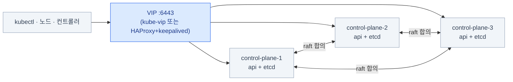

import { Tabs, TabItem, LinkCard } from '@astrojs/starlight/components';
import TermIntro from '../../../components/docs/TermIntro.astro';

> 바닥에서 잘못 고른 것은 **위층 전부를 다시 세워야** 고쳐진다 — 그래서 여기부터 본다

<TermIntro
  terms={[
    ['CNI', 'Container Network Interface', '파드에 IP를 주고 파드끼리 통신하게 만드는 플러그인 규격. **Calico · Cilium**이 대표적이다. 무엇을 쓰느냐로 NetworkPolicy가 실제로 강제되는지가 갈린다.'],
    ['CSI', 'Container Storage Interface', '쿠버네티스가 실제 디스크를 붙일 때 쓰는 표준. 온프렘에서는 스토리지 벤더 드라이버나 Ceph · Longhorn 같은 소프트웨어 스토리지를 CSI로 설치한다.'],
    ['쿼럼', 'Quorum', '과반수. etcd는 노드 과반이 살아 있어야 쓰기가 된다 — **3대 중 2대**, 5대 중 3대. 그래서 컨트롤 플레인은 홀수로 놓는다.'],
    ['VIP', 'Virtual IP', '여러 대 중 살아 있는 한 대가 넘겨받는 떠다니는 IP. 컨트롤 플레인 API 서버 앞에 두어 한 주소로 접근하게 만든다.'],
    ['erasure coding', '소거 부호', '데이터를 조각 + 패리티로 쪼개 여러 디스크에 흩어 두고, 일부가 죽어도 복원하는 방식. RAID의 소프트웨어 버전이라고 보면 된다(6장에서 다시 나온다).'],
    ['RWO · RWX', 'ReadWriteOnce · ReadWriteMany', '볼륨을 **한 노드만** 쓸 수 있는지, **여러 노드가 동시에** 쓸 수 있는지. 블록 스토리지는 대개 RWO, 파일 스토리지가 RWX를 준다.'],
  ]}
/>

## 문제 — 위층은 바닥의 성질을 그대로 물려받는다

이 덱의 위층은 전부 바닥에 의존한다. 그런데 그 의존이 눈에 잘 안 띈다.

| 위층에서 겪는 일 | 실제 원인 (바닥) |
|---|---|
| CloudNativePG 파드가 노드 장애 후 안 뜬다 | 볼륨이 **그 노드에만 있는** local 스토리지였다 |
| NetworkPolicy를 걸었는데 통신이 그대로 된다 | CNI가 정책을 **강제하지 않는** 종류였다 |
| Loki 파드 여러 개가 같은 PVC를 못 붙는다 | 스토리지가 **RWO**뿐이다 |
| PVC를 지웠더니 DB 데이터가 사라졌다 | StorageClass의 reclaimPolicy가 `Delete`였다 |
| 컨트롤 플레인 1대를 껐더니 클러스터 전체가 멎었다 | etcd가 **1대**였다 (쿼럼 없음) |

그래서 바닥에서 정해야 할 것은 딱 셋이다 — **클러스터 형태 · CNI · 스토리지**.

## 클러스터를 무엇으로 세우나

온프렘에서 실제로 고르는 선택지는 대략 넷이다. 이 덱은 어느 쪽이든 전제하지 않지만,
**컨트롤 플레인이 HA인지**와 **누가 업그레이드를 책임지는지**는 반드시 정하고 넘어가야 한다.

| 방식 | 성격 | 업그레이드 | 언제 고르나 |
|---|---|---|---|
| **kubeadm** | 공식 도구. 가장 표준적이고 문서가 많다 | `kubeadm upgrade`를 사람이 노드마다 | 표준을 그대로 따르고 싶을 때. CKA 지식이 그대로 쓰인다 |
| **RKE2 · k3s** | 단일 바이너리 배포판. 설치·업그레이드가 단순 | 배포판이 묶어서 처리 | 운영 인력이 적을 때. RKE2는 보안 기본값이 강하다 |
| **Talos** | OS 자체가 쿠버네티스 전용. SSH도 셸도 없다 | API로 선언적 | 노드를 가축처럼 다루고 싶을 때. 리눅스 습관을 버려야 한다 |
| **벤더 배포판** | OpenShift 등. 지원 계약 포함 | 벤더 절차 | 지원 계약이 조건일 때 |

### 컨트롤 플레인 HA — 3대와 그 앞의 한 주소

컨트롤 플레인은 **3대**가 사실상 기본값이다. etcd가 과반(쿼럼)으로 동작하기 때문에
2대는 의미가 없고(1대 죽으면 과반 붕괴), 4대도 홀수보다 나을 게 없다.



- **API 서버 앞에 한 주소가 필요하다.** 클라우드라면 관리형 LB가 그 자리였다.
  온프렘에서는 `kube-vip`(파드로 VIP를 띄운다)나 `HAProxy + keepalived`(노드 밖 2대)로 만든다.
- **etcd는 디스크 지연에 극도로 민감하다.** 컨트롤 플레인 노드에는 **NVMe SSD**를 주고,
  같은 디스크에 다른 워크로드를 올리지 않는다. etcd가 느려지면 클러스터 전체가 느려진다.
- 노드 3대짜리 소규모 클러스터라면 컨트롤 플레인에서 taint를 빼고 워크로드를 같이 올리기도 하지만,
  **DB와 관측 스택이 들어오는 순간 분리하는 게 낫다.**

## CNI — 정책을 강제할 수 있는 것을 고른다

파드 네트워크는 한 번 정하면 바꾸기가 아주 어렵다(전 파드 재생성). 온프렘에서 실제 후보는 둘이다.

| | **Calico** | **Cilium** |
|---|---|---|
| 데이터 경로 | iptables 또는 eBPF | **eBPF** 중심 |
| NetworkPolicy | 표준 + Calico 확장(전역 정책) | 표준 + Cilium 확장(L7 정책 — HTTP 메서드·경로까지) |
| 라우팅 | BGP로 사내 라우터와 피어링 가능 | 마찬가지 + kube-proxy 대체 가능 |
| 딸려 오는 것 | 성숙함, 문서 많음 | Hubble(네트워크 가시성), Gateway API 구현체 내장 |
| 고를 때 | 표준적인 선택. 사내 라우터와 BGP를 붙일 계획 | 관측·L7 정책까지 원하고 커널이 충분히 최신일 때 |

:::caution[함정]
**NetworkPolicy는 "적용하는 CNI"에서만 의미가 있다.** 정책을 강제하지 않는 CNI를 쓰면
`kubectl apply`는 성공하고 `get netpol`에도 보이지만 **아무것도 막지 않는다.**
막히는지 확인하는 방법은 하나뿐이다 — 허용 안 된 파드에서 실제로 붙어 보는 것.

```bash
kubectl run probe --rm -it --image=busybox:1.36 --restart=Never -- \
  wget -qO- --timeout=3 http://target-svc.other-ns.svc:8080
# 정책이 먹으면 timeout, 안 먹으면 응답이 온다
```
:::

## 스토리지 — 세 계층을 먼저 가른다

"스토리지"라는 한 단어에 성질이 완전히 다른 셋이 들어 있다. **이걸 안 가르면
6장(오브젝트 스토리지)과 7장(DB)의 이야기가 섞인다.**

| 계층 | 접근 방식 | 쿠버네티스에서 | 이 덱에서 쓰는 곳 |
|---|---|---|---|
| **블록**(block) | 디스크처럼 | PV/PVC로 **파드에 마운트**. 대개 RWO | CloudNativePG의 데이터 디렉터리, Prometheus TSDB |
| **파일**(file) | 파일시스템(POSIX) | PV/PVC로 마운트. **RWX 가능** | 여러 파드가 같은 디렉터리를 봐야 할 때 |
| **오브젝트**(object) | **HTTP API(S3)** | **마운트하지 않는다.** 앱이 SDK로 접근 | Loki chunk, Tempo 블록, Velero 백업, CNPG WAL |

:::tip[핵심]
오브젝트 스토리지는 `volumeMounts`로 붙이는 물건이 **아니다.** 앱이 코드에서
S3 클라이언트로 엔드포인트에 접속해 객체를 읽고 쓴다. 그래서
"Loki를 쓰려면 PVC를 얼마나 잡아야 하나"라는 질문 자체가 대개 잘못됐다 —
그건 [6장](/onprem/06-minio/)의 버킷 이야기다.
:::

### 블록·파일을 무엇으로 채우나

온프렘 CSI 선택지는 대략 이렇게 갈린다.

| 선택지 | 성격 | 주의 |
|---|---|---|
| **벤더 스토리지 CSI** (NetApp · Dell · Pure 등) | 이미 있는 SAN/NAS를 그대로 쓴다. 가장 안정적 | 벤더 드라이버 버전과 k8s 버전 호환표를 먼저 본다 |
| **Ceph** (Rook 오퍼레이터) | 블록·파일·오브젝트를 **한 시스템에서** 전부 제공 | 강력하지만 무겁다. 전담 노드와 운영 지식이 필요 |
| **Longhorn** | 쿠버네티스 네이티브 분산 블록 스토리지. 설치가 쉽다 | 노드 간 복제라 네트워크·디스크 성능을 그대로 탄다 |
| **NFS subdir provisioner** | 이미 있는 NFS를 RWX PVC로 | **DB에는 쓰지 않는다** — fsync 동작과 잠금이 위험하다 |
| **local-path** | 노드의 로컬 디렉터리 | **학습·임시용.** 볼륨이 노드에 묶여 파드가 다른 노드로 못 간다 |

:::caution[함정 — local-path로 DB를 올리면]
`local-path`(또는 hostPath) PVC를 쓴 파드는 **그 노드를 떠날 수 없다.** 노드를 재부팅하거나
드레인하면 파드는 `Pending`에 걸리고, 노드 디스크가 죽으면 데이터가 함께 사라진다.
kind·개발 클러스터에서 잘 돌던 CloudNativePG가 운영에서 첫 노드 장애에 무너지는 전형적인 경로다.
:::

### StorageClass 설계 — 세 가지만 정하면 된다

<Tabs>
<TabItem label="일반 워크로드용">

```yaml
apiVersion: storage.k8s.io/v1
kind: StorageClass
metadata:
  name: standard
  annotations:
    storageclass.kubernetes.io/is-default-class: "true"   # 기본 SC는 반드시 하나 둔다
provisioner: <벤더 CSI 이름>
reclaimPolicy: Delete             # PVC를 지우면 디스크도 지운다
allowVolumeExpansion: true        # 나중에 늘릴 수 있게
volumeBindingMode: WaitForFirstConsumer   # 파드가 스케줄된 뒤에 볼륨을 만든다
```

`WaitForFirstConsumer`가 기본값이어야 하는 이유 — 볼륨을 먼저 만들면
**그 볼륨이 있는 곳과 파드가 갈 곳이 어긋날 수 있다.** 파드 스케줄을 기다렸다가 만들면 그 문제가 없다.

</TabItem>
<TabItem label="DB·상태 저장용">

```yaml
apiVersion: storage.k8s.io/v1
kind: StorageClass
metadata:
  name: db-retain
provisioner: <벤더 CSI 이름>
reclaimPolicy: Retain             # PVC를 지워도 디스크는 남긴다
allowVolumeExpansion: true
volumeBindingMode: WaitForFirstConsumer
```

DB용은 **`Retain`으로 따로 만든다.** 실수로 `Cluster` 리소스를 지웠을 때
`Delete`면 데이터까지 같이 증발한다. 남은 PV는 나중에 손으로 정리하면 된다 —
**지우는 실수는 되돌릴 수 있어야 한다.**

</TabItem>
</Tabs>

정할 것은 셋뿐이다.

| 결정 | 값 | 이유 |
|---|---|---|
| 기본 StorageClass | **반드시 하나** | 없으면 `storageClassName`을 안 쓴 PVC가 전부 `Pending`이다 |
| DB용 reclaimPolicy | **`Retain`** | 실수로 지웠을 때 데이터가 남는다 |
| 확장 허용 | **`allowVolumeExpansion: true`** | 온프렘에선 처음부터 크게 잡기 어렵다. 줄이는 건 어차피 안 된다 |

## 노드 설계 — 무엇을 어디에 놓나

용량 계획은 [12장](/onprem/12-ops/)에서 다루고, 여기서는 **배치**만 정한다.

| 역할 | 대수 | 두는 것 | 왜 |
|---|---|---|---|
| 컨트롤 플레인 | 3 | API 서버 · etcd | 쿼럼. 다른 워크로드를 안 올린다(etcd 디스크 보호) |
| 인프라(infra) | 2+ | Gateway · cert-manager · Argo CD · 관측 스택 | 앱 폭주가 운영 도구를 못 죽이게 |
| 상태(data) | 3+ | CloudNativePG · (클러스터 안이라면) 스토리지 | 디스크가 빠른 노드. taint로 다른 워크로드 차단 |
| 워커 | n | 앱 | |

```bash
# 상태 노드에 다른 워크로드가 못 오게 표시
kubectl label node data-1 node-role=data
kubectl taint node data-1 dedicated=data:NoSchedule
# → CNPG Cluster 등에서 nodeSelector/tolerations로 그 노드를 지정한다
```

:::tip[핵심]
**관측 스택과 상태 저장소는 감시 대상과 같은 운명을 공유하면 안 된다.**
앱 노드가 디스크로 죽을 때 같은 노드의 Loki도 죽으면, 죽은 이유를 볼 수단이 사라진다.
[6장](/onprem/06-minio/)에서 "오브젝트 스토리지를 클러스터 밖에 두는" 이야기가 같은 원칙이다.
:::

## 점검 — 바닥이 준비됐는지

```bash
# ① 컨트롤 플레인·etcd 상태
kubectl get nodes -o wide
kubectl -n kube-system get pods -l component=etcd

# ② 기본 StorageClass가 정확히 하나인가 (둘이면 PVC가 어디로 갈지 모른다)
kubectl get storageclass
# NAME       PROVISIONER      ... DEFAULT
# standard   <csi>            ... true       ← (default) 표시가 하나만

# ③ 실제로 볼륨이 붙는지 — 여기서 안 되면 위층은 전부 무의미하다
kubectl create -f - <<'EOF'
apiVersion: v1
kind: PersistentVolumeClaim
metadata: { name: smoke }
spec:
  accessModes: [ReadWriteOnce]
  resources: { requests: { storage: 1Gi } }
EOF
kubectl get pvc smoke        # Bound가 떠야 한다. Pending이면 describe로 Events를 본다
kubectl describe pvc smoke | tail -20
kubectl delete pvc smoke

# ④ CNI가 정책을 강제하는가 → 위의 "함정" 절 명령으로 확인
```

| 증상 | 흔한 원인 | 확인 |
|---|---|---|
| PVC가 계속 `Pending` | 기본 SC 없음 · SC 이름 오타 · 프로비저너 파드 죽음 | `describe pvc`의 Events, CSI 컨트롤러 로그 |
| 노드가 `NotReady` | CNI 파드 미기동 · kubelet 인증서 만료 | `kubectl -n kube-system get pods`, 노드에서 `journalctl -u kubelet` |
| 파드가 다른 노드로 안 옮겨감 | local 볼륨에 묶임 | `kubectl get pv <name> -o yaml`의 `nodeAffinity` |
| API 서버가 간헐적으로 느림 | etcd 디스크 지연 | etcd 메트릭 `etcd_disk_wal_fsync_duration_seconds` ([관측 덱 2장](/observability/02-prometheus/)) |

## 2장 요약

- 바닥에서 정할 것은 셋이다 — **클러스터 형태 · CNI · 스토리지**. 나중에 바꾸기가 제일 어렵다
- 컨트롤 플레인은 **3대 + 앞에 VIP 하나**. etcd 디스크는 따로, 빠르게
- CNI는 **정책을 강제하는 것**으로 고르고, 실제로 막히는지 파드로 확인한다
- 스토리지는 **블록 · 파일 · 오브젝트** 세 계층이 다르다. 오브젝트는 마운트가 아니다
- StorageClass는 **기본 하나 + DB용 `Retain` 하나**. `local-path`로 DB를 올리지 않는다

<LinkCard
  title="3. 입구 ① — 외부 IP와 라우팅"
  description="type: LoadBalancer가 pending인 이유부터, ingress-nginx 은퇴 이후의 Gateway API 전환까지."
  href="/onprem/03-gateway/"
/>
