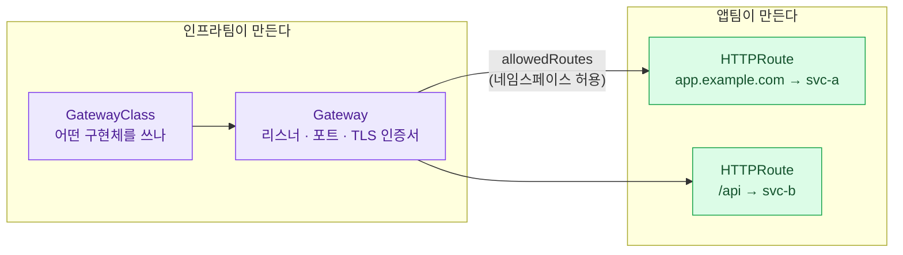
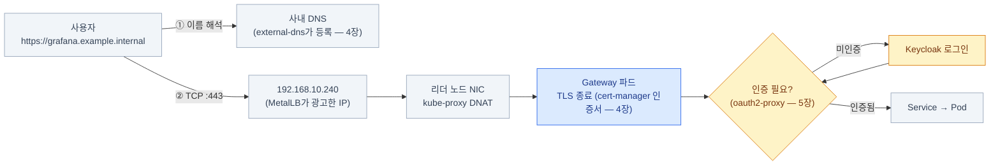

import { Tabs, TabItem, LinkCard, Steps } from '@astrojs/starlight/components';
import TermIntro from '../../../components/TermIntro.astro';

> 2026년 온프렘 입구의 답은 바뀌었다 — **ingress-nginx는 은퇴했고 Gateway API가 그 자리다**

<TermIntro
  terms={[
    ['MetalLB', '', '온프렘에서 `type: LoadBalancer`를 성립시키는 구현체. IP 풀에서 IP를 **할당**하고 사내 네트워크에 **광고**한다. 트래픽을 직접 나르지는 않는다.'],
    ['ARP', 'Address Resolution Protocol', '같은 네트워크 안에서 "이 IP는 이 장비 것"이라고 알려 주는 프로토콜. MetalLB L2 모드가 이걸로 IP를 광고한다.'],
    ['BGP', 'Border Gateway Protocol', '라우터끼리 "이 대역은 나를 거쳐 가라"고 알리는 라우팅 프로토콜. MetalLB BGP 모드는 사내 라우터와 이 관계를 맺는다.'],
    ['Ingress', '', 'HTTP(S) 라우팅을 선언하는 쿠버네티스 기본 리소스. 표준이 빈약해 컨트롤러마다 annotation으로 기능을 덧붙였고, 그 파편화가 Gateway API가 나온 이유다.'],
    ['Gateway API', '', 'Ingress를 대체하는 새 표준. **역할별로 리소스를 나눈다** — 인프라팀의 `GatewayClass`·`Gateway`, 앱팀의 `HTTPRoute`. v1.5가 2026-02에 나왔다.'],
    ['ingress2gateway', '', 'Ingress 리소스를 Gateway API 리소스로 변환해 주는 공식 도구. 1.0이 2026-03에 나왔다.'],
  ]}
/>

## 문제 — `EXTERNAL-IP`가 영원히 `<pending>`이다

밖에서 서비스에 닿으려면 **① 외부 IP가 붙고 ② 그 IP로 온 트래픽이 노드에 도착하고
③ HTTP 규칙에 따라 백엔드로 갈라져야** 한다. 클라우드는 ①②를 관리형 LB가, ③을 ALB나
Ingress 컨트롤러가 했다. 온프렘에는 ①②를 할 주체가 아예 없다.

```bash
kubectl get svc -A | grep LoadBalancer
# NAMESPACE   NAME      TYPE           EXTERNAL-IP   PORT(S)
# gateway     envoy     LoadBalancer   <pending>     80:31234/TCP,443:31235/TCP
#                                      ^^^^^^^^^ 아무도 IP를 안 준다
```

`NodePort`로 우회할 수는 있지만 포트가 30000번대라 사용자에게 줄 수 없고,
노드 IP를 직접 알려 주면 그 노드가 죽는 순간 서비스가 끊긴다. 제대로 채워야 한다.

## ①② IP 할당과 광고 — MetalLB

MetalLB는 `LoadBalancer` 서비스를 감시하다가 **미리 정해 둔 IP 풀에서 IP를 하나 꺼내
주고**, 그 IP를 사내 네트워크에 **광고**한다.

```yaml
# IP 풀 — 노드와 같은 L2 대역이면서 DHCP가 나눠주지 않는 예약 구간이어야 한다
apiVersion: metallb.io/v1beta1
kind: IPAddressPool
metadata:
  name: edge-pool
  namespace: metallb-system
spec:
  addresses:
    - 192.168.10.240-192.168.10.250
---
apiVersion: metallb.io/v1beta1
kind: L2Advertisement
metadata:
  name: edge-l2
  namespace: metallb-system
spec:
  ipAddressPools: [edge-pool]
```

구성 요소는 둘이고 **둘 다 클러스터 안의 평범한 파드**다 (노드에 패키지로 깔지 않는다).

| 구성 | 형태 | 하는 일 |
|---|---|---|
| controller | Deployment 1개 | 풀에서 IP를 **할당** |
| speaker | DaemonSet (모든 노드) | 그 IP를 **광고**(ARP 또는 BGP). `hostNetwork`로 동작 |

### L2와 BGP — 무엇이 다른가

| | **L2 (ARP)** | **BGP** |
|---|---|---|
| 광고 방식 | 한 노드가 "이 IP는 내 것"이라고 ARP 응답 | 노드들이 사내 라우터와 피어링 |
| 분산 | **안 된다** — 한 IP는 노드 1대가 전부 받는다 | ECMP로 여러 노드에 실제 분산 |
| 장애 시 | 다른 노드가 그 IP를 승계(페일오버) | 라우터가 살아 있는 경로로 |
| 요구 | 같은 L2 세그먼트면 끝 | **BGP를 말할 수 있는 사내 라우터** |
| 언제 | 대부분의 시작점 | 규모가 커지거나 단일 노드 대역폭이 한계일 때 |

:::caution[함정 — L2는 로드밸런싱이 아니다]
"MetalLB를 깔았으니 트래픽이 노드에 분산된다"는 오해가 흔하다. **L2 모드에서 한 LB IP의
트래픽은 항상 리더 노드 한 대가 받는다.** 그 노드의 NIC 대역폭이 상한이고,
노드가 죽으면 다른 노드로 넘어갈 뿐이다. 진짜 분산이 필요하면 BGP다.
:::

:::tip[핵심 — MetalLB는 경로상의 홉이 아니다]
패킷은 speaker 파드를 **통과하지 않는다.** MetalLB는 "이 IP는 이 노드로 보내라"고
광고만 하고, 실제 전달은 노드의 kube-proxy(iptables/IPVS)가 한다.
그래서 MetalLB가 트래픽 병목이 되는 일은 없다 — 대신 **장애 지점은 리더 노드**다.
:::

## ③ HTTP 라우팅 — 2026년에 바뀐 답

여기가 이 장의 본론이다. **오랫동안 온프렘의 표준 답이던 ingress-nginx가 은퇴했다.**

| 시점 | 일어난 일 |
|---|---|
| 2025-11 | 쿠버네티스 프로젝트가 **ingress-nginx 은퇴 예고** — 소수 자원봉사자에 의존하던 유지보수가 한계에 도달 |
| 2026-01 | Steering·Security Response 위원회 공식 성명 |
| **2026-03** | **은퇴 — 릴리스 없음, 버그픽스 없음, 보안 취약점이 나와도 패치 없음** |
| — | 후속으로 예고됐던 **InGate도 성숙하지 못해 함께 정리**됐다 |

:::caution[함정]
설치 자체는 지금도 된다. Helm 차트도 이미지도 남아 있다. 그래서 **"잘 돌고 있으니 괜찮다"** 로
넘어가기 쉬운데, 문제는 이게 **인터넷과 사내망의 경계에 서 있는 소프트웨어**라는 점이다.
경계에 놓인 물건에 보안 패치가 영영 안 나온다는 뜻이므로, 은퇴는 "언젠가 할 일"이 아니라
**기한이 지난 일**이다.
:::

### 결정표 — 지금 무엇을 골라야 하나

<Steps>

1. **지금 새로 세우는 중이다** → **Gateway API + 구현체**로 바로 간다.
   Ingress를 새로 배우고 나중에 또 옮길 이유가 없다.

2. **ingress-nginx가 이미 떠 있고 규칙이 몇 개다** → `ingress2gateway`로 변환해 옮긴다.

   ```bash
   # 클러스터의 Ingress를 읽어 Gateway API 리소스로 변환해 출력한다
   ingress2gateway print --namespace prod
   ```

3. **ingress-nginx가 떠 있고 규칙이 수백 개다** → 두 입구를 **한동안 병행**한다.
   새 서비스는 Gateway로, 기존은 순차 이전. 그 사이 ingress-nginx는
   **관리 대역에서만 접근 가능하게 좁히거나 앞에 다른 계층을 둔다.**

4. **어느 구현체를 고를지 못 정했다** → 아래 표.

</Steps>

| 구현체 | 성격 | 온프렘에서 |
|---|---|---|
| **Envoy Gateway** | Envoy 기반, 벤더 중립. Gateway API를 1급으로 지원하고 mTLS·JWT 검증·rate limit이 내장 | 서비스 메시 없이 기능을 다 쓰고 싶을 때. 가장 무난한 기본값 |
| **NGINX Gateway Fabric** | NGINX의 Gateway API 네이티브 후속작 | ingress-nginx의 nginx 설정 감각을 이어가고 싶을 때 |
| **Traefik** | 가볍고 운영이 단순. Gateway API 직접 지원 | 소·중 규모 클러스터, 개발 친화 |
| **Cilium Gateway** | CNI가 곧 게이트웨이 | 이미 Cilium을 CNI로 쓰고 있을 때 ([2장](/onprem/02-foundation/)) |
| **Istio** | 메시의 게이트웨이 | 이미 메시를 도입했을 때만. 게이트웨이만 쓰려고 들이지 않는다 |

### Gateway API가 Ingress와 다른 점 — 역할 분리

Ingress의 진짜 문제는 표현력이 아니라 **한 리소스에 인프라 설정과 앱 라우팅이 섞여 있던 것**이다.
그래서 컨트롤러마다 annotation으로 기능을 덧붙였고, 그 annotation은 컨트롤러를 바꾸는 순간 전부 무효였다.



| Ingress | Gateway API | 무엇이 나아지나 |
|---|---|---|
| `Ingress` 하나에 전부 | `GatewayClass` / `Gateway` / `HTTPRoute`로 분리 | 앱팀이 TLS·리스너를 건드릴 일이 없다 |
| annotation으로 기능 확장 | **표준 필드** (헤더 조작 · 트래픽 분할 · 재시도) | 구현체를 바꿔도 대부분 그대로 |
| 네임스페이스 넘는 라우팅이 애매 | `allowedRoutes` · `ReferenceGrant`로 명시 허용 | 누가 어디로 붙일 수 있는지가 선언된다 |
| HTTP 중심 | `HTTPRoute` · `GRPCRoute` · `TCPRoute` · `TLSRoute` | gRPC·TCP도 같은 모델로 |

### 최소 구성 예제

<Tabs>
<TabItem label="Gateway (인프라팀)">

```yaml
apiVersion: gateway.networking.k8s.io/v1
kind: Gateway
metadata:
  name: edge
  namespace: gateway-system
spec:
  gatewayClassName: envoy-gateway       # 설치한 구현체가 등록한 클래스
  listeners:
    - name: https
      protocol: HTTPS
      port: 443
      hostname: "*.example.internal"
      tls:
        mode: Terminate
        certificateRefs:
          - name: wildcard-tls          # cert-manager가 채운다 (4장)
      allowedRoutes:
        namespaces:
          from: Selector                # 아무 네임스페이스나 붙지 못하게
          selector:
            matchLabels:
              gateway-access: "true"
```

이 `Gateway`의 서비스가 곧 MetalLB에게 IP를 받는 `type: LoadBalancer`다 —
구현체가 자동으로 만들어 준다.

</TabItem>
<TabItem label="HTTPRoute (앱팀)">

```yaml
apiVersion: gateway.networking.k8s.io/v1
kind: HTTPRoute
metadata:
  name: grafana
  namespace: observability
spec:
  parentRefs:
    - name: edge
      namespace: gateway-system
  hostnames: ["grafana.example.internal"]
  rules:
    - matches:
        - path: { type: PathPrefix, value: / }
      backendRefs:
        - name: grafana
          port: 3000
```

앱팀은 자기 네임스페이스의 `HTTPRoute`만 만든다. 인증서도 포트도 건드리지 않는다.

</TabItem>
</Tabs>

## 전체 경로 — 사용자 요청이 지나는 길



**패킷이 실제로 통과하는 파드는 Gateway와 백엔드 둘뿐이다.** MetalLB도 Service도
길을 깔아 주는 장치일 뿐 경로상의 홉이 아니다 — 장애를 가를 때 이 구분이 중요하다.

## 접근 제한 — 두 겹으로 건다

관리자 UI(Argo CD · Grafana · Alertmanager)는 인증만으로 부족할 때가 많다.
**네트워크 레벨과 애플리케이션 레벨을 나눠서** 건다.

| 위치 | 방법 | 막는 것 |
|---|---|---|
| Service(LoadBalancer) | `spec.loadBalancerSourceRanges: [CIDR…]` | LB IP 자체에 닿는 출발 IP (굵은 차단) |
| Gateway 구현체 | 구현체의 정책 리소스 (Envoy Gateway의 `SecurityPolicy` 등) | 특정 호스트·경로로 오는 출발 IP |
| 애플리케이션 | oauth2-proxy · Keycloak ([5장](/onprem/05-identity/)) | 사용자 신원 |

:::caution[함정 — 소스 IP가 노드 IP로 바뀐다]
IP 화이트리스트를 걸었는데 허용 대역에서도 막히거나, 반대로 아무나 통과한다면
**소스 IP가 SNAT로 노드 IP가 됐을 가능성**이 높다. `externalTrafficPolicy: Local`을 주면
소스 IP가 보존되지만, 대신 **파드가 없는 노드로 온 트래픽은 버려진다**(그래서 MetalLB L2와
함께 쓸 때 리더 노드에 파드가 있어야 한다). 실제 도착 IP를 게이트웨이 액세스 로그에서
확인한 뒤에 정책을 짠다.
:::

## 점검

```bash
# ① IP가 붙었나 — 이게 pending이면 아래는 볼 필요도 없다
kubectl get svc -A | grep LoadBalancer
kubectl -n metallb-system logs ds/speaker | tail -20   # 할당·광고 실패 이유

# ② Gateway가 준비됐나 (Programmed=True 여야 실제로 리스닝한다)
kubectl get gateway -A
kubectl describe gateway edge -n gateway-system | sed -n '/Conditions/,$p'

# ③ Route가 Gateway에 붙었나 (Accepted=False면 allowedRoutes·hostname 불일치)
kubectl get httproute -A
kubectl describe httproute grafana -n observability

# ④ 실제로 응답하는가 — DNS를 건너뛰고 IP로 직접
curl -kv --resolve grafana.example.internal:443:192.168.10.240 \
  https://grafana.example.internal/
```

| 증상 | 흔한 원인 | 확인 |
|---|---|---|
| `EXTERNAL-IP`가 `<pending>` | IPAddressPool 미설정 · 풀 소진 | `kubectl -n metallb-system get ipaddresspool`, speaker 로그 |
| IP는 받았는데 안 닿음 | 노드와 다른 L2 세그먼트 · IP 충돌 | 같은 대역인지, DHCP 범위와 안 겹치는지 |
| `Gateway`가 `Programmed=False` | 인증서 Secret 없음 · 클래스 미설치 | `describe gateway`의 Conditions ([4장](/onprem/04-tls-dns/)) |
| `HTTPRoute`가 `Accepted=False` | `allowedRoutes` 라벨 누락 · hostname이 리스너와 불일치 | `describe httproute`의 Parents |
| 404가 게이트웨이에서 난다 | hostname 오타 · Route가 다른 Gateway에 붙음 | 게이트웨이 액세스 로그 |

## 3장 요약

- 온프렘에서 `type: LoadBalancer`를 성립시키는 건 **MetalLB**다 — IP를 **할당하고 광고**할 뿐,
  트래픽을 나르지 않는다. **L2는 분산이 아니라 페일오버**다
- **ingress-nginx는 2026-03에 은퇴했다** — 보안 패치가 없다. 경계에 두는 물건으로는 끝났다
- 지금의 답은 **Gateway API v1.5 + 구현체**(Envoy Gateway가 무난한 기본값).
  이전은 `ingress2gateway`로 시작한다
- Gateway API의 핵심은 **역할 분리** — 인프라팀의 `Gateway`, 앱팀의 `HTTPRoute`
- 접근 제한은 **네트워크(소스 IP) + 애플리케이션(신원)** 두 겹. 소스 IP SNAT를 먼저 확인한다

<LinkCard
  title="4. 입구 ② — 인증서와 이름"
  description="브라우저 경고 없는 HTTPS와 사람이 외울 수 있는 주소 — cert-manager와 external-dns."
  href="/onprem/04-tls-dns/"
/>
