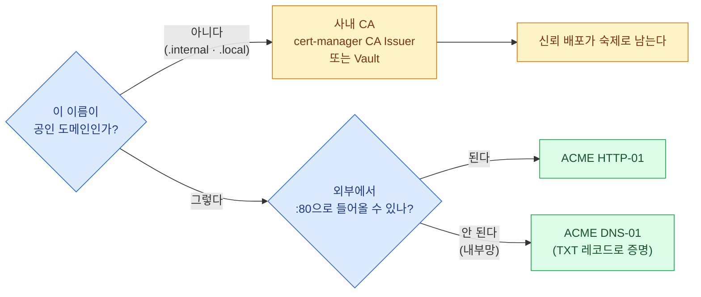
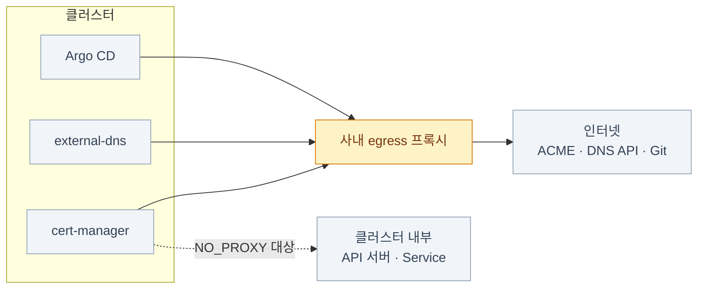

import { Tabs, TabItem, LinkCard, CardGrid, Card } from '@astrojs/starlight/components';
import TermIntro from '../../../components/docs/TermIntro.astro';

> 인증서 발급은 자동화되지만 **"이 CA를 믿어라"를 배포하는 일은 자동이 아니다**

<TermIntro
  terms={[
    ['CA', 'Certificate Authority, 인증 기관', '"이 인증서는 진짜다"라고 서명해 주는 주체. 브라우저·OS는 **미리 심어 둔 CA 목록**만 믿는다 — 사내 CA를 쓰면 그 목록에 직접 넣어야 한다.'],
    ['ACME', 'Automatic Certificate Management Environment', "인증서 발급을 자동화하는 프로토콜. Let's Encrypt가 이걸 쓴다. **도메인 소유를 증명(challenge)** 해야 발급된다."],
    ['HTTP-01 · DNS-01', '', 'ACME의 두 증명 방식. HTTP-01은 **외부에서 내 웹서버로 들어와** 확인하고, DNS-01은 **DNS에 TXT 레코드를 올려** 확인한다. 내부망 서비스는 HTTP-01이 불가능하다.'],
    ['cert-manager', '', '쿠버네티스에서 인증서를 발급·갱신해 주는 컨트롤러. `Certificate` 리소스를 선언하면 TLS Secret을 채워 준다.'],
    ['external-dns', '', 'Gateway·Ingress·Service를 보고 **DNS 레코드를 자동 등록**해 주는 컨트롤러.'],
    ['SAN', 'Subject Alternative Name', '인증서가 보증하는 이름 목록. **브라우저는 CN이 아니라 SAN을 본다** — 여기 없는 이름으로 접속하면 경고가 뜬다.'],
  ]}
/>

## 문제 — IP로는 아무도 못 쓴다

[3장](/onprem/03-gateway/)에서 `https://192.168.10.240`까지는 닿게 만들었다. 그런데 이대로는 못 쓴다.

| 남은 문제 | 왜 |
|---|---|
| 주소를 아무도 못 외운다 | 서비스가 늘면 IP를 나눠 주는 것 자체가 관리 대상이 된다 |
| 브라우저가 경고를 띄운다 | 자체 서명 인증서는 신뢰 목록에 없다 |
| 사용자가 경고를 습관적으로 무시하게 된다 | **이게 진짜 위험이다** — 진짜 중간자 공격도 그냥 넘긴다 |
| 앱끼리 HTTPS로 붙을 때 실패한다 | 서버 SDK는 경고를 넘길 버튼이 없다 |
| 1년 뒤 다 같이 만료된다 | 손으로 만든 인증서는 갱신 알림도 손으로 |

클라우드라면 ACM이 인증서를, Route 53이 이름을 맡았다. 온프렘에서는 **cert-manager와
external-dns**가 그 자리에 들어간다.

## 인증서 — 어디서 받아 오나

먼저 갈라야 할 것은 **공인 CA를 쓸 수 있는가**다. 여기서 두 갈래로 완전히 나뉜다.



| 방식 | 쓰는 자리 | 대가 |
|---|---|---|
| **ACME DNS-01** (공인 CA) | 사내에서만 접근하지만 **도메인은 공인**인 서비스 | 공인 DNS의 API 자격증명이 클러스터에 필요 |
| **ACME HTTP-01** (공인 CA) | 인터넷에 실제로 열려 있는 서비스 | 외부에서 `:80`이 들어와야 한다 |
| **사내 CA** | `.internal` 같은 사설 이름, 에어갭 | **신뢰 배포**를 사람이 해야 한다 |

:::tip[핵심 — 내부망이면 DNS-01이다]
HTTP-01은 CA 서버가 **외부에서 내 서버로 접속해** 확인한다. 내부망 서비스는 그게 불가능하다.
DNS-01은 `_acme-challenge` TXT 레코드만 올리면 되니 **인입이 전혀 필요 없다.**
와일드카드 인증서(`*.example.com`)도 DNS-01로만 발급된다 — 서비스마다 인증서를 만들지
않아도 되니 온프렘에서 특히 유용하다.
:::

### cert-manager 설정 — Issuer 두 종류

<Tabs>
<TabItem label="ACME DNS-01 (공인 도메인)">

```yaml
apiVersion: cert-manager.io/v1
kind: ClusterIssuer
metadata:
  name: letsencrypt-dns
spec:
  acme:
    server: https://acme-v02.api.letsencrypt.org/directory
    email: platform@example.com
    privateKeySecretRef:
      name: letsencrypt-dns-account-key
    solvers:
      - dns01:
          cloudflare:                       # 쓰는 DNS 제공자의 solver
            apiTokenSecretRef:
              name: cloudflare-api-token
              key: token
```

클러스터가 인터넷에 직접 못 나가면 **cert-manager 파드에 프록시 환경변수를 넣어야** 한다.
ACME 서버와 DNS API 양쪽 다 외부이기 때문이다 (아래 "egress 프록시" 절).

</TabItem>
<TabItem label="사내 CA (사설 이름 · 에어갭)">

```yaml
# 루트 CA 키/인증서를 Secret으로 넣어 두고 그것으로 서명한다
apiVersion: cert-manager.io/v1
kind: ClusterIssuer
metadata:
  name: internal-ca
spec:
  ca:
    secretName: internal-ca-keypair      # tls.crt(사내 루트 CA) + tls.key
```

발급은 완전히 오프라인으로 되고 만료 걱정도 자동화된다. 대신 **이 CA를 믿게 만드는 일**이
남는다 — 아래 절.

</TabItem>
<TabItem label="Certificate 요청">

```yaml
apiVersion: cert-manager.io/v1
kind: Certificate
metadata:
  name: wildcard-tls
  namespace: gateway-system          # Gateway가 읽을 수 있는 곳에
spec:
  secretName: wildcard-tls           # 이 Secret을 Gateway의 certificateRefs가 가리킨다 (3장)
  issuerRef:
    name: internal-ca
    kind: ClusterIssuer
  commonName: "*.example.internal"
  dnsNames:                          # 브라우저가 보는 건 여기다
    - "*.example.internal"
    - "example.internal"
  duration: 2160h                    # 90일
  renewBefore: 720h                  # 만료 30일 전에 갱신
```

</TabItem>
</Tabs>

### 사내 CA를 쓰면 남는 숙제 — 신뢰 배포

**발급은 자동, 신뢰는 수동이다.** 사내 루트 CA로 서명한 인증서는
"이 CA를 믿는다"고 등록된 곳에서만 경고 없이 열린다. 그 등록을 곳곳에 해야 한다.

| 어디에 | 어떻게 | 안 하면 |
|---|---|---|
| 사용자 브라우저·OS | 그룹 정책(AD)이나 MDM으로 배포 | 전 직원이 경고 화면을 본다 |
| 컨테이너 안 앱 | 이미지에 CA를 굽거나 ConfigMap을 `/etc/ssl/certs`에 마운트 | 앱→앱 HTTPS 호출이 `x509: certificate signed by unknown authority` |
| 쿠버네티스 노드 | `/usr/local/share/ca-certificates/` + `update-ca-certificates` | 이미지 pull(사내 레지스트리)이 실패 |
| Argo CD · cert-manager 등 컨트롤러 | 각 차트의 CA 번들 옵션 | Git·Webhook 연동이 조용히 실패 |

:::caution[함정]
**루트 CA의 유효기간과 교체 계획을 처음에 정해 둔다.** 10년짜리 루트 CA를 만들고 잊으면,
10년 뒤 그 CA로 서명한 **모든 것이 같은 날 죽는다.** 중간 CA를 두고 짧게 굴리는 구조가
정석이지만, 최소한 **만료일을 달력과 알림에 넣는 것**([관측 덱 2장](/observability/02-prometheus/))은 지금 한다.
:::

## 이름 — external-dns

인증서가 준비돼도 `https://192.168.10.240`으로 접속하면 SAN 불일치로 여전히 경고가 뜬다.
**이름이 그 IP를 가리켜야** 한다.

```yaml
# external-dns는 Gateway API의 HTTPRoute도 소스로 지원한다
# --source=gateway-httproute --policy=upsert-only --domain-filter=example.internal
apiVersion: gateway.networking.k8s.io/v1
kind: HTTPRoute
metadata:
  name: grafana
  namespace: observability
  annotations:
    external-dns.alpha.kubernetes.io/hostname: grafana.example.internal
spec:
  hostnames: ["grafana.example.internal"]
  # …(3장의 나머지)
```

옵션 셋만 제대로 주면 된다.

| 옵션 | 값 | 왜 |
|---|---|---|
| `--policy` | **`upsert-only`** | 기본값 `sync`는 클러스터에서 사라진 리소스의 **DNS 레코드를 지운다.** 수동 관리 레코드가 섞인 사내 DNS에서는 사고가 된다 |
| `--domain-filter` | 관리할 존만 | 실수로 다른 존을 건드리지 않게 |
| `--source` | `gateway-httproute` 등 | Ingress를 안 쓰면 소스도 바꿔야 한다 |
| `--txt-owner-id` | 클러스터마다 다르게 | 클러스터 둘이 같은 존을 쓸 때 서로의 레코드를 뺏지 않게 |

:::tip[핵심]
사내 DNS가 API를 제공하지 않으면(많다) external-dns를 못 쓴다. 그럴 때는
**와일드카드 A 레코드 하나**(`*.apps.example.internal → 192.168.10.240`)를 DNS 팀에 요청하고,
그 아래 이름은 Gateway가 알아서 가르게 하는 편이 현실적이다 —
서비스가 늘 때마다 DNS 요청을 넣지 않아도 된다.
:::

## egress 프록시 — 온프렘에서 제일 자주 막히는 곳

cert-manager(ACME 서버·DNS API), Argo CD(Git·Helm 저장소), 이미지 pull —
**밖으로 나가야 하는 컴포넌트가 생각보다 많다.** 온프렘 클러스터는 대개 인터넷에 직접 못 나간다.



```yaml
# 각 컴포넌트에 개별로 넣어야 한다 — 클러스터 전역 설정 같은 건 없다
env:
  - name: HTTPS_PROXY
    value: "http://proxy.example.internal:3128"
  - name: HTTP_PROXY
    value: "http://proxy.example.internal:3128"
  - name: NO_PROXY
    value: "10.0.0.0/8,192.168.0.0/16,.svc,.cluster.local,localhost,127.0.0.1"
```

:::caution[함정 — `NO_PROXY`를 빼먹으면]
`NO_PROXY`가 없으면 **클러스터 내부 통신까지 프록시로 나갔다가** 실패한다.
cert-manager가 자기 웹훅에 못 붙거나, Argo CD가 API 서버에 못 붙는 식으로
"프록시와 상관없어 보이는" 증상이 난다. `.svc`·`.cluster.local`·파드/서비스 CIDR을 반드시 넣는다.
:::

## 점검

```bash
# ① 인증서가 발급됐나 — READY=True 여야 한다
kubectl get certificate -A
kubectl describe certificate wildcard-tls -n gateway-system | sed -n '/Events/,$p'

# ② 막혀 있으면 아래로 내려가며 본다 (Certificate → CertificateRequest → Order → Challenge)
kubectl get certificaterequest,order,challenge -A
kubectl describe challenge -A | grep -A5 Reason

# ③ 실제 인증서에 그 이름이 들어 있나 (SAN 확인 — 경고의 대부분이 여기서 갈린다)
kubectl -n gateway-system get secret wildcard-tls -o jsonpath='{.data.tls\.crt}' \
  | base64 -d | openssl x509 -noout -subject -dates -ext subjectAltName

# ④ DNS 레코드가 등록됐나
kubectl -n external-dns logs deploy/external-dns | tail -30
dig +short grafana.example.internal

# ⑤ 끝에서 끝까지
curl -v https://grafana.example.internal/ 2>&1 | grep -E 'subject|issuer|SSL cert'
```

| 증상 | 흔한 원인 | 확인 |
|---|---|---|
| `Certificate`가 계속 `False` | egress 프록시 미설정 → ACME 서버에 못 닿음 | cert-manager 로그의 연결 오류 |
| DNS-01 challenge가 `pending`에서 안 넘어감 | DNS API 권한 부족 · TXT 전파 지연 | `describe challenge`, `dig TXT _acme-challenge.<도메인>` |
| 브라우저가 여전히 경고 | 사내 CA 미배포 · **SAN에 그 이름이 없음** | 위 ③ 명령 |
| 앱→앱 호출만 인증서 오류 | 컨테이너 안에 CA 번들이 없음 | 파드에서 `openssl s_client -connect …` |
| DNS 레코드가 안 생김 | annotation 누락 · `--domain-filter` 불일치 | external-dns 로그 |
| **레코드가 사라졌다** | `--policy=sync`가 수동 레코드를 지움 | 즉시 `upsert-only`로 바꾼다 |

## 4장 요약

- 인증서 갈래는 둘 — **공인 CA(ACME)** 와 **사내 CA**. 내부망이면 ACME는 **DNS-01**뿐이다
- 와일드카드 인증서 하나를 Gateway에 물리면 서비스마다 발급하지 않아도 된다
- **사내 CA는 발급이 아니라 "신뢰 배포"가 일이다** — 브라우저 · 컨테이너 · 노드 · 컨트롤러 넷
- external-dns는 **`upsert-only`** 로 건다. 사내 DNS에 API가 없으면 **와일드카드 A 레코드**가 현실적인 답
- 온프렘에서 제일 자주 막히는 건 **egress 프록시**다. `NO_PROXY`를 빼먹으면 내부 통신까지 깨진다

<LinkCard
  title="5. 입구 ③ — 로그인을 한 곳으로"
  description="Grafana admin, Argo CD admin, MinIO root… 도구마다 생기는 계정을 Keycloak과 oauth2-proxy로 모은다."
  href="/onprem/05-identity/"
/>
