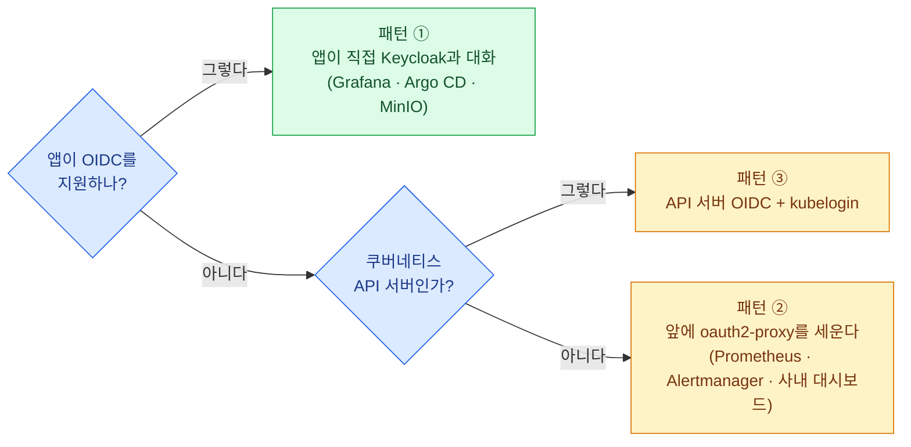
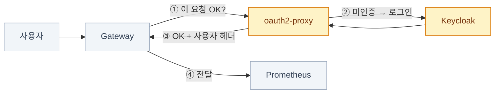
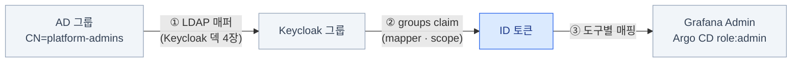

import { Tabs, TabItem, LinkCard, Steps } from '@astrojs/starlight/components';
import TermIntro from '../../../components/docs/TermIntro.astro';

> 플랫폼 도구를 하나 얹을 때마다 **관리자 계정이 하나씩 늘어난다** — 그게 이 장의 문제다

<TermIntro
  terms={[
    ['IdP', 'Identity Provider, 신원 공급자', '"이 사람이 누구인지" 확인해 주고 그 결과를 토큰으로 발급하는 쪽. 이 덱에서는 **Keycloak**이 그 자리다.'],
    ['SSO', 'Single Sign-On', '한 번 로그인하면 여러 앱에 다시 로그인하지 않아도 되는 것. 계정이 한 곳에만 있으니 **퇴사자 차단도 한 곳**에서 끝난다.'],
    ['OIDC', 'OpenID Connect', 'OAuth 2.0 위에 "누구인지"(신원)를 얹은 프로토콜. 앱은 ID 토큰을 받아 사용자를 안다. 상세는 [Keycloak 덱 2장](/keycloak/02-oauth-oidc/).'],
    ['oauth2-proxy', '', '앱 앞에 서서 **로그인 여부를 대신 확인해 주는 리버스 프록시**. 앱이 OIDC를 몰라도 인증을 강제할 수 있다.'],
    ['claim', '클레임', '토큰 안에 실린 사용자 정보 조각(이메일 · 그룹 · 부서). 앱은 이걸 보고 권한을 정한다.'],
    ['외부 인가', 'External Authorization', '게이트웨이가 요청을 백엔드로 넘기기 전에 **다른 서비스에 물어보는** 기능. Gateway API 구현체에서 oauth2-proxy를 이 자리에 꽂는다.'],
  ]}
/>

## 문제 — 도구마다 계정이 생긴다

지금까지 얹은 것만 세어도 로그인 화면이 이만큼이다.

| 도구 | 기본 상태 | 그대로 두면 |
|---|---|---|
| Grafana | `admin` / `admin` | 아무나 대시보드를 고친다 |
| Argo CD | `admin` + 초기 비밀번호 Secret | **클러스터에 무엇이든 배포할 수 있는 계정**이다 |
| Prometheus · Alertmanager | **인증이 아예 없다** | URL을 아는 사람이 전부 본다. 침묵(silence)도 걸 수 있다 |
| MinIO 콘솔 | root 키 | 오브젝트 전체 접근 |
| Kubernetes API | 인증서 kubeconfig | **회수가 안 된다** — 유출되면 클러스터를 다시 세워야 |

계정이 흩어지면 세 가지가 동시에 무너진다 — **퇴사자 차단**(어디를 지워야 하는지 모른다),
**감사**(누가 언제 했는지 도구마다 다른 로그), **비밀번호 관리**(결국 공유된다).

**해법은 하나다: 신원을 한 곳(Keycloak)에 두고, 각 도구는 그곳에 물어본다.**

:::tip[역할 분담]
Keycloak 자체 — realm · client · mapper · 토큰 수명 · AD 연동 — 는
**[Keycloak 덱](/keycloak/)** 이 전부 다룬다. 이 장은 그 위에서
**"플랫폼 도구 열 개를 어떻게 붙이나"** 만 본다.
:::

## 세 패턴 — 앱의 처지에 따라 갈린다



| 패턴 | 방식 | 장점 | 대가 |
|---|---|---|---|
| ① 앱 내장 OIDC | 앱이 client로 등록되고 직접 로그인 | 앱 안의 **역할까지 매핑**된다 | 앱마다 설정이 다르다 |
| ② oauth2-proxy | 앞단 프록시가 인증을 강제 | **앱을 안 고친다** | 앱은 "누가 왔는지"를 헤더로만 안다 |
| ③ API 서버 OIDC | kubectl이 토큰으로 인증 | 인증서 kubeconfig를 없앤다 | API 서버 설정 변경(재시작) |

### 플랫폼 도구별 대응표

| 도구 | 패턴 | 메모 |
|---|---|---|
| **Grafana** | ① | `auth.generic_oauth`. 그룹 → Grafana role 매핑까지 된다 ([관측 덱 5장](/observability/05-grafana/)) |
| **Argo CD** | ① | 내장 Dex를 거치거나 Keycloak에 직접. RBAC은 그룹 claim으로 |
| **MinIO 콘솔** | ① | OIDC 지원. 다만 커뮤니티판 콘솔은 기능이 축소됐다 ([6장](/onprem/06-minio/)) |
| **Prometheus** | ② | 인증 기능이 없다. **반드시** 앞에 세운다 |
| **Alertmanager** | ② | 침묵을 아무나 걸 수 있으면 알림 체계가 무의미해진다 |
| **Loki · Tempo** | — | 사용자에게 직접 노출하지 않는다. **Grafana 뒤에** 둔다 |
| **Kubernetes API** | ③ | → [Keycloak 덱 6장](/keycloak/06-k8s-oidc/) |

## 패턴 ② — oauth2-proxy를 어디에 꽂나

oauth2-proxy는 두 가지 방식으로 배치한다. **Gateway API 시대에는 ①이 기본**이다.

<Tabs>
<TabItem label="① 게이트웨이의 외부 인가">

게이트웨이가 요청을 백엔드로 넘기기 전에 oauth2-proxy에 **"이 요청 통과시켜도 되나"** 를 묻는다.
인증되지 않았으면 oauth2-proxy가 Keycloak 로그인으로 리다이렉트한다.



구현체마다 리소스 이름이 다르다 — Envoy Gateway는 `SecurityPolicy`, Traefik은 미들웨어.
**핵심은 같다: 백엔드는 그대로 두고 게이트웨이가 먼저 물어본다.**

```yaml
# Envoy Gateway 예 — 이 HTTPRoute로 오는 요청은 인가를 거친다
apiVersion: gateway.envoyproxy.io/v1alpha1
kind: SecurityPolicy
metadata:
  name: require-login
  namespace: observability
spec:
  targetRefs:
    - group: gateway.networking.k8s.io
      kind: HTTPRoute
      name: prometheus
  extAuth:
    http:
      backendRefs:
        - name: oauth2-proxy
          port: 4180
      headersToBackend: ["x-auth-request-user", "x-auth-request-groups"]
```

</TabItem>
<TabItem label="② oauth2-proxy가 직접 프록시">

oauth2-proxy가 트래픽 경로에 직접 서고, `--upstream`으로 백엔드에 넘긴다.

```yaml
args:
  - --provider=oidc
  - --oidc-issuer-url=https://sso.example.internal/realms/corp
  - --client-id=platform-tools
  - --email-domain=example.com
  - --upstream=http://prometheus.observability.svc:9090
  - --pass-access-token=true
  - --set-xauthrequest=true
  - --cookie-secure=true
```

단순하지만 **경로(path) 규칙이 까다롭다** — trailing slash 유무, upstream 여러 개일 때의
접두사 처리가 버전마다 다르다. 백엔드가 하나면 `--upstream`을 루트 하나로 두는 게 안전하다.

</TabItem>
</Tabs>

:::caution[함정 — 앱은 "누가 왔는지"를 모른다]
패턴 ②에서 백엔드가 받는 건 `X-Auth-Request-User` 같은 **헤더뿐**이다. 그래서
Prometheus는 여전히 "모두가 관리자"다 — 프록시는 **문을 잠글 뿐 안에서의 권한은 안 나눈다.**
읽기/쓰기를 나눠야 한다면 프록시 두 벌을 서로 다른 그룹 조건으로 세우거나,
애초에 패턴 ①이 되는 도구를 고른다.

그리고 **그 헤더는 신뢰 경계 안에서만 유효하다.** 사용자가 직접 백엔드에 붙을 수 있으면
헤더를 위조할 수 있다 — NetworkPolicy로 백엔드를 게이트웨이/프록시에서만 접근 가능하게 막는다.
:::

## 진짜 일은 그룹 매핑이다

도구를 붙이는 것보다 **"누가 무엇을 할 수 있나"를 정하는 게** 훨씬 오래 걸린다.
사슬은 셋이고, 어느 한 곳만 끊겨도 사용자는 "로그인은 되는데 아무것도 안 보인다"를 겪는다.



<Steps>

1. **AD 그룹을 먼저 정한다.** 도구별이 아니라 **역할별**로 — `platform-admins`,
   `platform-viewers`, `app-<팀>-devs` 정도면 대부분 커버된다.
   도구가 늘어날 때마다 그룹을 만들기 시작하면 관리가 무너진다.

2. **Keycloak에서 groups claim을 토큰에 싣는다.** client scope와 mapper 설정이며,
   [Keycloak 덱 3장](/keycloak/03-structure/)이 다룬다.

3. **도구마다 그 claim을 자기 역할로 번역한다.**

   ```ini
   # Grafana — 그룹에 따라 role 부여
   [auth.generic_oauth]
   role_attribute_path = contains(groups[*], 'platform-admins') && 'Admin' || 'Viewer'
   ```

   ```csv
   # Argo CD — argocd-rbac-cm
   g, platform-admins, role:admin
   g, platform-viewers, role:readonly
   ```

4. **claim이 실제로 도착하는지 확인한다.** 안 되면 사슬 어디가 끊겼는지 순서대로 본다 —
   AD 매퍼 → Keycloak scope → 토큰 → 도구 설정. 진단 절차는
   [Keycloak 덱 7장](/keycloak/07-apps/)의 "다섯 고리 점검"에 있다.

</Steps>

## 남는 문제 셋

| 문제 | 왜 생기나 | 어떻게 다루나 |
|---|---|---|
| **로그아웃이 한 번에 안 된다** | 세션이 세 층(앱 쿠키 · 프록시 쿠키 · Keycloak SSO 세션) | 도구 로그아웃 링크를 Keycloak의 end-session으로 보낸다 ([Keycloak 덱 5장](/keycloak/05-sessions/)) |
| **Keycloak이 죽으면 아무도 못 들어온다** | 신원을 한 곳에 모은 대가 | Keycloak을 HA로([Keycloak 덱 8장](/keycloak/08-deploy/)), **깨진 유리 계정**을 도구마다 하나 남긴다 |
| **자동화는 사람 로그인을 못 한다** | CI·스크립트에는 브라우저가 없다 | 서비스 계정 토큰(Argo CD)·API 키를 따로 두고 **감사 로그를 남긴다** |

:::caution[함정 — 깨진 유리 계정]
SSO로 전부 옮기면서 로컬 관리자 계정을 **전부** 지우면, Keycloak 장애 때
Grafana에도 Argo CD에도 못 들어간다. 도구마다 로컬 관리자 하나를 남기고
**긴 무작위 비밀번호로 금고에 넣어 둔다.** 쓰이면 알림이 나게 해 두면 더 좋다.
:::

## 점검

```bash
# ① Keycloak discovery가 열리나 (여기 안 되면 나머지는 전부 무의미)
curl -s https://sso.example.internal/realms/corp/.well-known/openid-configuration | head -20

# ② 프록시를 거쳤을 때 로그인으로 튕기나
curl -sI https://prometheus.example.internal/ | grep -i location
#   → Keycloak /protocol/openid-connect/auth 로 가야 정상

# ③ 토큰에 groups가 실렸나 (브라우저 개발자도구에서 ID 토큰을 꺼내 디코드)
echo "<jwt-payload>" | base64 -d | jq '.groups, .preferred_username'

# ④ 백엔드가 사용자 헤더를 받나
kubectl -n observability logs deploy/oauth2-proxy | tail -20

# ⑤ 백엔드에 직접 붙을 수 있는지 (붙으면 헤더 위조가 가능하다는 뜻)
kubectl run probe --rm -it --image=curlimages/curl:8.9.1 --restart=Never -- \
  curl -s -o /dev/null -w '%{http_code}\n' http://prometheus.observability.svc:9090/
```

## 5장 요약

- 도구가 늘어날수록 **관리자 계정이 늘어난다** — 퇴사자 차단 · 감사 · 비밀번호가 동시에 무너진다
- 패턴은 셋: **앱 내장 OIDC** / **앞단 oauth2-proxy** / **API 서버 OIDC**.
  Prometheus·Alertmanager는 인증이 없으므로 반드시 프록시 뒤에 둔다
- 프록시는 **문을 잠글 뿐 안에서의 권한은 안 나눈다.** 백엔드 직접 접근도 NetworkPolicy로 막는다
- 진짜 일은 **AD 그룹 → Keycloak claim → 도구 역할** 세 고리를 잇는 것이다
- **깨진 유리 계정**을 도구마다 하나 남긴다 — IdP가 죽으면 전부 잠긴다

<LinkCard
  title="6. 오브젝트 스토리지 — 사내 S3"
  description="Loki·Tempo·Velero·CNPG 백업이 전부 여기로 떨어진다. MinIO가 끝난 2026년에 무엇을 고르나."
  href="/onprem/06-minio/"
/>
