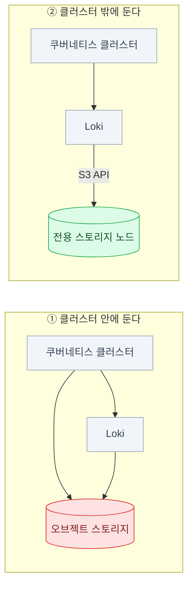

import { LinkCard, CardGrid, Card } from '@astrojs/starlight/components';
import TermIntro from '../../../components/TermIntro.astro';

> 이 바닥을 **클러스터 안에 두면**, 클러스터가 죽을 때 **죽은 이유를 볼 수단도 같이 죽는다**

<TermIntro
  terms={[
    ['오브젝트 스토리지', 'Object Storage', '파일을 **HTTP API로** 통째로 넣고 빼는 저장소. 디렉터리에 마운트하지 않는다. 큰 파일·백업·로그처럼 "통째로 쓰고 통째로 읽는" 데이터에 강하다.'],
    ['S3 API', '', 'AWS S3가 만든 오브젝트 스토리지 HTTP 인터페이스. 사실상 표준이라 **거의 모든 도구가 이 API로 말한다** — 그래서 온프렘에서도 S3 호환 제품을 세운다.'],
    ['버킷 · 객체 · 키', 'Bucket · Object · Key', '버킷은 최상위 그릇, 객체는 데이터 한 덩어리, 키는 그 이름. **키 안의 `/`는 진짜 폴더가 아니라 접두사(prefix)** 다.'],
    ['path-style · virtual-host style', '', '엔드포인트 형식. `http://호스트/버킷/키`(path-style)와 `http://버킷.호스트/키`(virtual-host). **온프렘은 대개 path-style**을 켠다 — 버킷마다 DNS를 만들 수 없어서다.'],
    ['erasure coding', '소거 부호', '객체를 데이터 조각 + 패리티 조각으로 쪼개 여러 디스크·노드에 흩어 두는 방식. 일부가 죽어도 복원된다.'],
    ['라이프사이클', 'Lifecycle', '"90일 지난 객체는 지운다" 같은 규칙을 스토리지가 스스로 적용하게 하는 기능. 온프렘에서 **디스크가 차는 것을 막는 유일한 자동 장치**다.'],
  ]}
/>

## 문제 — 이 바닥이 없으면 위층 절반이 안 뜬다

오브젝트 스토리지는 "있으면 좋은 것"이 아니라 **이 덱의 전제**다.

| 도구 | S3에 무엇을 넣나 | 없으면 |
|---|---|---|
| **Loki** | 로그 chunk와 인덱스 | 로그를 며칠치밖에 못 들고 있다 ([10장](/onprem/10-loki/)) |
| **Tempo** | 트레이스 블록 | 추적을 아예 못 켠다 ([11장](/onprem/11-tempo/)) |
| **CloudNativePG** | 베이스 백업 · WAL 아카이브 | **시점 복구(PITR)가 불가능하다** ([7장](/onprem/07-cnpg/)) |
| **Velero** | 클러스터 백업 | 클러스터를 다시 못 세운다 ([14장](/onprem/14-backup/)) |
| Prometheus 장기 저장 | 압축된 블록 | 메트릭 보존이 로컬 디스크 크기에 묶인다 |
| 사내 앱 | 첨부파일 · 리포트 · 모델 | 앱이 PVC에 파일을 쌓다가 노드에 묶인다 |

:::tip[핵심 — 마운트가 아니다]
오브젝트 스토리지는 파드에 `volumeMounts`로 붙이지 않는다. 앱이 **엔드포인트 URL과
액세스 키로 HTTP 요청**을 보낸다. 그래서 "Loki에 PVC를 얼마나 줘야 하나"라는 질문은
대개 잘못됐고, 대신 **"어느 버킷에 며칠치를 두나"** 를 정해야 한다.
:::

## 2026년의 문제 — MinIO 커뮤니티판은 끝났다

온프렘 사내 S3의 기본값은 오랫동안 MinIO였다. 그 전제가 무너졌다.

| 시점 | 일어난 일 |
|---|---|
| 2025-05 | 커뮤니티판 **웹 콘솔에서 관리 기능 제거** — 버킷·사용자·정책 관리가 빠지고 오브젝트 브라우저만 남음 |
| 2025-12 | 커뮤니티판 **maintenance mode** — 새 기능 없음, PR 안 받음 |
| **2026-02** | `minio/minio` 저장소 **아카이브** — 읽기 전용. 상용 AIStor로 무게중심 이동 |

**이미 돌고 있는 MinIO를 당장 끄라는 뜻은 아니다.** 다만 두 가지가 달라졌다 —
① 새로 깐다면 다른 후보를 함께 본다, ② 지금 쓰는 중이면 **보안 패치 경로**를 정해 둔다.

### 선택지

| 후보 | 성격 | 고를 때 |
|---|---|---|
| **기존 MinIO 유지** | 이미 돌고 있고 잘 돈다 | 단, 취약점 대응 계획(포크·상용 지원·격리)을 문서로 남긴다 |
| **AIStor** (상용) | MinIO사의 유료 제품. 콘솔과 지원이 살아 있다 | 예산이 있고 MinIO 운영 자산을 그대로 쓰고 싶을 때 |
| **RustFS** | Apache 2.0. MinIO에서 가장 직접적인 교체 대상으로 거론된다 | 라이선스가 자유롭고 이전 비용이 낮은 쪽을 원할 때 |
| **SeaweedFS** | 대량 소파일에 강한 분산 스토리지. S3 게이트웨이 제공 | 작은 파일이 억 단위일 때 |
| **Garage** | 경량. 소·중 규모와 엣지 지향, 문서가 좋다 | 노드 몇 대로 단순하게 세우고 싶을 때 |
| **Ceph RGW** (Rook) | 블록·파일·오브젝트를 한 시스템에서 | 이미 Ceph를 쓰거나 대규모 통합 스토리지가 필요할 때 |
| **기존 사내 스토리지의 S3 게이트웨이** | NetApp·Dell 등 벤더 제품이 S3를 제공 | **이미 있는 걸 먼저 확인한다** — 새로 세우기 전에 |

:::caution[함정]
"MinIO 웹 콘솔에서 버킷을 만든다"로 시작하는 문서는 **2025-05 이전 기준**이다.
지금 커뮤니티판에서 버킷·사용자·정책은 **`mc`(CLI)로만** 관리한다.

```bash
mc alias set store https://s3.example.internal ADMINKEY ADMINSECRET
mc mb store/loki                                  # 버킷 생성
mc admin user add store loki-user LOKISECRET      # 전용 사용자
mc admin policy attach store readwrite --user loki-user
```
:::

## 어디에 두나 — 이 장에서 제일 중요한 결정



| | 클러스터 안 | **클러스터 밖 (권장)** |
|---|---|---|
| 클러스터가 죽으면 | **로그·백업도 같이 못 본다** | 남아 있다. 원인 조사와 복구가 가능하다 |
| 클러스터를 다시 세울 때 | 데이터를 먼저 빼내야 한다 | 새 클러스터가 같은 엔드포인트를 가리키면 끝 |
| 수명 | 클러스터 수명에 묶인다 | 독립적 — 스토리지는 훨씬 오래 산다 |
| 디스크 요구 | 컴퓨트 노드에 대용량 디스크 | 스토리지 전용 하드웨어 |
| 운영 부담 | 오퍼레이터가 도와준다 | 노드 관리가 별도 업무 |

:::tip[핵심]
**백업과 로그를 백업 대상과 같은 실패 도메인에 두지 않는다.**
"클러스터가 죽었는데 Velero 백업이 그 클러스터 안 MinIO에 있다"는 온프렘에서 실제로
자주 나오는 사고다. 클러스터 안에 둘 수밖에 없다면 **최소한 백업만은 오프사이트로 복제**한다
([14장](/onprem/14-backup/)).
:::

## 버킷 설계 — 도구마다 버킷과 키를 나눈다

한 버킷에 전부 넣으면 **보존 정책도 권한도 나눌 수 없다.** 도구별로 자른다.

| 버킷 | 쓰는 쪽 | 보존 | 접근 |
|---|---|---|---|
| `loki-chunks` | Loki | 30~90일 (라이프사이클) | Loki 전용 사용자 (읽기·쓰기) |
| `tempo-traces` | Tempo | 7~30일 | Tempo 전용 사용자 |
| `pg-backups` | CloudNativePG | 30일 + WAL | CNPG 전용 사용자 |
| `velero` | Velero | 백업 정책에 따름 | Velero 전용 사용자 |
| `app-<서비스명>` | 사내 앱 | 앱마다 | 앱 전용 사용자 |

원칙 셋 —

<CardGrid>
<Card title="사용자를 도구마다 나눈다" icon="approve-check">
root 키를 여기저기 넣지 않는다. 키가 유출됐을 때 **무엇이 노출됐는지**를
버킷 단위로 가를 수 있어야 한다. 정책은 해당 버킷 접두사로만 좁힌다.
</Card>
<Card title="라이프사이클을 처음에 건다" icon="warning">
온프렘 디스크는 유한하다. **"나중에 정리하자"는 반드시 디스크 풀로 끝난다.**
버킷을 만들 때 보존 규칙도 같이 만든다.
</Card>
<Card title="키는 시크릿 관리 체계로" icon="setting">
평문 Secret으로 두지 않는다. Sealed Secrets나 External Secrets로
관리한다 ([13장](/onprem/13-gitops/)).
</Card>
<Card title="버저닝은 신중하게" icon="information">
실수 복구에는 좋지만 **용량이 조용히 몇 배가 된다.**
켠다면 만료 규칙(비현행 버전 N일 후 삭제)을 반드시 같이 건다.
</Card>
</CardGrid>

### 앱·도구가 쓰는 접속 정보

```yaml
apiVersion: v1
kind: Secret
metadata:
  name: loki-s3
  namespace: observability
type: Opaque
stringData:
  AWS_ACCESS_KEY_ID: loki-user
  AWS_SECRET_ACCESS_KEY: "<시크릿 관리 체계로 주입>"
  S3_ENDPOINT: "https://s3.example.internal"
```

```yaml
# Loki 쪽 설정 — 온프렘에서 거의 항상 필요한 두 줄
storage_config:
  aws:
    endpoint: https://s3.example.internal
    bucketnames: loki-chunks
    s3forcepathstyle: true      # ← 온프렘은 path-style
    region: us-east-1           # ← 아무 값이나. SDK가 요구해서 채우는 것뿐
```

:::caution[함정 넷 — 온프렘 S3에서 반복해서 데는 곳]
- **path-style을 안 켜면** SDK가 `버킷.s3.example.internal`로 붙으려다 DNS에서 실패한다
- **`region`은 의미가 없어도 필요하다.** 비워 두면 SDK가 에러를 낸다 — `us-east-1`을 넣는다
- **시계가 어긋나면 서명이 깨진다.** S3 서명은 시각을 포함한다. 노드와 스토리지의 NTP를 맞춘다
  (`RequestTimeTooSkewed`)
- **사내 CA 인증서**를 컨테이너가 못 믿으면 `x509: unknown authority`가 난다 ([4장](/onprem/04-tls-dns/))
:::

## 데이터 보호와 용량

- **erasure coding** — 객체를 조각내 여러 디스크·노드에 흩어 둔다. 디스크 몇 개가 죽어도 복원된다.
  대신 **쓸 수 있는 용량이 원디스크 합보다 작다** — 용량 계획에서 이걸 빼먹으면 안 된다.
- **분산 모드는 보통 노드 4대 이상**을 전제한다. 1대 단독은 학습·소규모용이고,
  그 디스크가 죽으면 그냥 잃는다.
- **용량 계획은 위층에서 역산한다.**

  | 항목 | 어림 |
  |---|---|
  | Loki | 하루 로그 GB × 보존일 × 압축률(대략 1/5~1/10) |
  | Tempo | 하루 트레이스 GB × 보존일 × 샘플링률 |
  | CNPG | 베이스 백업 크기 × 세대 + WAL(변경량 × 보존일) |
  | Velero | PV 데이터 총량 × 세대 (증분이면 훨씬 작다) |

  여기에 **여유 30%** 를 더한다. 오브젝트 스토리지는 가득 차면 쓰기가 막히고,
  그러면 **로그도 백업도 동시에 멈춘다.**

## 점검

```bash
# ① 엔드포인트가 열려 있고 인증이 되나
mc alias set store https://s3.example.internal KEY SECRET
mc admin info store            # 노드·디스크 상태
mc ls store                    # 버킷 목록

# ② 실제로 쓰고 읽히나 (도구 계정으로 확인 — root로 하면 권한 문제를 못 잡는다)
echo hello > /tmp/probe.txt
mc cp /tmp/probe.txt store/loki-chunks/probe.txt
mc cat store/loki-chunks/probe.txt
mc rm store/loki-chunks/probe.txt

# ③ 클러스터 안에서 닿나 (DNS·프록시·CA가 여기서 갈린다)
kubectl run s3probe --rm -it --image=curlimages/curl:8.9.1 --restart=Never -- \
  curl -sv https://s3.example.internal/minio/health/live

# ④ 용량
mc admin info store | grep -i used
```

| 증상 | 흔한 원인 | 확인 |
|---|---|---|
| `NoSuchBucket` | 버킷 이름 오타 · 도구가 자동 생성 안 함 | `mc ls store` |
| `SignatureDoesNotMatch` | 키 오타 · **시계 어긋남** | 노드 `timedatectl`, `date` 비교 |
| `x509: unknown authority` | 컨테이너에 사내 CA 없음 | [4장](/onprem/04-tls-dns/) 신뢰 배포 |
| 버킷 접근이 DNS 오류 | path-style 미설정 | 설정에 `s3forcepathstyle` / `forcePathStyle` |
| 쓰기가 갑자기 실패 | **디스크 풀** | `mc admin info`, 라이프사이클 규칙 확인 |

## 6장 요약

- 오브젝트 스토리지는 선택이 아니라 **전제**다 — Loki · Tempo · CNPG 백업 · Velero가 전부 여기 쓴다
- **MinIO 커뮤니티판은 2026-02에 아카이브됐다.** 유지·상용·대안(RustFS · SeaweedFS · Garage · Ceph RGW) 중 고르고,
  **이미 있는 사내 스토리지의 S3 게이트웨이부터 확인**한다
- **클러스터 밖에 둔다.** 안에 두면 클러스터가 죽을 때 죽은 이유를 볼 수단도 같이 죽는다
- 버킷은 **도구마다 나누고, 사용자도 나누고, 라이프사이클을 처음에 건다**
- 온프렘 단골 함정 넷: **path-style · region 값 · 시계 어긋남 · 사내 CA**

<LinkCard
  title="7. 데이터베이스 — CloudNativePG"
  description="StatefulSet으로 직접 띄우면 페일오버도 백업도 전부 수작업이 된다. 오퍼레이터가 대신하는 것들."
  href="/onprem/07-cnpg/"
/>
