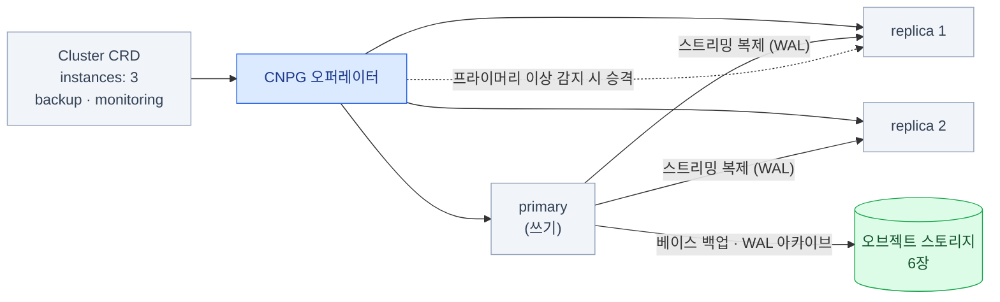
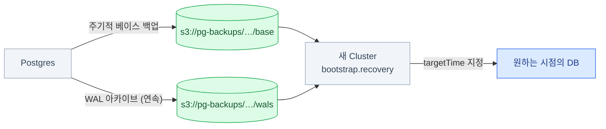

import { Tabs, TabItem, LinkCard, Steps } from '@astrojs/starlight/components';
import TermIntro from '../../../components/TermIntro.astro';

> 오퍼레이터는 **"운영 절차를 코드로 옮긴 것"** 이다 — 페일오버·백업·업그레이드가 그 절차다

<TermIntro
  terms={[
    ['CNPG', 'CloudNativePG', '쿠버네티스에서 PostgreSQL을 운영하는 오퍼레이터. `Cluster` CRD 하나로 복제·페일오버·백업·업그레이드를 선언한다. 현재 온프렘의 사실상 기본값이다.'],
    ['프라이머리 · 레플리카', 'Primary · Replica', '쓰기를 받는 인스턴스와, 그 변경을 따라 복제하는 인스턴스. 프라이머리가 죽으면 레플리카 하나가 승격(promote)된다.'],
    ['WAL', 'Write-Ahead Log', '데이터 파일을 고치기 **전에 먼저 기록하는 변경 로그**. 복제도 시점 복구도 전부 이 로그로 이뤄진다 — PostgreSQL의 심장이다.'],
    ['PITR', 'Point-In-Time Recovery, 시점 복구', '"어제 오후 3시 상태로" 되돌리는 복구. **베이스 백업 + 그 이후의 WAL**이 있어야 가능하다.'],
    ['페일오버 · 스위치오버', 'Failover · Switchover', '프라이머리가 **죽어서** 넘어가는 것과, 계획적으로 **넘기는** 것. 후자는 업그레이드 때 쓴다.'],
    ['동기 · 비동기 복제', 'Synchronous · Asynchronous', '커밋을 레플리카가 받을 때까지 **기다리는지**. 동기는 데이터를 안 잃지만 느리고, 레플리카가 죽으면 쓰기가 멈출 수 있다.'],
  ]}
/>

## 문제 — StatefulSet으로 띄우면 그때부터가 일이다

Postgres를 StatefulSet + PVC로 띄우는 건 어렵지 않다. 30줄이면 뜬다.
문제는 **뜬 다음**이다.

| 상황 | StatefulSet 직접 | 클라우드 RDS에서는 |
|---|---|---|
| 파드가 있던 노드가 죽었다 | 사람이 확인하고 옮긴다. 볼륨이 로컬이면 못 옮긴다 | 자동 페일오버 |
| 프라이머리가 응답이 없다 | **레플리카가 있어도 아무 일도 안 일어난다** | 승격 후 엔드포인트 전환 |
| 어제 오후 3시로 되돌려야 한다 | `pg_dump`가 어제 새벽 것뿐이라 못 한다 | 시점 복구 |
| 마이너 버전을 올려야 한다 | 순서를 손으로 — 잘못하면 복제가 깨진다 | 클릭 |
| 앱이 읽기 부하를 나누고 싶다 | 레플리카 주소를 앱이 직접 알아야 한다 | 읽기 엔드포인트 제공 |

:::tip[핵심]
`replicas: 3`으로 늘려도 **복제 DB가 되지 않는다.** 쿠버네티스가 해 주는 건
파드 3개 + 각자 PVC + 안정적인 이름까지다. "0번 데이터를 1번에 복제하고, 0번이 죽으면
1번을 승격한다"는 **DB 소프트웨어와 오퍼레이터의 일**이다.
:::

## 해법 — 오퍼레이터가 절차를 대신한다

CloudNativePG는 `Cluster` 리소스 하나로 그 절차를 전부 선언한다.



오퍼레이터가 만들어 주는 **서비스 셋**이 특히 중요하다 — 앱은 파드 이름을 몰라도 된다.

| 서비스 | 가리키는 곳 | 앱에서 |
|---|---|---|
| `<이름>-rw` | **현재 프라이머리** | 쓰기 연결은 항상 여기. 페일오버해도 주소가 안 바뀐다 |
| `<이름>-ro` | 레플리카들 | 읽기 전용 부하 분산 |
| `<이름>-r` | 전부(프라이머리 포함) | 아무 데나 읽어도 될 때 |

### Cluster 예제

```yaml
apiVersion: postgresql.cnpg.io/v1
kind: Cluster
metadata:
  name: platform-pg
  namespace: database
spec:
  instances: 3                          # 프라이머리 1 + 레플리카 2
  imageName: ghcr.io/cloudnative-pg/postgresql:17.5   # 태그를 고정한다

  storage:
    size: 200Gi
    storageClass: db-retain             # 2장에서 만든 Retain SC
  walStorage:                           # WAL을 데이터와 다른 볼륨에
    size: 50Gi
    storageClass: db-retain

  postgresql:
    parameters:
      max_connections: "300"
      shared_buffers: "2GB"

  # 상태 노드에만 뜨게 (2장)
  affinity:
    nodeSelector:
      node-role: data
    tolerations:
      - key: dedicated
        operator: Equal
        value: data
        effect: NoSchedule
    enablePodAntiAffinity: true         # 세 인스턴스를 다른 노드에
    topologyKey: kubernetes.io/hostname

  monitoring:
    enablePodMonitor: true              # Prometheus가 긁어 간다 (9장)

  backup:
    barmanObjectStore:
      destinationPath: s3://pg-backups/platform-pg
      endpointURL: https://s3.example.internal      # 6장의 그 엔드포인트
      s3Credentials:
        accessKeyId:
          name: pg-backup-s3
          key: ACCESS_KEY_ID
        secretAccessKey:
          name: pg-backup-s3
          key: SECRET_ACCESS_KEY
      wal:
        compression: gzip
      data:
        compression: gzip
    retentionPolicy: "30d"
```

:::caution[함정 — WAL 아카이브가 막히면 디스크가 찬다]
WAL은 아카이브에 성공해야 지워진다. S3 자격증명이 틀렸거나 버킷이 가득 차면
**Postgres가 WAL을 계속 쌓아 두다가 볼륨을 채우고 멈춘다.** 백업 실패는
"나중에 볼 일"이 아니라 **즉시 알림 대상**이다 ([9장](/onprem/09-prometheus/)).
:::

## 복제를 어떻게 설정하나

| 모드 | 커밋이 언제 성공하나 | 잃을 수 있는 것 | 쓸 자리 |
|---|---|---|---|
| **비동기**(기본) | 프라이머리 디스크에 쓰면 | 페일오버 시 **마지막 몇 트랜잭션** | 대부분. 관측·내부 도구 DB |
| **동기** | 레플리카가 받았다고 답하면 | 없음(설정한 만큼) | 결제·주문처럼 잃으면 안 되는 데이터 |

```yaml
spec:
  postgresql:
    synchronous:
      method: any
      number: 1          # 레플리카 1대가 받으면 커밋 성공
```

:::caution[함정 — 동기 복제의 함정]
`number`를 레플리카 수와 같게 두면, **레플리카 한 대만 죽어도 쓰기가 전부 멈춘다.**
인스턴스 3대(레플리카 2)라면 `number: 1`이 안전한 기본값이다 —
한 대가 죽어도 나머지 한 대로 조건이 충족된다.
:::

## 백업과 복구 — 여기가 오퍼레이터를 쓰는 진짜 이유



<Tabs>
<TabItem label="정기 백업">

```yaml
apiVersion: postgresql.cnpg.io/v1
kind: ScheduledBackup
metadata:
  name: platform-pg-nightly
  namespace: database
spec:
  schedule: "0 30 2 * * *"          # 초 필드가 있는 6자리 cron (매일 02:30)
  backupOwnerReference: self
  cluster:
    name: platform-pg
```

</TabItem>
<TabItem label="시점 복구">

**기존 클러스터를 되돌리지 않는다.** 백업에서 **새 Cluster를 만든다** — 원본은 그대로 두고
복구본을 확인한 뒤 전환하는 방식이라 실수의 여지가 적다.

```yaml
apiVersion: postgresql.cnpg.io/v1
kind: Cluster
metadata:
  name: platform-pg-restored
  namespace: database
spec:
  instances: 1
  storage: { size: 200Gi, storageClass: db-retain }
  bootstrap:
    recovery:
      source: platform-pg-backup
      recoveryTarget:
        targetTime: "2026-08-09 15:00:00.000000+09:00"   # 이 시점으로
  externalClusters:
    - name: platform-pg-backup
      barmanObjectStore:
        destinationPath: s3://pg-backups/platform-pg
        endpointURL: https://s3.example.internal
        s3Credentials:
          accessKeyId: { name: pg-backup-s3, key: ACCESS_KEY_ID }
          secretAccessKey: { name: pg-backup-s3, key: SECRET_ACCESS_KEY }
```

</TabItem>
</Tabs>

:::tip[핵심 — 복구는 리허설한 것만 된다]
백업이 "성공"으로 찍히는 것과 **그 백업으로 실제 DB가 뜨는 것**은 다른 일이다.
분기에 한 번은 위 복구 매니페스트로 **새 네임스페이스에 복구본을 띄우고
행 수를 세어 본다.** 안 해 본 백업은 백업이 아니다 ([14장](/onprem/14-backup/)).
:::

## 운영 — plugin이 대부분을 해 준다

```bash
# 설치: kubectl krew install cnpg
kubectl cnpg status platform-pg -n database          # 프라이머리·복제 지연·백업 상태 한 화면
kubectl cnpg status platform-pg -n database --verbose

kubectl cnpg promote platform-pg platform-pg-2 -n database   # 계획된 스위치오버
kubectl cnpg backup platform-pg -n database                  # 즉시 백업
kubectl cnpg restart platform-pg -n database                 # 롤링 재시작

# 접속 (진단용)
kubectl -n database exec -it platform-pg-1 -- psql -U postgres -c '\l'
```

### 업그레이드

<Steps>

1. **오퍼레이터 업그레이드** — 릴리스 노트를 먼저 본다. 1.29.1에서 심각도 높은 CVE가
   수정된 전례가 있으니 **오퍼레이터 자체의 보안 릴리스는 미루지 않는다.**

2. **Postgres 마이너 버전** — `imageName` 태그만 바꾸면 오퍼레이터가 롤링으로 처리한다.
   레플리카 먼저, 마지막에 스위치오버 후 옛 프라이머리.

3. **Postgres 메이저 버전** — 별도 절차다. 다운타임이 있거나 논리 복제로 옮긴다.
   **반드시 복구본으로 먼저 리허설**한다.

4. 각 단계 뒤에 `kubectl cnpg status`로 복제 지연이 0으로 돌아오는지 확인한다.

</Steps>

## 이 DB를 누가 쓰나

CNPG는 앱만을 위한 게 아니다. **플랫폼 자신이 쓴다.**

| 사용자 | 무엇을 넣나 | 없으면 |
|---|---|---|
| **Keycloak** | 사용자 · 세션 · client 설정 | SSO가 통째로 멈춘다 ([Keycloak 덱 8장](/keycloak/08-deploy/)) |
| **Grafana** | 대시보드 · 사용자 · 알림 규칙 | SQLite면 **HA가 불가능**하다 ([12장](/onprem/12-grafana/)) |
| 사내 앱 | 업무 데이터 | |

:::caution[함정 — 순환 의존]
Keycloak이 CNPG를 쓰고, CNPG의 모니터링이 Grafana를 거치고, Grafana가 Keycloak으로
로그인한다면 **셋이 동시에 죽었을 때 아무 데도 못 들어간다.**
그래서 [5장](/onprem/05-identity/)의 깨진 유리 계정과
[6장](/onprem/06-minio/)의 "스토리지는 클러스터 밖"이 같이 필요하다.
:::

## 점검

```bash
# ① 클러스터 상태 (Primary / Replication lag / Backup 세 줄만 봐도 대부분 판별된다)
kubectl cnpg status platform-pg -n database

# ② 백업이 실제로 올라가 있나 — 오브젝트 스토리지 쪽에서 확인한다
mc ls store/pg-backups/platform-pg/ --recursive | tail

# ③ WAL 아카이브가 밀리지 않나 (밀리면 디스크가 찬다)
kubectl -n database exec -it platform-pg-1 -- \
  psql -U postgres -c "SELECT * FROM pg_stat_archiver;"

# ④ 복제 지연
kubectl -n database exec -it platform-pg-1 -- \
  psql -U postgres -c "SELECT application_name, state, sync_state, \
    pg_wal_lsn_diff(sent_lsn, replay_lsn) AS lag_bytes FROM pg_stat_replication;"
```

| 증상 | 흔한 원인 | 확인 |
|---|---|---|
| 파드가 `Pending` | 스토리지 클래스 문제 · anti-affinity로 놓을 노드가 없음 | `describe pod`의 Events ([2장](/onprem/02-foundation/)) |
| 볼륨이 계속 차오름 | **WAL 아카이브 실패** | `pg_stat_archiver`의 `last_failed_time` |
| 백업 실패 | S3 자격증명 · 엔드포인트 · path-style | 오퍼레이터 로그, [6장](/onprem/06-minio/) 함정 넷 |
| 페일오버가 안 일어남 | 인스턴스가 1개 · 레플리카가 이미 비정상 | `kubectl cnpg status` |
| 쓰기가 전부 멈춤 | **동기 복제 `number`가 너무 높다** | `synchronous` 설정 |
| 복구가 특정 시점 이전으로 안 감 | WAL 보존 기간이 짧다 | `retentionPolicy`와 실제 버킷 내용 |

## 7장 요약

- `replicas`를 늘려도 **복제 DB가 되지 않는다** — 승격·복제·백업은 오퍼레이터의 일이다
- CNPG는 `Cluster` 하나로 선언하고, **`-rw` · `-ro` 서비스**가 페일오버를 앱에서 감춰 준다
- 백업은 **베이스 백업 + WAL 아카이브 → 오브젝트 스토리지**. 이 둘이 있어야 **PITR**이 된다
- **WAL 아카이브 실패는 즉시 알림 대상**이다 — 방치하면 디스크가 차서 DB가 멈춘다
- 동기 복제는 `number`를 레플리카 수보다 작게. 아니면 한 대 장애에 쓰기가 멈춘다
- **복구는 리허설한 것만 된다.** 분기 1회 새 네임스페이스에 복구본을 띄운다

<LinkCard
  title="8. 관측 — 세 신호와 스택 전체 그림"
  description="장애가 났을 때 어디를 보나. 메트릭·로그·트레이스의 역할 분담과 이 스택이 S3 하나로 모이는 이유."
  href="/onprem/08-observability/"
/>
