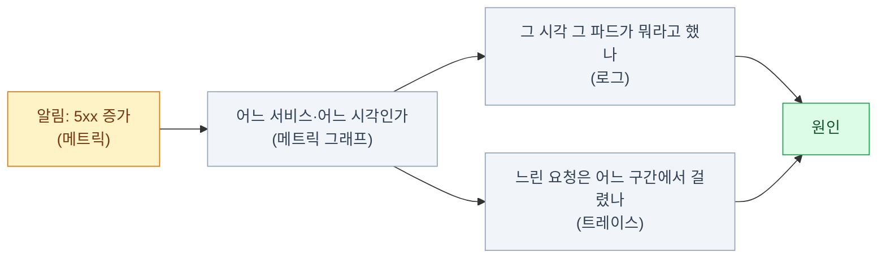
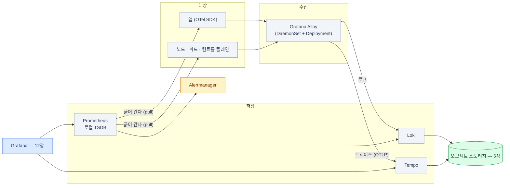

import { Card, CardGrid, LinkCard } from '@astrojs/starlight/components';
import TermIntro from '../../../components/TermIntro.astro';

> 관측 스택의 목적은 대시보드가 아니다 — **"지금 뭐가 문제냐"에서 원인까지 가는 시간을 줄이는 것**이다

<TermIntro
  terms={[
    ['관측 가능성', 'Observability', '시스템 밖에서 나오는 신호만 보고 **안에서 무슨 일이 벌어지는지 알아낼 수 있는 성질**. "모니터링"이 정해 둔 것을 지켜보는 일이라면, 이쪽은 **묻지 않았던 질문에도 답할 수 있는가**를 본다.'],
    ['메트릭 · 로그 · 트레이스', 'Metrics · Logs · Traces', '관측의 세 신호. 각각 **얼마나 · 무슨 일이 · 어디서 느렸나**에 답한다.'],
    ['카디널리티', 'Cardinality', '라벨 조합의 가짓수. **관측 스택을 죽이는 1번 원인**이다 — 사용자 ID처럼 값이 무한한 것을 라벨에 넣으면 시계열이 폭발한다.'],
    ['Grafana Alloy', '', 'Grafana Labs의 OpenTelemetry 컬렉터 배포판. 로그·메트릭·트레이스를 **한 에이전트로** 모은다. **Promtail은 2026-03에 EOL**이라 이쪽이 답이다.'],
    ['OTel', 'OpenTelemetry', '계측·수집의 벤더 중립 표준(CNCF). SDK · 프로토콜(OTLP) · 컬렉터로 이뤄진다. 지금은 트레이스뿐 아니라 로그·메트릭까지 여기로 모인다.'],
    ['exemplar', '표본 링크', '메트릭 한 점에 **대표 트레이스 ID를 매달아 두는 것**. 그래프에서 튄 지점을 클릭해 그 순간의 트레이스로 바로 갈 수 있다.'],
  ]}
/>

## 문제 — `kubectl logs`로는 안 된다

클러스터에 서비스가 몇 개만 넘어가도 이런 일이 벌어진다.

| 상황 | `kubectl` 만으로 |
|---|---|
| "어제 새벽에 느렸다는데요" | 파드가 재시작됐으면 **로그가 없다** |
| "어느 서비스가 문제죠?" | 파드를 하나씩 열어 본다 |
| "언제부터 이랬죠?" | 알 수 없다 — 지난 값이 없다 |
| "이 API가 왜 3초씩 걸리죠?" | 어느 구간에서 걸리는지 안 보인다 |
| "디스크 언제 찹니까" | 지금 값만 보인다. 추세가 없다 |

공통점은 **지금·여기밖에 못 본다**는 것이다. 관측 스택은 그 셋을 각각 채운다 —
**과거를 남기고, 전체를 모으고, 구간을 가른다.**

## 세 신호 — 무엇에 답하나

| 신호 | 답하는 질문 | 형태 | 비용 | 이 덱 |
|---|---|---|---|---|
| **메트릭** | 얼마나? 언제부터? 추세는? | 시간 × 숫자 | 싸다 (집계된 값) | [9장](/onprem/09-prometheus/) |
| **로그** | 정확히 무슨 일이 있었나? | 시각 + 텍스트 | 중간 (양이 많다) | [10장](/onprem/10-loki/) |
| **트레이스** | 한 요청이 **어디서** 느렸나? | 요청 하나의 구간 트리 | 비싸다 (샘플링한다) | [11장](/onprem/11-tempo/) |

:::tip[핵심 — 셋이 이어져야 값을 한다]
셋을 따로 두면 "메트릭에서 시각을 확인하고 → 로그 화면으로 가서 시각을 다시 입력하고 →
파드 이름을 찾아 넣는" 수동 이동이 매번 생긴다. **이어 붙이는 장치**가 셋 있다 —
로그에 실린 `trace_id`, 메트릭에 매달린 **exemplar**, 트레이스에서 로그로 가는 링크.
[12장](/onprem/12-grafana/)에서 이 셋을 실제로 연결한다.
:::

## 스택 전체 그림

이 덱이 쓰는 조합이다. **Grafana Labs 스택으로 통일한 이유는 저장소가 하나로 모이기 때문**이다 —
Loki도 Tempo도 오브젝트 스토리지에 쓴다. 온프렘에서 저장소를 한 종류로 줄이는 건 큰 이득이다.

| 자리 | 무엇 | 왜 그것 |
|---|---|---|
| 수집 | **Grafana Alloy** | 로그·트레이스·메트릭을 한 에이전트로. **Promtail은 2026-03 EOL** |
| 메트릭 | **Prometheus** | pull 모델과 쿠버네티스 생태계의 사실상 표준. 3.13이 LTS |
| 로그 | **Loki** | 인덱스가 라벨뿐이라 가볍고, **chunk를 S3에** 둔다 |
| 트레이스 | **Tempo** | 마찬가지로 **블록을 S3에**. 트레이스 ID 조회에 인덱스가 필요 없다 |
| 조회 | **Grafana** | 셋을 한 창에서 오가게 하는 것이 핵심 가치 |
| 알림 | **Alertmanager** | 라우팅·중복 제거·억제·침묵 |

### 수집기를 하나로 통일한다

에이전트가 신호마다 따로면 DaemonSet이 세 개가 되고, 설정도 업그레이드도 세 배가 된다.

| 후보 | 성격 | 고를 때 |
|---|---|---|
| **Grafana Alloy** | OTel 컬렉터 기반 + Grafana 스택 통합이 매끄럽다 | LGTM 스택을 쓴다면 기본값 |
| **OpenTelemetry Collector** | 벤더 중립 원본 | 나중에 백엔드를 갈아탈 여지를 크게 두고 싶을 때 |
| ~~Promtail~~ | 로그 전용 | **2026-03-02 EOL. 새로 쓰지 않는다** |

:::caution[함정]
검색으로 나오는 Loki 설치 가이드는 **대부분 아직 Promtail 기준**이다.
그대로 따라 하면 EOL된 에이전트를 새로 배포하게 된다.
Loki 문서의 Alloy 마이그레이션 도구가 Promtail 설정을 자동 변환해 주니,
**기존 설정이 있으면 변환부터** 한다.
:::

## 온프렘의 제약 — 저장소가 유한하다

클라우드 관측 서비스는 "쓴 만큼 낸다"였다. 온프렘은 **디스크가 물리적으로 유한하고,
차면 관측 스택이 먼저 죽는다.** 그래서 시작할 때 네 값을 정해야 한다.

| 값 | 어림 기준 | 정하지 않으면 |
|---|---|---|
| 메트릭 리텐션 | 로컬 15~30일. 더 필요하면 장기 저장 검토 | Prometheus PVC가 찬다 |
| 로그 보존 | 30~90일 (규정이 있으면 그쪽) | 버킷이 차서 **쓰기가 멈춘다** |
| 트레이스 보존 + 샘플링 | 7~30일, 샘플링 1~10% | 가장 빨리 용량을 먹는다 |
| 스크랩 간격 | 15~30초 | 짧을수록 시계열 수와 디스크가 비례해 는다 |

:::caution[함정 — 카디널리티]
**관측 스택을 죽이는 1번 원인은 데이터 양이 아니라 라벨 조합의 가짓수다.**
`user_id`·`request_id`·`pod_ip` 같은 값을 라벨에 넣으면 시계열이 수십만 개가 되고,
Prometheus는 메모리로, Loki는 인덱스로 무너진다.

원칙 하나만 기억하면 된다 — **라벨은 "값의 종류가 유한하고 미리 셀 수 있는 것"만.**
나머지는 로그 본문이나 트레이스 속성에 넣는다. 이 이야기는 9·10·11장에서 각각 다시 나온다.
:::

## 배치 원칙 — 감시자는 대상과 운명을 공유하면 안 된다

<CardGrid>
<Card title="① 관측 스택은 인프라 노드에" icon="approve-check">
앱이 노드를 잡아먹을 때 Loki가 같이 죽으면 원인을 못 본다.
[2장](/onprem/02-foundation/)에서 나눈 infra 노드에 두고 리소스 요청을 명시한다.
</Card>
<Card title="② 저장소는 클러스터 밖에" icon="approve-check">
클러스터가 죽어도 로그는 남아 있어야 한다.
오브젝트 스토리지를 밖에 두는 [6장](/onprem/06-minio/)의 이유가 여기서 다시 나온다.
</Card>
<Card title="③ 알림 경로는 스택 밖으로" icon="warning">
Alertmanager가 죽으면 **"알림이 안 온다"는 사실 자체를 모른다.**
정상일 때 주기적으로 울리는 신호(dead man's switch)를 만들고,
그게 멈추면 외부 채널이 알아채게 한다 ([9장](/onprem/09-prometheus/)).
</Card>
<Card title="④ 관측 스택도 감시 대상이다" icon="warning">
Prometheus 자신의 TSDB 용량, Loki의 인입 실패, Tempo의 S3 오류 —
이것들에 알림이 없으면 조용히 데이터가 비어 간다.
</Card>
</CardGrid>

## 무엇부터 만드나

한 번에 다 세우려 하면 대개 대시보드만 예쁘게 만들다 끝난다. 순서는 이렇다.

| 순서 | 무엇 | 이 단계에서 답할 수 있게 되는 질문 |
|---|---|---|
| 1 | **Prometheus + 노드·쿠버네티스 메트릭** | "노드·파드가 정상인가, 디스크는 언제 차나" |
| 2 | **Alertmanager + 알림 열 개** | "터졌을 때 사람이 알게 되는가" |
| 3 | **Loki + Alloy** | "그 시각에 무슨 일이 있었나" |
| 4 | **Grafana에서 둘을 연결** | "그래프에서 로그로 두 번의 클릭에 가는가" |
| 5 | **Tempo + 앱 계측** | "한 요청이 어디서 느렸나" |

:::tip[핵심]
**3번까지만 해도 운영의 8할이 된다.** 트레이스는 앱 코드에 계측을 넣어야 해서
진입 장벽이 다른 둘과 다르다 — 서비스가 서로 많이 부르기 시작할 때 도입해도 늦지 않다.
:::

## 8장 요약

- 관측의 목적은 대시보드가 아니라 **"뭐가 문제냐"에서 원인까지의 시간 단축**이다
- 세 신호는 각각 **얼마나(메트릭) · 무슨 일이(로그) · 어디서 느렸나(트레이스)** 에 답한다
- 이 스택으로 통일하는 이유는 **저장소가 오브젝트 스토리지 하나로 모이기** 때문이다
- 수집기는 **Grafana Alloy** 하나로. **Promtail은 EOL**이라 새로 쓰지 않는다
- 온프렘은 저장소가 유한하다 — **리텐션 · 보존 · 샘플링 · 스크랩 간격**을 처음에 정한다
- **카디널리티가 1번 사인**이다. 라벨은 값의 종류를 미리 셀 수 있는 것만
- 감시자는 대상과 **같은 노드·같은 저장소·같은 알림 경로**를 공유하지 않는다

<LinkCard
  title="9. 메트릭 — Prometheus와 알림"
  description="pull 모델, ServiceMonitor, 리텐션, 그리고 온프렘에서 반드시 걸어야 하는 알림 목록."
  href="/onprem/09-prometheus/"
/>
