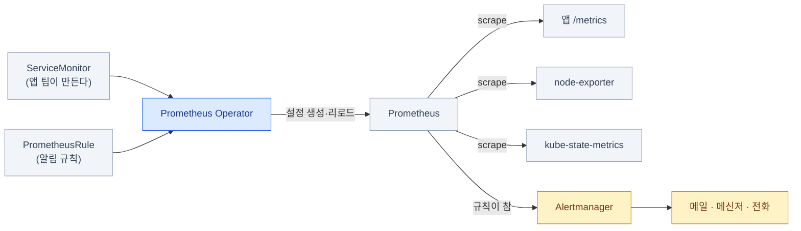

import { Tabs, TabItem, LinkCard } from '@astrojs/starlight/components';
import TermIntro from '../../../components/TermIntro.astro';

> 알림이 없는 메트릭은 **사고가 난 뒤에 보는 부검 자료**다 — 이 장의 절반이 알림인 이유다

<TermIntro
  terms={[
    ['pull 모델', '', 'Prometheus가 대상에 **직접 접속해 긁어 오는(scrape)** 방식. 대상이 보내 주는(push) 방식과 반대다. "긁으러 갔는데 없더라"로 **죽은 것도 알 수 있다**는 게 큰 차이다.'],
    ['exporter', '익스포터', 'Prometheus가 읽을 수 있는 형식으로 메트릭을 내주는 작은 프로그램. `node-exporter`(노드 상태), `kube-state-metrics`(쿠버네티스 오브젝트 상태)가 대표적이다.'],
    ['ServiceMonitor · PodMonitor', '', '"이 Service·Pod를 긁어라"를 선언하는 CRD. Prometheus 설정 파일을 직접 고치지 않고 **쿠버네티스 리소스로** 대상을 추가한다.'],
    ['PromQL', 'Prometheus Query Language', '메트릭 질의 언어. `rate()`(증가 속도) · `histogram_quantile()`(분위수) 두 함수만 익혀도 대부분을 쓴다.'],
    ['TSDB', 'Time Series Database', '시계열 저장소. Prometheus는 로컬 디스크에 자체 TSDB를 쓴다 — **PVC 크기가 곧 보존 기간**이다.'],
    ['Alertmanager', '', '알림의 라우팅·묶음·중복 제거·억제(inhibit)·침묵(silence)을 담당하는 별도 컴포넌트. Prometheus는 "규칙이 참이다"까지만 하고 나머지는 여기가 한다.'],
  ]}
/>

## 왜 pull인가

Prometheus는 대상이 보내 주기를 기다리지 않고 **직접 긁으러 간다.** 이 선택이
운영 감각을 꽤 바꾼다.

| | pull (Prometheus) | push |
|---|---|---|
| 대상이 죽으면 | **긁기 실패가 곧 신호**다 — `up == 0` | 안 오는 건지 죽은 건지 구분이 어렵다 |
| 대상 목록 | Prometheus가 안다 (서비스 디스커버리) | 대상이 주소를 알아야 한다 |
| 방화벽 | Prometheus → 대상 방향만 열면 된다 | 반대 |
| 배치 작업 | **곤란하다** — 짧게 살다 죽으면 못 긁는다 → Pushgateway | 자연스럽다 |

:::tip[핵심]
`up` 메트릭 하나가 "이 대상이 살아 있나"를 그대로 알려 준다.
**대부분의 온프렘 알림은 결국 `up == 0`과 디스크·인증서 만료 세 가지에서 시작한다.**
:::

## 무엇으로 설치하나

| 방식 | 성격 |
|---|---|
| **kube-prometheus-stack** (Helm) | Prometheus Operator + Prometheus + Alertmanager + Grafana + node-exporter + kube-state-metrics + 기본 대시보드·규칙 한 벌. **온프렘의 기본 출발점** |
| Prometheus Operator 단독 | 위 묶음이 과할 때 |
| 바이너리·단독 컨테이너 | 쿠버네티스 밖 대상을 긁을 때 |

kube-prometheus-stack을 쓰면 **긁을 대상을 CRD로 추가**하게 된다 — 설정 파일을 손대지 않는다.



<Tabs>
<TabItem label="긁을 대상 추가">

```yaml
apiVersion: monitoring.coreos.com/v1
kind: ServiceMonitor
metadata:
  name: my-app
  namespace: prod
  labels:
    release: kube-prometheus-stack     # Prometheus가 고르는 라벨 — 안 맞으면 조용히 무시된다
spec:
  selector:
    matchLabels:
      app: my-app                      # 이 라벨을 가진 Service를
  endpoints:
    - port: http-metrics               # 포트 "이름"이다. 번호가 아니다
      path: /metrics
      interval: 30s
```

</TabItem>
<TabItem label="알림 규칙">

```yaml
apiVersion: monitoring.coreos.com/v1
kind: PrometheusRule
metadata:
  name: platform-basics
  namespace: observability
  labels:
    release: kube-prometheus-stack
spec:
  groups:
    - name: platform
      rules:
        - alert: TargetDown
          expr: up == 0
          for: 10m                     # 10분 이상 지속돼야 발화 (깜빡임 무시)
          labels: { severity: critical }
          annotations:
            summary: "{{ $labels.job }} 대상이 10분째 응답 없음"
            runbook: "https://wiki.example.internal/runbooks/target-down"

        - alert: NodeDiskFillingUp
          expr: |
            predict_linear(node_filesystem_avail_bytes{fstype!~"tmpfs|overlay"}[6h], 24*3600) < 0
          for: 30m
          labels: { severity: warning }
          annotations:
            summary: "{{ $labels.instance }}:{{ $labels.mountpoint }} 24시간 내 디스크 소진 예상"
```

`predict_linear`가 온프렘에서 특히 유용하다 — **"찼다"가 아니라 "찰 것 같다"** 를
알려 주니 노드 증설 리드타임을 벌 수 있다.

</TabItem>
</Tabs>

:::caution[함정 — ServiceMonitor를 만들었는데 안 긁는다]
가장 흔한 원인 셋이다.
1. **`release` 라벨이 안 맞다.** Prometheus 리소스의 `serviceMonitorSelector`가 고르는 라벨과 같아야 한다
2. **`port`에 번호를 썼다.** Service의 포트 **이름**이어야 한다
3. **네임스페이스가 감시 대상이 아니다.** `serviceMonitorNamespaceSelector` 확인

확인은 Prometheus UI의 `Status → Targets` 또는:

```bash
kubectl -n observability port-forward svc/kube-prometheus-stack-prometheus 9090:9090
# → http://localhost:9090/targets 에서 대상이 목록에 있는지, 있는데 왜 실패인지
```
:::

## Prometheus 3.x에서 달라진 것

**3.13이 LTS**다 (2026-07). 2.x 설정은 대체로 그대로 통하지만, 새로 얻은 게 있다.

| 항목 | 내용 | 온프렘에서 |
|---|---|---|
| **OTLP 수신** | OpenTelemetry 프로토콜로 들어오는 메트릭을 직접 받는다 | 앱이 OTel로 계측돼 있으면 exporter 없이 바로 ([11장](/onprem/11-tempo/)) |
| **UTF-8 라벨** | 라벨 이름·값에 UTF-8 허용 | OTel 속성 이름을 그대로 쓸 수 있다 |
| 새 UI | 쿼리·타겟 화면 개편 | |
| remote write 2.0 | 장기 저장소로 보낼 때 효율 개선 | 장기 저장을 붙일 때 |

## 리텐션 — 언제 장기 저장이 필요한가

Prometheus는 **로컬 디스크에만** 저장한다. 그래서 보존 기간은 PVC 크기와 직결된다.

```yaml
spec:
  retention: 30d
  retentionSize: 180GB          # 둘 중 먼저 닿는 쪽으로 지운다 — 둘 다 주는 게 안전하다
  storage:
    volumeClaimTemplate:
      spec:
        storageClassName: standard
        resources: { requests: { storage: 200Gi } }
```

| 필요 | 답 |
|---|---|
| 15~30일이면 충분 | **로컬 TSDB 그대로.** 대부분 여기서 끝난다 |
| 몇 달~몇 년 보존 | **Thanos** 또는 **Mimir** — 압축된 블록을 오브젝트 스토리지에 ([6장](/onprem/06-minio/)) |
| 클러스터 여러 개를 한 화면에 | 마찬가지로 Thanos/Mimir. 또는 Grafana에서 데이터소스를 여러 개 |
| HA (Prometheus 자체 이중화) | 같은 설정으로 **2벌을 돌리고** Alertmanager가 중복을 제거하게 한다 |

:::tip[핵심]
**장기 저장은 필요해지기 전에 넣지 않는다.** Thanos·Mimir는 그 자체로 운영 대상이 하나 더
느는 일이다. "3개월 전 값이 필요한 상황"이 실제로 몇 번 생겼는지 세어 보고 결정한다.
:::

## 알림 설계 — 이 장의 핵심

**규칙 200개짜리 대시보드보다 잘 고른 알림 20개가 낫다.** 원칙 넷.

| 원칙 | 뜻 |
|---|---|
| **사람이 행동할 수 있는 것만** | 받고도 할 일이 없는 알림은 다음부터 무시된다 |
| **증상으로 건다** | "노드 CPU 90%"보다 "요청 실패율 증가"가 낫다. 원인은 조사로 찾는다 |
| **`for`를 넉넉히** | 깜빡임은 사람을 깨울 이유가 없다 |
| **runbook 링크를 단다** | 새벽 3시에 처음 보는 알림에서 제일 필요한 건 "그래서 뭘 하지"다 |

### 온프렘에서 반드시 있어야 하는 알림

클라우드가 콘솔에서 알려 주던 것들이다. **없으면 아무도 안 알려 준다.**

| 알림 | 대략의 조건 | 왜 |
|---|---|---|
| 대상 다운 | `up == 0` (10m) | 가장 기본 |
| 노드 NotReady | `kube_node_status_condition{condition="Ready",status="true"} == 0` | |
| **디스크 소진 예측** | `predict_linear(...[6h], 24h) < 0` | 온프렘은 증설에 시간이 걸린다 |
| PVC 사용률 | `kubelet_volume_stats_available_bytes / ..._capacity_bytes < 0.1` | Prometheus·Loki 자신이 여기 걸린다 |
| **인증서 만료 임박** | `certmanager_certificate_expiration_timestamp_seconds - time() < 14*86400` | [4장](/onprem/04-tls-dns/). 조용히 만료돼 전면 장애가 된다 |
| etcd 이상 | `etcd_server_has_leader == 0`, fsync 지연 | 클러스터 전체가 느려지는 원인 |
| **CNPG 백업 실패 · 복제 지연** | 백업 나이, `pg_stat_replication` 지연 | [7장](/onprem/07-cnpg/). WAL이 쌓이면 DB가 멈춘다 |
| 오브젝트 스토리지 용량 | 스토리지 exporter 기준 | 차면 **로그와 백업이 동시에** 멈춘다 |
| 파드 재시작 반복 | `rate(kube_pod_container_status_restarts_total[15m]) > 0` | |
| **관측 스택 자체** | Prometheus TSDB 용량, Loki 인입 실패 | 감시자가 조용히 죽는다 |
| **Watchdog** | 항상 참인 규칙 | 아래 |

:::caution[함정 — 알림이 안 오는 것을 어떻게 아나]
Alertmanager가 죽거나 메일 서버가 막히면 **알림이 안 오는데, 그 사실 자체를 아무도 모른다.**
그래서 **항상 발화하는 알림 하나(Watchdog)** 를 만들고, 그게 **외부 시스템에 주기적으로
도착하는지**를 그쪽에서 감시한다. kube-prometheus-stack에는 `Watchdog` 규칙이 이미 들어 있으니,
그걸 외부 채널로 라우팅해 두면 된다.
:::

### Alertmanager 라우팅

```yaml
route:
  receiver: default
  group_by: [alertname, namespace]
  group_wait: 30s          # 첫 알림 전 대기 — 관련된 것들이 같이 오게
  group_interval: 5m
  repeat_interval: 4h
  routes:
    - matchers: [ severity="critical" ]
      receiver: oncall-phone
    - matchers: [ alertname="Watchdog" ]
      receiver: external-heartbeat      # 죽은 스위치 감시용
      repeat_interval: 5m

inhibit_rules:
  # 노드가 통째로 죽었으면 그 위 파드 알림은 묻는다
  - source_matchers: [ alertname="NodeDown" ]
    target_matchers: [ severity="warning" ]
    equal: [ node ]
```

`inhibit_rules`가 실전에서 특히 중요하다 — **노드 하나가 죽었을 때 알림 40개가 오면
아무도 안 읽는다.**

## 카디널리티 관리

```text
# 시계열이 많은 메트릭 상위 (Prometheus UI에서 실행)
topk(10, count by (__name__)({__name__=~".+"}))

# 특정 메트릭의 라벨별 가짓수
count(count by (pod) (container_cpu_usage_seconds_total))
```

| 하면 안 되는 라벨 | 대신 |
|---|---|
| `user_id` · `request_id` · `trace_id` | 로그·트레이스에 넣는다 ([10장](/onprem/10-loki/) · [11장](/onprem/11-tempo/)) |
| `pod_ip` · 파드 이름(단명 파드) | `deployment`·`service` 단위로 |
| URL 전체 (`/orders/12345`) | 경로 템플릿 (`/orders/:id`) |

```yaml
# 이미 들어오는 라벨은 relabel로 잘라 낸다
metricRelabelings:
  - action: labeldrop
    regex: "id|uuid|request_id"
```

## 점검

```bash
# ① 대상이 다 잡혔나
kubectl -n observability port-forward svc/kube-prometheus-stack-prometheus 9090:9090
#   http://localhost:9090/targets   — DOWN인 대상의 Error 열을 본다

# ② 규칙이 로드됐나 (PrometheusRule 라벨이 틀리면 조용히 무시된다)
#   http://localhost:9090/rules

# ③ Alertmanager까지 실제로 가나 — 테스트 알림을 직접 쏴 본다
kubectl -n observability port-forward svc/kube-prometheus-stack-alertmanager 9093:9093
curl -XPOST http://localhost:9093/api/v2/alerts -H 'Content-Type: application/json' -d '[{
  "labels": {"alertname":"SmokeTest","severity":"critical"},
  "annotations": {"summary":"알림 경로 점검"}
}]'
#   → 실제 채널(메신저·메일)에 도착하는지 확인

# ④ TSDB 용량
#   http://localhost:9090/tsdb-status  — 시계열 수와 라벨 카디널리티 상위
```

## 9장 요약

- **pull 모델**이라 `up == 0` 하나로 "죽었다"를 안다 — 온프렘 알림의 출발점
- **kube-prometheus-stack**으로 시작하고, 대상은 **ServiceMonitor**로 추가한다.
  안 긁히면 `release` 라벨 · 포트 **이름** · 네임스페이스 셀렉터 셋을 본다
- Prometheus **3.13 LTS** — OTLP 수신과 UTF-8 라벨이 새로 생겼다
- 보존은 **로컬 TSDB로 15~30일**이 기본. 장기 저장(Thanos·Mimir)은 필요해진 뒤에
- 알림은 **행동 가능한 것만, 증상으로, `for`를 넉넉히, runbook과 함께**.
  온프렘 필수 목록에는 **디스크 소진 예측 · 인증서 만료 · CNPG 백업 실패**가 들어간다
- **Watchdog을 외부로 라우팅**한다 — 알림이 안 오는 것을 알아채는 유일한 방법이다
- 카디널리티가 스택을 죽인다. 라벨은 **미리 셀 수 있는 것만**

<LinkCard
  title="10. 로그 — Loki"
  description="인덱스가 라벨뿐인 로그 저장소. 라벨 설계가 전부인 이유와 Alloy로 수집하는 법."
  href="/onprem/10-loki/"
/>
