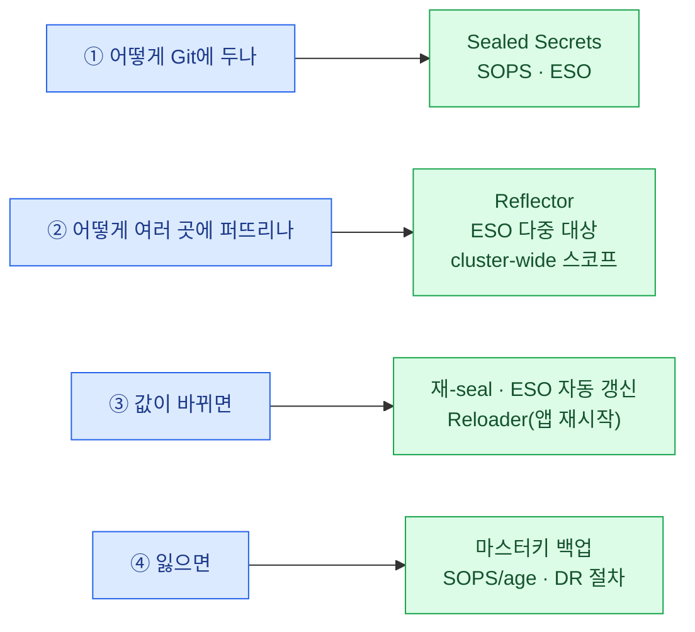
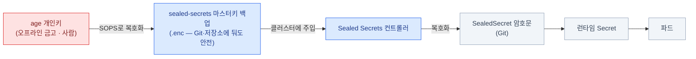

import { Tabs, TabItem, LinkCard, Steps } from '@astrojs/starlight/components';
import TermIntro from '../../../components/docs/TermIntro.astro';

> 시크릿이 복잡하게 느껴지는 건 **성질이 다른 네 문제가 한 단어에 묶여 있기** 때문이다

<TermIntro
  terms={[
    ['Secret', '', '쿠버네티스의 비밀 저장 오브젝트. **암호화가 아니라 base64 인코딩**일 뿐이다 — 읽을 권한만 있으면 누구나 원문을 본다.'],
    ['SealedSecret', '', '클러스터의 공개키로 암호화한 봉투. **Git에 올려도 안전**하고, 클러스터 안 컨트롤러만 개인키로 풀어 평범한 `Secret`을 만든다.'],
    ['sealing key', '마스터키', 'SealedSecret을 푸는 그 개인키. 클러스터 안에 있고, **이걸 잃으면 Git의 모든 암호문이 영원히 안 풀린다.**'],
    ['스코프', 'Scope', '암호문을 **어느 이름·어느 네임스페이스에서 풀 수 있는지**의 결합 범위. 기본은 이름+네임스페이스에 고정(strict)이라, 옮기면 복호화가 거부된다.'],
    ['SOPS · age', '', '파일 단위 암호화 도구와 그 키 형식. 이 덱에서는 **마스터키 백업 자체를 암호화**하는 "키를 지키는 키"로 쓴다.'],
    ['ESO', 'External Secrets Operator', '외부 금고(Vault 등)의 값을 읽어 쿠버네티스 `Secret`으로 만들어 주는 오퍼레이터. Git에는 **값이 아니라 참조**만 올라간다.'],
  ]}
/>

## 문제 — `Secret`은 암호화가 아니다

먼저 오해 하나를 걷어야 한다.

```bash
kubectl -n database get secret pg-backup-s3 -o jsonpath='{.data.SECRET_ACCESS_KEY}' | base64 -d
# → 그냥 원문이 나온다. 암호가 아니라 인코딩이다
```

읽을 권한이 있으면 누구나 본다. 그래서 세 가지가 동시에 문제가 된다.

| 문제 | 왜 |
|---|---|
| **Git에 못 올린다** | GitOps는 Git이 단일 소스인데([9장](/onprem/09-gitops/)), 평문 YAML을 올리면 저장소를 읽는 모두가 본다 |
| **etcd에 평문으로 남는다** | 저장 시 암호화를 안 켰다면 etcd 스냅샷에 원문이 들어 있다 ([11장](/onprem/11-backup/)) |
| **누가 읽을 수 있는지 모른다** | 네임스페이스 안에서 Secret 읽기 권한은 생각보다 넓게 퍼져 있다 |

:::tip[온프렘이라 더 복잡한 이유]
클라우드에서는 이 문제 대부분이 **관리형으로 사라진다** — Secrets Manager에 값을 넣고,
앱은 IAM 역할(IRSA)로 **자격증명 없이** 그것을 읽는다. "키를 어떻게 전달하나"라는 질문 자체가 없다.

온프렘에는 그 두 조각(금고, 그리고 신원 기반 접근)이 다 없다. 그래서
**값을 어디 둘지, 어떻게 클러스터에 넣을지, 누가 풀 수 있게 할지, 잃으면 어떻게 할지**를
전부 직접 설계해야 한다. 복잡한 게 정상이다.
:::

## 네 개의 다른 문제 — 여기서부터 갈라서 본다

"시크릿 관리"라는 말에 성질이 다른 네 문제가 섞여 있다. **이걸 안 가르면 도구 이름만 늘어난다.**



| 문제 | 헷갈리는 지점 |
|---|---|
| ① 저장 | Sealed Secrets와 SOPS는 **경쟁이 아니라 층이 다르다** — 하나는 런타임 워크플로, 하나는 파일·백업 암호화 |
| ② 배포 | **Secret은 네임스페이스를 못 넘는다.** 와일드카드 TLS·이미지 pull 시크릿이 전부 여기 걸린다 |
| ③ 갱신 | 값을 바꿔도 **이미 뜬 파드는 모른다**. 자동 반영은 별도 장치가 필요하다 |
| ④ 복구 | 이게 제일 무섭다 — **키 하나로 전부가 잠긴다** |

## ① Git에 두는 법 — 세 방식

| 방식 | Git에 올라가는 것 | 누가 푸나 | 장점 | 대가 |
|---|---|---|---|---|
| **Sealed Secrets** | 암호문 | 클러스터 안 컨트롤러가 자동 | 추가 인프라 없음. 시작이 가장 쉽다 | **마스터키를 잃으면 전부 못 푼다.** 값 조회·수정이 불편 |
| **ESO + 외부 금고** | **참조만** | 오퍼레이터가 금고에서 읽어 온다 | 회전·감사·만료가 금고에서 관리된다 | Vault 같은 걸 하나 더 운영해야 |
| **SOPS + age** | 암호문(파일) | 배포 시 사람·CI가 복호화 | 파일 단위로 유연. Git 밖에서도 쓴다 | 복호화 키 배포를 사람이 관리 |

:::tip[핵심 — 고르는 순서]
**Sealed Secrets로 시작한다.** 클러스터 안에 컨트롤러 하나면 끝이고, GitOps와 바로 맞물린다.

**비밀 회전이 업무가 되면 ESO로 간다** — "90일마다 DB 비밀번호를 바꿔야 한다",
"누가 언제 이 값을 봤는지 감사가 필요하다"가 나오는 순간이 그 시점이다.

**SOPS/age는 둘 중 무엇을 쓰든 같이 쓴다** — 아래 "신뢰의 사슬"에서 **마스터키 백업을
암호화하는 용도**로 필요하기 때문이다. 경쟁 도구로 놓고 고르는 물건이 아니다.
:::

### Sealed Secrets 실무 — 실제로 데는 곳

<Tabs>
<TabItem label="봉인해서 올리기">

```bash
# 평문 Secret을 "적용하지 말고" 매니페스트로만 만들어 바로 kubeseal에 넘긴다
kubectl create secret generic loki-s3 \
  --namespace observability \
  --from-literal=AWS_ACCESS_KEY_ID=loki-user \
  --from-file=AWS_SECRET_ACCESS_KEY=/dev/stdin \
  --dry-run=client -o yaml \
| kubeseal --controller-namespace sealed-secrets --format yaml \
  > platform/observability/loki/sealedsecret-s3.yaml

git add platform/observability/loki/sealedsecret-s3.yaml   # 암호문이라 안전하다
```

`--from-file=...=/dev/stdin`으로 값을 파이프로 넣는 이유는 아래 "평문이 새는 곳" 절에 있다 —
`--from-literal`에 비밀번호를 그대로 쓰면 **셸 히스토리에 남는다.**

</TabItem>
<TabItem label="값 하나만 바꾸기">

암호문은 **직접 편집할 수 없고**, 로컬에는 개인키가 없어 **기존 값을 열어 볼 수도 없다.**
그래서 바꿀 키만 다시 봉인해 갈아끼운다.

```bash
# (A) --merge-into — 기존 파일에 그 키만 병합. 다른 키는 그대로 유지된다 (가장 흔함)
kubectl create secret generic loki-s3 --namespace observability \
  --from-file=AWS_SECRET_ACCESS_KEY=/dev/stdin --dry-run=client -o yaml \
| kubeseal --merge-into platform/observability/loki/sealedsecret-s3.yaml

# (B) --raw — 값 하나만 암호화해서 encryptedData에 손으로 붙인다
printf '%s' "$NEW" | kubeseal --raw --name loki-s3 --namespace observability
```

**이름과 네임스페이스를 기존과 똑같이** 줘야 한다(아래 스코프). 그리고 결과는
**커밋해야 반영된다** — 파일이 곧 소스다.

</TabItem>
<TabItem label="CI에서 봉인">

개발자마다 `kubeseal`과 클러스터 접근을 갖게 하고 싶지 않다면, 봉인을 파이프라인으로 옮긴다.

```bash
# CI: 금고·환경변수에서 값을 받아 봉인한 결과만 커밋한다
kubeseal --cert sealed-secrets-public.pem --format yaml \
  --name "$NAME" --namespace "$NS" < secret.yaml > "sealedsecret-$NAME.yaml"
```

`--cert`로 **공개키 파일만** 주면 클러스터 접근 없이도 봉인된다.
공개키는 이름 그대로 공개해도 안전하니 저장소에 두면 된다.

</TabItem>
</Tabs>

:::caution[함정 1 — 스코프: 이름·네임스페이스를 바꾸면 안 풀린다]
SealedSecret은 기본적으로 **이름 + 네임스페이스에 고정**된다(strict). 탈취한 암호문을
다른 곳으로 옮겨 푸는 것을 막는 장치인데, 정작 제일 많이 데는 곳이 여기다 —
네임스페이스를 바꾸거나 리소스 이름을 정리하면 **`no key could decrypt secret`** 이 뜬다.

| 스코프 | 무엇에 고정 | 바꿔도 되는 것 | annotation |
|---|---|---|---|
| **strict** (기본) | 이름 + 네임스페이스 | 없음 — 가장 안전 | (없음) |
| **namespace-wide** | 네임스페이스만 | 같은 NS 안에서 **이름 변경 가능** | `sealedsecrets.bitnami.com/namespace-wide: "true"` |
| **cluster-wide** | (없음) | **어디로든** 옮길 수 있다 | `sealedsecrets.bitnami.com/cluster-wide: "true"` |

이름·NS를 바꿔야 하면 **그 위치로 다시 봉인**하는 게 정석이다.
`cluster-wide`는 편하지만 "어느 네임스페이스에서든 풀린다"는 뜻이라, 꼭 필요한 값에만 쓴다.
:::

:::caution[함정 2 — 마스터키를 백업하지 않으면 끝이다]
컨트롤러의 개인키가 사라지면 **Git에 있는 모든 암호문이 영원히 안 풀린다.**
클러스터를 다시 세울 때 DB 비밀번호부터 S3 키까지 **전부 새로 발급**해야 한다.

그리고 **키는 주기적으로 갱신된다**(기본적으로 새 키가 추가되고 옛 키는 복호화용으로 남는다).
즉 **백업은 한 번 뜨고 끝이 아니다** — 갱신 때마다 다시 떠야 한다.

```bash
kubectl -n sealed-secrets get secret \
  -l sealedsecrets.bitnami.com/sealed-secrets-key -o yaml > sealed-secrets-master.key
```
:::

### 신뢰의 사슬 — 무엇이 무엇을 푸나

위 백업 파일에는 **개인키가 평문으로** 들어 있다. 그대로 두면 그 파일 자체가 최대 위험이다.
그래서 한 겹을 더 씌운다 — **키를 지키는 키**.



```bash
# 1) age 키 한 벌 (공개키는 공유, 개인키는 오프라인 금고로)
age-keygen -o age.key          # 안에 AGE-SECRET-KEY-... 가 들어 있다

# 2) 마스터키 백업을 age로 암호화 → 이제 저장소에 둬도 된다
sops --encrypt --age age1ql3z...ac8r sealed-secrets-master.key > sealed-secrets-master.key.enc

# 3) 복구할 때
SOPS_AGE_KEY_FILE=age.key sops --decrypt sealed-secrets-master.key.enc > master.key
```

:::tip[핵심]
사슬의 **맨 왼쪽 끝(age 개인키)은 반드시 클러스터 밖·오프라인**에 있어야 한다.
그것만 있으면 전부 되살아나고, 그것이 없으면 나머지 백업이 다 있어도 아무 소용이 없다.
[11장](/onprem/11-backup/)의 백업 목록에서 이 키가 1순위인 이유다.
:::

## ② 네임스페이스 경계 — Secret은 NS를 못 넘는다

의외로 자주 부딪히는 벽이다. **파드는 같은 네임스페이스의 Secret만 참조할 수 있다.**
그런데 여러 곳에서 같은 값을 써야 하는 경우가 계속 생긴다.

| 여러 NS가 필요한 값 | 어디서 나왔나 |
|---|---|
| 와일드카드 TLS 인증서 | [4장](/onprem/04-tls-dns/) — 앱마다 Gateway를 쓰면 각자 NS에 필요 |
| 사내 레지스트리 pull 시크릿 | [9장](/onprem/09-gitops/) — **모든** 네임스페이스에 필요 |
| 오브젝트 스토리지 접근 키 | [6장](/onprem/06-minio/) — Loki · Tempo · Velero · CNPG가 각각 다른 NS |
| 사내 CA 번들 | [4장](/onprem/04-tls-dns/) |

선택지는 셋이다.

| 방법 | 어떻게 | 언제 |
|---|---|---|
| **네임스페이스마다 따로 봉인** | 같은 값을 NS 수만큼 봉인해 Git에 | NS가 두세 개고 잘 안 바뀔 때. 가장 단순하고 명시적 |
| **Reflector** | 원본에 annotation을 달면 지정한 NS로 **자동 복제·동기화** | NS가 많거나 값이 자주 바뀔 때 |
| **cluster-wide 스코프** | 암호문 하나를 어느 NS에든 배치 | 편하지만 **어디서든 풀린다** — 남용 금지 |

```yaml
# Reflector — 원본이 "퍼져라"라고 지정하는 방식
apiVersion: v1
kind: Secret
metadata:
  name: wildcard-tls
  namespace: gateway-system
  annotations:
    reflector.v1.k8s.emberstack.com/reflection-allowed: "true"
    reflector.v1.k8s.emberstack.com/reflection-allowed-namespaces: "team-.*"
    reflector.v1.k8s.emberstack.com/reflection-auto-enabled: "true"
    reflector.v1.k8s.emberstack.com/reflection-auto-namespaces: "team-.*"
```

:::caution[함정 — 복제본은 Git에 없다]
Reflector가 만든 사본은 **Argo CD가 모르는 리소스**다. 그래서
① `prune`이 켜져 있으면 "Git에 없는 것"으로 지워질 수 있고(제외 설정이 필요),
② 원본만 복구하면 사본은 **자동으로 다시 생기므로** 복구 절차에서 사본을 따로 챙길 필요는 없다.
어느 쪽이든 **"이 Secret은 어디서 왔나"를 팀이 알 수 있게** 해 두는 게 중요하다.
:::

## ③ 값이 바뀌면 — 회전과 반영

<Steps>

1. **값을 바꾼다** — 원천에서 먼저. S3 키라면 스토리지에서 새 키를 발급하고,
   DB 비밀번호라면 DB에서 바꾼다.

2. **다시 봉인해 커밋한다**(`--merge-into`) 또는 **금고에 새 값을 넣는다**(ESO면 이걸로 끝).

3. **파드가 새 값을 읽게 한다.** 여기가 빠지기 쉬운 단계다 —
   환경변수로 주입한 Secret은 **파드를 재시작해야 바뀐다.**
   (볼륨 마운트는 시간이 지나면 갱신되지만, 앱이 파일을 다시 읽어야 한다.)

   ```yaml
   # Reloader — Secret이 바뀌면 그 워크로드를 자동 롤링 재시작
   metadata:
     annotations:
       reloader.stakater.com/auto: "true"
   ```

4. **옛 값을 폐기한다.** 새 키가 도는 것을 확인한 뒤에 —
   순서를 바꾸면 그 사이에 인증 실패가 난다.

</Steps>

:::caution[함정 — 평문이 새는 곳]
값 자체는 잘 암호화해 놓고 **주변으로 새는** 경우가 많다.

| 새는 곳 | 대응 |
|---|---|
| **셸 히스토리** — `--from-literal=pw=실제값` | 파이프·파일로 넣는다(`--from-file=키=/dev/stdin`) |
| **`kubectl get secret -o yaml` 캡처를 채팅에 붙여넣기** | base64는 암호가 아니라는 것을 팀이 알게 |
| **etcd 스냅샷** | 저장 시 암호화(EncryptionConfiguration)를 켜고, 스냅샷 파일 접근을 Secret 수준으로 통제 ([11장](/onprem/11-backup/)) |
| **Argo CD UI의 매니페스트 화면** | Secret 표시를 끄고, UI 접근을 그룹으로 제한 ([5장](/onprem/05-identity/)) |
| **파드 로그 · 에러 메시지** | 앱이 연결 문자열을 통째로 로깅하지 않게 |
| **RBAC** — 네임스페이스에 `get secrets` 권한이 넓다 | 역할을 좁히고, 특히 **`kubectl auth can-i`로 실제 확인** |

```bash
kubectl auth can-i get secrets -n database --as=system:serviceaccount:default:default
```
:::

## ④ 잃었을 때 — 복구 순서

[11장](/onprem/11-backup/)의 클러스터 복구 절차 안에서 **시크릿은 아주 이른 단계**에 온다.
Argo CD가 동기화를 시작하기 전에 컨트롤러가 옛 키를 들고 있어야 하기 때문이다.

<Steps>

1. **age 개인키를 금고에서 꺼낸다.** 이게 없으면 여기서 끝이다

2. **SOPS로 마스터키 백업을 복호화**한다

3. **Sealed Secrets 컨트롤러를 설치**하고, 그 위에 **옛 키를 주입한 뒤 재기동**한다

   ```bash
   kubectl apply -f master.key
   kubectl -n sealed-secrets rollout restart deploy/sealed-secrets-controller
   ```

4. **Argo CD를 동기화**한다 → Git의 SealedSecret이 런타임 Secret으로 되살아난다

5. **Reflector 사본은 자동으로** 다시 생긴다. 확인만 한다

6. 그래도 안 풀리는 값이 있으면 **그 값은 새로 발급**하고, 원천(스토리지·DB·IdP)에도 반영한다

</Steps>

:::caution[하지 말 것]
급하다고 **평문 Secret을 손으로 `kubectl apply`** 해서 넘어가면, 그 값은 Git에 없어서
다음 복구 때 또 사라진다. 그리고 대개 그 사실을 아무도 기억하지 못한다.
급히 넣었으면 **같은 날 안에 봉인해 커밋**한다.
:::

## 점검

```bash
# ① 컨트롤러와 키 상태 (키가 여러 개면 갱신이 일어난 것 — 백업을 다시 떠야 한다)
kubectl -n sealed-secrets get pods
kubectl -n sealed-secrets get secret -l sealedsecrets.bitnami.com/sealed-secrets-key \
  -o custom-columns='NAME:.metadata.name,CREATED:.metadata.creationTimestamp'

# ② 봉인이 실제로 풀렸나 (SealedSecret → Secret이 생겼나)
kubectl -n observability get sealedsecret,secret loki-s3
kubectl -n sealed-secrets logs deploy/sealed-secrets-controller | tail -20
#   "no key could decrypt secret" → 스코프(이름·NS) 불일치 또는 키 유실

# ③ 백업이 최신인가 — 키 생성 시각과 백업 파일 시각을 비교한다
sops --decrypt sealed-secrets-master.key.enc | grep -c 'kind: Secret'

# ④ 복제가 됐나
kubectl get secret wildcard-tls -A

# ⑤ 누가 읽을 수 있나
kubectl auth can-i --list -n database --as=system:serviceaccount:apps:web | grep secret
```

| 증상 | 흔한 원인 | 확인 |
|---|---|---|
| `no key could decrypt secret` | **이름·네임스페이스가 봉인 때와 다르다** | 스코프 표. 해당 위치로 다시 봉인 |
| SealedSecret은 있는데 Secret이 안 생김 | 컨트롤러 미기동 · 네임스페이스 오타 | 컨트롤러 로그 |
| 값을 바꿨는데 앱이 옛 값을 씀 | **파드가 재시작 안 됨** | Reloader annotation, `rollout restart` |
| 다른 NS에서 Secret을 못 찾음 | NS 경계 | 따로 봉인 / Reflector / 스코프 |
| 복구 후 일부만 안 풀림 | 그 값이 **더 새 키로** 봉인됐다 | 백업 시점 확인 → 그 값만 재발급 |
| ESO가 값을 못 가져옴 | 금고 인증·경로·권한 | `kubectl describe externalsecret` |

## 10장 요약

- `Secret`은 **암호화가 아니라 base64**다. 클라우드에서 관리형이 대신하던 일이 통째로 남는다
- "시크릿 관리"에는 **네 개의 다른 문제**가 있다 — 저장 · 배포(NS) · 갱신 · 복구
- **Sealed Secrets로 시작하고, 회전이 업무가 되면 ESO로.** SOPS/age는 둘 중 무엇을 쓰든
  **마스터키를 지키는 용도로 같이** 쓴다
- 제일 잘 데는 곳은 **스코프**다 — 이름·네임스페이스를 바꾸면 복호화가 거부된다
- **Secret은 네임스페이스를 못 넘는다.** 따로 봉인 / Reflector / cluster-wide 중에 고른다
- 값을 바꾸면 **파드를 재시작해야 반영된다** (Reloader)
- 값보다 **주변으로 새는 것**을 조심한다 — 셸 히스토리 · etcd 스냅샷 · UI · RBAC
- 복구는 **age 개인키 → 마스터키 → 컨트롤러 → 동기화** 순. 맨 앞의 키는 오프라인 금고에

<LinkCard
  title="11. 백업과 복구"
  description="무엇을 잃을 수 있고 무엇부터 되살리나 — etcd, Velero, CNPG PITR, 그리고 복구 리허설."
  href="/onprem/11-backup/"
/>
