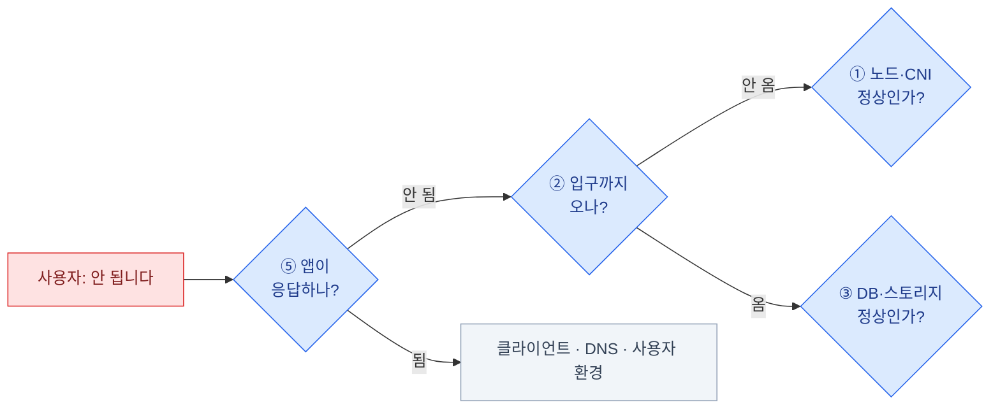

import { Tabs, TabItem, LinkCard, Steps } from '@astrojs/starlight/components';
import TermIntro from '../../../components/docs/TermIntro.astro';

> 온프렘 운영의 8할은 **디스크 · 인증서 · 버전** 셋이다 — 나머지가 화려할 뿐이다

<TermIntro
  terms={[
    ['버전 스큐', 'Version Skew', '컴포넌트 사이에 허용되는 **버전 차이의 범위**. 쿠버네티스는 kubelet이 API 서버보다 최대 3마이너 낮은 것까지 허용한다 — 이 범위를 벗어나면 동작을 보장하지 않는다.'],
    ['드레인', 'Drain', '노드에서 파드를 안전하게 비워 내는 것(`kubectl drain`). 업그레이드·점검 전에 한다.'],
    ['PDB', 'PodDisruptionBudget', '"이 앱은 동시에 몇 개까지만 내려도 된다"는 선언. 드레인이 이걸 존중하기 때문에 **PDB가 없으면 업그레이드가 서비스를 끊는다**.'],
    ['runbook', '실행 절차서', '특정 알림·증상이 왔을 때 **무엇을 순서대로 확인하고 조치하는지** 적은 문서. 알림에 링크로 달아 둔다([관측 덱 2장](/observability/02-prometheus/)).'],
    ['온콜', 'On-call', '장애 시 호출을 받는 당번. 도구보다 **누가 어떤 순서로 무엇을 보는지**가 정해져 있느냐가 품질을 가른다.'],
    ['용량 계획', 'Capacity Planning', '언제 무엇이 부족해질지 미리 계산하는 일. **온프렘에는 오토스케일이 없으므로** 이게 운영 업무의 한 항목이 된다.'],
  ]}
/>

## 운영 루틴 — 주기별로 고정한다

"문제 생기면 본다"로는 온프렘이 안 굴러간다. **주기를 고정해 두면 대부분의 사고가 예방된다.**

| 주기 | 하는 일 |
|---|---|
| **매일** | 알림 확인(밤새 온 것), 백업 잡 결과, Argo CD `OutOfSync` 목록 |
| **매주** | 디스크·PVC 사용률 추세, 인증서 만료 30일 이내 목록, 노드 상태, 재시작 반복 파드 |
| **매월** | 컴포넌트 버전과 최신 릴리스 대조(CVE 확인), 대시보드·알림 정리, 용량 추세 리뷰 |
| **분기** | **복구 리허설**([11장](/onprem/11-backup/)), 쿠버네티스·애드온 업그레이드, 접근 권한 감사, runbook 갱신 |
| **연 1회** | 사내 CA·클러스터 인증서 만료 점검, DR 시나리오 전면 훈련, 용량 증설 예산 |

```bash
# 매주 5분짜리 스크립트로 만들어 두면 좋은 것들
kubectl get nodes -o wide
kubectl get pods -A --field-selector=status.phase!=Running | grep -v Completed
kubectl get certificate -A | grep -v True
kubectl top nodes
kubectl get pvc -A -o custom-columns=\
'NS:.metadata.namespace,NAME:.metadata.name,SIZE:.status.capacity.storage,SC:.spec.storageClassName'
kubectl -n argocd get applications | grep -v 'Synced.*Healthy'
```

## 업그레이드 — 순서와 호환표

온프렘에서 업그레이드가 무서운 이유는 **컴포넌트가 서로 버전을 탄다**는 것이다.
쿠버네티스를 올렸더니 CNI가 안 뜨고, CNI를 올렸더니 게이트웨이가 안 뜨는 식.

### 먼저 호환표를 만든다

| 컴포넌트 | 현재 | 목표 | 대상 k8s 지원 | 출처 확인 |
|---|---|---|---|---|
| Kubernetes | | | — | |
| CNI (Calico/Cilium) | | | | |
| CSI 드라이버 | | | | |
| Gateway 구현체 | | | | |
| cert-manager | | | | |
| CloudNativePG | | | | |
| Prometheus Operator | | | | |
| Velero | | | | |

:::tip[핵심]
**이 표를 채우는 것이 업그레이드 작업의 절반이다.** 각 프로젝트의 릴리스 노트에
"지원 쿠버네티스 버전"이 적혀 있다. 하나라도 비어 있으면 올리지 않는다 —
올린 뒤에 알게 되면 되돌리기가 훨씬 비싸다.
:::

### 순서

<Steps>

1. **백업**. etcd 스냅샷 + CNPG 백업을 작업 직전에 한 번 더 ([11장](/onprem/11-backup/))

2. **스테이징 클러스터에서 먼저.** 없으면 최소한 **워커 노드 1대로** 먼저

3. **CNI·CSI가 목표 버전을 지원하는지 확인**하고, 필요하면 **먼저 올린다**

4. **컨트롤 플레인** — 한 대씩. 각 대 사이에 `kubectl get nodes`와 API 응답을 확인

5. **워커 노드** — `drain` → 업그레이드 → `uncordon`. **한 번에 한 대씩**

6. **애드온** — cert-manager · Gateway · 오퍼레이터들. CRD 변경이 있는지 릴리스 노트 확인

7. **검증** — 아래 스모크 테스트

</Steps>

```bash
# 노드 하나 처리 (kubeadm 기준)
kubectl drain node-3 --ignore-daemonsets --delete-emptydir-data --timeout=10m
#   → PDB 때문에 멈추면 그건 정상이다. 앱 팀과 조율하거나 replica를 늘린다
ssh node-3 'sudo kubeadm upgrade node && sudo apt-get install -y kubelet=<버전> && sudo systemctl restart kubelet'
kubectl uncordon node-3
kubectl get nodes    # VERSION 열 확인
```

:::caution[함정 — PDB가 없으면 드레인이 서비스를 끊는다]
`drain`은 PDB를 존중한다. **PDB가 없는 Deployment는 파드가 한꺼번에 내려간다** —
replica가 2여도 둘 다 같은 노드에 있었다면 순간 0이 된다.
플랫폼 컴포넌트와 중요한 앱에는 PDB와 anti-affinity를 같이 걸어 둔다.

```yaml
apiVersion: policy/v1
kind: PodDisruptionBudget
metadata: { name: api }
spec:
  minAvailable: 1
  selector: { matchLabels: { app: api } }
```
:::

### 업그레이드 후 스모크 테스트

```bash
# ① 노드·핵심 파드
kubectl get nodes
kubectl -n kube-system get pods | grep -v Running

# ② 입구 (3·4장)
kubectl get gateway,httproute -A
curl -sI https://grafana.example.internal/ | head -1

# ③ 상태 계층 (6·7장)
kubectl cnpg status platform-pg -n database
mc ls store/ >/dev/null && echo "S3 OK"

# ④ 관측 (8장 · 관측 덱)
kubectl -n observability get pods
#   Prometheus /targets 에서 DOWN 급증이 없는지

# ⑤ 배포 (9장)
kubectl -n argocd get applications | grep -v 'Synced.*Healthy'

# ⑥ 스토리지 실동작 (2장)
kubectl create -f - <<'EOF'
apiVersion: v1
kind: PersistentVolumeClaim
metadata: { name: smoke }
spec: { accessModes: [ReadWriteOnce], resources: { requests: { storage: 1Gi } } }
EOF
kubectl get pvc smoke && kubectl delete pvc smoke
```

## 용량 — 오토스케일이 없다는 것의 의미

클라우드는 노드가 모자라면 늘어났다. 온프렘은 **주문 → 입고 → 랙 → 설치**에 몇 주가 걸린다.
그래서 용량은 **알림이 아니라 계획**의 영역이다.

| 자원 | 어디서 보나 | 미리 정할 것 |
|---|---|---|
| 노드 CPU·메모리 | `kubectl top nodes`, Prometheus 추세 | **요청(request) 합계가 용량의 70%** 를 넘으면 증설 검토 |
| PVC 용량 | `kubelet_volume_stats_*` | 확장 가능한 SC로 만들어 뒀는가 ([2장](/onprem/02-foundation/)) |
| 오브젝트 스토리지 | 스토리지 자체 지표 | 라이프사이클로 상한을 만든다 ([6장](/onprem/06-minio/)) |
| Prometheus TSDB | `/tsdb-status` | 리텐션 vs 디스크 ([관측 덱 2장](/observability/02-prometheus/)) |
| IP 풀 | `IPAddressPool` 잔여 | 서비스가 늘면 LB IP도 는다 ([3장](/onprem/03-gateway/)) |

:::tip[핵심 — 예측 알림이 리드타임을 번다]
"디스크가 찼다"는 알림은 이미 늦었다. `predict_linear`로 **"24시간 내 소진 예상"** 을 걸어 두면
([관측 덱 2장](/observability/02-prometheus/)) 하루를 벌고, 주간 추세 리뷰를 하면 몇 주를 번다.
온프렘에서 이 시간차가 곧 장애를 막는다.
:::

## 조용히 만료되는 것들

**아무 일도 안 하는데 어느 날 전면 장애가 나는** 유형이다. 달력에 넣는다.

| 만료되는 것 | 기본 수명 | 갱신 | 만료되면 |
|---|---|---|---|
| kubeadm 클러스터 인증서 | **1년** | `kubeadm certs renew all` (컨트롤 플레인 업그레이드 시 자동 갱신) | **API 서버에 아무도 못 붙는다** |
| kubelet 클라이언트 인증서 | 1년 | 자동 회전(기본) | 노드가 `NotReady` |
| cert-manager 발급 인증서 | 90일 등 | 자동 | 브라우저 경고 → 서비스 접속 불가 |
| 사내 루트·중간 CA | 수년 | **수동** | 발급한 모든 인증서가 동시에 |
| Keycloak 서명 키 | 정책에 따라 | 롤오버 ([Keycloak 덱 9장](/keycloak/09-ops/)) | 토큰 검증 실패 |
| 서비스 계정 토큰(외부 시스템용) | 설정에 따라 | 재발급 | CI·연동 실패 |

```bash
# 클러스터 인증서 만료일 (컨트롤 플레인 노드에서)
sudo kubeadm certs check-expiration

# cert-manager 인증서 중 30일 내 만료
kubectl get certificate -A -o json | jq -r '
  .items[] | select(.status.notAfter != null) |
  "\(.metadata.namespace)/\(.metadata.name)\t\(.status.notAfter)"' | sort -k2
```

## 진단 사다리 — 터졌을 때 어느 층부터

[1장](/onprem/01-why/)의 층 구조가 그대로 진단 순서가 된다.
**위에서 아래로 내려가며 "여기까지는 되나"를 확인한다.**



| 단계 | 질문 | 명령 |
|---|---|---|
| 0 | **뭐가 언제부터?** | Grafana 개요 대시보드, Alertmanager 목록 |
| ⑤ | 앱 파드가 살아 있나 | `kubectl get pods -n <ns>`, `describe`, 로그 |
| ② | 입구까지 오나 | 게이트웨이 액세스 로그, `curl --resolve`로 직접 |
| ② | 이름·인증서인가 | `dig`, `openssl s_client`, `kubectl get certificate` |
| ③ | DB·스토리지인가 | `kubectl cnpg status`, `mc admin info` |
| ① | 노드·CNI인가 | `kubectl get nodes`, `kube-system` 파드, etcd 지표 |
| ④ | 관측 자체가 죽었나 | Prometheus `/targets`, Loki 인입 |

### 자주 나오는 사고와 첫 수

| 증상 | 자주 있는 원인 | 첫 수 |
|---|---|---|
| 노드가 갑자기 여러 대 `NotReady` | 컨트롤 플레인·etcd 문제 | API 응답 시간, etcd 리더 유무 |
| 파드가 `ImagePullBackOff` | 레지스트리 · 자격증명 · 사내 CA | 노드에서 직접 pull 시도 ([9장](/onprem/09-gitops/)) |
| 파드가 `Pending` | 스토리지 · 리소스 부족 · taint | `describe pod` Events |
| 전 서비스 HTTPS 오류 | **인증서 만료** | `kubectl get certificate -A` |
| 로그가 안 쌓임 | 오브젝트 스토리지 풀 · Alloy 죽음 | `mc admin info`, Alloy 파드 |
| DB 쓰기 실패 | **WAL 아카이브 실패로 디스크 참** | `pg_stat_archiver` ([7장](/onprem/07-cnpg/)) |
| 새 배포가 반영 안 됨 | Argo CD `OutOfSync` · 이미지 태그 | `argocd app diff` |
| 특정 앱만 느림 | 앱 자체 · 다운스트림 | 트레이스 ([관측 덱 4장](/observability/04-tempo/)) |

:::caution[함정 — 관측 스택부터 확인한다]
"메트릭이 없다"와 "장애가 없다"는 다른 말이다. 조사 시작할 때
**Prometheus의 `up`과 Loki 인입이 정상인지 먼저** 확인한다.
관측이 죽은 상태에서 그래프가 평평한 것을 "정상"으로 읽는 실수가 의외로 흔하다.
:::

## 온콜이 갖춰야 할 것

| 항목 | 최소 기준 |
|---|---|
| 접근 | 클러스터 접근 수단 + **깨진 유리 계정**([5장](/onprem/05-identity/))이 실제로 손에 있는가 |
| 문서 | 알림마다 runbook 링크. 없으면 그 알림부터 정리 대상 |
| 연락 | 스토리지·네트워크·DBA·앱 팀의 야간 연락 경로 |
| 권한 | 야간에 혼자서 롤백·재시작할 수 있는 권한이 있는가 |
| 기록 | 사후 회고(postmortem)를 남기고, **runbook에 반영**한다 |

## 12장 요약

- 루틴을 **일·주·월·분기**로 고정한다. 분기에는 **복구 리허설과 업그레이드**가 들어간다
- 업그레이드는 **호환표를 채우는 것이 절반**이다. 순서는 백업 → CNI/CSI → 컨트롤 플레인 → 워커 → 애드온
- **PDB가 없으면 드레인이 서비스를 끊는다**
- 온프렘엔 오토스케일이 없다 — 용량은 알림이 아니라 **계획**이고, `predict_linear`가 리드타임을 번다
- **조용히 만료되는 것들**(클러스터 인증서 1년, 사내 CA, 서명 키)을 달력에 넣는다
- 진단은 **층 구조를 위에서 아래로**. 시작할 때 **관측 스택 자체가 살아 있는지** 먼저 본다

<LinkCard
  title="13. 용어 사전"
  description="이 덱에 나온 약어와 개념을 한 곳에 — 층별로 묶어서."
  href="/onprem/13-glossary/"
/>
