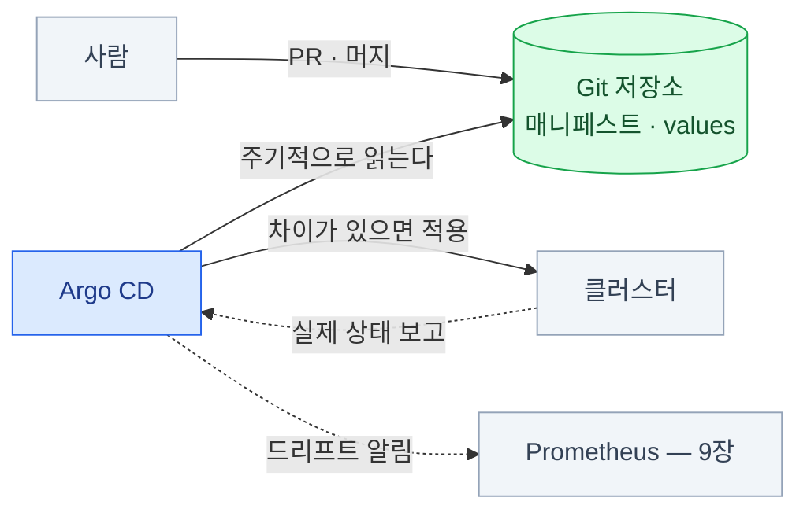

import { Tabs, TabItem, LinkCard, Steps, FileTree } from '@astrojs/starlight/components';
import TermIntro from '../../../components/TermIntro.astro';

> **"이 클러스터에 뭐가 깔려 있죠?"** 에 Git 저장소 주소로 답할 수 있어야 한다

<TermIntro
  terms={[
    ['GitOps', '', '클러스터의 원하는 상태를 **Git에 두고**, 컨트롤러가 그 상태를 클러스터에 계속 맞추는 방식. 배포가 `kubectl apply`가 아니라 **머지**가 된다.'],
    ['드리프트', 'Drift', 'Git에 적힌 상태와 클러스터 실제 상태가 어긋난 것. 누군가 `kubectl edit`으로 급하게 고친 흔적이 대부분이다.'],
    ['App of Apps', '', 'Argo CD `Application` 하나가 다른 `Application`들을 배포하는 구조. **클러스터 전체를 한 리소스에서 펼친다**.'],
    ['sync wave', '동기화 웨이브', '리소스에 순번을 매겨 **설치 순서를 강제**하는 Argo CD 기능. CRD가 먼저, 그것을 쓰는 리소스가 나중이어야 할 때 쓴다.'],
    ['ESO', 'External Secrets Operator', '외부 비밀 저장소(Vault 등)의 값을 읽어 쿠버네티스 Secret으로 만들어 주는 오퍼레이터.'],
    ['SealedSecret', '', '공개키로 암호화해 **Git에 올려도 안전한** Secret. 클러스터 안의 컨트롤러만 개인키로 풀 수 있다.'],
  ]}
/>

## 문제 — 손으로 깐 것은 재현되지 않는다

여기까지 오면 클러스터에 이만큼이 깔려 있다.

MetalLB · Gateway 구현체 · cert-manager · external-dns · oauth2-proxy ·
CloudNativePG · kube-prometheus-stack · Loki · Tempo · Grafana · Alloy · Velero —
**열두 개**, 각각 Helm values가 수십 줄.

| 질문 | 손으로 깔았다면 |
|---|---|
| "지금 Loki 보존 기간이 며칠이죠?" | 클러스터에 들어가 봐야 안다 |
| "누가 이 값을 바꿨죠?" | 알 수 없다 |
| "이 설정 왜 이렇게 돼 있죠?" | 3개월 전 그 사람만 안다 |
| "DR 사이트에 같은 걸 세워 주세요" | 처음부터 다시, 기억에 의존해서 |
| "테스트 클러스터랑 뭐가 다르죠?" | 비교할 방법이 없다 |

**Git에 두면 이 다섯이 전부 해결된다.** 그게 GitOps의 실용적인 이유다 —
"선언적"이라는 말보다 이쪽이 와닿는다.

## Argo CD — 원하는 상태를 계속 맞춘다



| | Argo CD | Flux |
|---|---|---|
| UI | **있다** (실물 화면이 운영에서 꽤 유용하다) | 없다 (CLI·CRD) |
| 모델 | `Application` 중심 | 여러 컨트롤러(Source·Kustomize·Helm) |
| 고를 때 | 사람이 화면으로 상태를 보는 게 중요하면 | 완전 자동화·GitOps 순수주의 |

이 덱은 Argo CD를 기준으로 쓴다 — 온프렘 운영에서 **"지금 뭐가 안 맞나"를 화면으로
보여 주는 것**의 가치가 크기 때문이다.

### 저장소 구조

<FileTree>

- platform/
  - bootstrap/
    - root-app.yaml **모든 것의 시작 — 이것 하나만 손으로 적용한다**
  - infra/
    - metallb/ values.yaml
    - gateway/ values.yaml
    - cert-manager/ values.yaml, clusterissuer.yaml
    - external-dns/ values.yaml
  - data/
    - cnpg-operator/
    - cnpg-clusters/ platform-pg.yaml
  - observability/
    - kube-prometheus-stack/ values.yaml, rules/
    - loki/ values.yaml
    - tempo/ values.yaml
    - grafana/ values.yaml, dashboards/
  - apps/
    - team-a/
    - team-b/

</FileTree>

```yaml
# root-app.yaml — App of Apps
apiVersion: argoproj.io/v1alpha1
kind: Application
metadata:
  name: platform-root
  namespace: argocd
spec:
  project: default
  source:
    repoURL: https://git.example.internal/platform/platform.git
    targetRevision: main
    path: bootstrap/apps            # 여기에 각 컴포넌트의 Application이 들어 있다
  destination:
    server: https://kubernetes.default.svc
  syncPolicy:
    automated:
      prune: true                   # Git에서 지운 것은 클러스터에서도 지운다
      selfHeal: true                # 손으로 고친 것을 되돌린다
```

### 설치 순서 — sync wave

플랫폼은 **순서가 있다.** CRD가 없으면 그 CRD를 쓰는 리소스가 실패하고,
Issuer가 없으면 Certificate가 발급되지 않는다.

```yaml
metadata:
  annotations:
    argocd.argoproj.io/sync-wave: "-2"      # 숫자가 작을수록 먼저
```

| wave | 내용 | 왜 이 순서 |
|---|---|---|
| -3 | 네임스페이스, CRD | 나머지가 이걸 참조한다 |
| -2 | MetalLB, cert-manager, CNPG **오퍼레이터** | 컨트롤러가 먼저 떠야 CR을 처리한다 |
| -1 | ClusterIssuer, IPAddressPool, Gateway | 오퍼레이터가 살아 있어야 만들어진다 |
| 0 | CNPG `Cluster`, Keycloak, 오브젝트 스토리지 연동 | 상태 계층 |
| 1 | 관측 스택, Argo CD 자신의 설정 | |
| 2 | 앱 | |

:::caution[함정 — 닭과 달걀]
GitOps로 전부 관리하려 하면 순환이 생긴다.

| 순환 | 푸는 법 |
|---|---|
| Argo CD 자신을 Argo CD로 배포? | **최초 1회는 손으로**(또는 스크립트) 깔고, 그 다음부터 자기 자신을 관리하게 한다 |
| Git 저장소가 클러스터 안(GitLab)에 있다? | 클러스터가 죽으면 복구 소스가 없다 — **저장소는 클러스터 밖에** |
| 이미지 레지스트리가 클러스터 안? | 마찬가지. 최소한 부트스트랩에 필요한 이미지는 밖에 |
| Argo CD 로그인이 Keycloak, Keycloak은 Argo CD로 배포? | Argo CD의 로컬 admin을 남긴다 ([5장](/onprem/05-identity/)) |
:::

## 시크릿 — Git에 그대로 올릴 수 없다

지금까지 나온 것만 해도 비밀이 이만큼이다 — MinIO 액세스 키, Postgres 비밀번호,
Keycloak client secret, DNS API 토큰, Grafana OAuth secret.

| 방식 | 어떻게 | 장점 | 단점 |
|---|---|---|---|
| **Sealed Secrets** | 클러스터의 공개키로 암호화해 **암호문을 Git에** | 추가 인프라가 없다. 시작이 쉽다 | **개인키를 잃으면 전부 복호화 불가** — 백업이 생명 |
| **External Secrets Operator** | 외부 저장소(Vault·사내 금고)의 값을 참조만 Git에 | 회전(rotation)·감사가 저장소에서 | Vault 같은 것을 하나 더 운영 |
| **SOPS + age** | 파일을 암호화해 Git에. 복호화 키로 배포 시 푼다 | 파일 단위로 유연 | 키 배포를 사람이 관리 |

<Tabs>
<TabItem label="Sealed Secrets">

```bash
# 평문 Secret을 만들고 → 봉인해서 Git에 올릴 파일로
kubectl create secret generic loki-s3 \
  --from-literal=AWS_ACCESS_KEY_ID=loki-user \
  --from-literal=AWS_SECRET_ACCESS_KEY='...' \
  --dry-run=client -o yaml \
| kubeseal --controller-namespace kube-system --format yaml \
  > observability/loki/sealedsecret-s3.yaml
```

:::caution[함정 — 마스터키를 백업하지 않으면]
Sealed Secrets 컨트롤러의 개인키가 사라지면 **Git에 있는 모든 암호문을 영원히 못 푼다.**
클러스터를 다시 세울 때 전 서비스의 비밀을 새로 발급해야 한다.

```bash
# 반드시 백업하고, 클러스터 밖 금고에 둔다
kubectl -n kube-system get secret -l sealedsecrets.net/sealed-secrets-key \
  -o yaml > sealed-secrets-master.key
```

이 파일은 **[14장](/onprem/14-backup/)의 백업 목록 1순위**다.
:::

</TabItem>
<TabItem label="External Secrets">

```yaml
apiVersion: external-secrets.io/v1beta1
kind: ExternalSecret
metadata:
  name: loki-s3
  namespace: observability
spec:
  refreshInterval: 1h
  secretStoreRef:
    name: vault-backend
    kind: ClusterSecretStore
  target:
    name: loki-s3
  data:
    - secretKey: AWS_ACCESS_KEY_ID
      remoteRef: { key: platform/loki-s3, property: access_key }
    - secretKey: AWS_SECRET_ACCESS_KEY
      remoteRef: { key: platform/loki-s3, property: secret_key }
```

Git에는 **참조만** 올라간다. 값이 바뀌면 자동으로 반영되고, 회전 이력이 저장소에 남는다.
운영 대상이 하나 늘어나는 대신 **비밀의 수명 관리**가 제대로 된다.

</TabItem>
</Tabs>

:::tip[핵심]
**Sealed Secrets로 시작해서, 비밀 회전이 업무가 되면 ESO로 간다.**
처음부터 Vault를 세우면 그것 자체가 프로젝트가 된다.
어느 쪽이든 **키·저장소의 백업이 곧 클러스터 복구 가능성**이라는 점은 같다.
:::

## 이미지 — 사내 레지스트리

온프렘에서 배포가 실패하는 흔한 이유는 매니페스트가 아니라 **이미지를 못 받아 오는 것**이다.

| 문제 | 대응 |
|---|---|
| 인터넷 직접 접근 불가 | 사내 레지스트리(Harbor 등)에 **미러링** |
| 외부 레지스트리 rate limit | 마찬가지. 미러가 rate limit도 해결한다 |
| 에어갭 | 이미지를 **tar로 반입**해 push. 차트도 함께 |
| 태그가 조용히 바뀜 | **다이제스트 고정**(`@sha256:…`) 또는 최소한 고정 태그. `latest` 금지 |
| 사내 CA를 노드가 안 믿음 | 노드의 CA 저장소에 추가 ([4장](/onprem/04-tls-dns/)) |

```yaml
# Helm values에서 레지스트리를 한 곳으로 몰아 두면 미러 전환이 한 줄이 된다
global:
  imageRegistry: registry.example.internal
  imagePullSecrets: [ regcred ]
```

## 운영에서 부딪히는 것들

| 항목 | 내용 |
|---|---|
| **`prune`이 무섭다** | 처음엔 `prune: false`로 두고 화면에서 차이만 본다. 익숙해지면 켠다 |
| **CRD가 지워질 뻔한다** | CRD에 `argocd.argoproj.io/sync-options: Prune=false`를 달아 보호한다. CRD가 지워지면 **그 CR의 데이터가 전부 사라진다** |
| **드리프트가 계속 난다** | `selfHeal`이 켜져 있는데 누군가 계속 손으로 고친다는 뜻이다. **왜 손으로 고쳐야 하는지**를 먼저 없앤다 |
| **Helm 차트 버전 고정** | `targetRevision`을 범위로 두면 어느 날 조용히 올라간다. **고정한다** |
| **차트 저장소 이전** | Loki 차트처럼 저장소가 옮겨 가는 일이 있다 ([10장](/onprem/10-loki/)) |
| **Argo CD 자신의 알림** | `argocd_app_info{sync_status="OutOfSync"}`를 Prometheus 알림으로 ([9장](/onprem/09-prometheus/)) |

## 점검

```bash
# ① 전체 앱 상태 — OutOfSync·Degraded가 있나
kubectl -n argocd get applications
argocd app list

# ② 왜 다른가
argocd app diff platform-observability

# ③ 시크릿이 실제로 만들어졌나
kubectl -n observability get secret loki-s3 -o jsonpath='{.data}' | jq 'keys'

# ④ 이미지가 사내 레지스트리에서 오나
kubectl -n observability get pods -o jsonpath='{range .items[*]}{.spec.containers[*].image}{"\n"}{end}' | sort -u

# ⑤ Sealed Secrets 마스터키 백업이 최신인가 (분기 점검 항목)
kubectl -n kube-system get secret -l sealedsecrets.net/sealed-secrets-key \
  -o jsonpath='{range .items[*]}{.metadata.name}{"\t"}{.metadata.creationTimestamp}{"\n"}{end}'
```

## 13장 요약

- GitOps의 실용적 이유는 **"뭐가 깔려 있고, 누가 언제 바꿨고, 어떻게 다시 세우나"** 에 답하는 것이다
- **App of Apps + sync wave**로 클러스터 전체와 설치 순서를 선언한다
- 닭과 달걀을 인정한다 — **Argo CD 최초 설치, Git 저장소, 레지스트리는 클러스터 밖**에 둔다
- 시크릿은 **Sealed Secrets로 시작 → 회전이 업무가 되면 ESO**.
  **마스터키 백업이 곧 복구 가능성**이다
- 온프렘 배포 실패의 단골은 매니페스트가 아니라 **이미지**다 — 사내 레지스트리와 태그 고정
- CRD는 prune에서 보호한다. **CRD가 지워지면 그 CR의 데이터가 전부 사라진다**

<LinkCard
  title="14. 백업과 복구"
  description="무엇을 잃을 수 있고 무엇부터 되살리나 — etcd, Velero, CNPG PITR, 그리고 복구 리허설."
  href="/onprem/14-backup/"
/>
