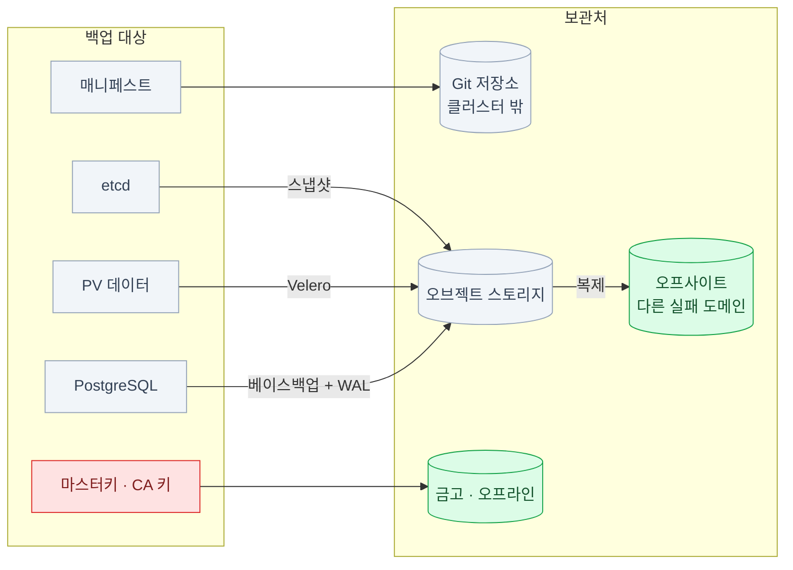

import { Tabs, TabItem, LinkCard, Steps, CardGrid, Card } from '@astrojs/starlight/components';
import TermIntro from '../../../components/TermIntro.astro';

> **"백업이 있다"와 "복구해 봤다"는 다른 말이다** — 이 장의 마지막 절이 제일 중요하다

<TermIntro
  terms={[
    ['RPO', 'Recovery Point Objective', '"얼마나 최근까지 되살릴 수 있나" — **잃어도 되는 데이터의 시간 폭**. 백업 주기가 이 값을 정한다.'],
    ['RTO', 'Recovery Time Objective', '"얼마나 빨리 되살릴 수 있나" — **복구에 허용되는 시간**. 절차가 문서화·리허설돼 있느냐가 이 값을 정한다.'],
    ['etcd 스냅샷', '', '쿠버네티스의 모든 오브젝트가 들어 있는 데이터베이스를 통째로 뜬 파일. **클러스터의 기억 전체**다.'],
    ['Velero', '', '쿠버네티스 리소스와 PV 데이터를 오브젝트 스토리지로 백업·복구하는 도구. 온프렘 클러스터 백업의 사실상 표준이다.'],
    ['Kopia', '', 'Velero가 PV 파일을 복사할 때 쓰는 백업 엔진. CSI 스냅샷을 못 쓰는 스토리지에서도 파일 단위로 백업할 수 있게 해 준다.'],
    ['실패 도메인', 'Failure Domain', '함께 죽는 범위. **백업을 백업 대상과 같은 실패 도메인에 두면 백업이 아니다**.'],
  ]}
/>

## 문제 — 무엇을 잃을 수 있나

"백업 돌고 있어요"라는 말은 대개 **일부만** 백업하고 있다는 뜻이다. 먼저 세어 본다.

| 잃을 수 있는 것 | 잃으면 | 무엇이 지키나 |
|---|---|---|
| **매니페스트·설정** | 무엇이 있었는지 모른다 | **Git** ([13장](/onprem/13-gitops/)) |
| **etcd** (오브젝트 전체) | 클러스터의 기억이 통째로 | etcd 스냅샷 |
| **PV 데이터** | 앱이 쌓아 둔 파일 | Velero (+ CSI 스냅샷) |
| **데이터베이스** | 업무 데이터 | CNPG 백업 + WAL ([7장](/onprem/07-cnpg/)) |
| **오브젝트 스토리지** | 로그·트레이스·백업 자체 | 복제 또는 오프사이트 ([6장](/onprem/06-minio/)) |
| **Sealed Secrets 마스터키** | **Git의 모든 비밀을 영영 못 푼다** | 별도 금고 ([13장](/onprem/13-gitops/)) |
| **사내 CA 개인키** | 발급한 인증서 체계를 다시 세워야 | 별도 금고 ([4장](/onprem/04-tls-dns/)) |
| **Keycloak realm 설정** | SSO를 처음부터 다시 | CNPG 백업 (DB가 원본) |

:::tip[핵심 — GitOps는 절반만 백업한다]
Git에 매니페스트가 다 있어도 **상태는 없다.** Argo CD로 클러스터를 다시 세우면
"무엇이 깔려 있는가"는 완벽히 복원되지만, **DB 내용도 로그도 오브젝트도 안 돌아온다.**
백업 계획은 항상 **선언(Git) + 상태(아래 셋)** 로 나눠서 짠다.
:::

## 층별 백업 — 무엇을 무엇으로



### etcd 스냅샷

```bash
# 컨트롤 플레인 노드에서 (kubeadm 기준 경로)
sudo ETCDCTL_API=3 etcdctl snapshot save /var/backups/etcd-$(date +%F-%H%M).db \
  --endpoints=https://127.0.0.1:2379 \
  --cacert=/etc/kubernetes/pki/etcd/ca.crt \
  --cert=/etc/kubernetes/pki/etcd/server.crt \
  --key=/etc/kubernetes/pki/etcd/server.key

# 확인 (여기서 에러가 나면 그 스냅샷은 못 쓴다)
sudo etcdctl --write-out=table snapshot status /var/backups/etcd-*.db

# 노드 밖으로 즉시 옮긴다 — 노드에만 있으면 노드와 함께 죽는다
mc cp /var/backups/etcd-*.db store/cluster-backups/etcd/
```

- **주기**: 하루 1회 + **위험한 작업 직전**(업그레이드, CRD 변경, 대량 삭제)
- **보존**: 최소 2주. 잘못된 삭제는 며칠 뒤에 발견되기도 한다
- **암호화**: 스냅샷 안에 Secret이 **평문으로** 들어 있다(저장 시 암호화를 안 켰다면).
  스냅샷 파일 자체의 접근 통제가 클러스터 Secret 접근 통제와 같은 급이어야 한다

:::caution[함정 — etcd 복구는 최후의 수단이다]
etcd를 되돌리면 **스냅샷 시점 이후의 모든 변경이 사라진다** — 그 사이 만든 파드,
발급된 인증서, 스케일 조정 전부. 게다가 실제 워크로드 상태(PV 안의 데이터)는
그대로라서 **오브젝트와 실물이 어긋나는** 상황이 생긴다.

GitOps가 있으면 대부분의 경우 **etcd 복구보다 클러스터를 새로 세우고 Git에서 다시 동기화하는
편이 빠르고 안전하다.** etcd 스냅샷은 "클러스터 전체가 날아갔고 Git도 최신이 아닐 때"의 보험이다.
:::

### Velero — 리소스와 PV

```yaml
apiVersion: velero.io/v1
kind: Schedule
metadata:
  name: daily
  namespace: velero
spec:
  schedule: "0 3 * * *"
  template:
    includedNamespaces: ["*"]
    excludedNamespaces: [kube-system, observability]   # 재생성 가능한 것은 뺀다
    defaultVolumesToFsBackup: true      # CSI 스냅샷을 못 쓰면 파일 단위(Kopia)로
    ttl: 720h                           # 30일
    storageLocation: default            # 6장의 오브젝트 스토리지
```

| 방식 | 어떻게 | 언제 |
|---|---|---|
| **CSI 스냅샷** | 스토리지가 순간 스냅샷을 뜬다. 빠르다 | 벤더 CSI가 지원할 때 |
| **파일 백업(Kopia)** | 볼륨 내용을 읽어 오브젝트 스토리지로 | 스냅샷을 못 쓸 때. 느리지만 이식성이 좋다 |

:::caution[함정 — DB를 Velero로만 백업하면 안 된다]
실행 중인 Postgres의 볼륨을 파일 단위로 복사하면 **트랜잭션 중간 상태**가 찍힐 수 있다.
복구는 되겠지만 정합성은 보장되지 않는다.
**DB는 반드시 DB의 방식으로**(CNPG의 베이스 백업 + WAL, [7장](/onprem/07-cnpg/)) 백업하고,
Velero는 그 외의 것을 맡는다.
:::

### 오프사이트 — 백업의 백업

지금까지의 백업은 전부 **오브젝트 스토리지 하나**에 모였다.
그 스토리지가 있는 랙이 타면 전부 사라진다.

| 방법 | 내용 |
|---|---|
| 버킷 복제 | 다른 사이트의 S3 호환 스토리지로 지속 복제 |
| 주기적 동기화 | `mc mirror`를 cron으로 — 단순하지만 확실하다 |
| 오프라인 매체 | 규정상 필요하면. 랜섬웨어 대비로는 이쪽이 확실하다 |

```bash
# 최소한 이 정도는 — 백업 버킷만이라도 다른 곳으로
mc mirror --overwrite --remove store/cluster-backups dr/cluster-backups
mc mirror --overwrite store/pg-backups dr/pg-backups
```

## RPO와 RTO를 실제로 적는다

"백업합니다"가 아니라 **숫자로 적어야** 계획이 된다. 아래는 출발점으로 쓸 만한 값이다.

| 대상 | 백업 주기 | RPO | 복구 방법 | RTO 어림 |
|---|---|---|---|---|
| 매니페스트 | 커밋마다 | 0 | Argo CD 동기화 | 분 |
| etcd | 1일 + 작업 전 | 24시간 | 스냅샷 복구 (최후 수단) | 시간 |
| PostgreSQL | 베이스 1일 + WAL 연속 | **분 단위** | 새 Cluster로 PITR | 1~수 시간 (데이터 크기) |
| PV 데이터 | 1일 | 24시간 | Velero restore | 시간 |
| 오브젝트 스토리지 | 지속 복제 | 분~시간 | 복제본으로 전환 | 데이터 크기에 비례 |
| 마스터키·CA 키 | 변경 시 | 0 | 금고에서 복원 | 분 |

:::tip[핵심 — 클러스터 전체를 잃었을 때의 순서]
숫자보다 중요한 건 **순서**다. 각 단계가 다음 단계의 전제다.

<Steps>

1. **오브젝트 스토리지**를 먼저 살린다 — 나머지 백업이 전부 거기 있다

2. **새 클러스터**를 세운다 (또는 DR 클러스터를 쓴다)

3. **Sealed Secrets 마스터키**를 복원한다 — 없으면 Git의 비밀을 못 푼다

4. **Argo CD**를 손으로 깔고 root Application을 적용한다 → 플랫폼이 스스로 펼쳐진다

5. **CNPG를 백업에서 PITR로** 복구한다 → Keycloak·Grafana가 살아난다

6. **Velero로 앱 PV**를 복구한다

7. DNS·인증서를 확인하고 입구를 연다

</Steps>
:::

## 복구 리허설 — 이 장에서 제일 중요한 절

<CardGrid>
<Card title="백업 성공 ≠ 복구 가능" icon="warning">
백업 잡이 초록불이어도 **파일이 손상됐거나, 빠진 리소스가 있거나,
복구 절차를 아무도 모르는** 경우가 흔하다. 확인하는 방법은 하나 — 해 보는 것.
</Card>
<Card title="분기 1회 · 30분" icon="approve-check">
전면 DR 훈련이 아니어도 된다. **새 네임스페이스에 DB 복구본 하나 띄우고
행 수를 세는 것**만으로 대부분의 문제가 드러난다.
</Card>
<Card title="문서는 복구 중에 쓴다" icon="pencil">
평시에 쓴 절차서는 대체로 틀렸다. **리허설하면서 막힌 지점을 그대로 적은 것**이
진짜 runbook이다.
</Card>
<Card title="사람 의존을 없앤다" icon="setting">
"그건 ○○님만 압니다"가 있으면 그게 최대 위험이다.
리허설은 **매번 다른 사람이** 절차서만 보고 한다.
</Card>
</CardGrid>

### 분기 리허설 체크리스트

```bash
# ① DB — 백업에서 새 클러스터를 띄워 행 수를 센다 (7장의 복구 매니페스트)
kubectl apply -f drill/platform-pg-restored.yaml
kubectl cnpg status platform-pg-restored -n drill
kubectl -n drill exec -it platform-pg-restored-1 -- \
  psql -U postgres -d appdb -c "SELECT count(*) FROM orders;"

# ② Velero — 네임스페이스 하나를 다른 이름으로 복구
velero restore create drill-$(date +%F) \
  --from-backup daily-20260810030000 \
  --include-namespaces prod --namespace-mappings prod:drill-prod
velero restore describe drill-$(date +%F) --details

# ③ 시크릿 — 마스터키로 실제 복호화가 되나 (백업본으로)
kubeseal --recovery-unseal --recovery-private-key sealed-secrets-master.key \
  < observability/loki/sealedsecret-s3.yaml | head

# ④ etcd 스냅샷 — 파일이 온전한가
etcdctl --write-out=table snapshot status /path/to/etcd-latest.db

# ⑤ 정리
kubectl delete ns drill drill-prod
```

| 리허설에서 자주 드러나는 것 | |
|---|---|
| WAL 보존이 짧아 원하는 시점으로 못 간다 | [7장](/onprem/07-cnpg/) `retentionPolicy` |
| 복구본이 뜰 StorageClass·용량이 없다 | 여유 용량을 미리 확보 |
| 마스터키 백업이 3개월 전 것이다 | 키 회전 후 백업을 안 했다 |
| Velero가 CRD를 복구하지 못한다 | 포함 규칙과 순서 확인 |
| 절차서의 명령이 옛 버전 것이다 | 리허설 중에 고친다 |

## 점검

```bash
# 백업이 실제로 최근 것인가 — "성공 로그"가 아니라 산출물을 본다
velero backup get | head
mc ls store/pg-backups/platform-pg/base/ | tail -3
mc ls store/cluster-backups/etcd/ | tail -3
mc ls dr/cluster-backups/etcd/ | tail -3      # 오프사이트에도 갔나
```

| 증상 | 흔한 원인 |
|---|---|
| 백업은 초록불인데 파일이 없다 | 스토리지 위치 설정이 다른 버킷을 본다 |
| PV가 백업 안 됨 | `defaultVolumesToFsBackup` 누락 · 노드 에이전트 미배포 |
| 복구했는데 앱이 안 뜬다 | Secret이 빠졌다 (시크릿을 별도 체계로 관리 중) |
| PITR이 원하는 시점 이전으로 안 간다 | WAL 보존 기간 |
| 복구가 너무 오래 걸린다 | 파일 백업의 한계 — CSI 스냅샷 지원 확인 |

## 14장 요약

- 백업 계획은 **선언(Git) + 상태(etcd · PV · DB · 오브젝트) + 열쇠(마스터키 · CA 키)** 로 나눈다
- **GitOps는 절반만 백업한다** — "무엇이 깔려 있었나"는 복원돼도 데이터는 안 돌아온다
- etcd 복구는 **최후의 수단**이다. GitOps가 있으면 새로 세우고 동기화하는 편이 대개 낫다
- **DB는 DB의 방식으로**(CNPG PITR). Velero의 파일 복사로 대신하지 않는다
- 백업이 전부 한 스토리지에 모인다 — **오프사이트 복제**가 마지막 안전망
- **분기 1회 30분 리허설.** 백업 성공은 복구 가능을 뜻하지 않고,
  진짜 runbook은 리허설 중에 쓰인다

<LinkCard
  title="15. 운영 — 루틴 · 업그레이드 · 진단"
  description="평상시에 무엇을 하고, 터졌을 때 어느 층부터 가르나. 온프렘 운영의 반복 업무."
  href="/onprem/15-ops/"
/>
