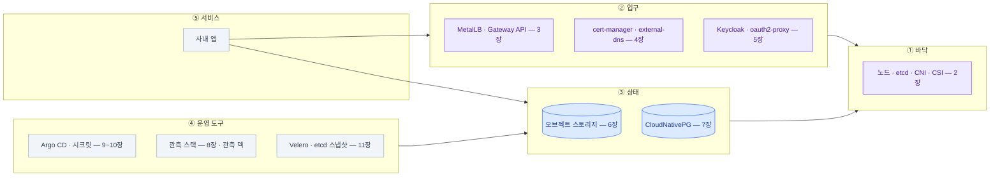

import { LinkCard, CardGrid, Card, Steps } from '@astrojs/starlight/components';
import TermIntro from '../../../components/docs/TermIntro.astro';

> 온프렘 운영은 도구 열세 개를 아는 일이 아니라 **빈칸 목록과 그 사이의 연결을 아는 일**이다

<TermIntro
  title="이 장의 사용법"
  terms={[
    ['전체 지도', '', '다섯 층과 그 층을 채운 도구들. **한 장으로 다시 보는 그림**이다.'],
    ['구축 체크리스트', '', '처음 세울 때의 순서. 아래에서 위로 — 각 단계가 다음 단계의 전제다.'],
    ['사고 대응 카드', '', '급할 때 보는 첫 수 모음. 자세한 건 각 장의 점검 절에 있다.'],
  ]}
/>

## 전체 지도



## 장별 한 문장

| 장 | 한 문장 |
|---|---|
| [0](/onprem/00-intro/) | 온프렘은 **빈칸 채우기**이고, 위층은 **바닥 두 개**에 떨어지며, 비용은 **연결의 수**로 커진다 |
| [1](/onprem/01-why/) | 안 되는 것들은 전부 **그 일을 하던 컨트롤러가 없다**는 한 가지 이유다 |
| [2](/onprem/02-foundation/) | 바닥에서 정할 셋 — **클러스터 형태 · CNI · 스토리지**. 나중에 바꾸기가 제일 어렵다 |
| [3](/onprem/03-gateway/) | MetalLB가 IP를 **할당·광고**하고, **ingress-nginx는 은퇴했으니 Gateway API**로 간다 |
| [4](/onprem/04-tls-dns/) | 내부망이면 ACME는 **DNS-01**뿐이고, 사내 CA는 **신뢰 배포**가 진짜 일이다 |
| [5](/onprem/05-identity/) | 도구마다 늘어나는 계정을 **Keycloak 한 곳으로** 모으되 **깨진 유리 계정**을 남긴다 |
| [6](/onprem/06-minio/) | 오브젝트 스토리지는 전제이고, **클러스터 밖에** 둔다. MinIO 커뮤니티판은 끝났다 |
| [7](/onprem/07-cnpg/) | `replicas`를 늘려도 복제 DB가 안 된다 — 승격·백업·**PITR**은 오퍼레이터의 일이다 |
| [8](/onprem/08-observability/) | **감시자를 대상과 같은 실패 도메인에 두지 않는다.** 저장소는 **S3 하나로** 모인다 |
| [9](/onprem/09-gitops/) | "뭐가 깔려 있죠?"에 **Git 주소로** 답한다. 순서는 sync wave가 인코딩한다 |
| [10](/onprem/10-secrets/) | 시크릿에는 **네 문제**가 섞여 있다 — 저장 · 네임스페이스 경계 · 갱신 · 복구. **sealing key 세트 백업이 곧 복구 가능성** |
| [11](/onprem/11-backup/) | GitOps는 **절반만** 백업한다. **복구는 리허설한 것만** 된다 |
| [12](/onprem/12-ops/) | 운영의 8할은 **디스크 · 인증서 · 버전**. 진단은 **층을 위에서 아래로** |

## 구축 체크리스트 — 처음 세울 때

<Steps>

1. **바닥** ([2장](/onprem/02-foundation/))
   - 컨트롤 플레인 3대 + VIP, etcd는 전용 빠른 디스크
   - CNI 설치 후 **NetworkPolicy가 실제로 막히는지** 파드로 확인
   - StorageClass 두 개 — 기본 하나, **DB용 `Retain`** 하나
   - 노드 라벨·taint로 infra / data / worker 분리

2. **오브젝트 스토리지** ([6장](/onprem/06-minio/)) — **클러스터 밖에.** 이게 없으면 아래 대부분이 막힌다
   - 도구별 버킷 + 도구별 사용자 + **라이프사이클**
   - 클러스터 안에서 엔드포인트에 닿는지, path-style·시계·CA 확인

3. **입구 ①** ([3장](/onprem/03-gateway/))
   - MetalLB IP 풀 (DHCP 밖 대역)
   - Gateway API CRD + 구현체 → `Gateway` 하나
   - `curl --resolve`로 IP 직접 접속까지 확인

4. **입구 ②** ([4장](/onprem/04-tls-dns/))
   - cert-manager + Issuer(ACME DNS-01 또는 사내 CA), **와일드카드 인증서 하나**
   - egress 프록시 환경변수 (**`NO_PROXY` 포함**)
   - DNS — external-dns 또는 **와일드카드 A 레코드**
   - 사내 CA면 **브라우저 · 컨테이너 · 노드 · 컨트롤러 넷에 신뢰 배포**

5. **데이터베이스** ([7장](/onprem/07-cnpg/))
   - CNPG 오퍼레이터 → `Cluster` 3 인스턴스, `walStorage` 분리
   - **백업(barmanObjectStore) 설정과 `ScheduledBackup`을 같은 날 만든다**

6. **인증** ([5장](/onprem/05-identity/) · [Keycloak 덱](/keycloak/))
   - Keycloak 배포(DB는 5번의 CNPG), AD 페더레이션
   - AD 그룹 → Keycloak 그룹 → **역할별로** 정리
   - 도구마다 **깨진 유리 계정**을 금고에

7. **관측** ([8장](/onprem/08-observability/) · [관측 덱](/observability/))
   - kube-prometheus-stack → **알림 열 개 + Watchdog 외부 라우팅**
   - Loki + Alloy (라벨은 최소로) → Grafana에 데이터소스 셋
   - 세 신호를 **잇는 연결 셋**을 대시보드보다 먼저 ([관측 덱 5장](/observability/05-grafana/))
   - Grafana DB를 CNPG로, SSO 연결
   - Tempo는 서비스 간 호출이 늘어난 뒤에

8. **배포** ([9장](/onprem/09-gitops/))
   - Argo CD를 손으로 1회 설치 → root Application → **자기 자신도 Git으로**
   - sync wave로 위 순서를 그대로 인코딩
   - 사내 레지스트리 미러, 태그 고정

9. **시크릿 체계** ([10장](/onprem/10-secrets/))
   - Sealed Secrets 컨트롤러 → 값 봉인 → Git. 스코프는 기본 strict로
   - **sealing key 세트를 클러스터 밖의 암호화 금고에 백업한다.** 키가 갱신되면 다시 뜬다
   - 조직의 금고가 없다면 SOPS/age 레시피를 선택할 수 있다
   - 여러 네임스페이스가 쓰는 값(와일드카드 TLS · pull 시크릿)의 복제 방식을 정한다

10. **백업과 리허설** ([11장](/onprem/11-backup/))
    - etcd 스냅샷 cron + 노드 밖 전송
    - Velero 스케줄, **오프사이트 복제**
    - **분기 리허설 일정을 달력에 등록** — 여기까지 해야 끝이다

11. **운영 루틴** ([12장](/onprem/12-ops/))
    - 일·주·월·분기 항목 정하기
    - 알림마다 runbook 링크
    - 만료 달력(클러스터 인증서 · 사내 CA · 서명 키)

</Steps>

:::tip[핵심]
**2번(오브젝트 스토리지)과 5번(DB)을 뒤로 미루면 나중에 전부 다시 만진다.**
Loki도 Tempo도 Velero도 Keycloak도 Grafana도 이 둘을 전제로 설정되기 때문이다.
:::

## 사고 대응 카드

급할 때 순서대로. 자세한 건 각 장의 점검 절에 있다.

<CardGrid>
<Card title="밖에서 아무도 못 들어온다" icon="warning">
1. `kubectl get svc -A | grep LoadBalancer` — IP가 있나 ([3장](/onprem/03-gateway/))

2. `kubectl get gateway,httproute -A` — Programmed / Accepted

3. `kubectl get certificate -A | grep -v True` — **만료가 제일 흔하다** ([4장](/onprem/04-tls-dns/))

4. `dig +short <호스트>` — 이름이 그 IP인가

5. `curl -kv --resolve` 로 IP 직접 — 어느 단계에서 끊기나
</Card>
<Card title="DB가 이상하다" icon="warning">
1. `kubectl cnpg status <cluster>` — 프라이머리 · 복제 지연 · 백업 ([7장](/onprem/07-cnpg/))

2. `pg_stat_archiver` — **WAL 아카이브 실패면 디스크가 찬다**

3. 볼륨 사용률 · StorageClass

4. 되돌려야 하면 **새 Cluster로 PITR** — 원본은 건드리지 않는다 ([11장](/onprem/11-backup/))
</Card>
<Card title="로그·메트릭이 안 보인다" icon="warning">
1. **관측 스택 자체가 살아 있나** — 그래프가 평평한 것과 정상은 다르다 ([12장](/onprem/12-ops/))

2. Prometheus `/targets` — DOWN 급증

3. `mc admin info` — **오브젝트 스토리지가 찼나** ([6장](/onprem/06-minio/))

4. Alloy 파드 · Loki 인입 429
</Card>
<Card title="배포가 반영이 안 된다" icon="warning">
1. `kubectl -n argocd get applications` — OutOfSync / Degraded

2. `argocd app diff <app>` — 무엇이 다른가 ([9장](/onprem/09-gitops/))

3. 파드가 `ImagePullBackOff`면 **레지스트리 · 자격증명 · 사내 CA**

4. `Pending`이면 스토리지 · 리소스 · taint ([2장](/onprem/02-foundation/))
</Card>
</CardGrid>

## 처음 인수인계 받았다면 — 30분 파악

```bash
# 무엇이 깔려 있나
kubectl get ns
helm list -A
kubectl -n argocd get applications          # Git 주소가 여기 있다

# 어디가 입구인가
kubectl get gateway,httproute,ingress -A
kubectl get svc -A | grep LoadBalancer

# 상태는 어디에
kubectl get cluster.postgresql.cnpg.io -A   # CNPG
kubectl get secret -A | grep -i 's3\|minio' # 오브젝트 스토리지 엔드포인트

# 무엇이 감시되고 있나
kubectl -n observability get prometheusrule -o name | wc -l
kubectl -n observability get pods

# 백업은 도나
velero backup get | head
kubectl get scheduledbackup -A

# 지금 안 좋은 것
kubectl get pods -A --field-selector=status.phase!=Running | grep -v Completed
kubectl get certificate -A | grep -v True
kubectl -n argocd get applications | grep -v 'Synced.*Healthy'
```

## 여기서 더 파려면

| 방향 | 무엇 | 이 덱과의 관계 |
|---|---|---|
| 쿠버네티스 자체 | [CKA 덱](/cka/) · [CKA 실습 덱](/cka-udemy/) | 이 덱이 전제한 기초 |
| 관측 | [관측 덱](/observability/) | 8장이 자리만 잡아 준 도구 넷 전체 |
| 인증 | [Keycloak 덱](/keycloak/) | 5장이 요약만 한 부분 전체 |
| 리눅스 운영 | [서버 관리 덱](/server/) | 노드 안에서 벌어지는 일 |
| 메시징 | [Kafka 덱](/kafka/) | 새 Tempo의 인입 경로에도 등장한다 |
| 정책·보안 | Pod Security Admission · Kyverno/OPA · 이미지 서명 | 이 덱이 다루지 않은 층 |
| 멀티 클러스터 | Thanos/Mimir · 클러스터 API · DR 사이트 | 규모가 커진 다음 |
| 서비스 메시 | Istio · Linkerd | 서비스 간 mTLS·트래픽 제어가 필요해지면 |

## 마지막 한 장

**온프렘에서 잘 굴러가는 플랫폼과 그렇지 않은 플랫폼의 차이는 도구 선택이 아니다.**
어느 자리가 비어 있는지 알고 있는가, 무엇이 무엇 위에 서 있는지 그릴 수 있는가,
그리고 **잃었을 때 되살려 본 적이 있는가** — 이 셋이다.

도구는 바뀐다. 이 덱을 쓰는 동안에도 ingress-nginx가 은퇴했고 MinIO 커뮤니티판이 끝났다.
바뀌지 않는 건 **빈칸 목록**과 **층 구조**다. 새 도구가 나오면
"이건 어느 빈칸을 채우나, 그 아래 무엇을 딛고 서나"를 물으면 된다.

<LinkCard
  title="처음으로 — 덱 개요"
  description="전체 구성과 두 문장을 다시 본다."
  href="/onprem/"
/>
