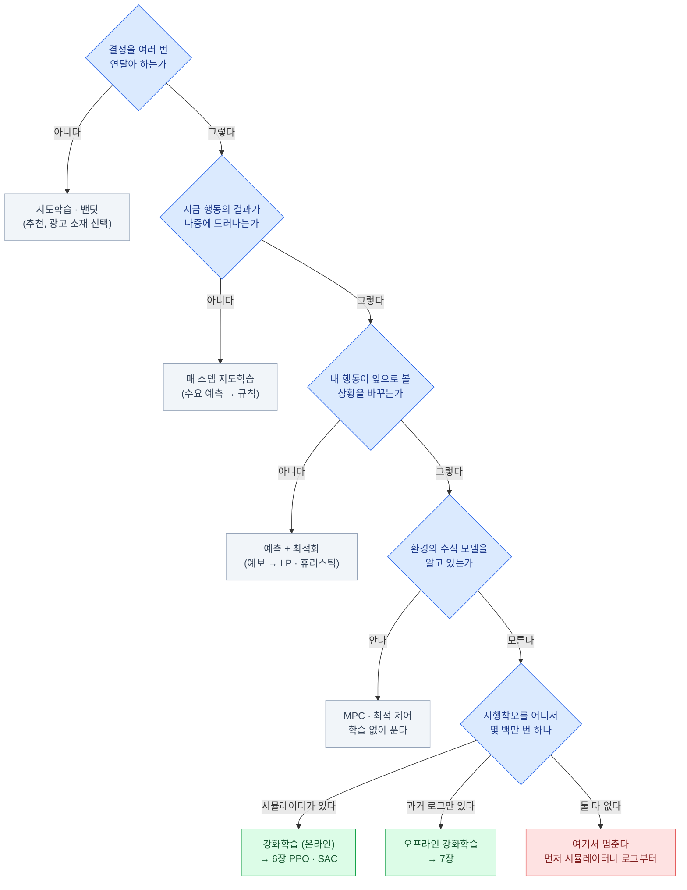
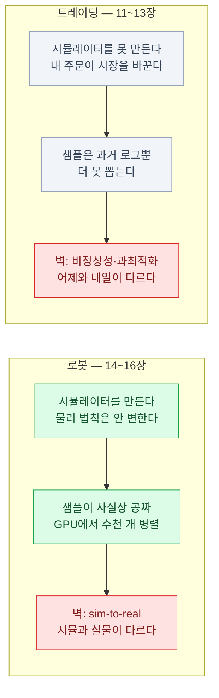

import { Tabs, TabItem, LinkCard, Badge } from '@astrojs/starlight/components';
import TermIntro from '../../../components/TermIntro.astro';

> 강화학습을 아는 것보다 **안 써도 되는 문제를 알아보는 것**이 먼저다

<TermIntro
  terms={[
    ['지도학습', 'Supervised Learning', '입력마다 **정답이 붙은** 데이터로 배우는 방식. 정답을 누가 달아 주느냐가 전제다.'],
    ['보상', 'Reward · r', '행동 뒤에 환경이 주는 **점수 하나**. "무엇이 정답인지"가 아니라 "얼마나 좋았는지"만 알려 준다.'],
    ['지연 보상', 'Delayed Reward', '지금 한 행동의 결과가 **한참 뒤에** 나타나는 것. 어느 행동 덕이었는지 가려내는 문제(공로 배분)를 만든다.'],
    ['공로 배분', 'Credit Assignment', '좋은 결과가 나왔을 때 **여러 행동 중 무엇 덕분인지**를 나누는 일. 강화학습이 어려운 근본 이유다.'],
    ['밴딧', 'Multi-Armed Bandit', '**한 번 고르고 바로 점수를 받는** 문제. 다음 상태가 없다 — 강화학습의 가장 단순한 사촌이다.'],
    ['MPC', 'Model Predictive Control · 모델 예측 제어', '시스템의 수식 모델을 알 때 **매 순간 앞을 내다보고 최적 입력을 계산**하는 제어 기법. 학습 없이 잘 돌아간다면 RL이 필요 없다.'],
  ]}
/>

## 문제 — 정답을 적어 줄 수 없는 일들

지도학습은 이렇게 쓴다. 사진에 "고양이"를 붙이고, 문장에 "긍정"을 붙이고,
모델이 그 짝을 외우게 한다. **정답을 사람이 적어 줄 수 있다는 것**이 전제다.

그런데 이런 일에는 그 전제가 없다.

| 일 | 정답을 적어 보려 하면 |
|---|---|
| 로봇 팔로 컵을 집기 | 관절 7개의 각도를 **매 20ms마다** 사람이 적어 줄 수 없다 |
| 100만 주를 하루에 걸쳐 파는 순서 | "이 순간 몇 주"의 정답이 없다. **다 팔고 나서야** 잘했는지 안다 |
| 데이터센터 냉각기 밸브 조절 | 지금 여는 게 옳은지는 **30분 뒤 온도**를 봐야 안다 |
| 게임에서 이기기 | 한 수 한 수의 정답이 없다. 결과는 300수 뒤 승패뿐 |

공통점이 셋이다. **정답 대신 점수만 있고**, 그 점수가 **한참 뒤에 오고**,
무엇보다 **내가 한 행동이 다음에 마주칠 상황을 바꾼다.**

마지막 것이 특히 지독하다. 지도학습에서는 내 예측이 데이터를 바꾸지 않는다.
고양이 사진을 잘못 맞혀도 다음 사진은 그대로 온다. 하지만 로봇이 왼쪽으로 가면
**앞으로 볼 세상 전체가 왼쪽 것**이 된다. 대량 매도 주문을 내면 **다음 호가가 내려가 있다.**

<Tabs>
<TabItem label="지도학습이면">

```text
데이터셋 (고정)
  (x₁, y₁), (x₂, y₂), … , (xₙ, yₙ)
       ↓
  모델이 x → y 를 맞히게 학습
       ↓
  틀린 만큼 손실. 정답과의 거리가 바로 신호다
```

**데이터가 먼저 있고 모델이 나중에 온다.** 모델이 뭘 하든 데이터셋은 안 변한다.

</TabItem>
<TabItem label="강화학습이면">

```text
       ┌──────── 행동 aₜ ────────┐
   에이전트                      환경
       └── 상태 sₜ₊₁, 보상 rₜ ───┘

  데이터는 "지금 정책이 돌아다니며" 만든다
  정책이 바뀌면 → 가는 곳이 바뀌고 → 데이터도 바뀐다
```

**모델(정책)이 먼저 있고 데이터가 그것에 따라 생긴다.** 학습이 진행되는 동안
데이터 분포 자체가 계속 움직인다 — 강화학습이 불안정한 근본 이유다.

</TabItem>
</Tabs>

## 강화학습을 쓸 조건 셋

**셋이 다 있어야 한다.** 하나라도 빠지면 더 싸고 안정적인 방법이 거의 항상 있다.

| 조건 | 뜻 | 빠지면 대신 쓸 것 |
|---|---|---|
| **① 순차적 결정** | 한 번이 아니라 **연달아** 결정한다 | 한 번뿐이면 → 밴딧 · 지도학습 |
| **② 지연 보상** | 잘했는지가 **나중에** 드러난다 | 즉시 알면 → 지도학습으로 직접 예측 |
| **③ 내 행동이 다음 상태를 바꾼다** | 환경이 내 행동에 반응한다 | 안 바꾸면 → 예측 + 규칙으로 충분 |



이 그림의 마지막 갈래가 이 덱의 두 응용을 정확히 가른다 —
**로봇은 왼쪽(시뮬레이터), 트레이딩은 가운데(로그)** 로 간다.

:::tip[핵심 — 조건 ③이 진짜 분기점이다]
①과 ②만 있는 문제는 의외로 **"예측하고 규칙으로 처리"** 가 이긴다.
날씨를 예측해 우산을 파는 일은 순차적이고 결과도 늦게 오지만, **내가 파는 것이 날씨를
바꾸지는 않는다.** 그래서 예측 정확도를 올리는 편이 훨씬 싸다.

내 행동이 세상을 바꾸기 시작할 때 — 로봇이 자세를 무너뜨릴 때, 주문이 호가를 밀어낼 때 —
비로소 강화학습이 값을 한다.
:::

## 강화학습이 아닌 것들

경계에 있는 방법들이다. **이 중 하나로 되면 그걸 쓴다.**

| 방법 | 무엇 | 강화학습과의 차이 | 언제 |
|---|---|---|---|
| **밴딧** | 여러 선택지 중 하나를 골라 즉시 보상 | **다음 상태가 없다.** 훨씬 쉽고 이론도 탄탄 | A/B 대체, 소재·가격 선택 |
| **맥락 밴딧** | 밴딧 + 상황(사용자 정보) | 마찬가지로 상태 전이가 없다 | 추천, 광고 |
| **예측 + 최적화** | 미래를 예측하고 그 위에서 계획을 푼다 | 학습이 행동에 반응하지 않는다 | 수요예측+재고, 경로 최적화 |
| **MPC · 최적 제어** | 수식 모델로 앞을 내다보며 계산 | **모델을 안다**는 전제. 학습이 없다 | 드론·공정 제어. 되면 이게 낫다 |
| **모방학습** | 사람 시연을 **지도학습으로** 따라한다 | 보상 함수가 필요 없다 | 시연을 모을 수 있을 때 ([16장](/rl/16-imitation-vla/)) |
| **진화 알고리즘** | 정책을 무작위로 흔들어 좋은 것만 남긴다 | 경사(gradient)를 안 쓴다 | 파라미터가 적고 시뮬이 빠를 때 |

:::caution[함정 1 — "예측을 잘하면 매매가 잘된다"는 착각과 그 반대]
주가 예측은 조건 ③이 약하다(개인 규모 주문은 시장을 안 바꾼다). 그래서
**"내일 오를 확률"을 지도학습으로 예측하고 규칙으로 매매**하는 편이 대개 더 낫다.
RL을 얹으면 예측 오차 위에 학습 불안정성이 하나 더 쌓일 뿐이다.

반대로 **100만 주를 하루에 걸쳐 파는 문제**는 조건 셋이 다 성립한다 —
잘게 나눠 연달아 결정하고, 총 체결 단가는 끝나야 나오고, 내 주문이 호가를 민다.
같은 "주식"이지만 **RL이 실제로 쓰이는 쪽은 이쪽**이다 ([13장](/rl/13-trading-practice/)).
:::

## 강화학습의 청구서

쓰기로 했다면 이 비용을 받아들이는 것이다. 미리 알고 시작하는 것과 아닌 것의 차이가 크다.

| 항목 | 실제로 무슨 일이 생기나 |
|---|---|
| **샘플 수** | 간단한 보행 하나에 **수천만~수십억 스텝**. 실물로는 불가능한 숫자다 |
| **불안정성** | 같은 코드, 시드만 바꿔 돌리면 **성공과 완전 실패가 갈린다** ([10장](/rl/10-evaluation/)) |
| **디버깅** | 손실이 내려가도 성능은 안 오른다. **손실 곡선이 지표가 아니다** |
| **보상 설계** | 코드보다 오래 걸린다. 대개 여기서 실패한다 ([8장](/rl/08-reward/)) |
| **안전** | 학습 중 에이전트는 **일부러 나쁜 짓을 해 본다.** 실물·실거래에서 이건 그냥 사고다 |
| **평가** | "좋아졌다"를 증명하는 게 어렵다. 시드 3개로는 아무 말도 못 한다 |

:::caution[함정 2 — 손실 곡선을 믿지 않는다]
지도학습에서는 손실이 내려가면 대체로 잘 되고 있는 것이다. 강화학습에서는
**손실이 내려가는 것이 아무것도 뜻하지 않는다.** 목표값(타깃) 자체가 학습 중에 움직이기 때문이다.
봐야 하는 것은 **에피소드 누적 보상**과 그것의 분산이다.
:::

## 그래도 강화학습이 이기는 자리

앞의 청구서를 내고도 남는 자리가 있다. 셋으로 정리된다.

| 자리 | 왜 이기나 | 예 |
|---|---|---|
| **정답은 못 쓰지만 채점은 되는 일** | 사람이 시범을 못 보이지만, 잘했는지는 계산할 수 있다 | 보행, 체결 단가, LLM 응답 선호 |
| **시뮬레이터가 싼 일** | 시행착오 비용이 GPU 시간뿐이다 | 물리 시뮬, 게임, 대기열 |
| **손으로 만든 규칙이 한계에 온 일** | 예외 처리가 수백 개로 불어난 규칙 기반 시스템 | 냉각 제어, 입찰 |

:::tip[핵심 — 한 문장 판정법]
**"정답 시범을 보일 수 있나?"** → 있으면 모방학습·지도학습.
**"없지만 점수는 매길 수 있나?"** → 그러면 강화학습.
**"점수도 못 매기나?"** → 그러면 아직 문제 정의가 안 끝난 것이다. 그것부터 한다.
:::

## 이 덱이 두 응용을 같이 두는 이유

로봇과 트레이딩은 도메인은 멀지만, **강화학습이 부딪히는 벽이 정확히 서로 반대**다.
한쪽만 보면 "RL은 이런 것"이라는 상이 한쪽으로 기운다.



**같은 PPO가 로봇에서는 1순위, 트레이딩에서는 거의 안 쓰이는 이유**가 이 그림에 다 있다.
알고리즘의 우열이 아니라 **샘플을 새로 뽑을 수 있느냐**의 차이다.

## 1장 요약

- 지도학습은 **정답을 적어 줄 수 있다**는 전제 위에 있다. 그 전제가 없는 자리가 강화학습의 자리다
- 강화학습을 쓸 조건은 셋 — **순차적 결정 · 지연 보상 · 내 행동이 다음 상태를 바꾼다**
- **조건 ③이 진짜 분기점**이다. 내 행동이 세상을 안 바꾸면 예측+규칙이 거의 항상 이긴다
- 밴딧 · MPC · 모방학습으로 되는 문제라면 **그걸 쓴다.** RL은 마지막 수단에 가깝다
- 청구서는 **샘플 수 · 불안정성 · 보상 설계 · 안전 · 평가**다. 손실 곡선은 지표가 아니다
- 판정 한 줄 — **정답 시범을 보일 수 있으면 모방학습, 못 보이지만 채점되면 강화학습**
- 로봇과 트레이딩은 **시뮬레이터를 만들 수 있느냐**로 갈리고, 그 차이가 알고리즘 선택까지 결정한다

<LinkCard
  title="2. MDP — 문제를 강화학습 문제로 옮기기"
  description="상태·행동·보상·전이·할인율. 현실을 이 다섯 칸에 채워 넣는 것이 실무의 절반이고, 여기서 잘못 놓으면 뒤가 다 무너진다."
  href="/rl/02-mdp/"
/>
