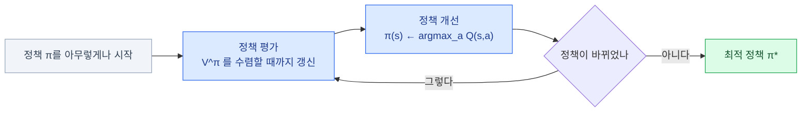
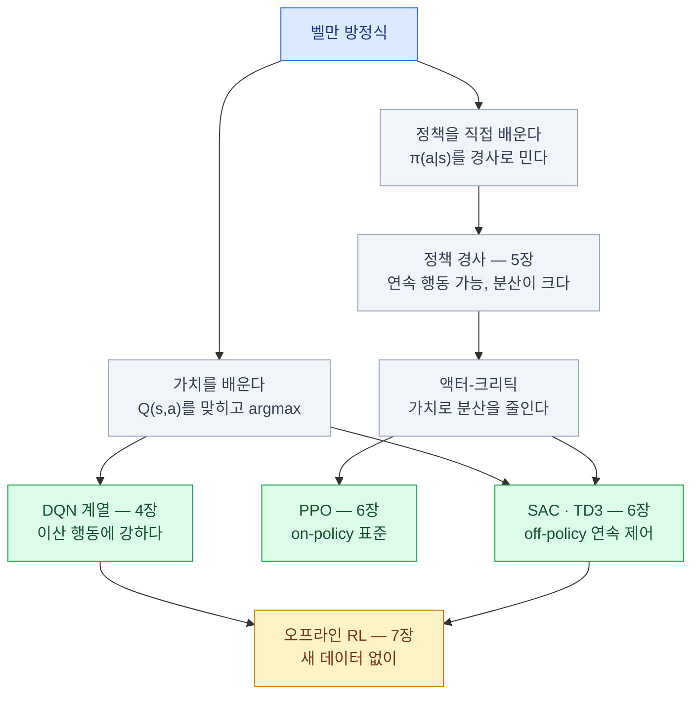

import { Tabs, TabItem, LinkCard, Badge } from '@astrojs/starlight/components';
import TermIntro from '../../../components/TermIntro.astro';

> 강화학습 알고리즘의 절반은 **"이 자리에 있으면 앞으로 얼마나 벌까"** 를 맞히는 이야기다

<TermIntro
  terms={[
    ['가치 함수', 'Value Function · V(s)', '상태 `s`에서 시작해 **앞으로 받을 리턴의 평균**. "여기 있으면 얼마나 좋은가"의 숫자.'],
    ['행동 가치', 'Action Value · Q(s,a)', '상태 `s`에서 **행동 `a`를 하고 나서** 받을 리턴의 평균. 행동을 고르려면 이게 필요하다.'],
    ['벨만 방정식', 'Bellman Equation', '가치를 **한 스텝 뒤의 가치로** 다시 쓴 식. 강화학습 거의 모든 알고리즘의 뼈대다.'],
    ['TD 학습', 'Temporal Difference · 시간차 학습', '**끝까지 안 가 보고**, 한 스텝만 가 보고 예측을 고치는 방법. 강화학습 고유의 아이디어다.'],
    ['탐색과 활용', 'Exploration vs Exploitation', '**새로운 걸 시도할까, 지금 아는 최선을 할까**의 저울질. 강화학습에만 있는 딜레마다.'],
    ['on-policy · off-policy', '온폴리시 · 오프폴리시', '**지금 쓰는 정책이 모은 데이터로만** 배우면 on-policy, 남이(또는 예전의 내가) 모은 데이터로도 배우면 off-policy.'],
  ]}
/>

## 문제 — 지금 받은 보상만으로는 판단할 수 없다

체스에서 퀸을 내주는 수를 뒀다. 그 순간의 보상은 **크게 마이너스**다.
그런데 세 수 뒤 외통수라면 그건 최고의 수였다.

**즉시 보상으로 행동을 평가할 수 없다.** 필요한 것은 "이 행동을 하면
**결국** 얼마를 받게 되는가"이고, 그 값에 이름을 붙인 것이 가치 함수다.

```text
V^π(s)  =  E[ Gₜ | sₜ = s ]           상태 s에서 정책 π대로 갔을 때의 리턴 평균
Q^π(s,a) =  E[ Gₜ | sₜ = s, aₜ = a ]   s에서 a를 하고 그 뒤 π대로 갔을 때
```

> `V`는 "이 자리가 얼마짜리인가", `Q`는 "이 자리에서 이 수를 두면 얼마짜리인가"다.

### V와 Q — 왜 둘 다 필요한가

| | 답하는 것 | 행동을 고를 수 있나 | 쓰이는 곳 |
|---|---|---|---|
| **V(s)** | 이 상태가 얼마나 좋은가 | **못 고른다** — 환경 모델이 있어야 한다 | 크리틱, 어드밴티지 계산 |
| **Q(s,a)** | 이 상태에서 이 행동이 얼마나 좋은가 | **고를 수 있다** — 가장 큰 걸 고르면 된다 | DQN 계열, SAC |

`Q`를 알면 정책이 공짜로 나온다는 것이 핵심이다.

```text
π(s) = argmax_a Q(s,a)
```

> 각 행동의 점수를 다 알면, **제일 높은 걸 고르는 것**이 최선의 정책이다.

**4장의 Q러닝 계열은 이 한 줄에서 출발한다.** 반대로 행동이 연속이면
`argmax`를 못 구해서 (무한개 중에 고를 수 없다) 다른 길이 필요해진다 — 그게 5~6장이다.

## 벨만 방정식 — 가치를 자기 자신으로 쓴다

가치의 정의는 "끝까지 다 더한 값"이라 그대로는 계산할 수 없다. 끝까지 가 봐야 하기 때문이다.
벨만의 아이디어는 **한 스텝만 떼어 내고 나머지를 다시 가치로 부르는 것**이다.

```text
V^π(s)  =  E[ r + γ · V^π(s') ]
                 ▲        ▲
          지금 받는 것   다음 자리의 가치
```

> **"여기의 가치 = 지금 받는 보상 + 다음 자리 가치의 (할인된) 평균"**

이 재귀 하나가 강화학습을 가능하게 한다. **끝까지 안 가 보고, 한 스텝 뒤의 추정치로
지금 추정치를 고칠 수 있게** 되기 때문이다.

### 기대 방정식과 최적 방정식

같은 재귀를 두 가지로 쓴다. 차이는 **다음 행동을 어떻게 고르느냐**뿐이다.

<Tabs>
<TabItem label="벨만 기대 방정식 — 이 정책이면">

```text
Q^π(s,a) = E[ r + γ · Q^π(s', a') ]      a' ~ π(s')
```

> 다음 행동도 **지금 정책이 하던 대로** 골랐을 때의 값.

"지금 정책의 실력이 얼마인가"를 재는 데 쓴다 — **정책 평가**다.
이 식을 따라가는 학습이 SARSA이고, 액터-크리틱의 크리틱도 이 형태다.

</TabItem>
<TabItem label="벨만 최적 방정식 — 최선을 다하면">

```text
Q*(s,a) = E[ r + γ · max_a' Q*(s', a') ]
```

> 다음 행동은 **가장 좋은 것**을 고른다고 놓는다.

"도달 가능한 최선이 얼마인가"를 정의한다. `max`가 들어간 것이 유일한 차이인데,
이 하나 때문에 **데이터를 모은 정책과 배우는 정책이 달라도 된다** — off-policy가 된다.
**Q러닝과 DQN이 이 식이다** ([4장](/rl/04-value-based/)).

</TabItem>
</Tabs>

:::tip[핵심 — `max` 하나가 off-policy를 만든다]
기대 방정식은 "다음에 **실제로 한** 행동"을 쓰고, 최적 방정식은 "다음에 **할 수 있는 최선**"을 쓴다.
후자는 실제로 무엇을 했는지와 무관하므로 **아무 데이터로나 배울 수 있다.**
과거 로그로 배워야 하는 트레이딩에서 off-policy가 기본이 되는 이유가 여기 있다
([7장](/rl/07-offline-model/)).
:::

## 모델을 알 때 — 동적 계획법

전이 확률 `P`를 다 안다면 벨만 방정식을 **그냥 반복해서 풀면** 된다.



**평가 → 개선을 번갈아 하면 최적 정책에 도달한다**는 것이 동적 계획법의 결론이고,
이 "평가하고 개선한다"는 구조가 **거의 모든 강화학습 알고리즘의 골격**으로 남는다.
액터-크리틱의 크리틱이 평가, 액터가 개선이다 ([5장](/rl/05-policy-gradient/)).

문제는 전제다. **현실에서 `P`를 아는 경우는 거의 없고**, 안다 해도 상태가 조금만 많아지면
표를 만들 수 없다. 그래서 실제로는 **가 보면서 배운다** — 모델 프리 강화학습이다.

## 모델을 모를 때 — MC와 TD

가 보면서 배우는 방법은 크게 둘이다.

| | 몬테카를로 (MC) | 시간차 (TD) |
|---|---|---|
| 언제 배우나 | **에피소드가 끝난 뒤** | **매 스텝** |
| 무엇으로 배우나 | 실제로 받은 리턴 전체 | 한 스텝 보상 + **다음 추정치** |
| 편향 | 없다 | 있다 (추정치를 믿으니까) |
| 분산 | **크다** | 작다 |
| 끝없는 과제에 | 못 쓴다 | **쓸 수 있다** |

TD가 하는 일을 식으로 보면 이렇다. 이 덱에서 가장 여러 번 나올 식이다.

```text
V(s) ← V(s) + α · [ r + γ·V(s') − V(s) ]
                    └──── TD 오차 δ ────┘
```

> 지금 예측(`V(s)`)과, 한 스텝 가 보고 얻은 더 나은 추정(`r + γ·V(s')`)의 **차이만큼**
> 예측을 옮긴다. 그 차이를 **TD 오차**라 부른다.

:::tip[핵심 — 부트스트래핑]
**추정치를 다른 추정치로 고치는 것**을 부트스트래핑이라 한다.
"아직 맞지도 않는 값으로 값을 고친다"는 게 이상해 보이지만, 실제 보상 `r`이 매 스텝
조금씩 진실을 주입하기 때문에 전체가 점점 맞아 간다.

**빠르고 온라인으로 되지만 불안정하다** — 강화학습의 성격 대부분이 여기서 나온다.
:::

### 그 사이 — n-스텝과 GAE

한 스텝만 보면(TD) 편향이 크고, 끝까지 보면(MC) 분산이 크다.
**몇 스텝을 볼지 조절**하는 것이 n-스텝이고, 그것들을 지수 가중으로 섞은 것이
**GAE(Generalized Advantage Estimation)** 다.

```text
n=1  : r + γV(s')                            ← TD. 편향↑ 분산↓
n=3  : r + γr' + γ²r'' + γ³V(s''')
n=∞  : r + γr' + γ²r'' + …                   ← MC. 편향↓ 분산↑

GAE(λ) : 위 전부를 λ로 가중 평균한 것          ← λ 하나로 저울질
```

> `λ`(보통 0.95)는 **편향과 분산 사이의 손잡이**다.

**PPO가 실제로 쓰는 어드밴티지 계산이 GAE**다 ([6장](/rl/06-ppo-sac/)).
지금은 "λ는 편향-분산 손잡이"만 기억하면 된다.

## 탐색과 활용

가치를 배우려면 데이터가 필요한데, **그 데이터를 모으는 것도 에이전트 자신**이다.
여기서 강화학습에만 있는 딜레마가 생긴다.

> 늘 가던 식당이 7점이다. 옆집은 몇 점인지 모른다.
> **오늘 7점을 확보할까, 모르는 집을 시도할까.**

늘 최선만 고르면(**활용**) 더 좋은 것을 영영 못 찾고, 계속 새로 시도하면(**탐색**)
아는 것도 못 써먹는다. 실무에서 쓰는 처방은 넷이다.

| 방법 | 어떻게 | 쓰는 곳 |
|---|---|---|
| **ε-greedy** | `ε` 확률로 무작위, 나머지는 최선. `ε`을 점점 줄인다 | DQN 계열의 기본 |
| **엔트로피 보너스** | 정책이 한쪽으로 쏠리면 벌점을 준다 | PPO · SAC. 연속 행동의 기본 |
| **노이즈 주입** | 행동에 잡음을 더한다 (OU · 가우시안) | TD3 등 연속 제어 |
| **낙관적 초기화** | 안 가 본 곳의 가치를 높게 시작 | 표 기반·소규모 문제 |

:::caution[함정 1 — 탐색 부족은 "학습 실패"로 위장한다]
보상 곡선이 낮은 값에서 평평해지면 대부분 **알고리즘 문제가 아니라 탐색 문제**다.
에이전트가 좋은 영역을 아예 밟아 본 적이 없어서, 배울 데이터에 정답이 없는 상태다.

먼저 확인할 것 — **엔트로피 계수가 너무 작지 않은가, `ε`이 너무 빨리 줄지 않는가,
에피소드가 너무 빨리 종료되어 멀리 못 가는 건 아닌가.**
:::

:::caution[함정 2 — 실전에서의 탐색은 그냥 사고다]
탐색은 "일부러 나쁜 행동을 해 보는 것"이다. 시뮬레이터에서는 공짜지만
**실물 로봇에서는 파손이고, 실거래에서는 손실**이다.
그래서 두 응용 모두 **탐색은 시뮬레이터나 과거 데이터 안에서 끝내고,
실전에는 고정된 정책을 배포**하는 구조를 쓴다 ([12장](/rl/12-trading-design/) · [15장](/rl/15-robot-stack/)).
:::

## 알고리즘 지도 — 여기서 갈라진다

지금까지의 재료로 뒤 장들의 지도를 그릴 수 있다.



| 갈래 | 핵심 아이디어 | 강점 | 약점 |
|---|---|---|---|
| **가치 기반** | `Q`를 맞히고 최선을 고른다 | 샘플 효율이 좋다, off-policy | **연속 행동에 못 쓴다** |
| **정책 기반** | 정책을 직접 경사로 민다 | 연속 행동, 확률적 정책 | 샘플을 많이 먹는다 |
| **액터-크리틱** | 둘을 합친다 | 오늘의 주류 | 하이퍼파라미터가 많다 |

## 3장 요약

- 즉시 보상으로는 행동을 평가할 수 없다. 필요한 것은 **앞으로 받을 리턴의 기대값**이다
- **`V`는 자리의 값, `Q`는 자리+행동의 값.** `Q`를 알면 `argmax`로 정책이 공짜로 나온다
- 벨만 방정식은 가치를 **"지금 보상 + 다음 가치"** 로 다시 쓴 재귀다
- 기대 방정식과 최적 방정식의 차이는 `max` 하나이고, **그 하나가 off-policy를 만든다**
- 모델을 알면 동적 계획법으로 풀리고, **평가 → 개선의 반복 구조가 뒤 알고리즘에 그대로 남는다**
- 모델을 모르면 MC(끝까지 보고)나 TD(한 스텝 보고)로 배운다. **TD는 빠르지만 불안정하다**
- **GAE의 `λ`는 편향과 분산 사이의 손잡이**다 — PPO가 실제로 쓴다
- 탐색과 활용은 강화학습 고유의 딜레마다. **성능이 낮은 값에서 평평하면 탐색부터 의심한다**
- **실전에서의 탐색은 사고**다. 두 응용 모두 탐색을 시뮬·과거 데이터 안에 가둔다

<LinkCard
  title="4. 가치 기반 — Q러닝에서 DQN까지"
  description="표로 시작해 신경망으로 넘어가는 길, 그 과정에서 무너지는 것들과 경험 재생·타깃 네트워크라는 두 처방."
  href="/rl/04-value-based/"
/>
