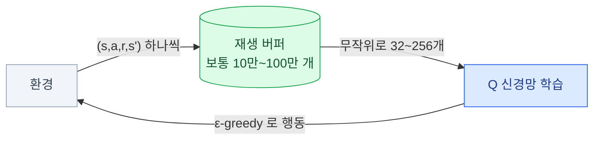

import { Tabs, TabItem, LinkCard, Badge } from '@astrojs/starlight/components';
import TermIntro from '../../../components/TermIntro.astro';

> DQN의 두 처방 — **경험 재생**과 **타깃 네트워크** — 은 지금도 off-policy 알고리즘 전부에 들어 있다

<TermIntro
  terms={[
    ['Q러닝', 'Q-Learning', '벨만 **최적** 방정식을 그대로 학습 규칙으로 옮긴 것. 강화학습에서 가장 유명한 알고리즘.'],
    ['함수 근사', 'Function Approximation', '상태마다 값을 표에 적는 대신 **신경망으로 값을 계산**하는 것. 상태가 많아지면 필수다.'],
    ['DQN', 'Deep Q-Network', 'Q러닝 + 신경망 + 두 가지 안정화 장치. 2015년에 아타리를 풀며 딥 강화학습을 연 알고리즘.'],
    ['경험 재생', 'Experience Replay', '겪은 것을 **버퍼에 쌓아 두고 무작위로 꺼내** 학습하는 것. 데이터의 시간적 상관을 깬다.'],
    ['타깃 네트워크', 'Target Network', '학습 목표를 계산할 때 쓰는 **잠깐 얼려 둔 사본**. 목표가 같이 움직여 발산하는 것을 막는다.'],
    ['과대추정', 'Overestimation Bias', '`max` 연산 때문에 **Q값이 실제보다 크게** 추정되는 현상. 가치 기반 방법의 고질병이다.'],
  ]}
/>

## 표로 하는 Q러닝

상태와 행동이 몇 개 안 되면 `Q(s,a)`를 **그냥 표에 적어 두면** 된다.
학습 규칙은 3장의 벨만 최적 방정식을 TD로 옮긴 것 하나다.

```text
Q(s,a) ← Q(s,a) + α · [ r + γ · max_a' Q(s',a') − Q(s,a) ]
                        └───── TD 타깃 ─────┘   └ 현재 추정 ┘
```

> 지금 칸의 점수를 **"받은 보상 + 다음 칸에서 낼 수 있는 최고 점수"** 쪽으로 `α`만큼 옮긴다.

절차는 이게 전부다.

<Tabs>
<TabItem label="의사코드">

```python
Q = defaultdict(lambda: np.zeros(n_actions))   # 전부 0으로 시작

for episode in range(N):
    s, _ = env.reset()
    done = False
    while not done:
        # ε-greedy 로 행동을 고른다 (탐색)
        a = env.action_space.sample() if random() < eps else np.argmax(Q[s])

        s2, r, terminated, truncated, _ = env.step(a)

        # 종료 상태면 다음 가치는 0 — 여기를 틀리는 실수가 흔하다
        target = r if terminated else r + gamma * np.max(Q[s2])
        Q[s][a] += alpha * (target - Q[s][a])

        s, done = s2, terminated or truncated
```

</TabItem>
<TabItem label="왜 off-policy인가">

행동은 `ε-greedy`로 골랐는데(가끔 무작위), 학습 타깃은 `max`를 쓴다.
즉 **"실제로 한 행동"과 "배우는 대상"이 다르다.**

```text
행동한 정책 (behavior)  : ε-greedy   ← 탐색이 섞여 있다
배우는 정책 (target)    : greedy      ← 항상 최선을 고른다
```

그래서 Q러닝은 **아무 데이터로나 배울 수 있다.**
예전 정책이 모은 데이터도, 사람이 만든 데이터도 쓸 수 있다 —
경험 재생과 오프라인 RL이 가능한 근거가 여기다.

</TabItem>
<TabItem label="SARSA와의 차이">

```text
Q러닝 : Q(s,a) ← … r + γ · max_a' Q(s',a')     "최선을 뒀다고 치고"
SARSA : Q(s,a) ← … r + γ · Q(s', a')           "실제로 한 행동으로"
```

SARSA는 **자기가 탐색 중이라는 걸 아는** 학습이라 더 안전하게 배운다.
절벽 옆을 걷는 과제에서 Q러닝은 최단 경로(절벽 바로 옆)를, SARSA는
**가끔 미끄러질 걸 감안해 한 칸 떨어진 길**을 배운다.

이름만 알아 두면 된다 — 실무에서 SARSA를 직접 쓰는 일은 드물다.

</TabItem>
</Tabs>

## 문제 — 표가 감당 못 한다

상태가 조금만 현실적이 되면 표가 폭발한다.

| 문제 | 상태 수 |
|---|---|
| 미로 8×8 | 64 |
| 카트폴 (위치·속도·각도·각속도, 연속) | **무한** |
| 아타리 화면 (84×84 흑백 4장) | 사실상 무한 |
| 호가창 10단 + 포지션 | 사실상 무한 |

게다가 표는 **일반화를 못 한다.** 거의 똑같은 상태를 처음 보면 아무것도 모르는 상태로 시작한다.
그래서 표 대신 **신경망**을 쓴다 — `Q(s,a) ≈ Q(s,a; θ)`.

그런데 이걸 그대로 하면 **거의 항상 발산한다.** 세 가지가 겹치기 때문이다.

:::caution[함정 — 치명적 삼요소]
아래 셋이 동시에 있으면 학습이 발산할 수 있다는 것이 알려진 결과다.

| 요소 | 이 상황에서 |
|---|---|
| **함수 근사** | 신경망을 쓴다 |
| **부트스트래핑** | 추정치로 추정치를 고친다 (TD) |
| **off-policy** | 배우는 정책과 행동한 정책이 다르다 |

Q러닝 + 신경망은 **셋 다 해당한다.** DQN의 두 장치는 이 삼요소를 없애는 게 아니라
**증상을 눌러 주는 처방**이고, 그래서 지금도 완전히 안전하지는 않다.
:::

## DQN — 두 개의 처방

### ① 경험 재생 — 상관을 깬다

연속된 경험은 서로 지나치게 닮아 있다. 방금 본 프레임 100장으로 학습하면
신경망이 **최근 구간에만 맞춰졌다가 다음 구간에서 그걸 잊는다.**



얻는 것이 둘이다 — **시간적 상관이 깨지고**, 경험 하나를 **여러 번 재사용**한다.
후자가 곧 샘플 효율이고, 실물 로봇처럼 샘플이 비싼 자리에서 결정적이다.

### ② 타깃 네트워크 — 목표를 잠깐 고정한다

TD 타깃에 `Q` 자신이 들어 있다. 그래서 `Q`를 고치면 **목표도 같이 움직인다.**
자기 그림자를 밟으려는 꼴이다. 처방은 사본을 하나 얼려 두는 것이다.

```text
타깃 = r + γ · max_a' Q(s', a' ; θ⁻)      θ⁻ 는 몇 천 스텝마다 θ를 복사한 사본
```

> 목표를 계산할 때는 **잠깐 멈춰 둔 옛 사본**을 쓴다. 목표가 안 흔들리므로 학습이 안정된다.

| 갱신 방식 | 어떻게 | 쓰는 곳 |
|---|---|---|
| **하드 업데이트** | N 스텝마다 통째로 복사 | DQN |
| **소프트 업데이트** | 매 스텝 조금씩 섞는다 (`τ=0.005` 정도) | SAC · TD3 ([6장](/rl/06-ppo-sac/)) |

:::tip[핵심 — 이 두 장치는 DQN만의 것이 아니다]
**재생 버퍼 + 타깃 네트워크**는 이후 모든 off-policy 알고리즘(TD3 · SAC · 오프라인 RL)의
공통 부품이 됐다. DQN을 배우는 값어치의 절반이 여기에 있다.
:::

## 그 뒤에 붙은 개선들

DQN 이후 나온 개선들 중 **지금도 기본으로 켜는 것**과 **필요할 때만 보는 것**을 나눈다.

| 개선 | 무엇을 고쳤나 | 판단 |
|---|---|---|
| **Double DQN** | `max`가 만드는 **과대추정**. 고를 때와 평가할 때 네트워크를 나눈다 | <Badge text="기본으로 켠다" variant="success" /> |
| **n-스텝 리턴** | 보상이 느리게 퍼지는 문제. 3스텝 정도 미리 더한다 | <Badge text="대개 이득" variant="success" /> |
| **Dueling** | 상태 가치와 행동별 이점을 나눠 학습 | <Badge text="이득" variant="note" /> |
| **우선순위 재생** | TD 오차가 큰 경험을 더 자주 뽑는다 | <Badge text="상황에 따라" variant="note" /> 구현이 까다롭다 |
| **분포형 (C51 등)** | 기대값이 아니라 **리턴의 분포**를 배운다 | <Badge text="이름만" variant="note" /> 위험 민감 과제에서 재조명 |
| **노이지 네트워크** | ε-greedy 대신 가중치에 잡음 | <Badge text="이름만" variant="note" /> |

이 여섯을 다 합친 것이 **Rainbow**다. 시험 삼아 이름을 외우기보다,
**"과대추정을 잡고(Double), 보상을 빨리 퍼뜨리고(n-스텝), 좋은 경험을 더 본다(우선순위)"**
라는 세 방향으로 기억하는 편이 쓸모 있다.

### 과대추정이 왜 생기나

```text
E[ max(추정치들) ]  ≥  max( E[추정치들] )
```

> 잡음이 섞인 값들 중에서 **최대를 고르면**, 운 좋게 크게 튄 것을 고르게 된다.
> 그래서 `max`를 반복하면 Q값이 계속 부풀어 오른다.

Double DQN의 처방은 **"고르는 네트워크"와 "값을 매기는 네트워크"를 분리**하는 것이다.

```text
DQN        : r + γ · Q(s', argmax_a' Q(s',a'; θ⁻) ; θ⁻)     같은 네트워크로 고르고 평가
Double DQN : r + γ · Q(s', argmax_a' Q(s',a'; θ ) ; θ⁻)     현재 망이 고르고, 타깃 망이 평가
```

**이 아이디어는 그대로 살아남았다** — 6장의 TD3가 쓰는 "두 크리틱 중 작은 값"이 같은 처방이다.

## 언제 이 계열을 고르나

| 고른다 | 안 고른다 |
|---|---|
| **행동이 이산**이고 개수가 적다 (수십~수백) | 행동이 연속이다 → `argmax`를 못 구한다 |
| 샘플이 비싸다 — 재사용해야 한다 | 샘플이 공짜다 → PPO가 더 안정적이다 |
| 과거 데이터로 배워야 한다 (off-policy) | 정책의 확률 자체가 필요하다 (섞인 전략) |
| 상태가 이미지·정형 데이터 | 행동 차원이 크고 구조적이다 |

**두 응용에서의 위치는 이렇다.**

| 응용 | 가치 기반의 자리 |
|---|---|
| 로봇 | 거의 안 쓴다 — 관절 토크는 연속이다. 다만 **SAC 안에 Q 학습이 그대로 들어 있다** |
| 트레이딩 | **자주 쓴다** — 행동이 이산(매수/관망/매도)이고 샘플이 비싸다. 다만 오프라인 보정이 필요하다 ([7장](/rl/07-offline-model/)) |

:::caution[함정 — DQN이 잘 되는 것처럼 보일 때]
가치 기반 학습은 **Q값이 계속 커지면서도 성능은 안 오르는** 상태에 자주 빠진다.
`Q`의 평균값을 반드시 같이 찍어 본다. 실제 받은 리턴보다 Q 추정이 크게 높으면 **과대추정**이고,
Double DQN · n-스텝 · 학습률 축소 순으로 손본다.
:::

## 4장 요약

- Q러닝은 벨만 **최적** 방정식을 TD 규칙으로 옮긴 것이다 — `max` 때문에 **off-policy**다
- 표는 상태가 조금만 늘어도 못 쓰고 **일반화도 못 한다.** 그래서 신경망으로 간다
- 그런데 **함수 근사 + 부트스트래핑 + off-policy**(치명적 삼요소)가 겹치면 발산할 수 있다
- DQN의 두 처방 — **경험 재생**(상관을 깨고 재사용)과 **타깃 네트워크**(목표를 고정)
- 이 둘은 DQN만의 것이 아니라 **모든 off-policy 알고리즘의 공통 부품**이 됐다
- 개선은 세 방향으로 기억한다 — **과대추정을 잡고 · 보상을 빨리 퍼뜨리고 · 좋은 경험을 더 본다**
- 과대추정은 `max`가 잡음 중 큰 것을 고르기 때문이다. **Double DQN은 고르기와 평가를 분리한다**
- **연속 행동에는 못 쓴다.** 로봇이 이 계열을 쓰지 않는 이유이고, 트레이딩에서 여전히 쓰는 이유다

<LinkCard
  title="5. 정책 기반 — 정책 경사와 액터-크리틱"
  description="Q를 거치지 않고 정책을 직접 미는 법. REINFORCE의 아이디어와 그 지독한 분산, 그리고 베이스라인·어드밴티지·액터-크리틱."
  href="/rl/05-policy-gradient/"
/>
