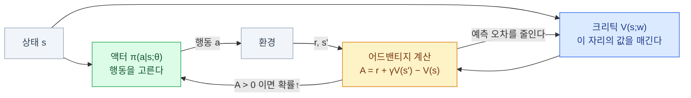
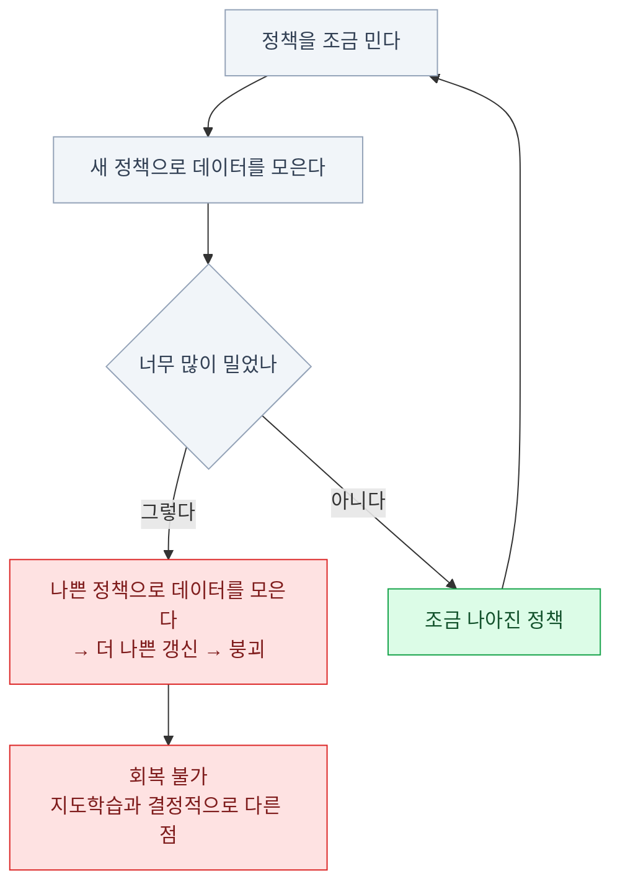

import { Tabs, TabItem, LinkCard, Badge } from '@astrojs/starlight/components';
import TermIntro from '../../../components/docs/TermIntro.astro';

> 좋았던 행동의 확률을 올리고 나빴던 행동의 확률을 내린다 — **정책 경사는 이 한 문장이 전부**다

<TermIntro
  terms={[
    ['정책 경사', 'Policy Gradient', '정책을 신경망으로 두고 **리턴이 커지는 방향으로 직접 파라미터를 미는** 방법.'],
    ['확률적 정책', 'Stochastic Policy · π(a|s)', '행동을 하나로 정하지 않고 **확률 분포로** 내놓는 정책. 탐색이 정책 안에 내장된다.'],
    ['REINFORCE', '리인포스', '가장 단순한 정책 경사 알고리즘. **에피소드가 끝난 뒤 받은 리턴으로** 확률을 밀고 당긴다.'],
    ['베이스라인', 'Baseline', '리턴에서 빼 주는 기준값. **평균을 빼는 것만으로 분산이 크게 준다** — 정답은 안 바뀐다.'],
    ['어드밴티지', 'Advantage · A(s,a)', '`Q(s,a) − V(s)`. **"평균보다 얼마나 나은 행동인가"** — 정책 경사가 실제로 쓰는 신호.'],
    ['액터-크리틱', 'Actor-Critic', '행동하는 쪽(액터)과 채점하는 쪽(크리틱)을 **두 신경망으로** 나눈 구조. 오늘날 주류의 골격.'],
  ]}
/>

## 문제 — Q로는 안 되는 것들

4장의 방식은 `Q`를 배우고 `argmax`로 행동을 골랐다. 여기에 걸림돌이 셋 있다.

| 걸림돌 | 무슨 일 |
|---|---|
| **연속 행동** | 관절 토크가 실수 7개면 `argmax`를 못 구한다 |
| **확률적 정책이 필요할 때** | 가위바위보에서 최선은 "무작위"다. `argmax`는 항상 하나만 고른다 |
| **행동 수가 폭발할 때** | 이산화하면 관절 수에 따라 곱셈으로 는다 ([2장](/rl/02-mdp/)) |

그래서 **가치를 거치지 말고 정책 자체를 학습 대상으로 두자**는 것이 이 장이다.

```text
π(a | s ; θ)     상태를 넣으면 행동의 확률(또는 연속 분포)을 내놓는 신경망
```

| 행동 형태 | 신경망이 내놓는 것 |
|---|---|
| 이산 | 각 행동의 확률 (softmax) |
| **연속** | 가우시안 분포의 **평균과 표준편차** — 거기서 뽑아 쓴다 |

연속 행동이 자연스럽게 나오는 것이 이 접근의 결정적 장점이다.
**연속 제어 로봇 RL에서 정책 기반·액터-크리틱 방법이 널리 쓰이는 이유**가 이것이다.

## 정책 경사 — 무엇을 미는가

목표는 "정책이 만드는 리턴의 평균을 키우는 것"이다. 그 목표를 `θ`로 미분한 결과가
**정책 경사 정리**인데, 결론만 보면 놀랄 만큼 단순하다.

```text
∇J(θ)  =  E[ ∇ log π(a|s ; θ) · G ]
             └── 그 행동을 ──┘   └ 그래서 ┘
                더 자주 하게      얼마나 좋았나
```

> **그 행동을 할 확률을 올리는 방향**에, **그 행동이 실제로 얼마나 좋았는지**를 곱한다.
> 좋았으면 확률을 올리고, 나빴으면 (음수가 곱해져) 확률을 내린다.

수학적으로는 로그를 쓰는 트릭이 들어가지만, 실무에서 기억할 것은 이 문장 하나다.
구현도 짧다 — **손실을 `−log π(a|s) · G`로 두고 평범하게 역전파**하면 된다.

<Tabs>
<TabItem label="REINFORCE 의사코드">

```python
for episode in range(N):
    # 1) 지금 정책으로 한 판 끝까지 돈다
    states, actions, rewards = rollout(env, policy)

    # 2) 각 시점의 리턴을 뒤에서부터 계산
    G, returns = 0, []
    for r in reversed(rewards):
        G = r + gamma * G
        returns.insert(0, G)

    # 3) 좋았던 행동의 로그 확률을 키운다
    loss = 0
    for s, a, Gt in zip(states, actions, returns):
        loss += -policy.log_prob(s, a) * Gt
    loss.backward(); optimizer.step()
```

</TabItem>
<TabItem label="왜 on-policy인가">

3번 줄의 `G`는 **지금 정책이 실제로 받아 온 리턴**이다.
정책이 갱신되면 그 데이터는 더 이상 지금 정책의 분포와 맞지 않는다. **바닐라
REINFORCE는 보정 없이 재사용하면 편향되므로 보통 버린다.** 중요도 샘플링 같은
off-policy 보정을 붙이면 재사용할 수 있지만 분산과 구현 복잡도가 늘어난다.

```text
데이터 수집 → 한 번(또는 몇 번) 학습 → 데이터 폐기 → 다시 수집
```

**샘플 효율이 나쁘다**는 뜻이고, 이것이 정책 경사 계열의 근본 비용이다.
그래서 바닐라 on-policy 계열은 **시뮬레이터 등으로 샘플을 비교적 싸게 모을 수 있는 자리**에서 편하다.

</TabItem>
</Tabs>

## 문제 — 분산이 지독하다

REINFORCE는 맞기는 맞는데 **너무 흔들린다.** 이유가 둘이다.

| 원인 | 무슨 일 |
|---|---|
| **에피소드 통째로 채점** | 한 판을 잘 끝냈으면 **그 안의 나쁜 수까지 전부** 확률이 올라간다 |
| **기준선이 없다** | 모든 리턴이 양수인 환경(예: 매 스텝 +1)이면 **모든 행동의 확률을 올리려 한다** |

두 번째가 특히 나쁘다. 리턴이 전부 양수면 방향은 결국 상대적 크기로만 정해지는데,
그러려면 표본이 아주 많이 필요하다.

### 처방 ① 베이스라인 — 평균을 뺀다

```text
∇J(θ) = E[ ∇ log π(a|s) · (G − b(s)) ]
```

> 리턴에서 **그 상태의 평균적인 성적 `b(s)`** 를 빼 준다.
> "잘한 것"이 아니라 **"평균보다 잘한 것"** 만 확률을 올린다.

놀라운 점은 **어떤 `b(s)`를 빼도 정답(기대 경사)은 안 바뀐다**는 것이다.
분산만 줄어든다. 공짜 개선이라 안 쓸 이유가 없다.

가장 널리 쓰이는 상태 의존 베이스라인은 가치 `V(s)`다. 정확한 최소 분산 베이스라인은
문제와 경사 크기에 따라 달라질 수 있지만, `V(s)`는 유용하고 계산하기 쉬운 표준 선택이다. 그러면 —

```text
G − V(s)  ≈  Q(s,a) − V(s)  =  A(s,a)      어드밴티지
```

> **"이 행동은 이 자리의 평균보다 얼마나 나은가."**

### 처방 ② 크리틱 — 끝까지 안 기다린다

`V(s)`를 알아야 하는데, 그걸 또 하나의 신경망으로 배운다. 그게 **크리틱**이다.
동시에 리턴을 끝까지 기다리지 않고 **TD로 대체**하면 매 스텝 학습할 수 있다.

```text
A(s,a) ≈ r + γ·V(s') − V(s)        ← 3장의 TD 오차와 같은 식이다
```

여기서 **액터-크리틱** 구조가 완성된다.



| 역할 | 배우는 것 | 신호 |
|---|---|---|
| **액터** (정책) | 무엇을 할까 | 어드밴티지 — 평균보다 좋았으면 확률을 올린다 |
| **크리틱** (가치) | 이 자리가 얼마짜리인가 | TD 오차 — 예측을 실제 쪽으로 옮긴다 |

**3장의 "평가 → 개선" 구조가 그대로 신경망 두 개로 구현된 것**이다.

:::tip[핵심 — 어드밴티지가 실질적인 학습 신호다]
정책 경사 계열에서 실제로 정책을 움직이는 것은 보상도 리턴도 아니고 **어드밴티지**다.
`A > 0`이면 "그 행동을 더", `A < 0`이면 "덜". 6장의 PPO도, LLM 후처리에 쓰는
정책 경사 변형들도 전부 이 신호를 어떻게 안정적으로 만드느냐의 이야기다.
:::

## A2C — 실제로 돌리는 형태

액터-크리틱을 실전에서 돌릴 때 두 가지가 추가된다.

| 추가 | 왜 |
|---|---|
| **환경 여러 개를 동시에** (벡터화) | 한 환경에서 순차로 모은 데이터는 상관이 높다. 16~4096개를 병렬로 돌려 배치를 만든다 |
| **엔트로피 보너스** | 정책이 한 행동으로 쏠려 **탐색이 죽는 것**을 막는다 |

```text
전체 손실 = 정책 손실 − c₁·엔트로피 + c₂·가치 손실
                        ▲               ▲
                 다양성을 유지하는 항   크리틱 학습
```

> 세 항을 한 손실로 묶어 한 번에 역전파한다. `c₁`(엔트로피 계수)은 **탐색 손잡이**,
> `c₂`는 크리틱 학습 세기다.

:::caution[함정 1 — 엔트로피 계수를 0으로 두면]
학습 초반에 정책이 **한 행동으로 붕괴**하고 거기서 못 빠져나온다.
보상 곡선이 낮은 값에서 평평해지면 **엔트로피 값을 로그로 찍어 본다** —
너무 빨리 0으로 떨어지고 있으면 계수를 올린다 (연속 제어에서 `0.0`~`0.01`,
이산 과제에서 `0.01` 정도가 흔한 출발점이다).
:::

## 남은 문제 — 한 걸음의 크기

액터-크리틱에는 아직 큰 구멍이 하나 있다. **정책을 얼마나 밀어야 하는가**이다.



지도학습이라면 학습률을 크게 잡아 손실이 튀어도 다음 배치에서 회복한다.
강화학습은 **데이터를 정책 자신이 만들기 때문에**, 한 번 크게 잘못 밀면
그다음 데이터가 통째로 나빠져 **회복하지 못한다.**

:::caution[함정 2 — 학습률만으로는 못 막는다]
파라미터 `θ`를 조금 바꾼 것이 **정책의 행동 분포를 크게 바꿀 수도** 있다.
"파라미터 공간에서의 거리"와 "행동 분포에서의 거리"가 다르기 때문이다.
그래서 학습률을 줄이는 것으로는 부족하고, **분포가 얼마나 바뀌었는지를 직접 재서 제한**해야 한다.
:::

이 문제를 정면으로 다룬 것이 TRPO이고, **그걸 훨씬 간단하게 근사한 것이 PPO**다.
다음 장이 그 이야기다.

| 알고리즘 | 스텝 크기를 어떻게 다루나 | 오늘의 위치 |
|---|---|---|
| REINFORCE | 안 다룬다 | 교육용 |
| A2C / A3C | 안 다룬다 (작은 학습률로 버틴다) | 옛 표준 |
| **TRPO** | 분포 변화량(KL)에 **엄격한 제약**을 건다 | 이론적 기준. 구현이 무겁다 |
| **PPO** | 비율을 잘라서 **간단히 근사** | <Badge text="널리 쓰임" variant="success" /> |

## 참고 자료

- [Simple Statistical Gradient-Following Algorithms for Connectionist Reinforcement Learning](https://link.springer.com/article/10.1007/BF00992696) — REINFORCE 원 논문
- [Policy Gradient Methods for Reinforcement Learning with Function Approximation](https://proceedings.neurips.cc/paper/2000/hash/464d828b85b0bed98e80ade0a5c43b0f-Abstract.html) — 정책 경사 정리와 액터-크리틱
- [High-Dimensional Continuous Control Using Generalized Advantage Estimation](https://arxiv.org/abs/1506.02438) — 가치 베이스라인과 GAE

## 5장 요약

- 정책 경사는 **가치를 거치지 않고 정책을 직접 민다** — 연속 행동과 확률적 정책이 자연스럽다
- 핵심 문장 하나 — **좋았던 행동의 확률을 올리고 나빴던 행동의 확률을 내린다**
- REINFORCE는 맞지만 **분산이 지독하다.** 한 판을 잘 끝내면 그 안의 나쁜 수까지 올라간다
- **행동에 의존하지 않는 베이스라인을 빼면 기대 경사는 그대로다.** `V(s)`가 널리 쓰이는 표준 선택이다
- 그래서 실제 학습 신호는 **어드밴티지 `A = Q − V`** — "평균보다 얼마나 나은가"다
- `V`를 신경망으로 배우면 **액터-크리틱**이 되고, 이는 3장의 평가 → 개선 구조 그대로다
- 실전 형태(A2C)에는 **환경 벡터화**와 **엔트로피 보너스**가 붙는다
- 바닐라 on-policy 추정기는 **정책이 바뀐 데이터를 보정 없이 재사용할 수 없다** — 샘플 비용이 크다
- 남은 구멍은 **한 걸음의 크기**다. 학습률로는 못 막고, 분포 변화량을 직접 제한해야 한다

<LinkCard
  title="6. PPO와 SAC — 오늘 실제로 쓰는 것"
  description="두 알고리즘이 각각 무슨 문제를 풀었고, 어떤 상황에서 무엇을 고르는가. 하이퍼파라미터의 실전 감각까지."
  href="/rl/06-ppo-sac/"
/>
