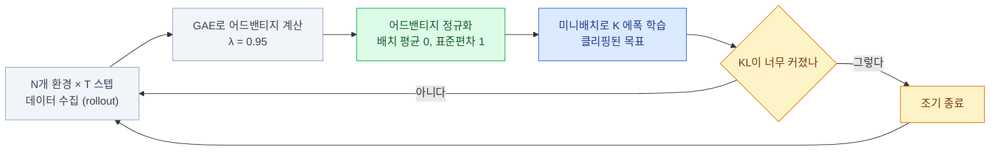
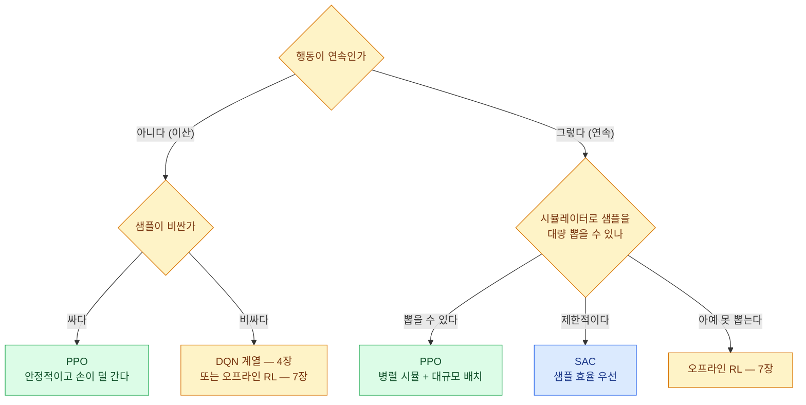

import { Tabs, TabItem, LinkCard, Badge } from '@astrojs/starlight/components';
import TermIntro from '../../../components/TermIntro.astro';

> 알고리즘 선택은 사실상 **"샘플이 싼가 비싼가"** 한 질문으로 끝난다

<TermIntro
  terms={[
    ['PPO', 'Proximal Policy Optimization · 근접 정책 최적화', '정책이 **한 번에 너무 많이 변하지 못하게 잘라 내는** on-policy 알고리즘. 로봇·LLM 후처리의 사실상 표준.'],
    ['클리핑', 'Clipping', '새 정책과 옛 정책의 확률 **비율을 일정 범위 밖으로 못 나가게** 자르는 것. PPO의 전부라 해도 된다.'],
    ['SAC', 'Soft Actor-Critic', '보상뿐 아니라 **정책의 무작위성(엔트로피)까지 같이 키우는** off-policy 알고리즘. 연속 제어의 샘플 효율 챔피언.'],
    ['최대 엔트로피 RL', 'Maximum Entropy RL', '"보상을 키우되 **가능한 한 여러 방식으로**"를 목표로 삼는 틀. 탐색이 목적 함수에 들어간다.'],
    ['쌍둥이 크리틱', 'Twin Critics · Clipped Double Q', '크리틱을 둘 두고 **작은 값을 쓴다.** 과대추정을 누르는 표준 처방.'],
    ['벡터 환경', 'Vectorized Environment', '환경 수백~수천 개를 **동시에** 돌려 배치를 만드는 것. on-policy 알고리즘의 생명줄이다.'],
  ]}
/>

## PPO — 한 걸음을 잘라 낸다

5장이 남긴 문제는 "정책을 얼마나 밀어야 하나"였다. PPO의 답은 놀랍도록 단순하다.
**너무 많이 밀었으면, 거기서 더 밀어 봐야 이득이 없게 만든다.**

```text
ratio = π_new(a|s) / π_old(a|s)          정책이 얼마나 변했나 (1이면 그대로)

목표 = min(  ratio · A ,  clip(ratio, 1−ε, 1+ε) · A  )        ε = 0.2 정도
```

> 확률 비율이 `0.8~1.2` 밖으로 나가면 **잘라 버려서, 더 밀어도 목표가 안 커진다.**
> 결과적으로 한 번의 갱신이 정책을 크게 바꾸지 못한다.

이 하나로 얻는 것이 크다 — **모은 데이터를 여러 번(에폭 4~10회) 재사용할 수 있게 된다.**
on-policy인데도 데이터를 조금은 아껴 쓸 수 있는 이유다.

### PPO의 한 사이클



**데이터를 모으고 → 여러 번 재사용해 학습하고 → 버리고 다시 모은다.**
이 사이클이 PPO의 전부다.

### 구현 디테일이 성능의 절반이다

PPO는 논문 식만 보고 짜면 **거의 확실히 성능이 안 나온다.**
아래 항목들이 알고리즘만큼 중요하다는 것이 재현 연구들의 공통 결론이다.

| 디테일 | 안 하면 | 비고 |
|---|---|---|
| **어드밴티지 정규화** | 스케일에 따라 학습률이 사실상 달라진다 | 미니배치마다 |
| **관측 정규화** (러닝 평균·분산) | 스케일이 큰 관측 하나가 학습을 지배한다 | 실전에서 가장 자주 빠뜨린다 |
| **보상 스케일링** | 가치 손실이 폭주한다 | 리턴의 표준편차로 나눈다 |
| **직교 초기화 + 작은 마지막 층** | 초반 정책이 극단으로 쏠린다 | 마지막 층 가중치를 100배 작게 |
| **경사 클리핑** (norm 0.5) | 가끔 한 배치가 정책을 망가뜨린다 | 사실상 필수 |
| **`truncated` 처리** | 시간 제한을 실패로 배운다 ([2장](/rl/02-mdp/)) | 잘린 시점의 가치를 이어 붙인다 |
| **학습률 선형 감쇠** | 후반에 흔들린다 | 흔한 기본 |

:::caution[함정 1 — "PPO가 안 되네요"의 8할]
알고리즘이 아니라 **관측 정규화 · 어드밴티지 정규화 · 보상 스케일**에서 온다.
새 환경에서 PPO가 전혀 안 오를 때 이 셋부터 확인한다.
검증된 구현체(Stable-Baselines3 2.9)로 먼저 돌려서 **환경 쪽 문제인지 구현 쪽 문제인지**
가르는 것이 가장 빠른 진단이다.
:::

### 흔히 쓰는 하이퍼파라미터

**환경마다 다르다.** 아래는 연속 제어(MuJoCo류) 기준의 출발점이지 정답이 아니다.

| 값 | 흔한 출발점 | 감각 |
|---|---|---|
| `γ` (할인율) | 0.99 | 문제 정의의 일부 |
| `λ` (GAE) | 0.95 | 편향-분산 손잡이 |
| `ε` (클립) | 0.2 | 크면 빠르고 불안정 |
| 에폭 | 10 | 크면 옛 데이터에 과적합 |
| 병렬 환경 | 8~64 (시뮬 규모에 따라 수천) | 많을수록 배치가 안정 |
| 롤아웃 길이 | 2048 / 환경 | 병렬 수 × 길이 = 배치 |
| 학습률 | 3e-4 | 대개 여기서 시작 |
| 엔트로피 계수 | 0.0 (연속) / 0.01 (이산) | 탐색이 죽으면 올린다 |

## SAC — 샘플을 아껴야 할 때

PPO는 데이터를 모으고 쓰고 버린다. 시뮬레이터가 있으면 괜찮지만,
**실물 로봇이나 느린 시뮬에서는 그 낭비를 감당할 수 없다.**
SAC는 재생 버퍼를 쓰는 off-policy 알고리즘이라 **경험 하나를 수백 번 재사용**한다.

SAC의 두 번째 아이디어는 목표 자체를 바꾼 것이다.

```text
목표 = E[ Σ ( r  +  α · H(π(·|s)) ) ]
                     └── 엔트로피 ──┘
```

> **보상을 키우되, 정책은 가능한 한 무작위로 유지한다.**
> "가장 여러 방식으로 잘하는 정책"을 찾는 셈이다.

이 항이 하는 일이 셋이다 — **탐색이 저절로 유지되고**, 하나의 해법에 조기 수렴하지 않고,
**여러 해법을 알고 있어 교란에 강해진다**(로봇에서 특히 값지다).

### SAC를 이루는 부품

| 부품 | 하는 일 |
|---|---|
| **재생 버퍼** | off-policy 학습. 샘플 재사용 ([4장](/rl/04-value-based/)) |
| **쌍둥이 크리틱** | Q 둘 중 **작은 값**을 쓴다 — 과대추정 억제 |
| **소프트 타깃 갱신** | `τ = 0.005`로 조금씩 섞는다 |
| **재파라미터화** | 확률적 행동에도 경사가 흐르게 한다 |
| **온도 `α` 자동 조절** | 목표 엔트로피를 정해 두고 `α`를 학습으로 맞춘다 |

마지막 것이 실무에서 크다 — **탐색 세기를 사람이 안 만져도 된다.**
SAC가 "손이 덜 가는 알고리즘"으로 불리는 이유다.

### TD3 — 결정적 정책 쪽의 대안

같은 자리에 TD3도 있다. SAC와 형제 관계이고, 셋을 고쳤다.

| 처방 | 무엇 |
|---|---|
| 쌍둥이 크리틱 | 작은 Q를 쓴다 (SAC와 같다) |
| **지연된 정책 갱신** | 크리틱을 2번 고칠 때 액터는 1번 |
| **타깃 정책 평활화** | 타깃 계산 시 행동에 잡음을 더해 뾰족한 Q를 뭉갠다 |

| | SAC | TD3 |
|---|---|---|
| 정책 | 확률적 | 결정적 + 탐색 잡음 |
| 탐색 | 목적 함수에 내장 | 사람이 잡음을 설계 |
| 튜닝 | **덜 민감** | 잡음 스케줄에 민감 |
| 실무 | **먼저 시도** | SAC가 안 될 때 |

## 무엇을 고르나



| | PPO | SAC |
|---|---|---|
| 방식 | on-policy | off-policy |
| 샘플 효율 | 나쁘다 | **좋다** (10~100배) |
| 안정성 | **매우 좋다** | 좋다 (하이퍼파라미터에 조금 더 민감) |
| 병렬화 | **매우 잘 된다** — 환경 수천 개 | 버퍼 병목이 있다 |
| 이산 행동 | 된다 | 변형이 필요하다 |
| 대표 자리 | **로봇 시뮬 대량 학습**, LLM 후처리 | **실물 로봇**, 느린 시뮬 |

:::tip[핵심 — 실제 선택 기준은 하나다]
**샘플이 공짜면 PPO, 아까우면 SAC.**

Isaac Lab처럼 GPU에서 로봇 4096개를 동시에 굴릴 수 있으면(15장) PPO의 낭비는
문제가 안 되고, 오히려 그 안정성이 이긴다. 반대로 실물 로봇에서 하루에 몇 시간밖에
못 굴리면 경험 하나를 수백 번 재사용하는 SAC가 답이다.
:::

:::caution[함정 2 — 두 응용 모두에서 SAC·PPO가 답이 아닐 수 있다]
트레이딩은 **셋째 갈래**로 간다 — 새 샘플을 아예 못 뽑기 때문에 위 두 알고리즘을
그대로 쓰면 데이터에 없는 행동을 과대평가한다. 7장이 그 이야기다.

실물 로봇도 실제로는 **시뮬에서 PPO로 배우고 실물로 옮기는**(sim-to-real) 경로가
주류다. "실물에서 SAC로 처음부터 배운다"는 연구 데모에 가깝다 ([15장](/rl/15-robot-stack/)).
:::

## 알고리즘 지도 정리

| 알고리즘 | 행동 | 정책 | 샘플 | 오늘의 위치 |
|---|---|---|---|---|
| DQN 계열 | 이산 | off | 좋음 | 이산 과제·트레이딩 |
| A2C | 둘 다 | on | 나쁨 | PPO에 밀렸다 |
| **PPO** | 둘 다 | on | 나쁨 | <Badge text="표준" variant="success" /> 로봇 시뮬·LLM |
| DDPG | 연속 | off | 좋음 | TD3·SAC에 밀렸다 |
| TD3 | 연속 | off | 좋음 | SAC 대안 |
| **SAC** | 연속 | off | **매우 좋음** | <Badge text="표준" variant="success" /> 연속 제어 |
| CQL · IQL | 둘 다 | 오프라인 | — | [7장](/rl/07-offline-model/) |

## 6장 요약

- PPO는 **확률 비율을 잘라서** 한 번의 갱신이 정책을 크게 못 바꾸게 한다
- 그 덕에 **모은 데이터를 여러 에폭 재사용**할 수 있다 — on-policy의 낭비를 조금 줄인다
- PPO는 **구현 디테일이 성능의 절반**이다. 특히 **관측 정규화 · 어드밴티지 정규화 · 보상 스케일**
- 새 환경에서 안 될 때는 **검증된 구현체로 먼저 돌려** 환경 문제인지 구현 문제인지 가른다
- SAC는 **재생 버퍼로 샘플을 아끼고**, 목표에 **엔트로피를 넣어** 탐색을 내장한다
- SAC의 부품 — 쌍둥이 크리틱 · 소프트 타깃 · 온도 자동 조절. **손이 덜 간다**
- TD3는 결정적 정책 쪽 형제다. **먼저 SAC를 시도하고 안 되면 TD3**
- 선택 기준은 하나 — **샘플이 공짜면 PPO, 아까우면 SAC, 아예 못 뽑으면 오프라인 RL**

<LinkCard
  title="7. 데이터를 아끼는 법 — 오프라인 RL과 모델 기반"
  description="새 데이터를 못 뽑는 상황에서 배우는 법. 분포 이탈이라는 근본 문제, CQL·IQL의 처방, 그리고 세계 모델을 배워 그 안에서 연습하는 접근."
  href="/rl/07-offline-model/"
/>
