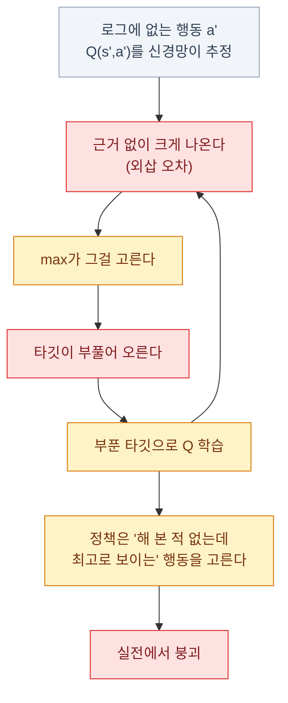
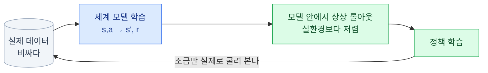

import { Tabs, TabItem, LinkCard, Badge } from '@astrojs/starlight/components';
import TermIntro from '../../../components/docs/TermIntro.astro';

> 오프라인 강화학습의 적은 알고리즘이 아니라 **"안 해 본 행동을 좋게 평가하는"** 낙관이다

<TermIntro
  terms={[
    ['오프라인 RL', 'Offline RL · Batch RL', '**이미 쌓인 로그로만** 정책을 배우는 것. 학습 중에 환경과 새로 상호작용하지 않는다.'],
    ['행동 정책', 'Behavior Policy · β', '그 로그를 **실제로 만든** 정책. 사람일 수도, 예전 규칙 시스템일 수도 있다.'],
    ['분포 이탈', 'Distributional Shift', '배운 정책이 **데이터에 없는 행동**을 하려 드는 것. 오프라인 RL의 근본 문제다.'],
    ['외삽 오차', 'Extrapolation Error', '데이터에 없는 `(s,a)`의 Q값을 신경망이 **멋대로 크게** 추정하는 현상. 낙관이 폭주한다.'],
    ['행동 복제', 'Behavior Cloning · BC', '로그의 `(상태 → 행동)`을 **지도학습으로 그대로 흉내**내는 것. 오프라인의 가장 강력한 기준선이다.'],
    ['세계 모델', 'World Model · Dynamics Model', '환경의 전이 `P(s\'|s,a)`를 **학습으로 흉내낸 것**. 그 안에서 상상으로 연습할 수 있다.'],
  ]}
/>

## 문제 — 새로 뽑을 수 없는 데이터

4~6장의 알고리즘은 전부 **"더 해 보고 배운다"** 를 전제한다. 그런데 —

| 상황 | 왜 못 뽑나 |
|---|---|
| 주식 매매 | **과거를 다시 살 수 없다.** 게다가 탐색은 실제 손실이다 |
| 실물 로봇 | 부품이 부서지고, 하루에 몇 시간뿐이다 |
| 의료·산업 공정 | 탐색이 곧 사고다 |
| 추천·광고 | 실험 트래픽에 한도가 있다 |

공통점은 **로그는 있지만 새 시행착오가 불가능하거나 매우 비싸다**는 것이다.
그러면 그 로그로만 배우면 될 것 같은데, **그대로 하면 처참하게 실패한다.**

## 왜 그냥 하면 안 되나 — 분포 이탈

Q러닝의 타깃에는 `max_a' Q(s',a')`가 들어 있다. 그 `max`는 **데이터에 없는 행동까지 포함해서**
최대를 고른다. 그리고 신경망은 안 본 입력에 대해 아무 값이나 내놓는다.



**되먹임 고리가 닫혀 있다는 점이 무섭다.** 온라인이라면 그 행동을 해 보고
"아 아니네" 하고 값을 내릴 수 있는데, **오프라인에서는 정정할 기회가 영영 없다.**

:::caution[함정 1 — 오프라인 성적표가 좋아 보이는 이유]
학습 로그에서 Q값도 오르고 "예상 수익"도 오른다. **그 예상 자체가 부푼 값**이라 그렇다.
오프라인 RL에서 **자기가 만든 가치 추정을 성능 지표로 보면 안 된다.**
평가는 반드시 아래의 OPE나 별도 검증 구간으로 한다.
:::

## 처방 — 데이터 근처에 묶어 둔다

오프라인 알고리즘들의 아이디어는 결국 하나다.
**"데이터가 뒷받침하지 않는 행동을 좋게 평가하지 마라."**

| 방식 | 대표 | 어떻게 | 성격 |
|---|---|---|---|
| **정책을 제약** | BCQ · TD3+BC | 배운 정책이 행동 정책에서 크게 못 벗어나게 | 직관적, 보수적 |
| **가치를 보수적으로** | **CQL** | 데이터에 없는 행동의 Q를 **일부러 낮춘다** | 널리 쓰인다 |
| **max를 아예 피한다** | **IQL** | 데이터 안 행동의 Q로 상위 **기대분위수(expectile)** 를 학습 | 비교적 단순한 구성 |
| **순서 예측으로 바꾼다** | Decision Transformer | "이 수익을 내려면 무슨 행동" 을 시퀀스 모델로 | 흥미롭지만 조건부 |

### CQL — 못 본 행동에 벌점

```text
가치 손실 = (평소 TD 손실)  +  c · [ 데이터에 없는 행동의 Q 평균 − 데이터에 있는 행동의 Q ]
```

> 로그에 없는 행동의 Q는 **눌러 내리고**, 로그에 있는 행동의 Q는 유지한다.
> 결과적으로 데이터 분포 아래에서 Q를 더 **보수적으로 추정하도록 유도**한다 — 낙관 대신 비관을 택한다.

### IQL — `max`를 쓰지 않는다

```text
V(s) ← 데이터 안 행동들의 Q에 비대칭 제곱 손실을 적용해 상위 τ 기대분위수(expectile)를 맞힌다
Q(s,a) ← r + γ · V(s')
정책 ← 어드밴티지가 큰 (데이터 안) 행동에 가중치를 준 지도학습
```

> "안 해 본 행동"을 아예 쳐다보지 않고, **로그 안에서 잘된 행동에 무게를 싣는다.**

여기서 expectile은 순서만 보는 **quantile(분위수)이 아니다.** 값의 크기까지 반영하는
비대칭 제곱 손실의 해다. IQL은 정책 제약 항을 직접 최적화하지 않는 비교적 단순한 구성이지만,
`τ`와 가중치 온도 외에도 학습률·네트워크·업데이트 설정 등 일반 하이퍼파라미터는 여전히 조정해야 한다.

:::tip[핵심 — 먼저 행동 복제를 기준선으로 돌린다]
**로그에 있는 행동을 그대로 흉내내는 BC(행동 복제)가 놀랍도록 강하다.**
데이터가 이미 좋은 정책(숙련자·잘 튜닝된 규칙 시스템)에서 나왔다면
오프라인 RL이 BC를 못 이기는 경우가 흔하다.

목표가 행동 정책보다 성능을 높이는 것이라면, **BC를 못 이긴 결과는 추가 복잡성을
정당화하기 어렵다.** 안전성·제약 등 다른 목표가 있다면 그 지표를 별도로 제시한다.
반대로 데이터가 잡다한 품질이면 RL 쪽이 "잘된 부분만 골라 배울" 수 있어 이긴다.
:::

## 오프라인 정책 평가 — 배포 전에 어떻게 아나

새로 못 굴려 보는데 정책이 좋은지 어떻게 아는가. 이것이 **OPE(Off-Policy Evaluation)** 이고,
**오프라인 RL에서 알고리즘보다 어려운 문제**다.

| 방법 | 아이디어 | 약점 |
|---|---|---|
| **중요도 가중** (IS) | 로그를 확률 비로 재가중해 새 정책 성과를 추정 | 스텝이 길면 **분산이 폭발**한다 |
| **가중 IS · 이중 강건(DR)** | 가중치를 정규화하고 모델 추정과 섞는다 | 여전히 분산이 크다 |
| **적합 Q 평가 (FQE)** | 새 정책 기준으로 Q를 다시 학습해 평가 | 같은 외삽 문제가 재발 |
| **시간 분할 검증** | 학습에 안 쓴 **뒤 기간**에서 돌려 본다 | 가장 실무적. 12장의 워크포워드 |
| **소액 실전 배포** | 아주 작은 규모로 실제 운용 | 가장 믿을 만하고 가장 비싸다 |

:::caution[함정 2 — 로그의 행동 확률을 모르면 IS를 못 쓴다]
중요도 가중은 **로그를 만든 정책의 행동 확률 `β(a|s)`** 가 필요하다.
사람이 만든 로그나 결정적 규칙 시스템의 로그에는 그 값이 없다.
그래서 실무에서는 **행동 확률을 별도 모델로 추정**하거나(오차가 그대로 들어온다),
아예 시간 분할 검증으로 간다. **로그를 남길 때 행동 확률을 같이 저장해 두는 것**이
나중에 큰 자산이 된다.
:::

## 모델 기반 강화학습 — 환경을 배워서 연습한다

다른 방향의 절약이 있다. **환경 자체를 신경망으로 배워서, 그 안에서 마음껏 연습**하는 것이다.



| 접근 | 무엇 | 특징 |
|---|---|---|
| **Dyna류 · MBPO** | 배운 모델로 **짧은** 상상 롤아웃을 만들어 SAC 등에 먹인다 | 샘플 효율이 크게 오른다 |
| **Dreamer 계열** | 잠재 공간에서 세계 모델을 배우고 **거기서만** 정책을 학습 | 픽셀 입력 과제에 강하다 |
| **모델 예측 제어(MPC) + 학습 모델** | 매 순간 모델로 앞을 시뮬해 행동 선택 | 정책을 안 배워도 된다 |

**대가는 모델 오차의 누적**이다. 배운 모델로 100스텝을 상상하면 뒤로 갈수록 환상이 된다.
그래서 흔한 처방은 **모델 오차에 맞춰 상상 롤아웃을 짧게 자르는 것**이다. 적절한 길이는 환경마다 다르다.

:::caution[함정 3 — 시장의 세계 모델을 배우려는 시도]
모델 기반은 **물리처럼 규칙이 안정된 곳에서 잘 된다.** 시장은 그 반대다 —
전이 자체가 시간에 따라 변하고(비정상성), 참가자들이 서로 반응한다.
"시장 시뮬레이터를 학습으로 만들어 그 안에서 RL을 돌린다"는 접근은 매력적으로 보이지만,
**모델이 만든 세계에 과적합한 정책**이 나오기 쉽다.
쓰더라도 **호가창 미시구조처럼 규칙이 비교적 안정된 좁은 범위**로 한정한다 ([13장](/rl/13-trading-practice/)).
:::

## 두 응용에서의 위치

| | 로봇 | 트레이딩 |
|---|---|---|
| 오프라인 RL | 시연 데이터 활용, 실물 미세조정에 씀 | **주력 접근**이 될 수밖에 없다 |
| 세계 모델 | 픽셀 기반 조작에서 활발 | 좁은 범위(체결)에서만 |
| BC 기준선 | 널리 쓰임 — 16장의 모방학습 | 기존 규칙 전략을 흉내내는 출발점 |
| 실전 검증 | 실물에서 조심스럽게 굴려 본다 | **워크포워드 + 소액 배포**([12장](/rl/12-trading-design/)) |

## 참고 자료

- [Offline Reinforcement Learning: Tutorial, Review, and Perspectives](https://arxiv.org/abs/2005.01643) — 오프라인 RL의 문제 설정과 방법론 개관
- [Conservative Q-Learning for Offline Reinforcement Learning](https://arxiv.org/abs/2006.04779) — CQL 원 논문
- [Offline Reinforcement Learning with Implicit Q-Learning](https://arxiv.org/abs/2110.06169) — IQL의 expectile 회귀와 정책 추출

## 7장 요약

- 새 샘플을 못 뽑는 상황(시장 · 실물 로봇 · 의료)에서는 온라인 알고리즘을 그대로 못 쓴다
- 근본 문제는 **분포 이탈**이다 — `max`가 **데이터에 없는 행동**을 근거 없이 높게 평가한다
- 온라인이면 해 보고 정정하지만, **오프라인에는 정정 기회가 없어** 되먹임이 닫힌다
- 처방은 하나로 요약된다 — **데이터가 뒷받침하지 않는 행동을 좋게 평가하지 마라**
- **CQL은 못 본 행동의 Q를 낮추고**, **IQL은 `max` 대신 expectile 회귀를 쓴다.** expectile은 quantile과 다르다
- **행동 복제(BC)를 항상 기준선으로 둔다.** 개선 목적이라면 BC를 못 이길 때 복잡성을 정당화하기 어렵다
- 평가(OPE)가 학습보다 어렵다. 중요도 가중은 분산이 폭발하고, **행동 확률을 로그에 남겨 둬야** 쓸 수 있다
- 실무에서 제일 믿을 만한 평가는 **시간 분할 검증과 소액 실전 배포**다
- 모델 기반은 환경을 배워 상상 속에서 연습한다. **상상은 짧게 잘라야** 하고, **시장에는 잘 안 맞는다**

<LinkCard
  title="8. 보상 설계 — 에이전트는 준 대로 한다"
  description="리워드 해킹의 실제 모습, 희소 보상과 셰이핑, 잠재 기반 셰이핑이 안전한 이유, 다목적 보상과 제약, 그리고 커리큘럼."
  href="/rl/08-reward/"
/>
