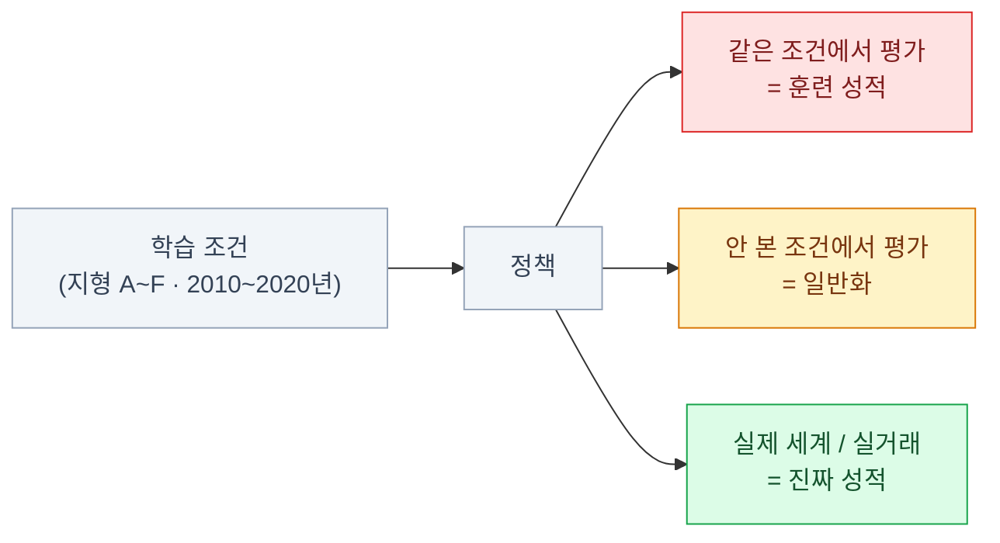

import { Tabs, TabItem, LinkCard, Badge } from '@astrojs/starlight/components';
import TermIntro from '../../../components/docs/TermIntro.astro';

> 강화학습에서 가장 흔한 거짓말은 **"시드 세 개 돌려 봤더니 좋아졌습니다"** 이다

<TermIntro
  terms={[
    ['시드 분산', 'Seed Variance', '같은 코드·같은 설정인데 **난수 시드만 달라 결과가 크게 갈리는** 현상. 강화학습에서는 예외가 아니라 기본이다.'],
    ['평가 환경', 'Evaluation Environment', '학습에 쓰지 않은 조건으로 성능을 재는 별도 환경. **학습 환경에서 잰 숫자는 성능이 아니다.**'],
    ['IQM', 'Interquartile Mean · 사분위 평균', '상하위 25%를 버리고 가운데 50%만 평균낸 값. **이상치 몇 개에 안 흔들리는** 요약 통계다.'],
    ['부트스트랩 신뢰구간', 'Bootstrap CI', '적은 표본에서 **재표집으로 불확실성 구간**을 구하는 방법. 시드가 적을 때 쓰는 표준 처방.'],
    ['일반화', 'Generalization', '학습에서 안 본 조건(지형·종목·기간)에서도 되는가. 강화학습은 **학습 환경 자체에 과적합**하기 쉽다.'],
    ['절제 실험', 'Ablation', '부품을 하나씩 빼 보며 **무엇이 실제로 기여했는지** 가리는 실험.'],
  ]}
/>

## 문제 — 같은 코드가 다른 결과를 낸다

강화학습은 시드 하나만 바꿔도 **성공과 완전 실패가 갈린다.**
데이터를 정책 자신이 만들기 때문이다 — 초반에 운 좋게 좋은 영역을 밟은 실행과
못 밟은 실행은 **다른 데이터셋으로 학습한 것**이나 마찬가지다.

```text
같은 설정, 시드만 다르게 10번:

  시드 0  ████████████████████  980
  시드 1  ███████████████       740
  시드 2  █                      35   ← 학습 실패
  시드 3  ██████████████████     890
  시드 4  ██                     60   ← 학습 실패
  …

  "평균 600" 이라는 한 숫자가 이 그림을 통째로 감춘다
```

> 시드 3개만 뽑아 좋은 것만 보고하면 **어떤 결론이든 만들 수 있다.**
> 강화학습 논문 재현이 어렵다는 평판의 큰 몫이 여기서 나온다.

:::caution[함정 1 — 학습 곡선의 최고점을 보고한다]
학습 도중 가장 좋았던 지점을 성능으로 쓰는 것은 **평가 데이터로 모델을 고른 것**과 같다.
정해진 스텝 수에서 멈추고 그때의 정책을 평가하거나, 체크포인트를 고를 거면
**고르는 데 쓴 구간과 보고하는 구간을 분리**한다.
:::

## 평가 프로토콜

### 학습과 평가를 분리한다

| 항목 | 학습 환경 | 평가 환경 |
|---|---|---|
| 탐색 | 확률적 행동, 엔트로피 보너스 | **결정적 행동**(분포의 평균)이 기본 |
| 무작위화 | 도메인 랜덤화 켠다 | **평가용 조건**으로 고정하거나 다른 범위 |
| 정규화 | 통계를 계속 갱신 | **갱신을 멈추고** 학습 시점 통계 사용 |
| 시작 조건 | 학습용 분포 | **안 본 초기 조건**을 포함 |

:::caution[함정 2 — 정규화 통계를 평가 중에 갱신한다]
평가 중에도 관측 정규화 통계를 갱신하면 **평가 데이터의 정보가 정책에 새어든다.**
`SB3`에서 `VecNormalize`를 평가에 쓸 때 `training=False`, `norm_reward=False`로
두는 것이 이 이유다. 트레이딩에서는 이 실수가 곧 **미래 정보 누출**이 된다.
:::

### 몇 번 재나

| 축 | 최소 | 권장 |
|---|---|---|
| **학습 시드** | 5 | **10 이상** |
| 시드당 평가 에피소드 | 10 | 30~100 (환경 무작위성이 크면 더) |
| 평가 시점 | 학습 끝 | 학습 중 주기적으로 + 끝 |

**시드 수를 늘리는 것이 하이퍼파라미터를 하나 더 만지는 것보다 대개 더 값지다.**
시드 3개로 얻은 "5% 개선"은 거의 항상 잡음이다.

## 평균 말고 무엇을 보고하나

시드별 결과는 **분포**다. 평균 하나로 요약하면 위 그림의 실패 시드들이 사라진다.

| 통계 | 성격 | 언제 |
|---|---|---|
| 평균 | 이상치에 취약. 실패 시드 하나가 다 망친다 | 잘 안 쓴다 |
| 중앙값 | 견고하지만 정보를 많이 버린다 | 보조 |
| **IQM (사분위 평균)** | 상하위 25%를 버린 평균. **견고하면서 정보도 유지** | <Badge text="권장" variant="success" /> 주 지표 |
| **부트스트랩 신뢰구간** | 불확실성을 구간으로 | <Badge text="필수" variant="success" /> 항상 같이 |
| **성능 프로파일** | "임계값 x 이상을 낸 실행의 비율" 곡선 | 방법 간 비교 |
| 성공률 | 이진 과제에서 직관적 | 조작·목표 도달 과제 |

```text
보고 예시 (나쁨) :  "제안 방법 852점, 기준선 790점 — 개선"
보고 예시 (좋음) :  "제안 IQM 811 [745, 866], 기준선 IQM 780 [702, 843], 시드 10개
                     → 구간이 크게 겹친다. 차이를 주장하지 않는다"
```

:::tip[핵심 — 구간이 겹치면 차이를 주장하지 않는다]
강화학습 실험에서 **신뢰구간이 겹치는 두 방법은 "같다"** 고 보는 것이 안전하다.
이 습관 하나가 헛된 방향으로 몇 주를 쓰는 것을 막는다.
:::

## 일반화 — 학습 환경에 과적합한다

강화학습은 **환경 자체를 외운다.** 지도학습의 과적합보다 알아채기 어렵다.
학습에 쓴 그 환경에서 재면 아주 잘하는 것처럼 보이기 때문이다.

| 무엇에 과적합하나 | 증상 | 재는 법 |
|---|---|---|
| 특정 초기 상태 | 시작 위치를 바꾸면 무너진다 | 초기 상태 무작위화 후 평가 |
| 시뮬레이터의 특성 | 실물에서 안 된다 (sim-to-real) | 물성치를 바꾼 평가 세트 ([14장](/rl/14-robot/)) |
| 특정 지형·레이아웃 | 새 레이아웃에서 실패 | 학습에 안 쓴 레벨 집합 |
| **특정 기간·종목** | 다른 기간에서 손실 | **워크포워드** ([12장](/rl/12-trading-design/)) |
| 난수 시퀀스 | 시드를 바꾸면 다르다 | 평가 시드를 학습과 분리 |



**세 숫자는 항상 이 순서로 떨어진다.** 첫 번째만 보고하는 결과는 아무 뜻이 없고,
세 번째까지 확인한 것만 "된다"고 말할 수 있다.

:::tip[핵심 — 평가 조건을 학습 전에 정해 둔다]
"학습 끝나고 잘 나오는 평가 조건을 고르는" 것이 가장 흔한 자기기만이다.
**평가 세트와 지표를 학습 시작 전에 못 박고**, 그 뒤엔 안 바꾼다.
트레이딩에서는 이것이 생존의 문제가 된다 ([12장](/rl/12-trading-design/)).
:::

## 무엇이 기여했는지 — 절제 실험

강화학습 시스템은 부품이 많다 — 보상 항 6개, 커리큘럼, 도메인 랜덤화, 네트워크 구조.
**빼 봐야 안다.**

| 뺐을 때 성능이 | 해석 |
|---|---|
| 크게 떨어진다 | 실제로 기여하고 있다 |
| 그대로다 | **없어도 된다.** 복잡도만 늘리고 있었다 |
| 오히려 오른다 | 방해하고 있었다 (흔하다) |

절제 실험도 **시드 여러 개**로 해야 한다. 시드 1개짜리 절제 실험은 아무 정보가 없다.

## 두 응용의 최종 관문

| | 로봇 | 트레이딩 |
|---|---|---|
| 1차 | 시뮬 평가 (학습 조건) | 학습 구간 성적 |
| 2차 | **물성치를 바꾼 시뮬** | **워크포워드** — 학습에 안 쓴 이후 기간 |
| 3차 | **실물 몇 대에서 짧게** | **페이퍼 트레이딩** — 실시간, 돈은 안 걸고 |
| 최종 | 실물 장기 운용 | **소액 실전** — 비용·체결까지 포함 |
| 못 넘으면 | sim-to-real 격차 ([14장](/rl/14-robot/)) | 과적합·비용 과소평가 ([12장](/rl/12-trading-design/)) |

**두 응용 모두 "마지막 관문에서 떨어지는 것이 정상"** 이다.
그 관문을 앞당겨 자주 통과시키는 것 — 로봇은 빨리 실물에 올려 보고,
트레이딩은 빨리 페이퍼로 돌려 보는 것 — 이 개발 속도를 결정한다.

## 평가 점검표

| 확인 | |
|---|---|
| 시드를 **5개 이상**(가능하면 10개) 돌렸는가 | |
| **IQM과 신뢰구간**으로 보고하는가 | |
| 평가 환경이 학습 환경과 **분리**돼 있는가 | |
| 평가 중 **정규화 통계 갱신을 껐는가** | |
| 평가 조건·지표를 **학습 전에 정했는가** | |
| **안 본 조건**에서의 성적을 따로 보고하는가 | |
| 랜덤·무행동·기존 규칙 **기준선**과 비교했는가 | |
| 주요 부품에 **절제 실험**이 있는가 | |
| 학습 곡선의 **최고점을 성능으로 쓰지 않았는가** | |

## 10장 요약

- 강화학습은 **시드만 바꿔도 성공과 완전 실패가 갈린다.** 시드 3개로는 아무 말도 못 한다
- 학습 곡선의 **최고점을 성능으로 보고하는 것**은 평가 데이터로 모델을 고른 것과 같다
- 평가 환경은 학습과 분리한다 — 결정적 행동, **정규화 통계 갱신 중지**, 안 본 초기 조건
- 평균 대신 **IQM + 부트스트랩 신뢰구간**으로 보고한다. **구간이 겹치면 차이를 주장하지 않는다**
- 강화학습은 **환경 자체에 과적합**한다. 학습 조건 성적 · 안 본 조건 성적 · 실제 성적은 늘 이 순서로 떨어진다
- **평가 조건과 지표는 학습 시작 전에 못 박는다** — 나중에 고르면 자기기만이다
- 부품의 기여는 **절제 실험**으로만 알 수 있고, 절제 실험도 시드 여러 개로 한다
- 두 응용 모두 최종 관문(실물 · 소액 실전)이 있고, **거기서 떨어지는 것이 정상**이다

<LinkCard
  title="11. 시장이라는 환경 — 트레이딩이 왜 특히 어려운가"
  description="시장을 MDP로 놓았을 때 깨지는 전제들 — 비정상성, 부분 관측, 낮은 신호 대 잡음비, 시장 충격, 그리고 그 결과."
  href="/rl/11-market/"
/>
