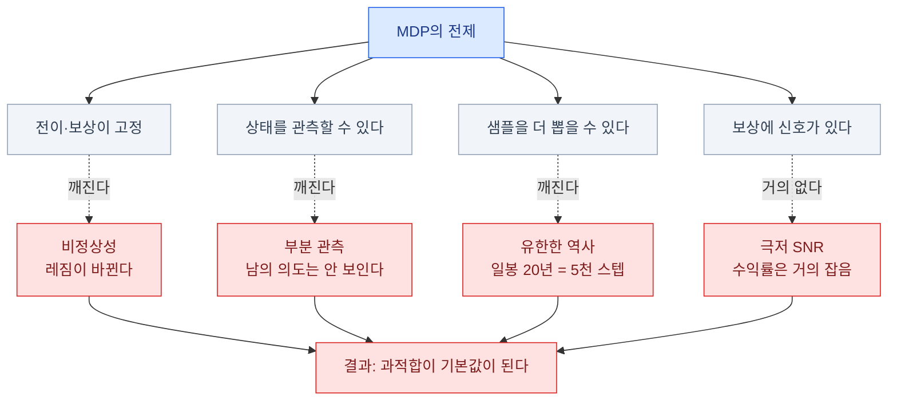

import { Tabs, TabItem, LinkCard, Badge } from '@astrojs/starlight/components';
import TermIntro from '../../../components/docs/TermIntro.astro';

> 시장은 **환경이 나쁜 게 아니라, 강화학습이 전제하는 것을 거의 다 어긴다**

<TermIntro
  terms={[
    ['비정상성', 'Non-stationarity', '전이 확률과 보상 분포가 **시간에 따라 변하는** 것. MDP의 기본 전제가 깨진다.'],
    ['신호 대 잡음비', 'SNR · Signal-to-Noise Ratio', '예측 가능한 성분 대 잡음의 비. 주가 수익률은 **이 값이 극단적으로 낮다.**'],
    ['시장 충격', 'Market Impact', '내 주문이 **가격을 불리한 쪽으로 밀어내는** 현상. 규모가 커질수록 커진다.'],
    ['슬리피지', 'Slippage', '내려는 가격과 **실제 체결 가격의 차이**. 백테스트가 가장 자주 무시하는 비용.'],
    ['호가창', 'Order Book · LOB', '각 가격에 걸린 매수·매도 주문의 목록. **미시구조 전략의 관측 대상**이다.'],
    ['알파 소멸', 'Alpha Decay', '전략이 알려지고 사람들이 따라 하면서 **수익원이 사라지는** 현상. 시장 고유의 적대성이다.'],
  ]}
/>

## 시장을 MDP로 놓아 보면

2장의 다섯 칸에 시장을 채워 넣는 것 자체는 어렵지 않다.

| 칸 | 흔한 선택 |
|---|---|
| **S** | 최근 수익률·변동성·거래량 특징, 보유 포지션, 현금, 남은 시간 |
| **A** | 목표 비중 (연속) 또는 매수/관망/매도 (이산) |
| **P** | 시장 — **우리가 못 만든다** |
| **R** | 손익, 또는 위험 조정 손익 − 거래 비용 |
| **γ** | 0.99 (일봉이면 사실상 무한 호라이즌) |

문제는 채우는 게 아니라, **채우고 나면 MDP의 전제 대부분이 안 맞는다**는 것이다.
이 장은 그 어긋남을 하나씩 짚는다. **이걸 모르고 시작하면 백테스트만 예쁜 결과가 나온다.**

## 깨지는 전제 여섯

### ① 비정상성 — 규칙이 바뀐다

로봇의 중력은 안 변한다. 시장은 **금리 국면, 유동성, 참가자 구성, 규제가 다 바뀐다.**

| 시기 | 통했던 것 |
|---|---|
| 저금리·상승장 | 눌림목 매수, 성장주 집중 |
| 급락 국면 | 현금·역추세 |
| 고변동 구간 | 변동성 매도가 파산으로 |

MDP는 `P`와 `R`이 고정이라고 가정하고 만들어졌다. 시장은 **환경 자체가 학습 중에 바뀌므로**,
"과거에서 배운 최적 정책"이 미래에 최적이라는 보장이 원리적으로 없다.

:::tip[핵심 — 비정상성에 대응하는 세 가지]
**① 짧은 호라이즌으로 문제를 줄인다** (하루 안에 끝나는 체결 문제 — 13장).
**② 레짐을 상태에 넣는다** (변동성 수준, 금리 국면).
**③ 주기적으로 재학습하고, 그 재학습 절차까지 백테스트한다.**
"한 번 학습해 영원히 쓴다"는 설계는 시장에서 성립하지 않는다.
:::

### ② 신호 대 잡음비가 극단적으로 낮다

이것이 **트레이딩이 로봇보다 근본적으로 어려운 이유**다.

| | 로봇 | 시장 |
|---|---|---|
| "잘한 행동"의 즉각적 증거 | 넘어지지 않았다 — **명확** | 올랐다 — **거의 운** |
| 예측 가능한 성분 | 물리 법칙 — 거의 전부 | 수익률의 극히 일부 |
| 잡음 대비 신호 | 크다 | **매우 작다** |

일간 수익률 예측에서 설명력이 몇 퍼센트만 나와도 훌륭한 것으로 취급된다.
**나머지는 잡음**이고, 강화학습은 그 잡음 속에서 공로 배분까지 해야 한다.

이 조합이 무슨 뜻인지가 중요하다 — **잡음에 맞춰 학습하기가 너무 쉽다.**
학습 구간에서 아름다운 수익 곡선이 나오는 것은 성과가 아니라 **기본값**이다.

### ③ 부분 관측 — 상태를 못 본다

시장의 진짜 상태는 "모든 참가자의 의도와 포지션"인데, 우리가 보는 것은 그 그림자다.

| 진짜 상태 | 우리가 보는 것 |
|---|---|
| 큰 손의 미체결 의도 | 호가창 스냅숏 (숨은 물량은 안 보인다) |
| 다른 전략들의 포지션 | 체결 기록 |
| 뉴스가 반영되는 속도 | 가격 변화 |

POMDP이므로 **과거를 접어 넣어야** 한다([2장](/rl/02-mdp/)) — 그러면 상태 차원이 커지고,
데이터는 유한하니 **과적합이 더 심해진다.**

### ④ 내 행동이 시장을 바꾼다 — 시장 충격

규모에 따라 갈린다. 이 갈림이 **"어디에 RL을 쓸 수 있나"** 를 정한다.

| 규모 | 시장 충격 | RL 관점 |
|---|---|---|
| 개인 소액 | 사실상 없다 | 조건 ③이 성립 안 함 → **예측 문제에 가깝다** ([1장](/rl/01-why/)) |
| 기관 대형 주문 | **크다** | 순차 결정 문제가 진짜로 성립 → **RL의 자리** ([13장](/rl/13-trading-practice/)) |
| 마켓메이킹 | 내 호가가 곧 시장의 일부 | 마찬가지로 RL의 자리 |

:::caution[함정 1 — 소액 개인 매매에 RL을 얹는 것]
내 주문이 시장을 안 바꾸면 1장의 조건 ③이 성립하지 않는다.
그런 문제에서는 **"수익률을 예측하는 지도학습 + 포지션 규칙"** 이 거의 항상
더 낫고, 더 검증하기 쉽고, 더 설명 가능하다.

**RL을 굳이 쓸 값어치가 생기는 지점은 "비용·재고·다기간 제약이 얽힐 때"** 다 —
그때는 예측만으로 답이 안 나온다 ([12장](/rl/12-trading-design/)).
:::

### ⑤ 데이터가 유한하다

9장 끝에서 말한 그 숫자다.

| 데이터 | 스텝 수 |
|---|---|
| 일봉 20년 (1종목) | 약 **5,000** |
| 분봉 5년 (1종목) | 약 50만 |
| 틱·호가 데이터 1년 | 수억 (대신 저장·처리 비용이 크다) |

PPO로 사족 보행 하나 배우는 데 수억 스텝이 든다는 것과 비교하면,
**일봉 강화학습은 데이터가 세 자릿수 이상 부족하다.**
게다가 그 5,000 스텝은 **서로 강하게 상관돼 있고**(연속된 날), 독립 표본이 아니다.

이것이 일봉 RL이 논문 밖에서 잘 안 보이는 가장 큰 이유다.
반대로 **호가 단위 문제는 데이터가 풍부**하고, 그래서 실전이 그쪽에 있다.

### ⑥ 적대적이고, 알파는 소멸한다

로봇의 지형은 로봇에 맞서지 않는다. 시장의 참가자들은 **서로에 맞서고, 서로를 학습한다.**
좋은 전략은 자본이 몰리면서 수익원이 줄어든다. **성공이 성공을 갉아먹는 구조**다.

## 시뮬레이터를 못 만든다

로봇과의 결정적 차이가 이것이다. "과거 데이터를 재생하면 시뮬레이터 아닌가?"
— 아니다. 재생은 **내가 아무것도 안 했을 때의 세계**를 다시 트는 것이다.

| 재생 방식 | 성립하나 | 왜 |
|---|---|---|
| 과거 가격을 재생하고 그 가격에 체결 | 소액이면 **근사적으로** | 내 주문이 없는 세계라서 |
| 대량 주문을 재생 위에서 체결 | **성립 안 한다** | 호가를 밀어내는 반응이 데이터에 없다 |
| 시장 충격 모델을 붙인 재생 | **부분적으로** | 충격 모델 자체가 가정이다. 13장의 표준 접근 |
| 에이전트 기반 시장 시뮬레이터 | 연구 단계 | 참가자 행동을 가정해야 한다 |
| 학습된 세계 모델 | 위험하다 | 모델이 만든 세계에 과적합 ([7장](/rl/07-offline-model/)) |

:::tip[핵심 — 그래서 방법론이 정해진다]
시뮬레이터가 없다는 것은 **온라인 RL(PPO·SAC)의 전제가 무너진다**는 뜻이다.
그 결과 트레이딩 RL은 사실상 이 조합으로 수렴한다 —

**과거 로그로 배우고(오프라인 RL) · 강하게 정규화하고 · 시간 분할로 검증하고 ·
충격 모델을 명시적으로 넣고 · 소액으로 먼저 나간다.**
:::

## 그래서 무엇이 되고 무엇이 안 되나

| | 잘 되는 쪽 | 잘 안 되는 쪽 |
|---|---|---|
| 호라이즌 | 초·분 (하루 안에 끝난다) | 일·주 (레짐이 바뀐다) |
| 데이터 | 호가·틱 — 풍부하다 | 일봉 — 유한하다 |
| 보상 | **체결 단가 · 재고 비용** — 계산 가능 | 미래 수익률 — 거의 잡음 |
| 조건 ③ | 내 주문이 호가를 민다 | 소액은 시장을 안 바꾼다 |
| 기준선 | TWAP · VWAP 등 명확한 비교 대상 | "시장 수익률"뿐 |
| 대표 문제 | **최적 체결 · 마켓메이킹 · 헤징** | **"주가 예측 매매"** |

**이 표가 11~13장의 결론을 미리 담고 있다.** 강화학습이 트레이딩에서 실제로 값을 하는 자리는
"무엇을 살까"가 아니라 **"어떻게 실행할까"** 쪽이다.

:::caution[함정 2 — 논문 수가 실전 채택률이 아니다]
"주가 예측 + DRL" 논문은 매우 많다. 그러나 대부분 **거래 비용을 과소평가하거나,
검증 구간이 짧거나, 하이퍼파라미터를 검증 구간에서 골랐다.**
실제 운용에 대한 공개된 증거는 희박하다.

논문을 읽을 때 확인할 것 넷 — **거래 비용을 넣었는가 · 워크포워드인가 ·
시드를 몇 개 돌렸는가 · 단순 기준선(매수 후 보유, TWAP)과 비교했는가.**
:::

## 11장 요약

- 시장은 MDP의 전제를 거의 다 어긴다 — **비정상성 · 부분 관측 · 유한한 데이터 · 극저 SNR**
- 학습 구간에서 아름다운 수익 곡선이 나오는 것은 성과가 아니라 **기본값**이다
- 비정상성 대응은 셋 — **호라이즌 축소 · 레짐을 상태에 · 재학습 절차까지 백테스트**
- **내 주문이 시장을 바꾸는가**가 결정적이다. 안 바꾸면 RL이 아니라 예측 문제다
- 일봉 20년은 **약 5천 스텝**이고 서로 상관돼 있다. 로봇 대비 데이터가 세 자릿수 부족하다
- **재생은 시뮬레이터가 아니다** — 내 주문이 없던 세계의 재생이라 대량 주문에 안 맞는다
- 그래서 방법이 정해진다 — **오프라인 RL + 강한 정규화 + 시간 분할 검증 + 충격 모델 + 소액 배포**
- 실제로 되는 자리는 **"무엇을 살까"가 아니라 "어떻게 실행할까"** 다
- 논문을 읽을 때 넷을 본다 — **비용 · 워크포워드 · 시드 수 · 단순 기준선 비교**

<LinkCard
  title="12. 트레이딩 에이전트 설계 — 상태·행동·보상과 백테스트"
  description="특징과 정규화에서 새는 미래 정보, 목표 비중이라는 행동, 위험 조정 보상, 그리고 백테스트를 믿을 수 있게 만드는 검증 절차."
  href="/rl/12-trading-design/"
/>
