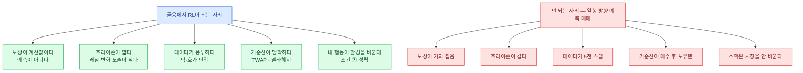

import { Tabs, TabItem, LinkCard, Badge } from '@astrojs/starlight/components';
import TermIntro from '../../../components/docs/TermIntro.astro';

> 되는 자리들의 공통점은 하나다 — **보상을 정확히 계산할 수 있고, 이길 기준선이 명확하다**

<TermIntro
  terms={[
    ['최적 체결', 'Optimal Execution', '큰 주문을 **어떻게 쪼개 낼 것인가**의 문제. 목표는 기준가 대비 불리한 체결(비용)을 줄이는 것.'],
    ['TWAP · VWAP', 'Time/Volume Weighted Average Price', '시간 또는 거래량에 비례해 균등하게 쪼개는 **가장 기본적인 체결 전략**. RL이 이겨야 할 기준선이다.'],
    ['마켓메이킹', 'Market Making', '매수·매도 호가를 **동시에 걸어 두고** 스프레드를 먹는 일. 재고 위험 관리가 본질이다.'],
    ['재고 위험', 'Inventory Risk', '마켓메이커가 원치 않게 떠안은 포지션이 **가격 변동에 노출되는** 위험.'],
    ['딥 헤징', 'Deep Hedging', '옵션 등 파생상품의 헤지 비중을 **거래 비용까지 넣고 학습으로** 찾는 접근.'],
    ['구현 부족분', 'Implementation Shortfall', '"결정한 순간의 가격"과 **실제 평균 체결가**의 차이. 체결 알고리즘의 표준 성과 지표다.'],
  ]}
/>

## 되는 자리 ① — 최적 체결

**100만 주를 오늘 안에 팔아야 한다.** 한 번에 던지면 호가를 밀어내 손해고,
너무 천천히 하면 그 사이 가격이 어디로 갈지 모른다. **급하게 팔수록 충격 비용이 크고,
천천히 팔수록 가격 위험이 크다** — 이 둘의 저울질이 문제의 전부다.

| 칸 | 내용 |
|---|---|
| **S** | 남은 수량, 남은 시간, 호가창 상태(스프레드·잔량 불균형), 최근 체결 흐름, 단기 변동성 |
| **A** | 이번 구간에 낼 수량 + 주문 유형(시장가/지정가·호가 위치) |
| **R** | `−(체결가 − 기준가) × 수량` — 즉 **구현 부족분의 음수** |
| **종료** | 수량 소진(`terminated`) 또는 마감(`truncated`, 잔량은 시장가로 처리하고 벌점) |
| γ | 에피소드가 짧아 1에 가깝게 |

**왜 여기서는 RL이 성립하나** — 1장의 조건 셋이 전부 성립한다.
잘게 나눠 연달아 결정하고, 총 단가는 끝나야 나오고, **내 주문이 호가를 민다.**

| 기준선 | 성격 |
|---|---|
| **TWAP** | 시간에 균등 분할. 단순하고 견고하다 |
| **VWAP** | 거래량 프로파일에 비례. 업계 표준 |
| **Almgren-Chriss류** | 충격과 위험의 저울을 수식으로 푼 고전 해법 |

RL이 더하는 것은 **상황 반응성**이다 — 호가 잔량이 두꺼울 때 더 내고, 스프레드가 벌어지면 참고,
거래량이 몰리는 구간을 활용한다. 고정 스케줄인 TWAP·VWAP가 못 하는 일이다.

:::tip[핵심 — 여기가 금융 RL의 1번 자리인 이유]
**보상이 잡음이 아니다.** "체결 단가가 기준가보다 얼마나 나빴나"는 계산이 끝난 값이고,
미래 예측이 아니다. 11장에서 말한 극저 SNR 문제를 **이 문제 정의가 우회한다.**

게다가 **데이터가 풍부하고**(틱·호가), **기준선이 명확하며**(TWAP 대비 몇 bp),
**호라이즌이 짧아**(하루 안) 비정상성 노출이 작다.
:::

:::caution[함정 — 여기서도 시뮬레이터가 진짜 일이다]
호가창 재생 위에서 **내 주문의 충격을 어떻게 모형화하느냐**가 결과를 좌우한다.
충격을 과소평가한 시뮬에서 학습하면 **에이전트는 공격적으로 던지는 법을 배우고**,
실전에서 그대로 비용을 낸다. 이 분야 채용에서 "시장 시뮬레이터 개발 경험"을
따로 묻는 이유가 이것이다.
:::

## 되는 자리 ② — 마켓메이킹

양쪽에 호가를 걸고 스프레드를 먹는다. **문제는 한쪽만 체결되면서 원치 않는 재고가
쌓이는 것**이고, 그 재고가 가격 변동에 노출된다.

| 칸 | 내용 |
|---|---|
| **S** | 현재 재고, 호가창 상태, 최근 변동성, 체결 강도, 남은 시간 |
| **A** | 매수·매도 호가를 **중간가에서 얼마나 떨어뜨릴지**(스프레드와 치우침), 각 수량 |
| **R** | 스프레드 수익 + 재고 평가손익 **− λ·재고 위험 − 비용** |
| 함정 | 재고 벌점이 약하면 **한쪽으로 크게 쏠린 채 방치**한다 |

고전 기준선은 **Avellaneda-Stoikov 계열**이다 — 재고에 따라 호가를 치우치게 하는 수식 해법.
RL이 더하는 것은 **호가창 신호에 대한 반응**과 **체결 확률의 비선형성**을 데이터로 배우는 것이다.

**이 문제도 조건이 좋다** — 짧은 호라이즌, 계산 가능한 보상, 풍부한 데이터, 명확한 기준선.

## 되는 자리 ③ — 헤징과 배분

| 문제 | RL이 하는 일 | 기준선 |
|---|---|---|
| **딥 헤징** | 거래 비용·이산 시간·시장 마찰을 넣고 헤지 비중을 결정 | 이론 델타 헤지 |
| **포트폴리오 리밸런싱** | 회전율 비용과 제약 아래서 비중을 조정 | 정기 리밸런싱, 평균-분산 최적화 |
| 자산 배분 | 레짐 전환을 고려한 다기간 배분 | 고정 비중·리스크 패리티 |

딥 헤징이 흥미로운 이유는 **"이론적으로 옳은 답이 있는데 현실 마찰 때문에 못 쓰는"**
전형적인 상황이기 때문이다. 이론 해법이 무시하는 비용과 이산성을
학습이 자연스럽게 흡수한다. **그리고 여기서는 시뮬레이터를 쓸 수 있다** —
가격 경로 모형(또는 과거 경로 재표집) 위에서 파생상품의 손익은 정확히 계산된다.

배분 쪽은 조심스럽다. **호라이즌이 길어지는 만큼 11장의 문제들이 다시 커진다.**
회전율·비용 제약이 강하게 걸린 문제일수록 RL의 값어치가 남는다.

## 되는 자리들의 공통 조건

**다섯 조건을 체크리스트로 쓸 수 있다.** 새 금융 RL 아이디어를 들었을 때
이 다섯 칸을 채워 보면 될 일인지 아닌지가 대체로 갈린다.

## 산업 현장은 어떻게 생겼나

이 일을 하려는 관점에서, 실제 업무 비중이 어디에 있는지가 중요하다.

| 일 | 비중 | 내용 |
|---|---|---|
| **데이터 엔지니어링** | 크다 | 틱·호가 데이터 수집·정합성 검사·저장. 결측과 이상치 처리 |
| **시뮬레이터 개발** | **크다** | 체결·충격·지연 모형. 여기 품질이 결과를 정한다 |
| 특징 설계 | 중간 | 미시구조 특징, 누출 방지 |
| 알고리즘 | **작다** | 대부분 검증된 구현을 쓴다 |
| 검증·리스크 | 크다 | 워크포워드, 스트레스, 한도 설계 |
| 운용·모니터링 | 크다 | 실시간 성과 추적, 이상 감지, 정지 규칙 |

:::tip[핵심 — 채용에서 실제로 보는 것]
"PPO를 구현할 수 있다"는 거의 안 본다. 보는 것은 —
**시계열 검증을 제대로 할 줄 아는가**(누출·워크포워드),
**비용과 체결을 현실적으로 모형화할 수 있는가**,
**대용량 시계열 데이터를 다룰 줄 아는가**,
그리고 **자기 결과를 스스로 의심할 줄 아는가**이다.
17장에서 이 이야기를 이어 간다.
:::

### 운용에 올릴 때 붙는 것들

| 항목 | 내용 |
|---|---|
| 한도 | 포지션·손실·회전율 한도를 **정책 밖에서** 강제 |
| 정지 규칙 | 성과·오차가 임계를 넘으면 자동 중단 |
| 설명 가능성 | "왜 이 주문을 냈나"를 사후에 재구성할 수 있어야 한다 |
| 재현성 | 특정 시점의 입력·모델 버전으로 결정을 재현 |
| 재학습 주기 | 언제 다시 배울지, 그 절차 자체를 검증했는가 ([11장](/rl/11-market/)) |
| 모니터링 | 실전 성과가 백테스트 분포 안에 있는가 |

**마지막 항목이 실무의 핵심 습관**이다. 실전 성과가 백테스트에서 나온 분포의
꼬리에 있으면, 그건 운이 나쁜 게 아니라 **가정이 틀렸다는 신호**로 읽는다.

## 개인이 만들 수 있는 프로젝트

이 방향으로 갈 사람이 포트폴리오로 삼기 좋은 것들이다.
**"주가 예측 RL 봇"보다 훨씬 좋은 평가를 받는다.**

| 프로젝트 | 왜 좋은가 |
|---|---|
| **호가창 재생 + 충격 모형 체결 시뮬레이터** | 이 분야가 실제로 어려워하는 지점을 안다는 증거 |
| TWAP·VWAP 기준선 대비 RL 체결 에이전트 | **기준선 비교**가 명확하다 |
| 마켓메이킹 장난감 환경 + 재고 벌점 실험 | 재고 위험을 이해했다는 증거 |
| 누출 없는 워크포워드 백테스트 프레임워크 | 12장의 함정들을 아는지가 드러난다 |
| 딥 헤징 재현 (비용 있는 델타 헤지) | 이론 기준선이 있어 비교가 깔끔하다 |

**공개 데이터로도 가능하다.** 무료 호가 데이터가 제한적이면
분봉·체결 데이터로 축소판을 만들고, **가정과 한계를 문서에 명시**하는 편이
과장된 수익 곡선보다 훨씬 좋은 인상을 준다.

## 13장 요약

- 금융 RL이 실제로 도는 자리는 셋 — **최적 체결 · 마켓메이킹 · 헤징/배분**
- 공통 조건 다섯 — **보상이 계산값 · 짧은 호라이즌 · 풍부한 데이터 · 명확한 기준선 · 내 행동이 시장을 바꿈**
- 최적 체결은 **"급하게 팔면 충격, 천천히 팔면 위험"** 의 저울질이고, 보상이 예측이 아니라 계산이다
- 그 대신 **시장 충격 모형이 진짜 일**이다. 충격을 과소평가한 시뮬은 공격적인 정책을 낳는다
- 마켓메이킹의 본질은 스프레드가 아니라 **재고 위험 관리**다
- 딥 헤징은 **이론 해법이 무시하는 마찰**을 학습이 흡수하는 좋은 예다
- 업무 비중은 **데이터·시뮬레이터·검증**에 있고 알고리즘은 작다
- 실전 성과가 백테스트 분포의 꼬리에 있으면 **운이 아니라 가정이 틀린 것**으로 읽는다
- 포트폴리오는 "예측 봇"이 아니라 **시뮬레이터·기준선 비교·누출 없는 검증**을 보여 주는 것이 낫다

<LinkCard
  title="14. 로봇이라는 환경 — 연속 제어와 sim-to-real"
  description="반대편 세계로 넘어간다. 왜 로봇에서는 RL이 실제로 굴러가는가, 그리고 그 대가인 sim-to-real 격차를 무엇으로 메우는가."
  href="/rl/14-robot/"
/>
