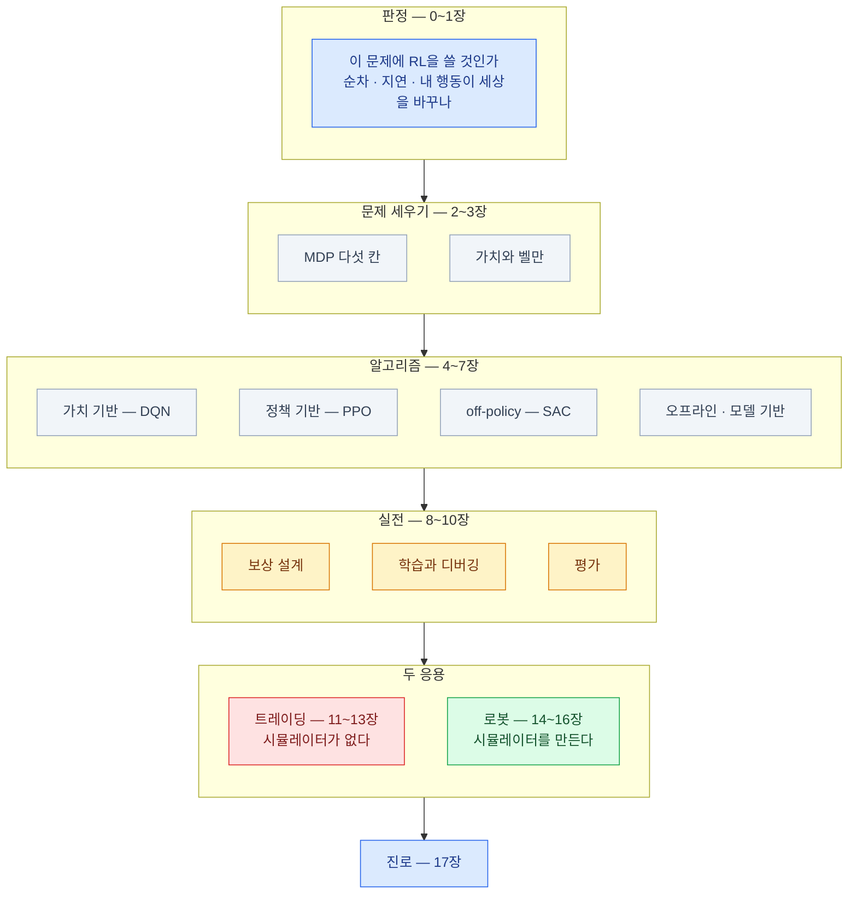

import { LinkCard, CardGrid, Card, Steps } from '@astrojs/starlight/components';
import TermIntro from '../../../components/docs/TermIntro.astro';

> 강화학습을 아는 것은 알고리즘 목록이 아니라 **판정 · 설계 · 검증의 습관**이다

<TermIntro
  title="이 장의 사용법"
  terms={[
    ['전체 지도', '', '덱을 한 장으로 다시 본 그림. 어느 장이 무엇을 맡았는지 확인용이다.'],
    ['장별 한 문장', '', '각 장에서 **하나만 남긴다면** 그것. 나중에 훑을 때 여기부터 본다.'],
    ['세 장의 카드', '', '**판정 · 설계 · 디버깅** — 실제로 일할 때 꺼내 쓰는 순서 목록이다.'],
    ['다음 단계', '', '이 덱을 덮고 무엇을 할 것인가. 17장의 경로를 짧게 다시 정리했다.'],
  ]}
/>

## 전체 지도

## 장별 한 문장

| 장 | 하나만 남긴다면 |
|---|---|
| [0](/rl/00-intro/) | RL은 **"정답은 못 쓰는데 채점은 되는"** 자리에서 이겼다 |
| [1](/rl/01-why/) | 조건 셋 — **순차적 결정 · 지연 보상 · 내 행동이 다음 상태를 바꾼다.** 하나라도 빠지면 다른 방법이 이긴다 |
| [2](/rl/02-mdp/) | 첫 산출물은 코드가 아니라 **MDP 다섯 칸 표**다. 마르코프 성질은 설계로 만들어 낸다 |
| [3](/rl/03-value/) | 벨만은 가치를 **"지금 보상 + 다음 가치"** 로 쓴 재귀다. `max` 하나가 off-policy를 만든다 |
| [4](/rl/04-value-based/) | DQN의 두 처방 — **경험 재생과 타깃 네트워크**. 지금도 모든 off-policy의 부품이다 |
| [5](/rl/05-policy-gradient/) | **좋았던 행동의 확률을 올린다.** 실질 신호는 어드밴티지 `Q − V`다 |
| [6](/rl/06-ppo-sac/) | **샘플이 공짜면 PPO, 아까우면 SAC.** PPO는 구현 디테일이 성능의 절반이다 |
| [7](/rl/07-offline-model/) | 오프라인의 적은 **데이터에 없는 행동을 좋게 평가하는 낙관**이다. BC를 못 이기면 실패다 |
| [8](/rl/08-reward/) | 에이전트는 **시킨 대로가 아니라 준 대로** 한다. 이상하면 보상 함수를 소리 내어 읽는다 |
| [9](/rl/09-training/) | **손실 곡선은 지표가 아니다.** 진단은 기준선 → 관측 → 보상 → 그다음에야 하이퍼파라미터 |
| [10](/rl/10-evaluation/) | 시드 3개로는 아무 말도 못 한다. **IQM과 신뢰구간**으로 말하고, 구간이 겹치면 주장하지 않는다 |
| [11](/rl/11-market/) | 시장은 MDP의 전제를 거의 다 어긴다. **재생은 시뮬레이터가 아니다** |
| [12](/rl/12-trading-design/) | **전체 기간 정규화가 가장 흔한 미래 정보 누출**이다. 비용을 2배로 해도 남는지 본다 |
| [13](/rl/13-trading-practice/) | 되는 자리는 **"무엇을 살까"가 아니라 "어떻게 실행할까"** 다 — 체결·마켓메이킹·헤징 |
| [14](/rl/14-robot/) | 로봇에서 되는 이유는 **연습장을 만들 수 있어서**다. 대가는 sim-to-real 격차 |
| [15](/rl/15-robot-stack/) | 판을 바꾼 것은 알고리즘이 아니라 **GPU 안에서 도는 환경 수천 개**다 |
| [16](/rl/16-imitation-vla/) | **모방학습이 싸게 만들고 강화학습이 실제로 되게 민다** |
| [17](/rl/17-career/) | 변별력은 알고리즘이 아니라 **환경 설계 · 검증 · 도메인 지식**에 있다 |

## 세 장의 카드

<CardGrid>

<Card title="① 판정 — 시작 전" icon="question">

- 결정이 **여러 번 이어지나**
- 결과가 **나중에** 드러나나
- **내 행동이 다음 상황을 바꾸나**
- 밴딧 · MPC · 예측+규칙 · 모방학습으로 되지 않나
- 시행착오를 **어디서** 몇 백만 번 하나
- **점수를 매길 수 있나** — 못 매기면 문제 정의부터

</Card>

<Card title="② 설계 — MDP 다섯 칸" icon="pencil">

- 상태에 **내 누적 결과**(포지션·자세)가 있나
- 관측이 부족하면 **과거를 접어 넣었나**
- 행동을 **한 층 올릴 수 있나** (목표 각도·목표 비중)
- 보상 항의 **스케일을 맞췄나**, 항별로 **로깅**하나
- 제약을 **마스킹**으로 걸 수 있나
- `terminated`와 `truncated`를 **나눴나**

</Card>

<Card title="③ 디버깅 — 안 오를 때" icon="error">

1. 랜덤·무행동 **기준선**을 쟀나
2. 손으로 좋은 행동을 넣으면 보상이 오르나
3. **쉬운 버전**으로 줄이면 되나
4. **관측 범위와 정규화**를 확인했나
5. 보상 **항별 기여도**를 봤나
6. **검증된 구현체**로도 안 되나
7. 그다음에야 하이퍼파라미터

</Card>

<Card title="④ 검증 — 믿기 전에" icon="approve-check">

- 시드 **5개 이상**, IQM + 신뢰구간
- 평가 환경이 **학습과 분리**됐나
- 정규화 통계 **갱신을 껐나**
- **안 본 조건**에서도 되나
- 평가 기준을 **학습 전에** 정했나
- 로봇이면 **실물**, 트레이딩이면 **워크포워드 + 소액**

</Card>

</CardGrid>

## 두 응용, 다시 한 번

이 덱이 둘을 같이 둔 이유를 마지막으로 정리한다.

| | 로봇 (피지컬 AI) | 시스템 트레이딩 |
|---|---|---|
| 환경 | **만들 수 있다** | 못 만든다 |
| 샘플 | GPU에서 수천 개 병렬. 사실상 공짜 | 과거 로그뿐. 일봉 20년 = 5천 스텝 |
| 주력 알고리즘 | **PPO** (+ 실물에선 SAC·모방) | **오프라인 RL** · 지도학습 하이브리드 |
| 보상 | 명확 (넘어짐 · 속도 추종) | 잡음 (수익률) — 그래서 **체결 비용** 쪽으로 문제를 옮긴다 |
| 진짜 적 | **sim-to-real 격차** | **과적합과 비정상성** |
| 최종 관문 | 실물에서 오래 돌기 | 소액 실전에서 백테스트대로 나오기 |
| 실무의 실체 | 시뮬과 실물을 맞추는 **계측** | 누출 없는 **검증 체계** |
| 성숙도 | 보행은 배포 단계, 조작은 모방학습 중심 | 체결·마켓메이킹은 실전, 예측 매매는 대부분 논문 |

**같은 알고리즘이 왜 한쪽에서 주력이고 다른 쪽에서는 안 쓰이는지** —
이 표 하나로 설명된다. 새 도메인을 만났을 때도 같은 질문을 먼저 한다:
**"여기에는 연습장이 있는가, 샘플은 얼마인가, 보상은 계산 가능한가."**

## 다음에 무엇을 할 것인가

<Steps>

1. **작은 것부터 직접 돌린다.**

   카트폴 DQN → 연속 제어 PPO/SAC 비교. **시드 5개로 분포를 보고**하는 습관을 여기서 붙인다.

2. **환경을 하나 처음부터 만든다.**

   Gymnasium 규약으로. 리워드 해킹을 한 번 당해 보는 것이 이 단계의 소득이다 ([8장](/rl/08-reward/)).

3. **도메인을 고른다.**

   로봇이면 [15장](/rl/15-robot-stack/)의 경로(MuJoCo → Isaac Lab → 실물),
   트레이딩이면 [12~13장](/rl/12-trading-design/)의 경로(누출 없는 백테스트 → 체결 시뮬레이터).

4. **하나를 논문처럼 정리한다.**

   문제 정의 · MDP 표 · 기준선 · 시드 분포 · 절제 실험 · **실패한 것과 그 이유**.
   이것이 17장에서 말한 "좋은 포트폴리오"다.

</Steps>

**한 가지만 지킨다면 — 자기 결과를 스스로 의심하는 습관**이다.
이 분야에서 가장 흔한 실패는 알고리즘을 몰라서가 아니라
**되는 줄 알았는데 아니었던 것**을 늦게 발견해서 생긴다.

<LinkCard
  title="개요로 돌아가기"
  description="덱 구성과 전체를 관통하는 세 문장을 다시 본다."
  href="/rl/"
/>
