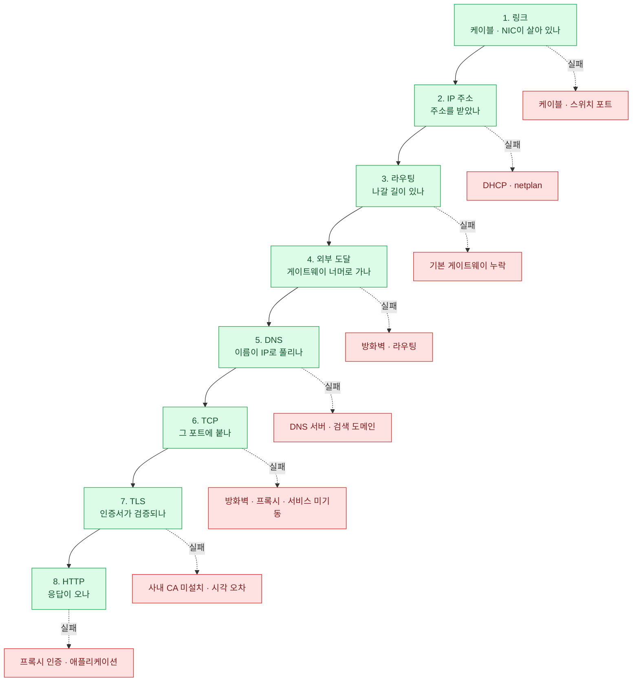

import { Steps, LinkCard } from '@astrojs/starlight/components';
import TermIntro from '../../../components/TermIntro.astro';

> "인터넷이 안 돼요"는 정보가 아니다 — **"어디까지 되는가"** 가 정보다

<TermIntro
  terms={[
    ['ICMP', 'Internet Control Message Protocol', '`ping`·`traceroute`가 쓰는 제어용 프로토콜. **사내망과 클라우드에서 자주 차단된다** — ping이 안 된다고 해서 그 서버가 죽은 것은 아니다.'],
    ['3-way handshake', '', 'TCP 연결을 여는 세 단계(SYN → SYN/ACK → ACK). "연결 자체가 되는가"를 묻는 층이고, `nc -vz`나 `curl`의 `Connected to`가 이 성공을 뜻한다.'],
    ['SNI', 'Server Name Indication', 'TLS 접속을 시작할 때 **어떤 도메인에 붙는지 평문으로 알려주는** 확장. 한 IP에 여러 인증서가 있을 때 필요하고, `openssl s_client`에서 `-servername`을 꼭 줘야 하는 이유다.'],
    ['CONNECT', '', 'HTTPS를 프록시로 통과시킬 때 쓰는 HTTP 메서드. 클라이언트가 프록시에 "이 호스트:443으로 터널을 뚫어 달라"고 요청한다 — **프록시 로그에 도메인은 남고 내용은 안 남는** 이유다.'],
    ['MTU 블랙홀', 'MTU black hole', '경로 중간의 MTU가 작은데 분할 안내(ICMP)가 차단돼, **작은 요청은 성공하고 큰 응답만 조용히 사라지는** 현상. "접속은 되는데 다운로드만 멈춘다"의 전형적 원인이다.'],
  ]}
/>

## 층으로 가른다

각 층은 **아래층이 성공해야만 의미가 있다.** 그래서 위에서부터 찍어보는 것이 아니라
아래에서 위로 올라가며 **처음 실패하는 지점**을 찾는다. 거기가 원인이다.



## 순서대로 확인하기

<Steps>

1. **링크 — 물리적으로 연결돼 있나**

   ```bash
   ip -br link
   sudo ethtool enp1s0 | grep -E "Speed|Link detected"
   ```

   `Link detected: no`거나 상태가 `DOWN`이면 **케이블·스위치 포트 문제**다.
   가상 머신이면 하이퍼바이저에서 NIC이 분리됐을 수 있다. 위층은 볼 필요가 없다.

2. **IP 주소 — 주소를 받았나**

   ```bash
   ip -br a
   ```

   주소가 없거나 **`169.254.x.x`(link-local)면 DHCP 실패**다.
   `journalctl -u systemd-networkd -n 30`에서 이유를 본다.

3. **라우팅 — 나갈 길이 있나**

   ```bash
   ip r                     # default 경로가 있나
   ip r get 8.8.8.8         # 이 목적지로는 어디로 나가는가
   ping -c2 $(ip r | awk '/^default/{print $3}')   # 게이트웨이까지
   ```

   default 경로가 없으면 같은 서브넷 밖으로 나갈 수 없다. 게이트웨이 ping이 실패하면
   랜 구간 문제다 — `ip neigh`로 ARP가 잡히는지도 본다.

4. **외부 도달 — 게이트웨이 너머**

   ```bash
   ping -c3 8.8.8.8         # 이름이 아니라 IP로  ← DNS를 배제하는 것이 핵심
   traceroute -n 8.8.8.8
   mtr -n -c 20 --report 8.8.8.8
   ```

   **여기서는 반드시 IP로 친다.** 이름으로 치면 DNS 실패와 구분이 안 된다.

   :::caution[함정 — ping 실패 = 단절이 아니다]
   사내망·클라우드는 **ICMP를 통째로 막아 두는 일이 흔하다.** ping이 안 되는데
   `curl https://…`는 되는 경우가 실제로 많다. ping은 "되면 좋은 신호"일 뿐,
   **실패를 근거로 삼지 않는다.** 대신 TCP로 확인한다 —
   `traceroute -T -p 443 대상` 또는 아래 6번.
   :::

5. **DNS — 이름이 IP로 풀리나**

   ```bash
   getent hosts intranet.corp.local    # /etc/hosts 포함, 실제 해석 결과
   resolvectl query intranet.corp.local
   dig +short intranet.corp.local
   dig @10.20.0.53 intranet.corp.local   # 특정 서버에 직접
   resolvectl status | head -30           # 어느 DNS를 쓰고 있나
   ```

   4번은 되는데 5번이 안 되면 **DNS만의 문제다** — 원인은 대개 DNS 서버 주소,
   검색 도메인(`search corp.local`) 누락, 또는 사내 존이 외부 DNS에는 없는 것이다.

6. **TCP — 그 포트에 실제로 붙나**

   ```bash
   nc -vz -w3 10.20.30.50 443
   curl -v --connect-timeout 5 https://intranet.corp.local -o /dev/null
   timeout 3 bash -c '</dev/tcp/10.20.30.50/443' && echo OPEN || echo CLOSED
   ```

   반응으로 원인이 갈린다 —

   | 반응 | 뜻 |
   |---|---|
   | `Connected` / `succeeded` | **TCP는 성공.** 위층(TLS·HTTP)으로 넘어간다 |
   | `Connection refused` | 패킷은 **도착했다.** 그 포트에 아무도 안 듣고 있다 — 서비스 미기동([5장](/server/05-systemd/)) |
   | 응답 없이 **타임아웃** | 중간에서 **버려지고 있다** — 방화벽·보안그룹·경로 문제 |
   | `No route to host` | 라우팅/ARP 단계 실패 — 3번으로 돌아간다 |

   `refused`와 `timeout`의 구분이 이 장에서 가장 값진 정보다.
   전자는 **서버 쪽 문제**, 후자는 **경로/방화벽 문제**로 조사 방향이 완전히 갈린다.

7. **TLS — 인증서가 검증되나**

   ```bash
   openssl s_client -connect intranet.corp.local:443 -servername intranet.corp.local </dev/null
   curl -vI https://intranet.corp.local
   curl -vI --insecure https://intranet.corp.local   # 검증만 끄고 테스트 (진단용)
   ```

   `--insecure`로는 되고 그냥은 안 되면 **인증서 신뢰 문제로 확정**이다 —
   사내 프록시의 사설 CA가 안 깔린 것이 압도적으로 흔하다([9장](/server/09-proxy/)).
   `certificate has expired`인데 실제로는 유효하다면 **서버 시각을 의심**한다
   (`timedatectl`).

8. **HTTP — 응답이 오나**

   ```bash
   curl -v https://intranet.corp.local/health
   curl -o /dev/null -s -w '%{http_code} dns=%{time_namelookup} conn=%{time_connect} tls=%{time_appconnect} total=%{time_total}\n' https://intranet.corp.local
   ```

   `-w`의 시간 분해는 **어느 층이 느린지**를 한 줄로 보여준다 —
   `time_namelookup`이 크면 DNS, `time_connect`가 크면 TCP,
   `time_appconnect`가 크면 TLS 핸드셰이크다.

   상태 코드도 층을 가른다 — **`407 Proxy Authentication Required`는 프록시 인증**,
   `502`/`504`는 서버 쪽 상류 문제, `000`은 아예 응답이 없다는 curl의 표시다.

</Steps>

## 증상 → 원인 조합표

층 진단의 결과를 조합하면 원인이 좁혀진다. 실무에서 반복해서 나오는 것들이다.

| 되는 것 | 안 되는 것 | 원인일 확률이 높은 것 |
|---|---|---|
| 게이트웨이 ping | 외부 IP ping | 상위 방화벽 · NAT · 라우팅. 또는 **ICMP만 차단** |
| `ping 8.8.8.8` | `ping google.com` | **DNS만의 문제** — `resolvectl status` |
| `dig`는 응답 | `getent hosts`는 실패 | `/etc/nsswitch.conf` 또는 검색 도메인 |
| `getent hosts` 성공 | `nc -vz 443` 타임아웃 | 방화벽/보안그룹, 또는 **프록시를 안 거치고 직접 나가려는 중** |
| `nc -vz 443` 성공 | `curl` TLS 실패 | **사내 CA 미설치**([9장](/server/09-proxy/)) 또는 서버 시각 오차 |
| `curl --insecure` 성공 | `curl` 실패 | 인증서 신뢰 문제로 **확정** |
| `curl` 성공 | `apt update` 실패 | 프로그램별 프록시 설정 누락 — apt는 별도 파일이다([9장](/server/09-proxy/)) |
| 다른 서버에서 성공 | 이 서버에서 실패 | 이 서버의 설정/방화벽. 두 서버의 `env`와 `ip r`을 **diff 한다** |
| 작은 요청 성공 | 큰 전송만 멈춤 | **MTU 블랙홀** (아래) |
| 접속 직후 성공 | 몇 분 뒤 끊김 | 유휴 타임아웃 (방화벽 세션 · keepalive) |

:::caution[함정 — 로컬은 되는데 원격만 안 될 때]
서버 위에서 `curl localhost:8080`은 되는데 밖에서는 안 된다면, 순서는 이렇다 —

1. `sudo ss -tulpn | grep 8080` — **`127.0.0.1`에 바인딩**돼 있지 않은가([7장](/server/07-network/))
2. `sudo ufw status` — 로컬 방화벽이 막고 있지 않은가([13장](/server/13-security/))
3. 클라우드/사내 방화벽의 인바운드 규칙
4. 클라이언트 쪽에서 `nc -vz`가 **refused인지 timeout인지** — 1·2는 refused, 3은 timeout이 되기 쉽다
:::

### MTU 블랙홀 확인

```bash
ping -M do -s 1472 -c2 8.8.8.8    # 1472 + 28 = 1500. 실패하면 경로 MTU가 더 작다
ping -M do -s 1400 -c2 8.8.8.8    # 줄여 가며 통과하는 크기를 찾는다
ip link show enp1s0 | grep mtu
```

`-M do`는 "분할하지 말라"는 뜻이다. 1472는 실패하고 1400은 성공하면
경로 어딘가에 MTU 1500 미만 구간이 있는 것이다 — VPN·터널 환경에서 자주 본다.

## 패킷까지 봐야 할 때

여기까지 와도 안 갈리면 실제 패킷을 본다. **나가긴 하는가**를 확인하는 것이 목적이다.

```bash
sudo tcpdump -ni enp1s0 host 10.20.30.50 and port 443
sudo tcpdump -ni any port 53                       # DNS 질의가 실제로 나가는가
sudo tcpdump -ni enp1s0 -c 20 -w /tmp/cap.pcap      # 파일로 저장 (와이어샤크로 열기)
```

읽는 법은 딱 두 가지만 알면 된다 —
**`SYN`만 반복되고 `SYN, ACK`가 없으면** 요청은 나갔고 응답이 안 오는 것(중간 차단),
**패킷이 아예 안 보이면** 로컬에서 막혔거나 다른 인터페이스로 나가는 것이다(`ip r get`).

:::tip[핵심]
순서는 **링크 → 주소 → 경로 → 외부 → DNS → TCP → TLS → HTTP**.
각 층에서 도구를 하나씩만 기억한다 —
`ethtool` · `ip -br a` · `ip r get` · `ping IP` · `getent hosts` · `nc -vz` ·
`openssl s_client` · `curl -v`.
그리고 두 가지 판정을 챙긴다 — **refused냐 timeout이냐**,
**`--insecure`로는 되느냐**. 이 둘이 원인의 절반을 가른다.
:::

## 8장 요약

- "안 된다"가 아니라 **"어디까지 되는가"** 를 만든다 — 아래층부터 하나씩
- 4층 확인은 **반드시 IP로** 한다. 이름으로 치면 DNS와 구분이 안 된다
- **ping 실패를 단절의 근거로 쓰지 않는다** — 사내망은 ICMP를 잘 막는다
- TCP는 **`refused`(서버 쪽) vs `timeout`(경로·방화벽)** 의 구분이 핵심 정보다
- `curl --insecure`로 되면 **인증서 신뢰 문제로 확정** — 사내 CA를 의심한다
- `curl -w`의 시간 분해로 어느 층이 느린지 한 줄에 본다
- 작은 요청만 되고 큰 전송이 멈추면 **MTU** — `ping -M do -s …`

<LinkCard
  title="9. 사내 프록시 — 프로그램마다 따로 논다"
  description="환경변수부터 apt · snap · docker · git · pip, 그리고 사설 CA 인증서 설치까지."
  href="/server/09-proxy/"
/>
