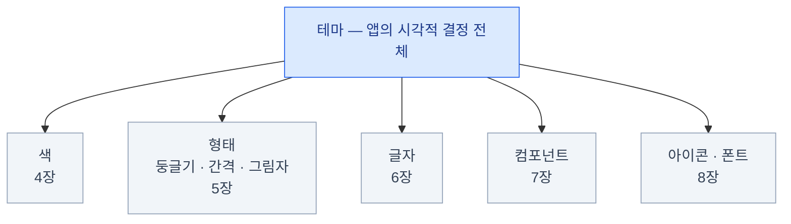

import { Card, CardGrid, LinkCard } from '@astrojs/starlight/components';
import TermIntro from '../../../components/TermIntro.astro';

> 새 도구를 배울 때 힘든 것은 개념 자체가 아니라 **설명 없이 지나가는 단어들**이다

이 덱은 그 지점을 규칙으로 막는다.

- **약어는 처음 나올 때 풀 이름을 준다.** `cva`는 `class-variance-authority`다
- **"이게 뭔지"보다 "이게 왜 있는지"를 먼저** 쓴다. 없으면 무슨 문제가 생기는지가 설명이다
- **덜 쓰이는 기능은 뺀다.** 넣더라도 "이런 게 있다" 한 줄로 끝내고 넘어간다

## 누구를 위한 것인가

<CardGrid>
<Card title="전제하는 것" icon="approve-check">
HTML과 CSS를 조금 써봤다.
React로 컴포넌트를 만들어 본 적이 있다.
터미널에서 `npm` / `pnpm` 명령을 실행할 수 있다.
</Card>
<Card title="전제하지 않는 것" icon="information">
Tailwind CSS를 잘 안다. — 몰라도 읽힌다
디자인 시스템을 만들어 봤다.
Next.js의 서버 컴포넌트를 안다.
</Card>
</CardGrid>

Tailwind를 처음 본다면 아래 세 줄만 알고 들어와도 충분하다.

- Tailwind는 **CSS 클래스 이름 하나 = 스타일 한 줄**인 도구다. `p-4`는 `padding: 1rem`이다
- 그래서 별도 `.css` 파일을 거의 안 만들고 **HTML 태그에 클래스를 나열**한다
- 색·간격 같은 값은 **CSS 파일에 정의한 변수**에서 온다 — 이 덱의 주제가 바로 그 변수다

## 기본 용어 다섯 개

이 다섯 개는 덱 전체에서 계속 나온다. 여기서 한 번에 정리한다.

<TermIntro
  title="이 덱 전체에서 쓰는 말"
  terms={[
    ['CSS 변수', 'CSS Custom Property', 'CSS 안에서 값에 이름을 붙여 두는 문법. `--primary: #4f46e5;` 로 정의하고 `var(--primary)` 로 꺼내 쓴다. 브라우저가 직접 지원하므로 빌드 없이도 값을 바꿀 수 있다 — 다크 모드가 가능한 이유다.'],
    ['토큰', 'Design Token', '디자인 결정에 붙인 이름. 값 `#4f46e5` 는 그냥 값이지만 `--primary` 는 "우리 앱의 주 색상"이라는 결정이다. 결정이 바뀌면 한 곳만 고친다.'],
    ['테마', 'Theme', '토큰 값을 한 벌로 묶은 것. `라이트 테마` 와 `다크 테마` 는 이름은 같고 값만 다른 두 벌이다. 이 덱의 중심 개념.'],
    ['유틸리티 클래스', 'Utility Class', 'Tailwind가 만들어 주는 한 줄짜리 클래스. `bg-primary` 는 "배경을 --primary 색으로"라는 뜻이다.'],
    ['CLI', 'Command Line Interface', '터미널에서 실행하는 명령줄 도구. shadcn/ui는 웹사이트가 아니라 이 CLI로 쓴다 — `pnpm dlx shadcn@latest add button` 같은 형태다.'],
  ]}
/>

:::tip[핵심]
**"값이 아니라 결정에 이름을 붙인다."**
이 한 문장이 덱 전체를 관통한다. `#18181b`가 아니라 `--primary`라고 쓰는 이유,
컴포넌트 안에 색을 직접 안 박는 이유, 테마 교체가 가능한 이유가 전부 이것이다.
:::

## 이 덱이 다루는 것

리소스 다섯 종을 하나씩 다루고, 그 다음 **두 벌로 만들기(다크 모드) → 직접 만들기 → 팀에 배포하기**로 간다.

## 이 덱이 다루지 않는 것

"많이 쓰이는 것만"이라는 원칙 때문에 아래는 뺐다.
필요해질 때 공식 문서에서 찾으면 되는 것들이라 **이름만 알아두면 충분하다.**

| 뺀 것 | 한 줄 설명 | 언제 필요한가 |
|---|---|---|
| `style` 프리셋 8종 | 컴포넌트의 시각적 성격 프리셋(`vega`·`sera` 등) | 프로젝트 시작할 때 한 번 고르고 끝 |
| 모노레포 설정 | 앱 여러 개가 컴포넌트를 공유하는 구조 | 앱이 둘 이상이 될 때 |
| `eject` · `migrate` | 유틸을 인라인화하거나 아이콘·베이스를 일괄 교체 | 마이그레이션할 때 |
| Radix / React Aria 상세 | shadcn이 쓸 수 있는 다른 기반 라이브러리 | 기본값(Base UI)으로 부족할 때 |
| Blocks · Charts | 완성된 화면 조합 · 차트 래퍼 | 대시보드를 빨리 만들 때 |
| MCP 서버 연동 | AI 도구가 레지스트리를 읽게 하는 설정 | 에이전트로 UI를 짤 때 |

:::caution[함정]
검색으로 찾은 자료에 **`tailwind.config.js`, `asChild`, `forwardRef`** 가 나오면
**한 세대 이전 자료**다. 동작은 하지만 지금 방식과 다르다.
Tailwind 4는 설정을 CSS 파일에 쓰고, shadcn 기본 기반은 `asChild` 대신 `render`를 쓴다.
:::

## 버전 기준

| 도구 | 버전 | 왜 중요한가 |
|---|---|---|
| Tailwind CSS | **4.x** | 설정이 JS 파일에서 **CSS 파일**로 옮겨 갔다. 3.x 자료와 문법이 다르다 |
| shadcn CLI | **3.x** | `registries` 필드, `view`·`docs` 명령이 이때 들어왔다 |
| Next.js | 16 | 이 덱은 Next.js에 크게 의존하지 않는다. Vite 등에서도 대부분 그대로다 |
| 기반 라이브러리 | **Base UI** | 2026년 7월부터 기본값. 예전 기본값은 Radix UI였다 |

## 0장 요약

- 이 덱은 shadcn/ui를 **테마 관리 방식**으로 설명한다
- 새 용어는 **풀 이름 + 왜 필요한지**를 먼저 준다. 각 장 첫머리 상자가 그 역할이다
- 기본 용어 다섯: **CSS 변수 · 토큰 · 테마 · 유틸리티 클래스 · CLI**
- 관통하는 한 문장 — **값이 아니라 결정에 이름을 붙인다**
- 곁가지는 뺐다. 뺀 목록은 위 표에 있으니 **이름만 기억**해 두면 된다

<LinkCard
  title="1. shadcn/ui란 무엇인가"
  description="설치하지 않는 컴포넌트 — 왜 이런 이상한 방식이 나왔는가."
  href="/shadcn/01-what-is-shadcn/"
/>
