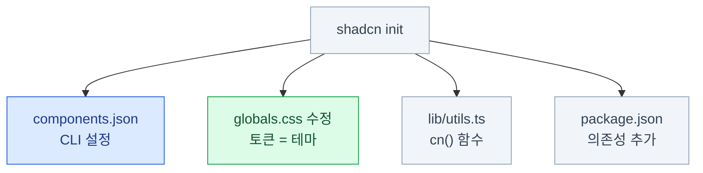

import { Steps, FileTree, LinkCard, Tabs, TabItem } from '@astrojs/starlight/components';
import TermIntro from '../../../components/docs/TermIntro.astro';

> 파일 네 개만 알면 된다. 그중 **하나가 테마**다.

<TermIntro
  terms={[
    ['`init`', 'Initialize', '프로젝트에 shadcn/ui를 처음 붙이는 명령. 설정 파일과 토큰을 만들어 준다. 프로젝트당 한 번.'],
    ['`dlx`', 'Download & Execute', '패키지를 설치하지 않고 한 번만 실행하는 pnpm 명령. npm의 `npx`, yarn의 `dlx`와 같다. shadcn CLI는 설치할 필요가 없어 이 방식으로 쓴다.'],
    ['alias / 경로 별칭', 'Path Alias', '`../../../components/ui/button` 대신 `@/components/ui/button` 으로 쓰게 해 주는 설정. `tsconfig.json` 에 정의한다.'],
    ['`globals.css`', '', 'Tailwind를 불러오고 토큰을 정의하는 CSS 파일. 이름은 프로젝트마다 다를 수 있다. **이 파일이 곧 테마다.**'],
  ]}
/>

## 처음부터 끝까지

<Steps>

1. **프로젝트를 만든다**

   ```bash
   pnpm create next-app@latest my-app
   cd my-app
   ```

   Tailwind CSS 설치 여부를 물으면 **예**라고 답한다.

2. **shadcn/ui를 붙인다**

   ```bash
   pnpm dlx shadcn@latest init
   ```

3. **컴포넌트를 받는다**

   ```bash
   pnpm dlx shadcn@latest add button card input
   ```

4. **쓴다**

   ```tsx
   // app/page.tsx
   import { Button } from '@/components/ui/button'

   export default function Home() {
     return <Button>클릭</Button>
   }
   ```

</Steps>

전제 조건 두 가지 — **Tailwind가 설치돼 있을 것**, **`@/*` 경로 별칭이 있을 것.**
`create-next-app`이 둘 다 해준다. 기존 프로젝트에 붙이는 거라면 이 둘을 먼저 확인한다.

## `init`이 만드는 것 네 개



| 파일 | 하는 일 | 이 덱에서 |
|---|---|---|
| `components.json` | 이후 모든 CLI 동작의 기준 | 이 장 |
| **`app/globals.css`** | **토큰 정의 = 테마 본체** | **4~10장 전부** |
| `lib/utils.ts` | `cn()` — 클래스 이름을 합치는 도우미 | [7장](/shadcn/07-component/#cn이-왜-필요한가) |
| 의존성 | `clsx`, `tailwind-merge`, `class-variance-authority`, 프리미티브, 아이콘 | [7](/shadcn/07-component/)·[8장](/shadcn/08-icon-font/) |

:::tip[핵심]
`init` 직후 **`globals.css`를 열어보는 것**이 이 덱에서 가장 학습 효과가 큰 행동이다.
색 이름 20개가 라이트/다크 두 벌로 들어 있는 게 보인다. 그게 테마다.
:::

## `globals.css` — 여기가 테마다

`init` 직후 파일의 뼈대는 이렇다. 세 덩어리로 읽으면 된다.

```css
/* app/globals.css */
@import "tailwindcss";                  /* ① Tailwind 불러오기 */

:root {                                 /* ② 라이트 값 */
  --radius: 0.625rem;
  --background: oklch(1 0 0);
  --foreground: oklch(0.145 0 0);
  --primary: oklch(0.205 0 0);
  --primary-foreground: oklch(0.985 0 0);
  /* … 20개 남짓 */
}

.dark {                                 /* ② ' 다크 값 — 같은 이름 */
  --background: oklch(0.145 0 0);
  --foreground: oklch(0.985 0 0);
  --primary: oklch(0.922 0 0);
  --primary-foreground: oklch(0.205 0 0);
}

@theme inline {                         /* ③ Tailwind에 연결 */
  --color-background: var(--background);
  --color-foreground: var(--foreground);
  --color-primary: var(--primary);
  --color-primary-foreground: var(--primary-foreground);
  --radius-lg: var(--radius);
}
```

- **②가 "무슨 값인가"** — 테마마다 바뀐다. 브랜드 색 교체는 여기만 고친다
- **③이 "어떤 클래스를 만들 것인가"** — 한 번 쓰고 거의 안 건드린다
- ②만 있고 ③이 없으면 **변수는 있는데 `bg-primary` 클래스가 없다** ([4장](/shadcn/04-color/#연결하지-않으면-클래스가-안-생긴다))

:::caution[함정 — Tailwind 3 자료]
`tailwind.config.js`에 색을 등록하라는 자료를 보게 될 텐데, **Tailwind 3 방식**이다.
Tailwind 4는 설정 파일을 쓰지 않고 **CSS 파일 안의 `@theme` 블록**으로 대체했다.
`components.json`의 `tailwind.config`가 빈 문자열인 게 그 흔적이다.
:::

## `components.json` — 실제로 중요한 필드 세 개

파일 전체는 이렇지만, **처음에 신경 쓸 것은 세 개**다.

```json
{
  "$schema": "https://ui.shadcn.com/schema.json",
  "style": "new-york",
  "rsc": true,
  "tsx": true,
  "tailwind": {
    "config": "",
    "css": "app/globals.css",
    "baseColor": "zinc",
    "cssVariables": true,
    "prefix": ""
  },
  "aliases": {
    "components": "@/components",
    "ui": "@/components/ui",
    "utils": "@/lib/utils",
    "lib": "@/lib",
    "hooks": "@/hooks"
  },
  "registries": {}
}
```

### ① `cssVariables` — 반드시 `true`

이 덱 전체에서 가장 중요한 설정 하나다.

<Tabs>
<TabItem label="true (권장)">

```tsx
<div className="bg-background text-foreground">
```

- 컴포넌트에 **의미 토큰만** 들어간다
- 다크 모드가 값 교체로 해결된다
- 테마 교체가 **CSS 몇 줄**

</TabItem>
<TabItem label="false">

```tsx
<div className="bg-white text-zinc-950 dark:bg-zinc-950 dark:text-zinc-50">
```

- 컴포넌트에 **원시 색이 직접** 박힌다
- 모든 컴포넌트에 `dark:` 변형이 붙는다
- 테마 교체 = **전 파일 수정**. 이 덱의 내용 대부분이 무의미해진다

</TabItem>
</Tabs>

**그리고 나중에 못 바꾼다.** 이미 받은 컴포넌트들이 전부 하드코딩된 색을 들고 있어서,
바꾸려면 전부 다시 받고 내 수정 내역을 재적용해야 한다.

### ② `baseColor` — 중립색 계열

앱 화면의 90%를 차지하는 회색 계열이다. `zinc` · `slate` · `stone` · `neutral` 중에 고른다.
차이는 미묘하지만 인상은 꽤 다르다 — [4장](/shadcn/04-color/#basecolor--중립색-고르기)에서 실물로 비교한다.
**이것도 나중에 못 바꾼다.**

### ③ `aliases` — 파일이 놓일 위치

`add`로 받은 파일이 어디에 생길지 정한다. 기본값이면 `components/ui/`다.
이건 **나중에 바꿔도 된다** (이미 받은 파일을 옮기는 건 손으로 해야 하지만).

### 나머지 필드

| 필드 | 한 줄 | 바꿀 수 있나 |
|---|---|---|
| `style` | 컴포넌트의 시각적 성격 프리셋 (8종) | ❌ |
| `rsc` | `true`면 필요한 파일에 `"use client"` 자동 추가 | ✅ |
| `tsx` | `false`면 `.jsx`로 생성 | ✅ |
| `tailwind.prefix` | 유틸리티 클래스에 접두사 (`tw-` 등) | ✅ |
| `registries` | 외부 레지스트리 등록 ([11장](/shadcn/11-registry/)) | ✅ |

## 파일 지도

<FileTree>

- components.json CLI 설정. **git에 커밋한다**
- app/
  - globals.css **테마 본체 — 이 덱의 주 무대**
  - layout.tsx 폰트와 다크 모드 설정이 들어갈 곳 ([8](/shadcn/08-icon-font/)·[9장](/shadcn/09-dark/))
- lib/
  - utils.ts `cn()` 하나뿐인 파일
- components/
  - ui/ **shadcn이 관리하는 영역 — 손대는 규칙이 필요하다**
    - button.tsx
    - card.tsx
    - input.tsx
  - **직접 만든 컴포넌트는 여기, ui/ 밖에 둔다**

</FileTree>

:::tip[핵심]
**`components/ui/`와 그 밖을 섞지 않는다.**
`ui/`는 "shadcn에서 온 것"이고, 그 밖은 "우리가 만든 것"이다.
이 경계가 흐려지면 [11장의 `--diff`](/shadcn/11-registry/#내가-고친-파일-추적하기)로 업스트림 변경을 추적할 수 없게 된다.
:::

## CLI — 실제로 쓰는 명령

70개 넘는 옵션이 있지만 **일상적으로 쓰는 건 이 정도**다.

```bash
# 설치 전에 소스를 미리 본다 — 가장 저평가된 명령
pnpm dlx shadcn@latest view button

# 컴포넌트 추가
pnpm dlx shadcn@latest add dialog

# 무엇이 바뀔지만 보고 실행은 안 함
pnpm dlx shadcn@latest add dialog --dry-run

# 내가 고친 파일과 최신 원본의 차이 (11장의 핵심 도구)
pnpm dlx shadcn@latest add button --diff

# 뭐가 있는지 찾기
pnpm dlx shadcn@latest search table
```

### 의존성은 자동으로 따라온다

```bash
pnpm dlx shadcn@latest add dialog
```

```text
✔ Created 3 files:
  - components/ui/dialog.tsx
  - components/ui/button.tsx      ← dialog가 필요로 해서
  - hooks/use-media-query.ts
✔ Installed 1 package:
  - @base-ui-components/react
```

**이미 있는 파일은 덮어쓰지 않는다.** 내가 고쳐 둔 `button.tsx`는 안전하다.
(강제로 덮어쓰려면 `--overwrite`가 필요한데, 이건 내 수정이 날아간다는 뜻이다.)

## 3장 요약

- `init`이 만드는 것 넷: **`components.json` · `globals.css` 토큰 · `lib/utils.ts` · 의존성**
- **`globals.css`가 테마 본체**다. 세 덩어리 — Tailwind 불러오기 / 값 정의 / `@theme inline` 연결
- `components.json`에서 실제로 중요한 것은 **`cssVariables`(반드시 true) · `baseColor` · `aliases`**
- `cssVariables`와 `baseColor`, `style`은 **나중에 못 바꾼다**
- Tailwind 4는 `tailwind.config.js`를 안 쓴다 — CSS 안의 `@theme`이 대신한다
- `components/ui/`와 직접 만든 컴포넌트를 **섞지 않는다**
- 자주 쓰는 명령: **`view` · `add` · `--dry-run` · `--diff` · `search`**

<LinkCard
  title="4. 색 리소스"
  description="배경과 글자를 짝으로 — 20개 이름으로 앱 전체의 색을 관리한다."
  href="/shadcn/04-color/"
/>
