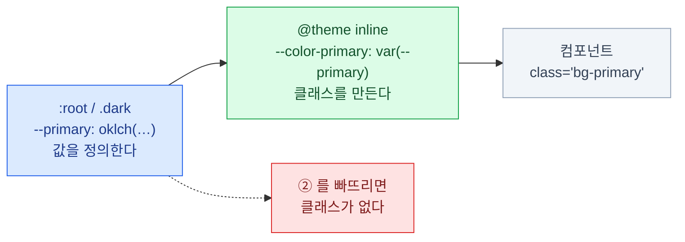

import { Steps, LinkCard, Tabs, TabItem } from '@astrojs/starlight/components';
import TermIntro from '../../../components/docs/TermIntro.astro';
import TokenPairsDemo from '../../../components/demos/TokenPairsDemo.astro';
import ColorScale from '../../../components/demos/ColorScale.astro';

> 색 토큰은 **하나씩이 아니라 짝으로** 만든다. 이유가 명확하다.

<TermIntro
  terms={[
    ['foreground', '', '"배경 위에 올라가는 것" — 주로 글자색. shadcn/ui는 배경색 토큰마다 짝이 되는 `-foreground` 를 둔다.'],
    ['대비', 'Contrast Ratio', '배경과 글자의 밝기 차이. 낮으면 안 읽힌다. 접근성 기준(WCAG)은 본문 4.5:1 이상을 요구한다.'],
    ['oklch', 'Oklab Lightness Chroma Hue', '색을 밝기·선명도·색상 세 숫자로 적는 최신 CSS 색 표기법. 밝기를 사람 눈에 맞게 다루므로 **밝기만 바꿔도 색이 안 변한다**.'],
    ['WCAG', 'Web Content Accessibility Guidelines', '웹 접근성 국제 표준. 색 대비 기준의 출처.'],
    ['baseColor', '', 'shadcn init 때 고르는 중립색(회색) 계열. 화면의 90%를 차지한다.'],
  ]}
/>

## 짝으로 만든다 — `background` / `foreground`

shadcn/ui의 색 토큰에는 규칙이 하나 있다. **배경색을 정하면 그 위의 글자색도 같이 정한다.**

```css
--primary: oklch(0.55 0.22 264);            /* 바탕 */
--primary-foreground: oklch(0.99 0 0);      /* 그 위의 글자 */
```

```tsx
<button className="bg-primary text-primary-foreground">저장</button>
```

**이 둘은 항상 같이 쓴다.** 실물로 보면 —

<TokenPairsDemo />

### 왜 짝이어야 하는가

짝이 아니면 이런 일이 생긴다.

<Tabs>
<TabItem label="짝을 안 쓸 때">

```tsx
<button className="bg-primary text-white">저장</button>
```

라이트 모드에서 `--primary`가 진한 남색이라 흰 글자가 잘 보인다. 그런데 —

- 다크 모드에서 `--primary`를 **밝은 색으로 뒤집으면** → 흰 배경에 흰 글자
- 브랜드 색을 노란색으로 바꾸면 → 노란 배경에 흰 글자
- **글자색이 배경 변경을 따라오지 않는다**

</TabItem>
<TabItem label="짝을 쓸 때">

```tsx
<button className="bg-primary text-primary-foreground">저장</button>
```

```css
:root { --primary: oklch(0.25 0.05 264); --primary-foreground: oklch(0.99 0 0); }
.dark { --primary: oklch(0.92 0.02 264); --primary-foreground: oklch(0.21 0.03 264); }
```

- 배경이 어두워지면 글자가 밝아지고, 반대도 마찬가지
- **대비가 테마 정의 시점에 보장된다.** 사용하는 쪽은 신경 쓸 게 없다

</TabItem>
</Tabs>

:::tip[핵심]
**색 하나를 정하는 게 아니라 "이 표면 위에서는 이 글자색"이라는 한 쌍을 정하는 것**이다.
`text-white`가 컴포넌트에 등장한다면 거의 항상 버그의 씨앗이다.
:::

## 알아야 할 색 토큰

20개 남짓이지만 **역할별로 묶으면 여섯 덩어리**다.

| 토큰 짝 | 언제 쓰나 | 빈도 |
|---|---|---|
| `background` / `foreground` | 페이지 바탕과 기본 글자 | ★★★ |
| `card` / `card-foreground` | 카드처럼 **떠 있는 표면** | ★★★ |
| `primary` / `primary-foreground` | 주요 액션 버튼, 강조 | ★★★ |
| `muted` / `muted-foreground` | 흐린 배경, **설명 문구** | ★★★ |
| `border` · `input` · `ring` | 테두리 / 입력창 테두리 / 포커스 링 | ★★★ |
| `destructive` | 삭제·오류 | ★★☆ |
| `secondary` / `secondary-foreground` | 보조 액션 버튼 | ★★☆ |
| `accent` / `accent-foreground` | 마우스 올렸을 때·선택됐을 때 | ★★☆ |
| `popover` / `popover-foreground` | 드롭다운·툴팁 등 떠 있는 레이어 | ★☆☆ |
| `chart-1` ~ `chart-5` | 차트 팔레트 | ★☆☆ |
| `sidebar-*` | 사이드바 전용 한 벌 | ★☆☆ |

**위 다섯 줄만 확실히 알면 실무의 90%가 커버된다.** 아래 넷은 필요해질 때 찾아 쓰면 된다.

### 자주 헷갈리는 셋

- **`background` vs `card`** — 라이트 모드에서는 둘 다 흰색이라 차이가 안 보인다.
  하지만 다크 모드에서 카드가 살짝 떠 보이게 하려면 값을 다르게 준다. **처음부터 구분해서 쓴다**
- **`muted` vs `secondary`** — `muted`는 "덜 중요한 것"(설명 문구, 비활성 영역),
  `secondary`는 "주요 액션은 아니지만 액션인 것"(취소 버튼). **의도가 다르다**
- **`accent` vs `primary`** — `accent`는 **상호작용 상태**용이다.
  마우스 올림·키보드 선택 시 배경. 브랜드 색이 아니다

## `oklch` — 왜 이 표기법인가

`init`이 만든 파일을 열면 익숙한 `#18181b` 대신 이런 게 보인다.

```css
--primary: oklch(0.205 0 0);
/*              ↑     ↑ ↑
                밝기  선명도  색상(각도) */
```

| | 밝기 | 선명도 | 색상 |
|---|---|---|---|
| 범위 | `0`(검정) ~ `1`(흰색) | `0`(회색) ~ `0.4` 정도 | `0` ~ `360`도 |
| 예 | `0.205` = 꽤 어두움 | `0` = 완전 무채색 | `264` = 파랑 계열 |

**왜 굳이?** HSL이나 hex는 밝기 숫자가 사람 눈과 안 맞는다.
같은 밝기 값 50%인데 노랑은 눈부시고 파랑은 어둡게 보인다.
`oklch`는 밝기를 눈에 맞춰 정의해서, **밝기만 바꿔도 색감이 유지**된다.

```css
/* 같은 파랑, 밝기만 다른 5단계 — oklch면 이게 자연스럽다 */
--blue-300: oklch(0.80 0.12 264);
--blue-500: oklch(0.62 0.20 264);
--blue-700: oklch(0.45 0.18 264);
```

:::caution[함정]
**hex를 써도 동작은 한다.** `--primary: #18181b;` 도 아무 문제 없다.
다만 다크 모드 값을 만들 때 `oklch` 쪽이 훨씬 쉽다 — 밝기 숫자 하나만 뒤집으면 되기 때문이다.
새로 만드는 프로젝트라면 `oklch`를 권한다.
:::

## `baseColor` — 중립색 고르기

화면 대부분은 브랜드 색이 아니라 **회색**이다. 텍스트, 테두리, 배경, 비활성 상태 전부.
`init` 때 고르는 `baseColor`가 그 회색 계열을 정한다.

<ColorScale name="zinc — 완전 중립 · 가장 무난하다" colors={['#fafafa','#f4f4f5','#e4e4e7','#d4d4d8','#a1a1aa','#71717a','#52525b','#3f3f46','#27272a','#18181b','#09090b']} />
<ColorScale name="slate — 푸른 기가 섞임 · 차분하고 테크틱" colors={['#f8fafc','#f1f5f9','#e2e8f0','#cbd5e1','#94a3b8','#64748b','#475569','#334155','#1e293b','#0f172a','#020617']} />
<ColorScale name="stone — 따뜻한 기가 섞임 · 부드러움" colors={['#fafaf9','#f5f5f4','#e7e5e4','#d6d3d1','#a8a29e','#78716c','#57534e','#44403c','#292524','#1c1917','#0c0a09']} />
<ColorScale name="neutral — 순수 무채색" colors={['#fafafa','#f5f5f5','#e5e5e5','#d4d4d4','#a3a3a3','#737373','#525252','#404040','#262626','#171717','#0a0a0a']} />

고르는 기준은 간단하다 — **브랜드 색이 따뜻하면 `stone`, 차가우면 `slate`, 애매하면 `zinc`.**
`zinc`가 기본값이고 대부분의 경우 맞는 선택이다.

**나중에 못 바꾼다**는 점만 기억하자.

## 연결하지 않으면 클래스가 안 생긴다

가장 자주 겪는 함정이다. **CSS 변수를 정의하는 것만으로는 `bg-primary`가 만들어지지 않는다.**



- **왼쪽** — 무슨 값인가. 테마마다, 라이트/다크마다 다르다
- **가운데** — 어떤 유틸리티 클래스를 만들 것인가. 한 번 쓰고 끝
- **오른쪽** — 어떻게 쓰는가. 이름만 알면 된다

`--color-` 접두사가 붙은 이름이 곧 Tailwind 클래스가 된다.
`--color-primary`를 선언하면 `bg-primary`, `text-primary`, `border-primary`가 전부 생긴다.

:::caution[함정 — `inline`을 빠뜨리면]
`@theme` 대신 `@theme inline`을 쓰는 이유가 있다.
값이 **다른 변수를 참조**(`var(--primary)`)하기 때문이다.

`inline` 없이 쓰면 Tailwind가 빌드 시점에 값을 **한 번 복사**해 버려서,
`.dark`에서 `--primary`를 바꿔도 반영되지 않는다. **다크 모드가 조용히 안 먹는다.**
:::

## 색 토큰 추가하기 — `warning`을 예로

기본 토큰에는 "경고"용 노란색이 없다. 직접 추가해 보자. **세 곳을 건드린다.**

<Steps>

1. **라이트 값을 정의한다**

   ```css
   :root {
     --warning: oklch(0.84 0.16 84);
     --warning-foreground: oklch(0.28 0.07 46);
   }
   ```

2. **다크 값을 정의한다** — 밝기를 뒤집는다

   ```css
   .dark {
     --warning: oklch(0.41 0.11 46);
     --warning-foreground: oklch(0.99 0.02 95);
   }
   ```

3. **`@theme inline`에 연결한다** — 이게 있어야 클래스가 생긴다

   ```css
   @theme inline {
     --color-warning: var(--warning);
     --color-warning-foreground: var(--warning-foreground);
   }
   ```

4. **쓴다**

   ```tsx
   <div className="bg-warning text-warning-foreground">
     저장하지 않은 변경사항이 있습니다
   </div>
   ```

</Steps>

:::caution[함정]
**하나라도 빠지면 증상이 다르게 나온다.**

| 빠뜨린 곳 | 증상 |
|---|---|
| 라이트 값 | 라이트 모드에서 색이 아예 안 나온다 |
| **다크 값** | **다크 모드에서 라이트 값이 그대로 남아 눈이 아프다** — 가장 놓치기 쉽다 |
| `@theme inline` | 변수는 있는데 `bg-warning` 클래스가 없어 아무 일도 안 일어난다 |
:::

## 색 안티패턴 다섯

- **컴포넌트에 원시 색 직접** — `bg-zinc-900`, `bg-[#18181b]`. 테마 밖으로 나간다
- **`-foreground` 짝을 안 씀** — `text-white` 하드코딩. 다크 모드에서 깨진다
- **`@theme inline` 연결 누락** — 변수는 있는데 클래스가 없다
- **의미 없는 이름** — `--color-1`, `--blue-2`. 반년 뒤 아무도 못 쓴다
- **다크 값을 밝기만 반전** — `#fff` ↔ `#000` 단순 반전은 눈이 아프다.
  다크 배경은 순수 검정이 아니라 `oklch(0.145 0 0)` 정도가 편하다

## 4장 요약

- 색 토큰은 **`background` / `foreground` 짝**으로 만든다. 대비가 정의 시점에 보장된다
- 컴포넌트에서 `text-white` 같은 고정 글자색은 **거의 항상 버그의 씨앗**
- 실무의 90%는 다섯 짝 — **`background` · `card` · `primary` · `muted` · `border`/`input`/`ring`**
- `muted`(덜 중요한 것) / `secondary`(보조 액션) / `accent`(호버·선택)는 **의도가 다르다**
- `oklch`는 **밝기를 눈에 맞게** 다뤄서 다크 값 만들기가 쉽다. hex를 써도 되긴 한다
- `baseColor`는 화면의 90%를 결정한다. **`zinc`가 무난하고, 나중에 못 바꾼다**
- **값 정의 + `@theme inline` 연결**이 한 세트다. `inline`을 빠뜨리면 다크 모드가 조용히 죽는다

<LinkCard
  title="5. 형태 리소스"
  description="--radius 하나가 앱 전체의 인상을 결정한다."
  href="/shadcn/05-shape/"
/>
