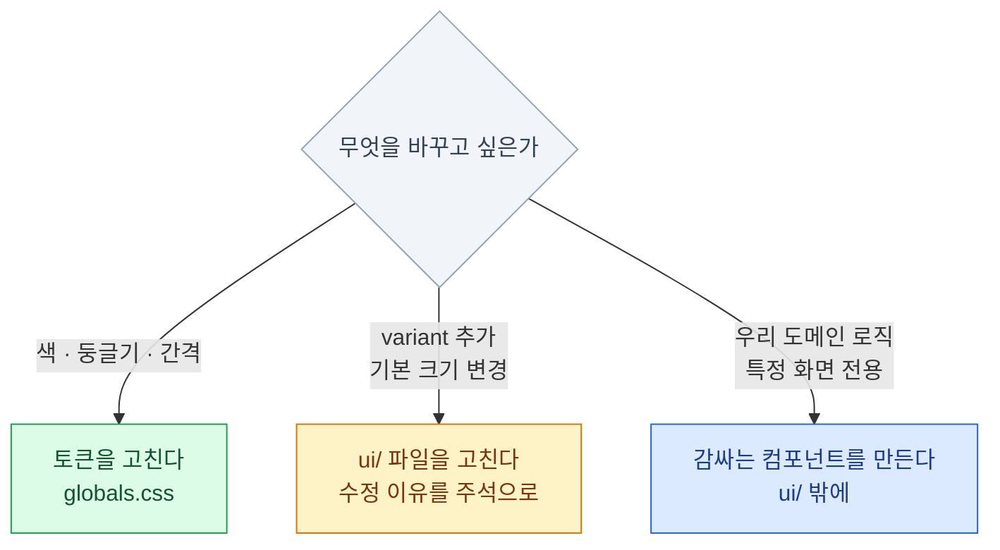

import { LinkCard, Tabs, TabItem, CardGrid, Card } from '@astrojs/starlight/components';
import TermIntro from '../../../components/docs/TermIntro.astro';
import ClassAnatomy from '../../../components/demos/ClassAnatomy.astro';
import CvaDemo from '../../../components/demos/CvaDemo.astro';
import InputStatesDemo from '../../../components/demos/InputStatesDemo.astro';

> `--primary`가 "브랜드 색은 이것"이라는 결정이라면,
> `button.tsx`는 "**outline 버튼이란 이런 것**"이라는 결정이다. 둘 다 테마다.

<TermIntro
  terms={[
    ['variant', '변형', '같은 컴포넌트의 다른 성격. 버튼의 `default` / `outline` / `ghost` 처럼. **크기와는 별개의 축**이다.'],
    ['`cva`', 'class-variance-authority', 'variant 이름을 받아 Tailwind 클래스 문자열을 만들어 주는 작은 라이브러리. 조건문 없이 표로 관리하게 해 준다.'],
    ['`cn`', 'class names', 'shadcn이 만들어 주는 도우미 함수. 클래스 문자열을 합치되 **충돌하는 것은 뒤쪽을 이기게** 한다.'],
    ['`clsx`', '', '조건에 따라 클래스를 켜고 끄는 라이브러리. `cn` 의 절반을 담당한다.'],
    ['`tailwind-merge`', '', '`p-2 p-4` 처럼 충돌하는 Tailwind 클래스에서 뒤엣것만 남기는 라이브러리. `cn` 의 나머지 절반.'],
  ]}
/>

## 컴포넌트가 왜 테마인가

토큰만으로는 정의되지 않는 결정들이 있다.

- outline 버튼은 **테두리가 있고 배경이 투명하다** — 어느 토큰에도 안 적혀 있다
- 버튼의 기본 높이는 **2.25rem**이다 — `--spacing`이 아니라 컴포넌트가 정한다
- 마우스를 올리면 **`accent` 배경으로 바뀐다** — 어떤 토큰을 쓸지도 결정이다

이 결정들이 사는 곳이 `components/ui/button.tsx`다.
**shadcn/ui가 소유권을 넘겨 준 게 바로 이 층**이고, 그래서 이건 관리 대상 리소스다.

## `button.tsx` 읽기

받아 온 파일에서 군더더기를 걷어내면 이 구조다.

```tsx
// components/ui/button.tsx
import { cva, type VariantProps } from 'class-variance-authority'
import { cn } from '@/lib/utils'

const buttonVariants = cva(
  // ① 모든 버튼이 공유하는 부분
  "inline-flex items-center justify-center gap-2 whitespace-nowrap rounded-md \
   text-sm font-medium transition-colors \
   focus-visible:outline-none focus-visible:ring-2 focus-visible:ring-ring \
   disabled:pointer-events-none disabled:opacity-50",
  {
    variants: {
      // ② 성격 축
      variant: {
        default:     "bg-primary text-primary-foreground hover:bg-primary/90",
        secondary:   "bg-secondary text-secondary-foreground hover:bg-secondary/80",
        destructive: "bg-destructive text-white hover:bg-destructive/90",
        outline:     "border border-input bg-background hover:bg-accent hover:text-accent-foreground",
        ghost:       "hover:bg-accent hover:text-accent-foreground",
        link:        "text-primary underline-offset-4 hover:underline",
      },
      // ③ 크기 축
      size: {
        sm:      "h-8 px-3 text-xs",
        default: "h-9 px-4 py-2",
        lg:      "h-10 px-6",
        icon:    "size-9",
      },
    },
    // ④ 아무것도 안 주면 이것
    defaultVariants: { variant: "default", size: "default" },
  }
)

function Button({ className, variant, size, ...props }) {
  return <button className={cn(buttonVariants({ variant, size, className }))} {...props} />
}
```

**여기서 확인할 것 하나** — `bg-zinc-900` 같은 원시 색이 **단 한 번도 안 나온다.**
전부 `bg-primary`, `border-input`, `ring-ring` 같은 의미 토큰이다.
[2장에서 본 테마 교체](/shadcn/02-theme/#같은-컴포넌트라는-말의-무게)가 가능한 유일한 이유다.

### ① 공통 클래스는 관심사별로 읽는다

길어 보이지만 사실 **몇 개의 관심사가 나열**된 것뿐이다.

<ClassAnatomy groups={[
  ['레이아웃', 'inline-flex items-center justify-center'],
  ['간격', 'gap-2 px-4 py-2'],
  ['크기', 'h-9'],
  ['타이포', 'text-sm font-medium whitespace-nowrap'],
  ['테두리', 'rounded-md'],
  ['색상', 'bg-primary text-primary-foreground'],
  ['상태', 'hover:bg-primary/90 focus-visible:ring-2 disabled:opacity-50'],
]} />

이 순서로 읽는 습관을 들이면 100자짜리 클래스 문자열도 3초 만에 파악된다.
**직접 컴포넌트를 만들 때도 이 순서로 쓴다** — 팀이 같은 순서를 쓰면 diff가 읽힌다.

### ②③ 두 축이 독립적으로 조합된다

`variant`와 `size`는 **서로 모른다.** 그래서 6 × 4 = 24가지 조합이 자동으로 나온다.
직접 눌러 보면 클래스 문자열이 어떻게 합쳐지는지 보인다 —

<CvaDemo />

:::tip[핵심]
**축을 나누는 것이 variant 설계의 전부**다.
`primaryLarge`, `outlineSmall` 같은 이름을 만들기 시작하면 조합 폭발이 시작된다.
"이건 성격인가 크기인가"를 먼저 묻는다.
:::

### `cn`이 왜 필요한가

`cn`은 두 라이브러리를 합친 것이다.

```ts
// lib/utils.ts
import { clsx, type ClassValue } from 'clsx'
import { twMerge } from 'tailwind-merge'

export function cn(...inputs: ClassValue[]) {
  return twMerge(clsx(inputs))
}
```

없으면 무슨 일이 생기는지 보자.

<Tabs>
<TabItem label="cn 없이 그냥 이어붙일 때">

```tsx
<Button className="p-8">넓은 버튼</Button>
```

```html
<!-- 결과 -->
<button class="… px-4 py-2 … p-8">
```

`px-4 py-2`와 `p-8`이 **둘 다 살아 있다.**
어느 쪽이 이길지는 CSS 파일에 어떤 순서로 들어갔느냐에 달렸다 — **예측할 수 없다.**

</TabItem>
<TabItem label="cn을 쓸 때">

```tsx
<Button className="p-8">넓은 버튼</Button>
```

```html
<!-- 결과 -->
<button class="… p-8">
```

`tailwind-merge`가 **같은 속성을 건드리는 클래스를 알아보고** 뒤엣것만 남긴다.
"나중에 준 게 이긴다"는 예측 가능한 규칙이 생긴다.

</TabItem>
</Tabs>

:::caution[함정]
직접 만든 컴포넌트에서 `className`을 그냥 이어붙이면(`` `${base} ${className}` ``)
**바깥에서 준 클래스가 안 먹는 버그**가 생긴다. 원인을 찾기 아주 어렵다.
`className` prop을 받는 컴포넌트는 **항상 `cn`을 통과**시킨다.
:::

## 상태도 결정이다

버튼 하나에 상태가 여럿 있다. **각 상태를 어떤 토큰으로 표현할지가 테마의 일부**다.

<InputStatesDemo />

| 상태 | 클래스 | 규칙 |
|---|---|---|
| 기본 | — | |
| 마우스 올림 | `hover:` | 보통 `accent` 또는 원래 색의 90% 투명도 |
| **키보드 포커스** | `focus-visible:` | **`ring-ring`. 지우면 안 된다** |
| 비활성 | `disabled:` | `opacity-50` + `pointer-events-none` |
| 오류 | `aria-invalid:` | `border-destructive` |

**`focus-visible`과 `focus`의 차이**를 알아두면 좋다.
`focus`는 마우스 클릭에도 반응해서 클릭할 때마다 테두리가 생긴다.
`focus-visible`은 **키보드로 이동했을 때만** 반응한다 — 그래서 이쪽을 쓴다.

## 꼭 알아야 할 컴포넌트

70개가 넘지만, **실제로 계속 쓰는 건 이 정도**다.

<CardGrid>
<Card title="거의 매일" icon="star">
`Button` · `Input` · `Label` · `Card` ·
`Dialog` · `Select` · `Table` · `Badge`
</Card>
<Card title="자주" icon="approve-check">
`Form` · `Checkbox` · `Switch` · `Textarea` ·
`Tabs` · `Dropdown Menu` · `Tooltip` · `Alert`
</Card>
<Card title="필요할 때 찾으면 되는 것" icon="information">
`Command`(⌘K 검색) · `Sheet`(모바일 서랍) ·
`Popover` · `Skeleton` · `Sonner`(토스트) · `Accordion`
</Card>
<Card title="이런 것도 있다" icon="puzzle">
`Data Table` · `Chart` · `Carousel` · `Resizable` ·
`Input OTP` · `Sidebar`. 이름만 기억.
</Card>
</CardGrid>

### `Form`은 조금 특별하다

`Form`은 혼자 동작하지 않는다. **`react-hook-form` + `zod`와 한 세트**로 쓴다.

- `react-hook-form` — 입력값 상태 관리. 리렌더를 최소화한다
- `zod` — 검증 규칙을 스키마로 선언. 타입도 같이 나온다
- shadcn `Form` — 둘을 이어 주고 **오류 메시지와 라벨을 접근성 규칙에 맞게** 연결한다

세 번째가 핵심이다. `aria-invalid`, `aria-describedby`를 손으로 붙이면 거의 항상 빠뜨린다.

## 컴포넌트를 고칠 때

받은 파일은 내 코드지만, **아무렇게나 고치면 [11장](/shadcn/11-registry/)의 업스트림 추적이 어려워진다.**
세 단계로 나눠 생각한다.



| 하고 싶은 것 | 어디를 | 왜 |
|---|---|---|
| "버튼을 더 각지게" | **토큰** (`--radius`) | 모든 컴포넌트가 같이 움직인다 |
| "브랜드 색 변경" | **토큰** (`--primary`) | 한 줄 |
| "`success` variant 추가" | `ui/button.tsx` | 여기 말고 둘 곳이 없다 |
| "결제 버튼은 항상 로딩 스피너" | **감싸는 컴포넌트** | 도메인 로직은 `ui/`에 안 넣는다 |

```tsx
// components/pay-button.tsx  ← ui/ 밖
import { Button } from '@/components/ui/button'

export function PayButton({ loading, ...props }) {
  return (
    <Button disabled={loading} {...props}>
      {loading && <Spinner className="size-4" />}
      결제하기
    </Button>
  )
}
```

:::tip[핵심]
**`ui/` 파일을 고칠 때는 파일 맨 위에 주석으로 이유를 남긴다.**

```tsx
// [수정] 2026-08 — success variant 추가 (배포 성공 배지용)
// [수정] 2026-08 — 기본 size를 sm으로. 우리 앱은 밀도가 높다
```

반년 뒤 `--diff`로 업스트림 변경을 봤을 때, 어느 게 내 변경이고 어느 게 원본 변경인지
이 주석이 있어야 구분된다.
:::

## 7장 요약

- 컴포넌트도 테마다 — **"outline이란 이런 것"이라는 결정**이 코드로 들어 있다
- `button.tsx`에 **원시 색이 한 번도 안 나온다.** 이것이 테마 교체를 가능하게 한다
- 긴 클래스 문자열은 **레이아웃 → 간격 → 크기 → 타이포 → 테두리 → 색 → 상태** 순으로 읽는다
- `cva`는 **variant(성격) × size(크기) 두 축**을 독립적으로 조합한다. 축을 합치면 폭발한다
- **`cn`은 클래스 충돌을 해결**한다. `className`을 받는 컴포넌트는 항상 통과시킨다
- 포커스는 `focus`가 아니라 **`focus-visible`** — 키보드일 때만 반응한다
- 매일 쓰는 컴포넌트는 8개 남짓. 나머지는 필요할 때 찾는다
- 고칠 때는 **토큰 → `ui/` 파일 → 감싸기** 순으로 검토하고, `ui/` 수정에는 **주석으로 이유**를 남긴다

<LinkCard
  title="8. 아이콘 · 폰트 리소스"
  description="세트를 하나로 통일하고, 폰트는 언제 어떻게 내려받게 할 것인가."
  href="/shadcn/08-icon-font/"
/>
