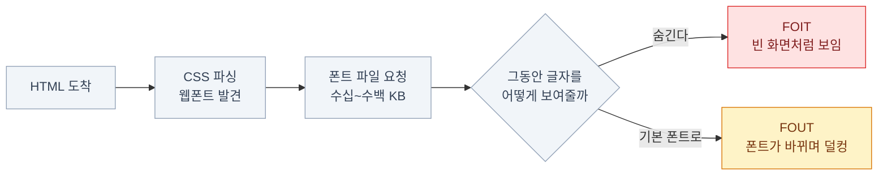

import { LinkCard, Tabs, TabItem, Steps } from '@astrojs/starlight/components';
import TermIntro from '../../../components/docs/TermIntro.astro';

> 아이콘과 폰트는 **파일**이라서 토큰과 다르게 느껴지지만, 관리 대상인 건 똑같다.
> 통일되지 않으면 화면이 어색해지고, 잘못 불러오면 **화면이 늦게 뜬다.**

<TermIntro
  terms={[
    ['lucide', '', 'shadcn/ui의 기본 아이콘 세트. 1500개가 넘는 선(line) 스타일 아이콘 모음. 오픈소스.'],
    ['SVG', 'Scalable Vector Graphics', '수학적으로 그려지는 이미지 형식. 아무리 확대해도 안 깨지고, CSS로 색을 바꿀 수 있다.'],
    ['`currentColor`', '', 'CSS 키워드. "지금 이 요소의 글자색"을 뜻한다. SVG 아이콘이 주변 글자색을 자동으로 따라오게 만드는 장치.'],
    ['FOIT / FOUT', 'Flash of Invisible / Unstyled Text', '웹폰트를 내려받는 동안 글자가 **안 보이거나**(FOIT) **다른 폰트로 보였다가 바뀌는**(FOUT) 현상.'],
    ['서브셋', 'Subset', '폰트 파일에서 필요한 글자만 잘라낸 것. 한글 폰트를 실용적으로 쓰려면 필수.'],
  ]}
/>

## 아이콘 리소스

### 왜 세트를 통일해야 하는가

아이콘은 저마다 **선 굵기, 모서리 처리, 여백 비율**이 다르다.
두 세트를 섞으면 개별로는 멀쩡한데 나란히 놓으면 어색하다.

```tsx
{/* ❌ 섞으면 굵기와 크기가 안 맞는다 */}
import { Search } from 'lucide-react'
import { FaUser } from 'react-icons/fa'
import { MdSettings } from 'react-icons/md'
```

```tsx
{/* ✅ 한 세트에서만 */}
import { Search, User, Settings } from 'lucide-react'
```

**세트 선택도 테마 결정이다.** 프로젝트당 하나로 정하고 리뷰에서 지킨다.

### lucide 쓰기

`init`이 기본으로 깔아 주는 세트다.

```tsx
import { Search, Loader2 } from 'lucide-react'

<Search className="size-4" />
<Loader2 className="size-4 animate-spin" />
```

| 규칙 | 이유 |
|---|---|
| **크기는 `size-4`(16px) 기본** | 14px 글자 옆에 놓았을 때 균형이 맞는다. 버튼 안 아이콘은 대부분 이것 |
| **색은 지정하지 않는다** | lucide는 `stroke="currentColor"`라서 **글자색을 자동으로 따라온다** |
| `aria-hidden` | 장식용 아이콘은 화면낭독기가 읽지 않게 한다 |
| 의미 있는 아이콘엔 라벨 | 아이콘만 있는 버튼은 `aria-label="검색"`이 필요하다 |

:::tip[핵심]
**아이콘에 색 클래스를 붙이지 않는다.**

```tsx
<Button variant="destructive"><Trash className="size-4" /> 삭제</Button>
```

`currentColor` 덕분에 아이콘이 버튼의 글자색을 그대로 따라간다.
`text-red-500`을 아이콘에 직접 주면 다크 모드에서 혼자 안 바뀐다.
:::

### 크기 규칙

| 클래스 | 크기 | 어디에 |
|---|---|---|
| `size-3` | 12px | 배지 안, 아주 작은 표시 |
| **`size-4`** | **16px** | **기본. 버튼·메뉴·입력창** |
| `size-5` | 20px | 카드 헤더, 조금 강조 |
| `size-6`+ | 24px+ | 빈 화면 안내, 히어로 |

:::caution[함정]
아이콘 크기를 아무렇게나 주면 **버튼 높이가 아이콘 때문에 밀린다.**
버튼 안 아이콘은 `size-4`로 고정하고, `shrink-0`을 붙여 줄어들지 않게 한다.

```tsx
<Search className="size-4 shrink-0" />
```
:::

### 다른 세트를 쓰고 싶으면

`components.json`에 등록하면 CLI가 그 세트로 컴포넌트를 받아 온다.

```json
{ "iconLibrary": "radix" }
```

이미 받은 파일까지 바꾸려면 `shadcn migrate icons` 명령이 있다.
**세트 교체는 한 번 하고 끝나는 일**이라 이 이상은 필요해질 때 문서를 보면 된다.

## 폰트 리소스

폰트는 **언제 어떻게 내려받게 할 것인가**가 전부다. 잘못하면 화면이 늦게 뜨거나 덜컹거린다.

### 무슨 문제가 생기나



**둘 중 하나는 반드시 일어난다.** 고를 수 있을 뿐이다.
그리고 대부분의 경우 **FOUT 쪽이 낫다** — 글자가 안 보이는 것보다 낫기 때문이다.

```css
@font-face {
  font-family: 'Pretendard Variable';
  src: url('/fonts/pretendard.woff2') format('woff2');
  font-display: swap;   /* ← 기본 폰트로 먼저 보여준다 = FOUT 선택 */
}
```

### 세 가지 방법

<Tabs>
<TabItem label="① 시스템 폰트 — 가장 빠르다">

```css
@theme inline {
  --font-sans: -apple-system, BlinkMacSystemFont, 'Segoe UI',
               'Apple SD Gothic Neo', 'Malgun Gothic', sans-serif;
}
```

- 내려받을 게 **없다**. FOIT도 FOUT도 없다
- 기기마다 글꼴이 다르다 — 브랜드 통일이 안 된다
- **관리도구·내부 시스템이라면 최선의 선택**

</TabItem>
<TabItem label="② next/font — Next.js라면 이것">

```tsx
// app/layout.tsx
import { Inter } from 'next/font/google'

const inter = Inter({ subsets: ['latin'], variable: '--font-sans' })

export default function RootLayout({ children }) {
  return (
    <html className={inter.variable}>
      <body className="font-sans">{children}</body>
    </html>
  )
}
```

- 빌드 시점에 **폰트 파일을 내 서버로 가져온다** — 구글 서버 요청이 사라진다
- `font-display: swap`과 폴백 크기 보정을 **자동으로** 해 준다
- **한글 폰트는 구글 폰트에 있는 것만** 가능하다 (Noto Sans KR 등)

</TabItem>
<TabItem label="③ 셀프호스팅 + 동적 서브셋 — 한글의 현실적 해답">

```css
/* Pretendard가 공식 제공하는 CSS를 불러온다 */
@import url('https://cdn.jsdelivr.net/gh/orioncactus/pretendard/dist/web/variable/pretendardvariable-dynamic-subset.css');

@theme inline {
  --font-sans: 'Pretendard Variable', system-ui, sans-serif;
}
```

- 폰트를 **수백 개 조각으로 쪼개** 두고, 페이지에 실제 쓰인 글자의 조각만 내려받는다
- 수 MB짜리 한글 폰트가 **페이지당 수십 KB**로 줄어든다
- 가변 폰트라 **굵기 전부가 파일 하나**에 들어 있다 ([6장](/shadcn/06-typography/#굵기))

</TabItem>
</Tabs>

:::tip[핵심]
**한글 웹폰트를 쓸 거면 동적 서브셋이 사실상 유일한 답이다.**
전체 파일은 굵기당 수 MB라 모바일에서 감당이 안 되고,
정적 서브셋(자주 쓰는 2350자만)은 이름·전문용어에서 글자가 깨진다.
:::

### 토큰에 연결한다

어느 방법을 쓰든 **마지막은 똑같다** — 폰트를 토큰에 매달아 컴포넌트가 이름만 알게 한다.

<Steps>

1. **폰트를 불러온다** (위 셋 중 하나)

2. **토큰에 연결한다**

   ```css
   @theme inline {
     --font-sans: 'Pretendard Variable', system-ui, sans-serif;
     --font-mono: ui-monospace, Menlo, monospace;
   }
   ```

3. **바탕에 한 번만 적용한다**

   ```tsx
   <body className="font-sans antialiased">
   ```

4. **컴포넌트는 아무것도 안 한다**

   `font-sans`는 상속되므로 개별 컴포넌트에 폰트 클래스를 붙일 일이 없다.
   코드에 폰트가 필요한 자리에만 `font-mono`를 준다.

</Steps>

:::caution[함정]
`--font-sans`를 정의만 하고 `<body>`에 `font-sans`를 안 붙이면
**Tailwind 기본 폰트(시스템 폰트)가 그대로 나온다.** 정의와 적용은 별개다.
[4장의 `@theme inline` 연결 누락](/shadcn/04-color/#연결하지-않으면-클래스가-안-생긴다)과 같은 종류의 실수다.
:::

## 8장 요약

- **아이콘 세트는 하나로 통일**한다. 섞으면 선 굵기와 여백이 안 맞아 어색해진다
- lucide 아이콘은 `currentColor`라 **글자색을 자동으로 따라온다** — 색 클래스를 붙이지 않는다
- 크기는 **`size-4`(16px)가 기본**, 버튼 안에서는 `shrink-0`을 같이 준다
- 웹폰트는 **FOIT(안 보임)와 FOUT(덜컹) 중 하나가 반드시** 일어난다. `font-display: swap`으로 FOUT를 고른다
- 방법 셋 — **시스템 폰트**(가장 빠름) · **`next/font`**(Next.js 기본) · **동적 서브셋**(한글의 답)
- 한글 웹폰트는 **동적 서브셋이 사실상 유일한 실용적 방법**이다
- 어느 방법이든 마지막은 **`--font-sans` 토큰에 연결 + `<body>`에 한 번 적용**

<LinkCard
  title="9. 테마 두 벌 — 다크 모드"
  description="같은 이름, 다른 값 — 그리고 첫 화면이 하얗게 번쩍이는 문제."
  href="/shadcn/09-dark/"
/>
