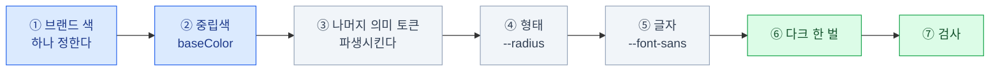

import { LinkCard, Steps, CardGrid, Card } from '@astrojs/starlight/components';
import TermIntro from '../../../components/docs/TermIntro.astro';
import ThemeSwitcher from '../../../components/demos/ThemeSwitcher.astro';
import ColorScale from '../../../components/demos/ColorScale.astro';

> 앞의 여섯 장을 한 파일에 모으는 장이다. **`globals.css` 하나를 완성한다.**

<TermIntro
  terms={[
    ['프리셋', 'Preset', '미리 만들어 둔 테마 한 벌. `shadcn add` 로 통째로 받아 적용할 수 있다.'],
    ['톤온톤', 'Tone on Tone', '한 색상에서 밝기만 다르게 뽑아 쓰는 배색. 브랜드 색 하나로 팔레트를 만드는 가장 안전한 방법.'],
    ['대비 검사', 'Contrast Check', '배경과 글자의 밝기 차이가 기준(본문 4.5:1)을 넘는지 확인하는 것. 브라우저 개발자도구에 내장돼 있다.'],
  ]}
/>

## 순서



**출발점은 두 개다** — 브랜드 색과 중립색.
나머지는 그 둘에서 파생하거나 기본값에서 시작하되, 대비·상태색·제품 성격에 맞춰 검증한다.

## ① 브랜드 색 하나

먼저 브랜드 색을 `oklch`로 변환해 **밝기·채도·색상 전체를 출발값으로** 삼는다.
버튼 배경에서는 색상 인상을 유지하면서 밝기와 채도를 조절한다.

```css
--primary: oklch(0.55 0.20 264);
/*                     ↑    ↑
                    채도    색상 */
```

| 색상 각도 | 대략 |
|---|---|
| `25` | 빨강 |
| `60` | 주황 |
| `95` | 노랑 |
| `150` | 초록 |
| `195` | 청록 |
| `264` | 파랑 |
| `300` | 보라 |

hex 브랜드 색이 있다면 브라우저 개발자도구에서 색을 클릭해 `oklch`로 바꿔 보면 숫자가 나온다.

:::caution[함정]
브랜드 색을 그대로 `--primary`에 넣으면 **글자 대비가 안 나오는 경우가 많다.**
브랜드 색은 로고용으로 밝게 만들어진 경우가 흔하기 때문이다.

`--primary`는 **`--primary-foreground`가 올라갈 배경**이다.
특정 밝기 숫자만으로 통과를 보장할 수 없으므로 두 색을 함께 정하고 실제 대비를 측정한다.
로고 색이 밝다면 밝기와 채도를 조절한 UI용 버전을 별도로 둔다.
:::

## ② 중립색

[4장](/shadcn/04-color/#basecolor--중립색-고르기)에서 본 그대로다.
현재 프리셋에서는 따뜻한 인상은 `stone`·`taupe`, 차가운 인상은 `mist`,
무채색은 `neutral`·`zinc`부터 비교한다. 미묘한 차이는 `shadcn/create`의 실제 화면으로 고른다.

<ColorScale name="zinc — 중립적인 출발점" colors={['#fafafa','#f4f4f5','#e4e4e7','#d4d4d8','#a1a1aa','#71717a','#52525b','#3f3f46','#27272a','#18181b','#09090b']} />

## ③~⑥ 한 파일로

<Steps>

1. **라이트 값을 채운다**

   ```css
   /* app/globals.css */
   @import "tailwindcss";

   :root {
     /* 브랜드 */
     --primary: oklch(0.55 0.20 264);
     --primary-foreground: oklch(0.99 0 0);

     /* 바탕과 표면 */
     --background: oklch(1 0 0);
     --foreground: oklch(0.145 0 0);
     --card: oklch(1 0 0);
     --card-foreground: oklch(0.145 0 0);
     --popover: oklch(1 0 0);
     --popover-foreground: oklch(0.145 0 0);

     /* 보조 */
     --secondary: oklch(0.97 0 0);
     --secondary-foreground: oklch(0.205 0 0);
     --muted: oklch(0.97 0 0);
     --muted-foreground: oklch(0.556 0 0);
     --accent: oklch(0.97 0 0);
     --accent-foreground: oklch(0.205 0 0);

     /* 경고 */
     --destructive: oklch(0.577 0.245 27);

     /* 선 */
     --border: oklch(0.922 0 0);
     --input: oklch(0.922 0 0);
     --ring: oklch(0.55 0.20 264);   /* 포커스 링은 브랜드 색으로 */

     /* 형태 */
     --radius: 0.625rem;
   }
   ```

2. **다크 값을 채운다** — 밝기를 뒤집고 채도를 낮춘다

   ```css
   .dark {
     --primary: oklch(0.72 0.16 264);        /* 밝게, 채도 ↓ */
     --primary-foreground: oklch(0.20 0.04 264);

     --background: oklch(0.145 0 0);          /* 순수 검정 아님 */
     --foreground: oklch(0.985 0 0);
     --card: oklch(0.205 0 0);                /* 배경보다 밝게 = 떠 보임 */
     --card-foreground: oklch(0.985 0 0);
     --popover: oklch(0.205 0 0);
     --popover-foreground: oklch(0.985 0 0);

     --secondary: oklch(0.269 0 0);
     --secondary-foreground: oklch(0.985 0 0);
     --muted: oklch(0.269 0 0);
     --muted-foreground: oklch(0.708 0 0);
     --accent: oklch(0.269 0 0);
     --accent-foreground: oklch(0.985 0 0);

     --destructive: oklch(0.704 0.191 22);

     --border: oklch(1 0 0 / 10%);            /* 반투명 흰색이 자연스럽다 */
     --input: oklch(1 0 0 / 15%);
     --ring: oklch(0.72 0.16 264);
   }
   ```

3. **Tailwind에 연결한다** — 빠뜨리면 클래스가 안 생긴다

   ```css
   @theme inline {
     --color-background: var(--background);
     --color-foreground: var(--foreground);
     --color-card: var(--card);
     --color-card-foreground: var(--card-foreground);
     --color-popover: var(--popover);
     --color-popover-foreground: var(--popover-foreground);
     --color-primary: var(--primary);
     --color-primary-foreground: var(--primary-foreground);
     --color-secondary: var(--secondary);
     --color-secondary-foreground: var(--secondary-foreground);
     --color-muted: var(--muted);
     --color-muted-foreground: var(--muted-foreground);
     --color-accent: var(--accent);
     --color-accent-foreground: var(--accent-foreground);
     --color-destructive: var(--destructive);
     --color-border: var(--border);
     --color-input: var(--input);
     --color-ring: var(--ring);

     --radius-sm: calc(var(--radius) * 0.6);
     --radius-md: calc(var(--radius) * 0.8);
     --radius-lg: var(--radius);
     --radius-xl: calc(var(--radius) * 1.4);
     --radius-2xl: calc(var(--radius) * 1.8);

     --font-sans: 'Pretendard Variable', system-ui, sans-serif;
     --font-mono: ui-monospace, Menlo, monospace;
   }
   ```

4. **바탕에 적용한다**

   ```tsx
   // app/layout.tsx
   <body className="bg-background text-foreground font-sans antialiased">
   ```

</Steps>

:::tip[핵심]
**`--ring`을 브랜드 색으로 두는 것**을 권한다.
포커스 링은 화면에서 가장 자주 나타나는 브랜드 접점인데 대부분 회색으로 방치된다.
한 줄로 앱이 훨씬 "우리 것" 같아진다.
:::

## 확인하기

토큰을 바꾸면 화면이 어떻게 달라지는지 다시 한 번 —

<ThemeSwitcher />

### 도구를 쓰면 빠르다

- **shadcn 공식 테마 편집기** — 웹에서 색을 조절하고 CSS를 복사한다
- **tweakcn** — 커뮤니티 편집기. 미리 만든 테마가 많다
- **프리셋 받기** — 남이 만든 테마를 통째로 가져온다

  ```bash
  pnpm dlx shadcn@latest add https://tweakcn.com/r/themes/<이름>.json
  ```

**처음에는 프리셋에서 시작해 브랜드 색만 바꾸는 편**이 빠르다.
색 20개를 손으로 조화롭게 맞추는 건 생각보다 어렵다.

## 점검 목록

<CardGrid>
<Card title="색" icon="seti:image">
`--primary` 위에 `--primary-foreground` 대비가 4.5:1 이상인가.
`--muted-foreground`가 라이트/다크 **양쪽에서** 읽히는가.
`--border`가 배경과 구분되는가.
</Card>
<Card title="형태" icon="seti:plan">
`--radius`를 극단값(`0`, `2rem`)으로 바꿔 봐도 화면이 안 깨지는가.
포커스 링이 잘리지 않는가 (`overflow-hidden` 주의).
</Card>
<Card title="글자" icon="seti:font">
폰트 폴백이 있는가.
한글 본문에 `break-keep`이 걸려 있는가.
로딩 중 레이아웃이 덜컹거리지 않는가.
</Card>
<Card title="다크" icon="moon">
새로고침해도 안 번쩍이는가.
카드가 배경과 구분되는가.
로고가 멀쩡한가.
</Card>
</CardGrid>

### 대비 검사하는 법

브라우저 개발자도구에서 색 값 옆의 네모를 클릭하면 **대비 비율이 바로 나온다.**
`AA` 통과 표시가 있으면 본문 기준(4.5:1)을 넘은 것이다.

| 대상 | 필요한 대비 |
|---|---|
| 본문 글자 | 4.5:1 |
| 큰 글자 (약 18.7px 이상 굵게, 24px 이상 보통 굵기) | 3:1 |
| 테두리·아이콘 등 비텍스트 | 3:1 |

**`--muted-foreground`가 가장 자주 걸린다.** "흐리게" 하려다 안 읽히게 만드는 경우다.

## 10장 요약

- 출발점은 두 개 — **브랜드 색**과 **중립색 계열**. 나머지는 파생하거나 기본값에서 시작한다
- 브랜드 색을 그대로 `--primary`에 넣지 않는다. **foreground와 한 쌍으로 실제 대비를 측정**한다
- 다크 값은 **밝기를 뒤집고 채도를 낮춘다.** `--card`는 `--background`보다 밝게
- 다크의 `--border`는 **반투명 흰색**(`oklch(1 0 0 / 10%)`)이 자연스럽다
- **`--ring`을 브랜드 색으로** 두면 한 줄로 앱 인상이 바뀐다
- **프리셋에서 시작해 브랜드 색만 바꾸는 것**이 실용적이다
- 검사에서 가장 자주 걸리는 것은 **`--muted-foreground` 대비**

## 참고 자료

- [shadcn/ui Theming](https://ui.shadcn.com/docs/theming) — 최신 기본 토큰과 반경 스케일
- [WCAG 2.2 Contrast Minimum](https://www.w3.org/WAI/WCAG22/Understanding/contrast-minimum.html) — 일반·큰 텍스트 대비 기준

<LinkCard
  title="11. 테마를 팀에 배포하기"
  description="레지스트리 — 내 테마와 컴포넌트를 다른 앱이 받아 가게 만든다."
  href="/shadcn/11-registry/"
/>
