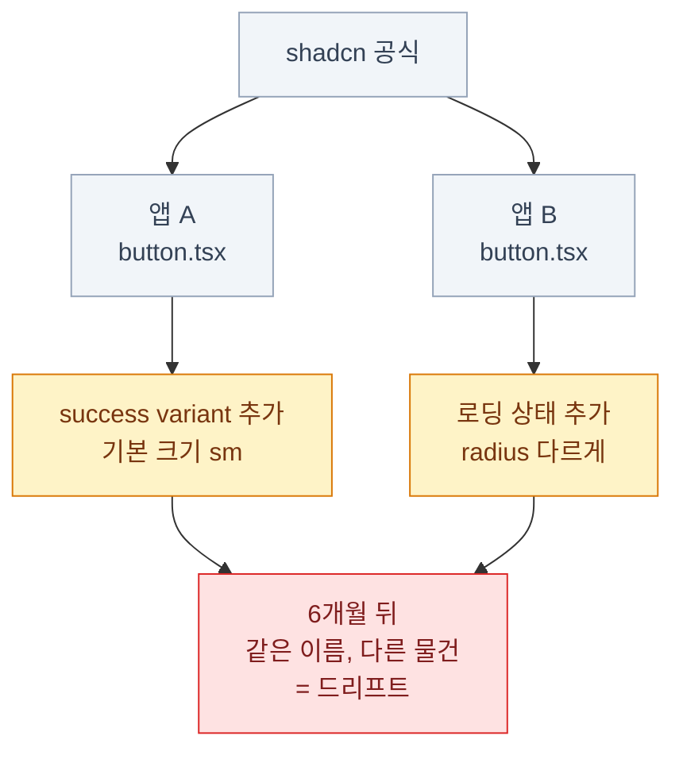

import { LinkCard, Steps, FileTree, Tabs, TabItem } from '@astrojs/starlight/components';
import TermIntro from '../../../components/docs/TermIntro.astro';

> 앱이 하나면 필요 없다. **둘이 되는 순간 필요해진다.**

<TermIntro
  terms={[
    ['레지스트리', 'Registry', '컴포넌트와 테마를 JSON으로 담아 둔 배포처. shadcn CLI가 URL을 받아 여기서 코드를 가져온다.'],
    ['업스트림', 'Upstream', '내가 복사해 온 원본. shadcn/ui 공식 레지스트리가 이 덱에서의 업스트림이다.'],
    ['`--diff`', '', '내가 고친 파일과 레지스트리의 현재 항목 차이를 보여주는 CLI 옵션. 업스트림 변경을 검토하는 핵심 도구다.'],
    ['드리프트', 'Drift', '같은 컴포넌트가 앱마다 조금씩 달라져 결국 서로 다른 물건이 되는 현상.'],
  ]}
/>

## 왜 필요해지는가

앱이 둘이 되면 이런 일이 시작된다.



**소유권 모델의 대가**다. 자유롭게 고칠 수 있다는 건 자유롭게 갈라진다는 뜻이기도 하다.
레지스트리는 이 갈라짐에 **공통 출발점**을 다시 만들어 준다.

## 무엇을 배포하는가

레지스트리는 컴포넌트만 배포하는 게 아니다.

| 종류 | 담기는 것 | 언제 |
|---|---|---|
| **`registry:theme`** | **CSS 변수 한 벌** | **팀 테마를 작은 단위로 배포할 때** |
| `registry:ui` | 컴포넌트 소스 파일 | 우리 팀만의 컴포넌트를 공유할 때 |
| `registry:block` | 여러 파일로 된 화면 조각 | 로그인 화면 같은 완성 조합 |
| `registry:hook` | 훅 파일 | 컴포넌트가 필요로 하는 훅 |
| `registry:style` | 프로젝트 초기 설정 한 벌 | 새 앱 시작 템플릿 |
| `registry:base` | 기반·컴포넌트·토큰·폰트·설정 전체 | 디자인 시스템 전체를 한 번에 고정할 때 |
| `registry:font` | 폰트 설정 | 폰트를 별도 항목으로 배포할 때 |

**테마부터 시작하는 것을 권한다.** 파일이 CSS 하나라 만들기 쉽고 효과가 즉시 보인다.

## 테마를 배포한다

<Steps>

1. **`registry.json`을 만든다**

   ```json
   {
     "$schema": "https://ui.shadcn.com/schema/registry.json",
     "name": "acme",
     "homepage": "https://ui.acme.com",
     "items": [
       {
         "name": "acme-theme",
         "type": "registry:theme",
         "title": "Acme 테마",
         "description": "브랜드 색 · 반경 · 폰트 한 벌",
         "cssVars": {
           "theme": {
             "radius": "0.5rem",
             "font-sans": "'Pretendard Variable', system-ui, sans-serif"
           },
           "light": {
             "primary": "oklch(0.55 0.20 264)",
             "primary-foreground": "oklch(0.99 0 0)",
             "ring": "oklch(0.55 0.20 264)"
           },
           "dark": {
             "primary": "oklch(0.72 0.16 264)",
             "primary-foreground": "oklch(0.20 0.04 264)",
             "ring": "oklch(0.72 0.16 264)"
           }
         }
       }
     ]
   }
   ```

2. **빌드한다**

   ```bash
   pnpm dlx shadcn@latest build
   ```

   `public/r/acme-theme.json`이 생긴다.

3. **정적 파일로 올린다**

   Vercel·Cloudflare Pages·S3 — 어디든 된다. **JSON 파일 하나를 제공하는 게 전부**라
   서버가 필요 없다. 사내용이면 사내망 정적 호스팅으로 충분하다.

4. **다른 앱에서 받는다**

   ```bash
   pnpm dlx shadcn@latest add https://ui.acme.com/r/acme-theme.json
   ```

   그 앱의 `globals.css`에 토큰이 병합된다. 기존 키를 바꿀 수 있으므로 먼저 `--dry-run`이나
   `--diff`로 적용 범위를 확인하고, git diff를 리뷰한다.

</Steps>

:::tip[핵심]
**테마를 레지스트리로 만들면 브랜드 변경이 "앱마다 CSS를 재작성"에서 "같은 항목을 검토해 재적용"으로 바뀐다.**
고정된 릴리스가 필요하면 URL이나 레지스트리 파라미터에 버전을 명시한다. 버전 없는 URL은
현재 JSON을 가리키므로 명령 한 줄이 곧 자동 버전 관리가 되는 것은 아니다.
:::

### 이름을 붙여 두면 짧아진다

`components.json`에 등록해 두면 URL 대신 짧은 이름을 쓸 수 있다.

```json
{
  "registries": {
    "@acme": "https://ui.acme.com/r/{name}.json"
  }
}
```

```bash
pnpm dlx shadcn@latest add @acme/acme-theme
pnpm dlx shadcn@latest add @acme/data-table
```

사내 레지스트리라 인증이 필요하면 헤더를 함께 설정할 수 있다.

```json
{
  "registries": {
    "@acme": {
      "url": "https://ui.acme.com/r/{name}.json",
      "headers": { "Authorization": "Bearer ${ACME_TOKEN}" }
    }
  }
}
```

`${ACME_TOKEN}`은 환경변수에서 읽는다. **토큰을 파일에 직접 쓰지 않는다.**

## 컴포넌트도 배포한다

우리 팀만의 컴포넌트가 생기면 같은 방식으로 배포한다.

```json
{
  "name": "user-avatar",
  "type": "registry:ui",
  "title": "사용자 아바타",
  "files": [
    { "path": "registry/user-avatar.tsx", "type": "registry:ui" }
  ],
  "registryDependencies": ["avatar", "tooltip"],
  "dependencies": ["date-fns"]
}
```

- **`registryDependencies`** — 다른 레지스트리 항목. 공식 컴포넌트 이름을 쓰면 그것도 같이 받아진다
- **`dependencies`** — npm 패키지. 자동으로 설치된다

받는 쪽은 명령 한 줄이다.

```bash
pnpm dlx shadcn@latest add @acme/user-avatar
# → user-avatar.tsx + avatar.tsx + tooltip.tsx + date-fns 설치
```

<FileTree>

- registry/ 배포할 소스를 모아 두는 곳
  - user-avatar.tsx
  - data-table.tsx
- registry.json 배포 정의
- public/
  - r/ **`build`가 만드는 결과 — 이걸 호스팅한다**
    - acme-theme.json
    - user-avatar.json

</FileTree>

## 내가 고친 파일 추적하기

레지스트리와 별개로, **업스트림 변경을 확인하는 핵심 도구**가 이것이다.
git 이력·테스트·시각 회귀 검사도 함께 안전망이 된다.

```bash
pnpm dlx shadcn@latest add button --diff
```

```diff
  components/ui/button.tsx
- "focus-visible:ring-2 focus-visible:ring-ring"
+ "focus-visible:ring-[3px] focus-visible:ring-ring/50 focus-visible:border-ring"
```

**업스트림에서 포커스 링 스타일이 개선됐다는 뜻이다.**
내 파일에는 이 개선이 없다 — `--diff`는 이 차이를 직접 드러내 준다.

<Tabs>
<TabItem label="왜 중요한가">

shadcn/ui 컴포넌트는 계속 개선된다. 대부분이 **접근성 수정**이다.

- 포커스 표시 방식 개선
- `aria-*` 속성 추가
- 키보드 조작 버그 수정
- 프리미티브 API 변경 대응

라이브러리를 썼다면 `npm update` 한 번에 받았을 것들이다.
**소유권을 가져온 대가로, 이걸 직접 확인해야 한다.**

</TabItem>
<TabItem label="어떻게 운영하나">

```bash
# 분기에 한 번, 전체 비교
pnpm dlx shadcn@latest add --all --diff > /tmp/ui-diff.txt
```

- **분기 1회 정도**면 충분하다. 매주 볼 필요는 없다
- 접근성·버그 수정만 골라 반영하고, 스타일 변경은 우리 테마 기준으로 판단한다
- **[7장에서 남긴 수정 주석](/shadcn/07-component/#컴포넌트를-고칠-때)이 여기서 값을 한다** —
  어느 게 내 변경이고 어느 게 원본 변경인지 그 주석이 있어야 구분된다

</TabItem>
</Tabs>

:::caution[함정]
`--diff`를 보고 나서 `--overwrite`로 덮어쓰면 **내 수정이 전부 날아간다.**
diff를 보고 **필요한 부분만 손으로 반영**하는 게 정석이다.
:::

## 팀 규칙 세 가지

이만큼만 정해도 드리프트가 크게 준다.

<Steps>

1. **`components/ui/`는 함부로 고치지 않는다**

   토큰으로 되는 일은 토큰으로, 도메인 로직은 감싸는 컴포넌트로.
   진짜 고쳐야 하면 **파일 맨 위에 `[수정]` 주석**을 남긴다.

2. **테마는 레지스트리 한 곳에서만 온다**

   앱마다 `globals.css`를 손으로 편집하지 않는다.
   브랜드 색을 바꾸고 싶으면 레지스트리를 고치고 각 앱이 받아 간다.

3. **분기마다 `--diff`를 돌린다**

   담당자를 정해 둔다. 안 정해 두면 아무도 안 한다.

</Steps>

## 11장 요약

- 앱이 둘 이상이 되면 **드리프트**가 시작된다. 레지스트리가 공통 출발점을 만든다
- 배포 단위는 여럿이지만 **테마(`registry:theme`)부터** 시작하는 게 쉽고 효과가 크다
- 레지스트리는 **JSON 파일을 정적으로 제공**하는 것뿐이다. 서버가 필요 없다
- `components.json`의 `registries`에 등록하면 `@acme/이름`으로 짧게 쓴다. 토큰은 환경변수로
- 컴포넌트 배포는 `registryDependencies`(레지스트리 항목)와 `dependencies`(npm)를 구분해 적는다
- **`--diff`는 업스트림 변경을 확인하는 핵심 도구**다. git 이력과 테스트를 함께 쓴다
- 팀 규칙 셋 — **`ui/` 함부로 안 고침 · 테마는 한 곳에서 · 분기마다 `--diff`**

## 참고 자료

- [Registry 시작하기](https://ui.shadcn.com/docs/registry/getting-started) — 정적 JSON 빌드·호스팅과 namespace 사용법
- [Registry item 유형](https://ui.shadcn.com/docs/registry/registry-item-json) — `registry:theme`·`registry:base`·`registry:font`의 현재 스키마
- [Registry 예제](https://ui.shadcn.com/docs/registry/examples) — `cssVars` 키 형식과 theme/base 예제

<LinkCard
  title="12. 용어 사전"
  description="이 덱에 나온 모든 용어를 한 곳에."
  href="/shadcn/12-glossary/"
/>
