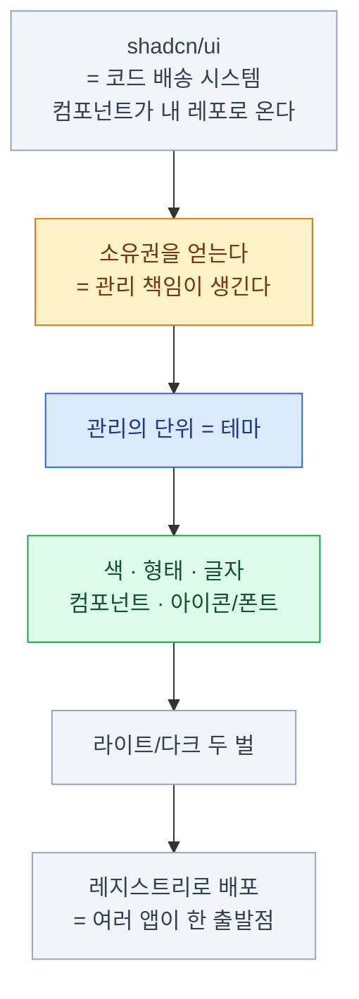

import { Card, CardGrid, LinkCard, Steps } from '@astrojs/starlight/components';
import ThemeSwitcher from '../../../components/demos/ThemeSwitcher.astro';

> 전부 잊어도 이 한 문장만 남으면 된다 —
> **값이 아니라 결정에 이름을 붙이고, 그 이름들을 한 곳에 모은다.**

## 덱 전체를 한 장에

## 장별 한 줄

| 장 | 한 줄 |
|---|---|
| [1](/shadcn/01-what-is-shadcn/) | shadcn/ui는 라이브러리가 아니라 **코드 배송 시스템**이다. 자유를 얻고 유지보수 책임을 진다 |
| [2](/shadcn/02-theme/) | 테마는 색 설정이 아니라 **시각적 결정 전체의 목록**이다. 바꾸는 비용을 상수로 만든다 |
| [3](/shadcn/03-setup/) | **`globals.css`가 테마 본체**다. `cssVariables: true`는 반드시 켠다 |
| [4](/shadcn/04-color/) | 색은 **`background`/`foreground` 짝**으로. `@theme inline` 연결을 빠뜨리면 클래스가 안 생긴다 |
| [5](/shadcn/05-shape/) | **`--radius` 한 줄**이 인상의 절반. 간격은 스케일로만 |
| [6](/shadcn/06-typography/) | UI 기본은 **`text-sm`**. 한글은 줄 간격 넉넉히, 자간은 좁히지 않고, `break-keep` |
| [7](/shadcn/07-component/) | 컴포넌트도 테마다. **variant × size 두 축**, `className`은 항상 `cn`을 통과 |
| [8](/shadcn/08-icon-font/) | 아이콘 세트는 **하나로 통일**. 한글 웹폰트는 **동적 서브셋** |
| [9](/shadcn/09-dark/) | 다크는 **테마 한 벌 더**. 직접 만들면 화면이 번쩍인다 |
| [10](/shadcn/10-make-theme/) | 실제 결정은 **브랜드 색과 중립색 둘뿐**. 나머지는 파생 |
| [11](/shadcn/11-registry/) | 앱이 둘이 되면 **레지스트리**. `--diff`로 업스트림 변경을 검토한다 |

## 절대 하지 말 것 일곱

| 하지 말 것 | 왜 |
|---|---|
| 이 덱에서 `cssVariables: false`로 `init` | 의미 토큰 기반 테마 흐름을 잃는다. 전환하려면 컴포넌트 재설치와 diff 검토가 필요하다 |
| 컴포넌트에 `bg-zinc-900` 직접 | 그 컴포넌트는 테마 밖으로 나간다 |
| `text-white` 하드코딩 | 다크 모드에서 안 보이게 된다 |
| `@theme inline` 연결 누락 | 변수는 있는데 클래스가 없다. 아무 일도 안 일어난다 |
| `outline: none`으로 포커스 링 제거 | 키보드 사용자가 길을 잃는다 |
| `className`을 `cn` 없이 이어붙임 | 바깥에서 준 클래스가 안 먹는 버그. 원인 추적이 어렵다 |
| 다크 모드를 `useEffect`로 직접 구현 | 새로고침마다 흰 화면이 번쩍인다 |

## 시작 체크리스트

새 프로젝트를 시작한다면 이 순서다.

<Steps>

1. **`create-next-app` + `shadcn init`**

   `cssVariables: true` 확인. `baseColor`는 브랜드 온도에 맞춰 — 애매하면 `zinc`.

2. **`globals.css`를 열어 본다**

   토큰 20개가 라이트/다크 두 벌로 들어 있는 걸 눈으로 확인한다. **이게 테마다.**

3. **브랜드 색과 `--radius`, `--ring`을 바꾼다**

   [10장의 순서](/shadcn/10-make-theme/)대로. 프리셋에서 시작하면 더 빠르다.

4. **`next-themes`로 다크 모드를 붙인다**

   붙이자마자 새로고침해 본다. 안 번쩍이면 성공.

5. **폰트를 정한다**

   한글이면 동적 서브셋. `--font-sans`에 연결하고 `<body>`에 적용.

6. **팀 규칙 세 줄을 README에 적는다**

   `ui/` 함부로 안 고침 · 토큰만 씀 · 분기마다 `--diff`.

</Steps>

## 마지막으로 한 번 더

<ThemeSwitcher />

**HTML은 한 글자도 안 바뀐다.** 이 덱은 결국 이 한 장면을 설명한 것이다.

## 다음에 볼 것

<CardGrid>
<Card title="프론트엔드 덱" icon="laptop">
Next.js의 서버/클라이언트 경계, Tailwind CSS 자체,
데이터 가져오기와 캐싱까지 — 스택 전체의 흐름.

[프론트엔드 덱 →](/frontend/)
</Card>
<Card title="접근성" icon="approve-check">
이 덱에서 프리미티브가 대신해 준 부분을
직접 이해하려면 — 포커스 관리, ARIA, 키보드 조작.

[프론트엔드 18장 →](/frontend/18-a11y/)
</Card>
<Card title="공식 문서" icon="open-book">
`ui.shadcn.com` — 컴포넌트별 API와 예제.
`registry.json` 스키마도 여기 있다.
</Card>
<Card title="손을 움직이기" icon="rocket">
빈 프로젝트에 `init` 하고 `globals.css`를
직접 뜯어보는 것이 이 덱을 다시 읽는 것보다 낫다.
</Card>
</CardGrid>

<LinkCard
  title="12. 용어 사전"
  description="막히는 단어가 있으면 여기로."
  href="/shadcn/12-glossary/"
/>
