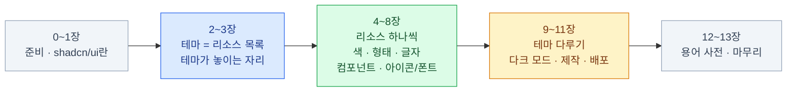

import { Card, CardGrid, LinkCard } from '@astrojs/starlight/components';
import ThemeSwitcher from '../../../components/ThemeSwitcher.astro';

> 앱의 외모를 **한 곳에 모아 이름 붙인 것**이 테마다. shadcn/ui는 그 테마를 다루는 도구다.

아래 버튼을 눌러보면 이 덱이 무슨 이야기를 할지 한 번에 드러난다.
**HTML은 한 글자도 바뀌지 않는다.** 바뀌는 것은 이름에 매달린 값뿐이다.

<ThemeSwitcher />

이 하나가 되면 나머지가 전부 따라온다 — 다크 모드, 브랜드 교체, 팀 전체의 일관성.
안 되면 디자인을 바꿀 때마다 파일 200개를 찾아 고치게 된다.

## 이 덱은 무엇인가

shadcn/ui를 **"컴포넌트 복사해 쓰는 도구"가 아니라 "테마를 관리하는 방식"으로** 설명한다.

- 새로 나오는 말은 **처음 등장할 때 풀 이름과 "왜 필요한지"를 먼저** 준다
- 실무에서 거의 안 만나는 곁가지는 **의도적으로 뺐다** ([0장](/shadcn/00-intro/#이-덱이-다루지-않는-것)에 뺀 목록이 있다)
- 각 장 첫머리에 그 장의 새 용어 상자, 끝에 요약이 있다

**Next.js 16 · React 19 · Tailwind CSS 4 · shadcn CLI 3.x** 기준이다.

## 구성 — 테마를 리소스별로 쪼갠다

| 장 | 주제 | 묶음 |
|---|---|---|
| [0](/shadcn/00-intro/) | 이 덱을 읽는 법 · 기본 용어 다섯 개 | 준비 |
| [1](/shadcn/01-what-is-shadcn/) | shadcn/ui란 무엇인가 — 설치하지 않는 컴포넌트 | 준비 |
| [2](/shadcn/02-theme/) | **테마 = 리소스 목록** — 이 덱의 중심 | 그릇 |
| [3](/shadcn/03-setup/) | 테마가 놓이는 자리 — 설치와 파일 구조 | 그릇 |
| [4](/shadcn/04-color/) | 색 리소스 — 짝으로 관리한다 | 리소스 |
| [5](/shadcn/05-shape/) | 형태 리소스 — 둥글기 · 간격 · 테두리 · 그림자 | 리소스 |
| [6](/shadcn/06-typography/) | 글자 리소스 — 크기 스케일과 한글 | 리소스 |
| [7](/shadcn/07-component/) | 컴포넌트 리소스 — 결정이 담긴 코드 | 리소스 |
| [8](/shadcn/08-icon-font/) | 아이콘 · 폰트 리소스 | 리소스 |
| [9](/shadcn/09-dark/) | 테마 두 벌 — 다크 모드 | 다루기 |
| [10](/shadcn/10-make-theme/) | 내 테마 만들기 | 다루기 |
| [11](/shadcn/11-registry/) | 테마를 팀에 배포하기 | 다루기 |
| [12](/shadcn/12-glossary/) | 용어 사전 | 마무리 |
| [13](/shadcn/13-wrapup/) | 마무리 — 한 장 요약 | 마무리 |

## 읽는 법

<CardGrid>
<Card title="용어 상자" icon="information">
각 장 첫머리의 회색 상자가 **그 장에서 처음 나오는 말**이다.
모르는 단어가 나왔는데 상자에 없다면 [12장 용어 사전](/shadcn/12-glossary/)에 있다.
</Card>
<Card title="표시 약속" icon="star">
`:::tip` 상자는 **꼭 기억할 원칙**,
`:::caution` 상자는 **실제로 자주 겪는 함정**이다.
</Card>
<Card title="가장 중요한 세 장" icon="approve-check">
[2장 테마 = 리소스 목록](/shadcn/02-theme/) ·
[4장 색 리소스](/shadcn/04-color/) ·
[10장 내 테마 만들기](/shadcn/10-make-theme/).
급하면 이 셋만 읽어도 된다.
</Card>
<Card title="곁가지는 뺐다" icon="warning">
"이런 것도 있다" 수준의 기능은 **한 줄로만** 적고 넘어간다.
빠진 목록은 [0장](/shadcn/00-intro/#이-덱이-다루지-않는-것)에 정리해 뒀다.
</Card>
</CardGrid>

## 프론트엔드 덱과의 관계

[프론트엔드 덱](/frontend/)에도 shadcn/ui 장이 있다.
그쪽은 **Next.js · Tailwind · shadcn/ui 세 도구를 한 흐름으로** 훑고,
이 덱은 **shadcn/ui 하나를 테마 관점으로 깊게** 판다. 겹치는 곳은 이쪽이 더 자세하다.

Tailwind CSS 자체(유틸리티 클래스가 무엇인지, `@theme`이 무엇인지)를 아직 모른다면
[프론트엔드 10장](/frontend/10-tailwind/)을 먼저 보고 오는 편이 빠르다.

<LinkCard
  title="0. 시작하기 전에"
  description="이 덱이 전제하는 것, 기본 용어 다섯 개, 그리고 일부러 빼놓은 것들."
  href="/shadcn/00-intro/"
/>
