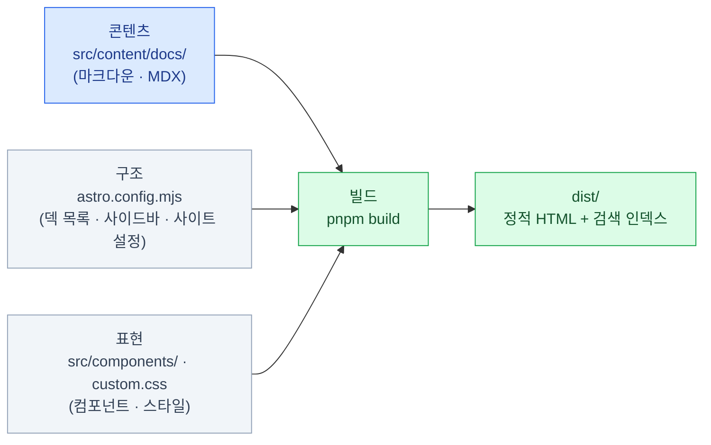

import { Card, CardGrid, LinkCard } from '@astrojs/starlight/components';
import TermIntro from '../../../components/TermIntro.astro';

> 이 덱의 예제는 전부 **지금 보고 있는 이 사이트**다 — 읽다가 궁금하면 레포를 열면 된다

<TermIntro
  terms={[
    ['SSG', 'Static Site Generator', '정적 사이트 생성기. 빌드 시점에 모든 페이지를 HTML 파일로 미리 만들어 둔다. 요청마다 서버가 페이지를 조립하지 않으므로 **서버가 필요 없고, 싸고, 빠르다.** Starlight가 이 부류다.'],
    ['docs-as-code', '', '문서를 코드처럼 다루는 방식 — 마크다운 파일을 git으로 버전 관리하고, diff로 리뷰하고, 빌드해서 배포한다. 이 레포의 운영 방식 그 자체다.'],
    ['마크다운', 'Markdown', '평문에 가까운 경량 마크업. `#` 제목, `**굵게**` 같은 기호로 서식을 준다. 이 사이트의 모든 본문이 이것이다 — 정확히는 컴포넌트를 얹은 MDX(4장).'],
    ['프론트매터', 'Frontmatter', '마크다운 파일 맨 위 `---` 사이의 메타데이터 블록. 본문이 아니라 **페이지의 속성**(제목·설명)이다. 이 값이 사이드바 라벨과 검색 결과에 쓰인다.'],
    ['Starlight', '', 'Astro 위에 만들어진 문서 사이트 프레임워크. 헤더·사이드바·검색·다크모드 같은 뼈대를 전부 주고, 우리는 마크다운 폴더만 채운다.'],
  ]}
/>

## 이 덱은 누구를 위한 것인가

- **이 사이트를 고치거나 덱을 새로 만들** 사람 — 지금은 소유자 한 명이지만, 미래의 자신 포함
- 스터디 노트를 어디에 쌓을지 고민하며 **노션·위키·문서 사이트 사이에서** 저울질하는 사람
- 마크다운은 써 봤는데 **MDX·컴포넌트·빌드가 뭘 하는 물건인지** 감이 없는 사람

전제하는 것: 마크다운 기본 문법, git, 터미널에서 명령 실행.
전제하지 않는 것: Astro나 프론트엔드 프레임워크 경험, JavaScript 숙련도.

### 다루는 것과 다루지 않는 것

<CardGrid>
<Card title="다룬다" icon="approve-check">
문서 도구 지형과 **Starlight를 고른 이유**.

Astro의 최소한 — 아일랜드 · 콘텐츠 컬렉션.

Starlight의 구조 — 라우팅 · 사이드바 · topics.

**MDX가 무엇이고 어디서 깨지는지**.

내장 컴포넌트의 역할 분담과 커스텀 컴포넌트 작성.

축적·검색·참조에 맞는 **문서 작성법**.

빌드 · 검색(Pagefind) · Cloudflare Pages 배포.
</Card>
<Card title="다루지 않는다" icon="close">
Astro로 하는 일반 웹앱 개발 (SSR · API 라우트 · DB).

React · Vue 등 UI 프레임워크 자체 (→ [프론트엔드 덱](/frontend/)).

CSS 일반론과 디자인 시스템 (→ [shadcn 덱](/shadcn/)).

Starlight 전체 API 레퍼런스 — 공식 문서로 링크만 한다.

블로그 · 마케팅 사이트 등 문서 아닌 사이트 유형.
</Card>
</CardGrid>

## 왜 노션이 아니라 문서 사이트인가

학습 노트는 쓰는 날보다 **다시 찾는 날이 훨씬 많다.** 그래서 요구사항이
"쓰기 편한가"가 아니라 "쌓이고, 검색되고, 참조되는가"로 바뀐다.
이 관점에서 도구를 보면 갈림길이 분명해진다.

| 요구 | 노션 · 위키 | docs-as-code (이 레포) |
|---|---|---|
| 본문의 소유 | 그 서비스 안의 데이터 | **내 레포의 마크다운 파일** |
| 버전 관리 | 페이지 히스토리 (제한적) | git — diff · 되돌리기 · 브랜치 |
| 코드 블록 · 다이어그램 | 되지만 이식 불가 | 하이라이트 · mermaid가 표준 문법 |
| 대량 리팩터링 | 페이지 단위 수작업 | `grep` · 일괄 치환 · 빌드가 검증 |
| AI 에이전트와 협업 | API 통해 간접 | **파일이라서 직접 읽고 쓴다** |
| 진입 장벽 | 없음 — 누구나 바로 | 마크다운 · git을 알아야 한다 |

마지막 줄이 유일한 대가다. 편집자가 개발자(또는 개발 도구를 쓰는 사람) 하나뿐인
이 레포에서는 대가가 사실상 없고, 나머지 줄을 전부 가져간다.
편집자가 비개발자 여럿이라면 결론이 달라진다 — 그 갈림길은 [1장](/starlight/01-landscape/)에서 다룬다.

:::tip[핵심]
이 선택의 본질은 Starlight냐 다른 SSG냐가 아니라 **"본문을 파일로 소유하는가"** 다.
파일이면 git · grep · 에이전트 · 빌드 검증이 전부 따라오고, 도구는 나중에 갈아탈 수도 있다.
:::

## 미리 잡아두는 멘탈 모델 — 3층 분리

이 사이트에서 무언가를 고칠 때, 손대는 파일은 항상 셋 중 한 층에 있다.

- **콘텐츠** — 글을 쓰고 고치는 일의 거의 전부. 마크다운만 만지면 되고, 이 덱의 4~7장이 여기다
- **구조** — 덱을 추가하거나 장 순서를 바꿀 때만 연다. 3장이 여기다
- **표현** — 새 시각 패턴이 필요할 때만. 6장이 여기다

층이 분리되어 있어서 **글을 고치다 실수해도 사이트 구조가 깨지지 않고**, 그 역도 성립한다.
노션 같은 WYSIWYG 도구는 세 층이 한 화면에 뭉쳐 있다 — 편하지만, 층별로 검증하거나
버전 관리할 수 없는 이유이기도 하다.

## 이 덱의 기준

**Starlight 0.41 · Astro 7, 2026년 8월** 기준이다. Starlight는 아직 1.0 전이라
마이너 버전에서도 동작이 바뀔 수 있다 — 업그레이드 전에
[docs/starlight-changes.md](https://github.com/mechurak/study-starlight/blob/main/docs/starlight-changes.md)를 본다.

그리고 다시 한번 — **예제는 전부 이 레포다.** 장마다 "이 레포에서는"이 나오는 이유이고,
이 덱이 공식 문서를 베낀 요약이 아니라 **선택과 운영의 기록**인 이유다.

## 0장 요약

- 대상은 **이 사이트를 고치거나 비슷한 것을 만들려는 사람**, 예제는 이 레포 자체
- 노션 대신 문서 사이트인 이유는 **본문을 파일로 소유**하기 위해서다 — git · 검색 · 에이전트 협업이 따라온다
- 멘탈 모델은 3층 분리: **콘텐츠**(`src/content/docs/`) / **구조**(`astro.config.mjs`) / **표현**(`src/components/`)
- 기준은 Starlight 0.41 · Astro 7 (2026-08) — 예제가 레포와 다르면 레포가 맞다

<LinkCard
  title="1. 문서 도구의 지형"
  description="노션부터 Docusaurus까지 — 문서를 두는 곳 세 부류, 후보 비교, 그리고 왜 Starlight였나."
  href="/starlight/01-landscape/"
/>
