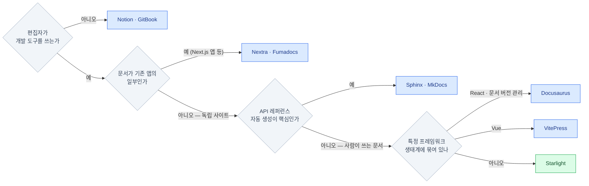

import { Card, CardGrid, LinkCard } from '@astrojs/starlight/components';
import TermIntro from '../../../components/TermIntro.astro';

> 도구 비교의 첫 질문은 기능이 아니라 **"누가 편집하는가"** 다

<TermIntro
  terms={[
    ['WYSIWYG', 'What You See Is What You Get', '노션·워드처럼 화면에서 서식을 바로 보며 편집하는 방식. 진입 장벽이 없는 대신 **산출물이 파일이 아니라 그 서비스 안의 데이터**가 된다.'],
    ['하이드레이션', 'Hydration', '서버가 보낸 HTML에 브라우저가 JS를 다시 붙여 상호작용을 살리는 과정. 앱에는 필수지만 **읽는 게 전부인 문서에는 대부분 낭비**다 — 문서 도구 선택의 숨은 갈림길.'],
    ['i18n', 'Internationalization', '다국어 지원. 문서 프레임워크들이 내장 여부로 경쟁하는 기능 중 하나 — 이 사이트는 한국어 단일이지만 설정은 i18n 구조(`locales`) 위에 있다.'],
    ['테마', 'Theme', '문서 프레임워크에서 "사이트 껍데기 한 벌" — 레이아웃·색·컴포넌트 묶음. Starlight 자체가 Astro의 문서 테마이고, 그 위에 또 테마 플러그인(rapide)을 얹을 수 있다.'],
  ]}
/>

## 문서를 두는 곳은 세 부류다

"문서 어디에 쓰지"의 선택지는 많아 보이지만, **본문이 어디에 사는가**로 가르면 세 부류로 정리된다.

<CardGrid>
<Card title="SaaS 위키" icon="document">
**Notion · Confluence · Slite**

본문이 그 서비스의 DB에 산다. 편집은 가장 편하고 협업 기능이 강하다.
대가는 이식성 — 내보내기는 되지만 서식·구조가 뭉개지고, 외부 공개·커스터마이즈가 제한된다.
</Card>
<Card title="문서 호스팅 서비스" icon="cloud-download">
**GitBook · ReadMe · Mintlify**

git 연동은 되지만 렌더링·검색·테마를 서비스가 쥔다.
"docs-as-code의 편집 + SaaS의 운영"이라는 절충. 팀 요금제가 붙고, 커스터마이즈는 서비스가 허용한 만큼만.
</Card>
<Card title="docs-as-code SSG" icon="seti:git">
**Starlight · Docusaurus · VitePress · MkDocs**

본문이 내 레포의 마크다운이고, 빌드도 배포도 내가 쥔다.
자유도와 소유권이 최대인 대신 **초기 설정과 운영이 내 몫**이다. 이 레포의 선택.
</Card>
</CardGrid>

0장에서 봤듯 이 레포의 요구는 축적·검색·참조 + 파일 소유였으므로 세 번째 부류로 좁혀졌다.
남은 것은 그 안에서 어느 SSG인가다.

## docs-as-code 진영의 후보들

2026년 기준, 문서 특화 SSG의 주전급은 이렇다.

| 도구 | 기반 | 만든 곳 | 특징 한 줄 |
|---|---|---|---|
| **Starlight** | Astro | Astro 팀 | 기본 zero-JS · 검색/i18n/다크모드 내장 · 프레임워크 무관 컴포넌트 |
| Docusaurus | React | Meta | 가장 큰 생태계 · **문서 버전 관리**(v1/v2 병행 문서) · 블로그 내장 |
| VitePress | Vue | Vue 팀 | 가볍고 빠름 · Vue 생태계 표준 · 커스터마이즈는 Vue로 |
| MkDocs Material | Python | 커뮤니티 (오픈소스 + 스폰서) | Python 생태계 표준 · 플러그인 성숙 · 마크다운 확장 문법이 독자적 |
| Nextra / Fumadocs | Next.js | 커뮤니티 | Next.js 앱에 문서를 **끼워 넣을 때** — 문서가 앱의 일부인 경우 |
| Sphinx | Python | Python 프로젝트 | docstring에서 **API 문서 자동 생성** — 라이브러리 레퍼런스용 |
| mdBook | Rust | Rust 프로젝트 | 책 형태 문서 — 단순하고 빠르지만 확장성이 좁다 |

전부 마크다운 + git + 정적 빌드라는 뼈대는 같다. 갈리는 지점은
**① 무엇이 내장인가**(검색·i18n·다크모드를 조립해야 하나) 와
**② 커스터마이즈할 때 어떤 기술을 요구하는가**(React냐 Vue냐 Python이냐) 다.

## 갈림길이 되는 질문들

이 레포는 질문 네 개를 전부 오른쪽 아래로 통과했다 — 편집자는 개발 도구를 쓰고,
문서는 독립 사이트이고, API 자동 생성이 아니라 사람이 쓰는 학습 노트이고,
특정 프레임워크에 묶일 이유가 없었다.

## 왜 Starlight였나

결승에 남는 것은 보통 Starlight와 Docusaurus다. 이 레포가 Starlight를 고른 이유 —

### 기본값이 문서에 맞다

Docusaurus는 React 앱이다 — 문서 페이지에도 React 런타임이 실리고 하이드레이션이 돈다.
Starlight는 Astro의 **zero-JS 기본값**(2장) 위에 있어서 문서 페이지가 거의 순수 HTML로 나간다.
읽는 게 전부인 사이트에서 이 차이는 로딩 속도와 모바일 체감으로 그대로 나타난다.

### 조립할 게 없다

검색(Pagefind) · 다크모드 · 목차 · i18n · 접근성 · SEO(canonical·sitemap)가 **전부 내장**이다.
MkDocs나 VitePress에서 플러그인을 골라 조립해야 하는 것들이 첫 빌드부터 그냥 있다.
혼자 운영하는 사이트에서는 "고를 자유"보다 **"고르지 않아도 되는 기본값"** 이 크다.

### 컴포넌트가 프레임워크에 묶이지 않는다

본문 확장이 필요하면 Astro 컴포넌트를 만들면 되고(6장), 정말 필요하면
React든 Vue든 섞어 넣을 수도 있다. 이 레포의 `TermIntro`·`DeckMap` 같은 컴포넌트는
전부 순수 Astro라 **클라이언트 JS를 하나도 만들지 않는다.**

### 필요한 만큼만 손댈 수 있다

frontmatter 한 줄 → 내장 컴포넌트 → 커스텀 컴포넌트 → 컴포넌트 override(사이드바 교체 같은
UI 수술)까지, 개입의 사다리가 촘촘하다. 이 레포는 사다리를 실제로 끝까지 썼다 —
덱 드롭다운 사이드바가 override의 산물이다(6장).

:::caution[함정 — 정직한 단점]
Starlight는 **아직 0.x다.** 마이너 업그레이드가 breaking일 수 있고, 이 레포처럼
override를 쓰면 업그레이드 때 맞춰 고칠 각오가 필요하다. 커뮤니티 플러그인 수도
Docusaurus보다 적다. "가장 안전한 선택"이 아니라 **"이 요구에 가장 맞는 선택"** 이었다.
:::

## 선택이 달라지는 경우

같은 비교를 다른 상황에 대입하면 결론이 바뀐다 — 이 표가 이 장의 재사용 가치다.

| 상황 | 추천 | 이유 |
|---|---|---|
| 편집자가 비개발자 여럿 | Notion · GitBook | git이 진입 장벽이다 — 도구가 아니라 사람에 맞춘다 |
| 제품 문서 + 버전별 문서 병행 | Docusaurus | v1/v2 문서 버전 관리가 내장 · 생태계 최대 |
| Vue 프로젝트의 공식 문서 | VitePress | 생태계 관례 — 기여자가 이미 아는 도구 |
| Python 라이브러리 레퍼런스 | Sphinx · MkDocs | docstring 자동 추출이 본체 |
| Next.js 서비스 안의 /docs | Nextra · Fumadocs | 앱과 문서가 한 배포 단위 |
| **개인·소규모 학습 노트, 독립 사이트** | **Starlight** | 내장 기본값 + zero-JS + 필요한 만큼의 커스터마이즈 |

### 이미 고른 뒤에 오는 추천 — 갈아타기는 다른 문제다

위 표는 전부 "처음 고를 때" 기준이다. 운영 중인 사이트에 새 도구를 추천받으면
— 실제로 Fumadocs를 추천받은 적이 있다 — 판정에 **전환 비용**이 추가된다.

Fumadocs로 그 판정을 해 보면: Starlight가 "설정하면 완성된 문서 사이트"라면
Fumadocs는 "문서 사이트를 조립하는 부품 세트"에 가깝다. React 컴포넌트를 본문에
자유롭게 심고 문서를 Next.js 앱의 일부로 넣을 때 강한데, **그 강점이 여기서는 살 데가 없다** —
이 사이트는 독립 정적 사이트이고 React 런타임이 필요한 지점이 없다.
반면 전환 비용은 전방위다:

- **본문이 Starlight 문법에 물려 있다** — `:::tip` aside, `<Steps>`·`<Tabs>` 내장 컴포넌트를 전 페이지가 쓴다
- **커스텀 컴포넌트 전부 재작성** — `TermIntro`·`DeckMap`·사이드바 override는 Astro 컴포넌트라 React로 다시 써야 한다
- **파이프라인 재구축** — mermaid 통합, topics 기반 덱 구조, Pagefind 검색(대체제인 Orama는 한국어 토크나이징을 따로 설정해야 한다)

:::tip[재사용할 판정 절차]
새 도구 추천은 두 단계로 판정한다 — ① 위 갈림길 트리에 다시 넣어 **처음부터라도 그걸
골랐을지** 보고, ② 아니라면 끝, 맞더라도 **전환 비용이 새 강점을 넘는지** 계산한다.
"더 좋은 도구인가"가 아니라 "**갈아탈 만큼** 좋은가"가 질문이다.
:::

## 1장 요약

- 문서 도구는 **본문이 어디에 사는가**로 세 부류다 — SaaS 위키 / 호스팅 서비스 / docs-as-code SSG
- docs-as-code 후보들의 차이는 **내장 범위**와 **커스터마이즈에 요구되는 기술**이다
- Starlight를 고른 이유: 문서에 맞는 zero-JS 기본값, 검색·다크모드·i18n **내장**, 프레임워크 무관 컴포넌트, 촘촘한 개입 사다리
- 단점도 있다 — 0.x의 불안정성, 상대적으로 작은 생태계. 상황이 다르면 선택도 달라진다
- 운영 중에 받은 도구 추천(Fumadocs 등)은 **갈아타기 판정**이다 — 트리 재통과에 더해 전환 비용까지 계산한다

<LinkCard
  title="2. Astro — 밑에 깔린 것"
  description="zero-JS 기본값과 아일랜드, .astro 컴포넌트, 콘텐츠 컬렉션 — Starlight를 이해하는 데 필요한 만큼의 Astro."
  href="/starlight/02-astro/"
/>
