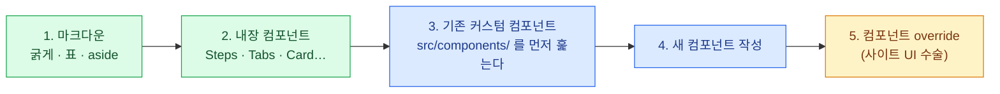

import { LinkCard } from '@astrojs/starlight/components';
import TermIntro from '../../../components/docs/TermIntro.astro';

> 컴포넌트를 만들 실력보다 중요한 것은 **만들지 않을 판단**이다 — 사다리를 아래 칸부터 밟는다

<TermIntro
  terms={[
    ['Props', 'Properties', '컴포넌트가 밖에서 받는 값. 태그의 속성으로 넘기고, 컴포넌트 안에서 `Astro.props`로 받는다. TypeScript `interface Props`를 쓰면 잘못된 사용을 빌드가 잡는다.'],
    ['스코프 스타일', 'Scoped Style', '컴포넌트 `<style>`이 **그 컴포넌트의 HTML에만** 적용되는 것. Astro의 기본 동작 — 클래스 이름 충돌을 걱정하지 않아도 되는 이유.'],
    ['override', 'Component Override', 'Starlight가 자기 UI 부품(사이드바·헤더 등)을 내 컴포넌트로 **교체할 수 있게 열어 둔 공식 구멍.** config의 `components` 항목으로 선언한다.'],
    ['slot', '', '컴포넌트 태그 사이에 쓴 자식 콘텐츠가 들어가는 자리. `<slot />`을 템플릿에 두면 그 위치에 자식이 렌더된다 — 이 레포 컴포넌트는 대부분 slot 대신 props를 쓴다.'],
  ]}
/>

## 언제 만드는가 — 개입의 사다리

시각적 표현이 필요할 때, 아래 칸부터 순서대로 검토한다. 위 칸으로 올라갈수록
만드는 비용과 유지보수 비용이 커진다.



4번으로 올라가는 신호는 하나다 — **같은 시각 패턴을 세 번째 복붙하고 있을 때.**
이 레포의 `TermIntro`(용어 상자)와 `DeckMap`(덱 구성 지도)이 그렇게 태어났다.
한 번 쓸 강조를 위해 컴포넌트를 만들지 않는다.

3번 칸을 건너뛰지 않는 것도 규칙이다 — `src/components/demos/`에는 이미 데모·시각화
컴포넌트가 여럿 있다(`UiSurface` · `ThemeCompare` · `ColorScale` 등, 주로 shadcn 덱용).
비슷한 것이 있으면 만들지 말고 넓힌다.

## .astro 컴포넌트의 해부 — TermIntro를 예제로

이 페이지 첫머리의 용어 상자가 `src/components/docs/TermIntro.astro`다. 뼈대만 추리면 —

```astro
---
/*
  장 첫머리의 "처음 나오는 말" 상자.        ← ① 머리 주석: 왜 있는지 + 사용법
  terms: [용어, 풀 이름(없으면 ''), 한 줄 설명][]
*/
interface Props {                            // ② 받는 값의 타입 — 오용을 빌드가 잡는다
  title?: string;
  terms: [string, string, string][];
}
const { title = '이 장에서 처음 나오는 말', terms } = Astro.props;
---
                                             {/* ③ 템플릿 — 빌드 때 HTML로 굳는다 */}
<div class="terms">
  <div class="terms__title">{title}</div>
  <dl>
    {terms.map(([word, full, desc]) => (
      <div class="terms__row"> … </div>
    ))}
  </dl>
</div>

<style>                                      /* ④ 스코프 스타일 — 이 컴포넌트에만 */
  .terms { … }
</style>
```

네 부분의 역할 분담이 이 레포 컴포넌트의 표준형이다 —

- **① 머리 주석** — "왜 이 컴포넌트가 존재하고 props를 어떻게 주는지"를 파일 맨 위에.
  CLAUDE.md가 컴포넌트 문서를 따로 두지 않고 **머리 주석을 가리키는** 이유다.
  고치기 전에 읽는 것도, 여기에 적는 것도 규칙이다
- **② Props interface** — 필수/선택과 타입을 선언. 본문에서 잘못 쓰면 빌드 에러
- **③ 템플릿** — 2장에서 본 대로 클라이언트 상태 없음, 빌드 때 한 번 렌더
- **④ 스코프 스타일** — 다음 절

## 스타일 캡슐화와 다크 모드

컴포넌트의 `<style>`은 기본이 스코프라서, `.terms` 같은 평범한 클래스 이름을
사이트 전역과 충돌 걱정 없이 쓴다. 지켜야 할 것은 셋 —

- **색은 Starlight CSS 변수부터.** `var(--sl-color-gray-5)` · `var(--sl-color-accent)` 처럼
  테마 변수를 쓰면 라이트/다크가 공짜로 맞는다. 하드코딩 색은 폴백으로만 —
  `var(--sl-color-gray-7, #f4f4f5)`
- **테마 변수로 안 되는 곳만 `[data-theme='dark']` 로 직접 대응한다.** 스코프 스타일에서
  루트의 테마 속성을 참조하려면 `:global()`이 필요하다 —

  ```css
  :global([data-theme='dark']) .terms {
    background: var(--sl-color-gray-6, #27272a);
  }
  ```

- **사이트 전역 조정은 컴포넌트가 아니라 `src/styles/custom.css`.** 컴포넌트 스타일은
  자기 안에서 끝나야 한다 — 전역을 건드리는 컴포넌트는 디버깅 불가능한 결합을 만든다

## 문자열을 HTML로 넣을 때 — set:html의 안전 규칙

props로 받은 설명 문자열에 `` `코드` ``나 `**굵게**` 를 허용하고 싶을 때가 온다
(TermIntro·DeckMap이 정확히 이 경우다). 마크다운 파서를 통째로 부르는 대신,
이 레포의 패턴은 **escape 먼저, 치환은 최소만** —

```ts
const escape = (s: string) =>
  s.replace(/&/g, '&amp;').replace(/</g, '&lt;').replace(/>/g, '&gt;');
// 비탐욕(.+?) 매칭이라 굵게 안에 `*`가 있어도 깨지지 않는다
const format = (s: string) =>
  escape(s)
    .replace(/`(.+?)`/g, '<code>$1</code>')
    .replace(/\*\*(.+?)\*\*/g, '<strong>$1</strong>');
```

순서가 안전의 전부다 — **escape가 먼저**라서 props에 태그가 들어와도 문자 그대로
보일 뿐 실행되지 않고, 그 위에 code와 strong 두 개만 살린다.
`set:html`을 쓰는 자리에는 반드시 이런 관문을 둔다.

## 본문에서 쓰기

```mdx
import TermIntro from '../../../components/docs/TermIntro.astro';

<TermIntro
  terms={[
    ['용어', 'Full Name', '한 줄 설명 — `코드`와 **굵게**가 된다'],
  ]}
/>
```

- import 경로는 상대 경로다 — 공용 문서 컴포넌트는 `../../../components/docs/`, 데모는 `../../../components/demos/`
- **본문에는 태그 하나만 남긴다.** 데이터는 props로, 모양은 컴포넌트 안에 —
  본문 파일에서 시각 조정을 하고 싶어지면 컴포넌트를 고칠 때다
- `client:*` 지시자는 붙이지 않는다 — 이 레포 본문 컴포넌트는 전부 정적이다(2장)

## override — 사이트 UI를 교체하는 마지막 칸

본문 컴포넌트가 "페이지 안"의 도구라면, override는 **사이트 껍데기**를 바꾼다.
Starlight의 기본 UI 부품 자리에 내 컴포넌트를 선언하는 방식이다 —

```js
starlight({
  components: {
    // 검색 결과에 덱 이름을 표시 — Pagefind meta 주입
    MarkdownContent: './src/components/layout/MarkdownContent.astro',
    // 덱 목록을 드롭다운으로 접는다
    Sidebar: './src/components/layout/Sidebar.astro',
    // 헤더에 "[토글] Study Note / <현재 덱>"
    SiteTitle: './src/components/layout/SiteTitle.astro',
  },
})
```

이 레포의 사이드바 드롭다운·접기 토글·헤더 덱 표시가 전부 이 세트다.
각 파일의 머리 주석에 "왜 이 구조인가"가 있고, **고치기 전에 그걸 먼저 읽는 것**이 규칙이다.

:::caution[함정 — override는 업그레이드 부채다]
override한 컴포넌트는 Starlight 내부 구조에 기대는 만큼, **Starlight 업그레이드 때
깨질 수 있는 지점**이 된다. 그래서 사다리의 마지막 칸이다 — CSS나 plugin으로 될 일을
override로 하지 않고, 하게 되면 머리 주석에 이유와 기대는 지점을 남긴다.
:::

## 6장 요약

- 사다리 순서 — 마크다운 → 내장 → **기존 컴포넌트 훑기** → 새로 만들기 → override.
  만드는 신호는 "같은 패턴 세 번째 복붙"
- `.astro` 표준형 네 부분 — **머리 주석**(왜 + 사용법) / Props interface / 템플릿 / 스코프 스타일
- 색은 `--sl-color-*` 변수부터, 다크 대응은 `:global([data-theme='dark'])`, 전역 조정은 `custom.css`로 분리
- `set:html` 앞에는 반드시 **escape → 최소 치환** 관문
- override는 사이트 UI 수술이자 **업그레이드 부채** — 마지막 수단, 이유는 머리 주석에

<LinkCard
  title="7. 문서답게 쓰기"
  description="슬라이드가 아니라 문서 — 제목이 목차가 되는 설계, 문제→해법 서술, 표와 그림의 분업, 검색을 위한 글쓰기."
  href="/starlight/07-writing/"
/>
