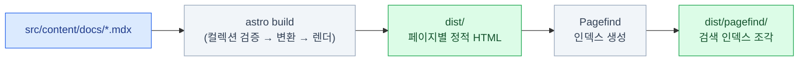

import { Steps, LinkCard } from '@astrojs/starlight/components';
import TermIntro from '../../../components/docs/TermIntro.astro';

> 빌드는 문법을 보증하고, 브라우저는 렌더를 보증한다 — **무엇을 고쳤는지에 따라 판정자가 다르다**

<TermIntro
  terms={[
    ['Pagefind', '', '빌드 산출물(HTML)에서 **정적 검색 인덱스**를 만드는 도구. 검색 서버 없이 브라우저가 인덱스 조각만 내려받아 검색한다. Starlight에 내장 — 설정 없이 빌드가 만든다.'],
    ['sharp', '', 'Astro가 이미지 처리에 쓰는 **네이티브 라이브러리.** 설치 시 바이너리 빌드가 필요해서, CI 환경에서 빌드 스크립트가 막히면 `astro build`가 통째로 깨지는 단골 지점.'],
    ['canonical', '', '"이 페이지의 정식 주소"를 검색엔진에 알리는 링크 태그. config의 `site` 값으로 생성된다 — 도메인이 둘이어도 검색엔진이 한 주소로 모으는 장치.'],
    ['preview 배포', 'Preview Deployment', '`main`이 아닌 브랜치를 푸시하면 그 브랜치만의 임시 URL로 배포되는 것. 본 사이트를 건드리지 않고 실물을 확인하는 수단.'],
  ]}
/>

## pnpm build가 하는 일



산출물 `dist/`는 **정적 파일 전부**다 — 서버 코드가 없으므로 아무 정적 호스팅에나 올릴 수
있고, 로컬에서도 `npx serve dist -l 4323`으로 배포와 같은 물건을 확인할 수 있다.
검색 인덱스가 빌드 산출물이라는 점이 중요하다 — **검색은 배포 시점의 스냅샷**이고,
dev 서버의 검색과 실배포의 검색이 다를 수 있는 이유다.

## dev와 build는 다른 물건이다

| | `astro dev` | `astro build` |
|---|---|---|
| 변환 시점 | 페이지 요청 때 그때그때 | 전체를 한 번에 |
| 잡는 에러 | 지금 보는 페이지 것만 | **전 페이지** — 안 열어 본 페이지 포함 |
| topics·링크 검증 | 느슨 | sidebar slug 참조 오류로 실패 |
| 검색 | 동작하지만 인덱스가 다름 | Pagefind 정식 인덱스 |

그래서 규칙은 단순하다 — **고치는 동안은 dev, 끝났으면 반드시 build.**
dev에서 멀쩡했는데 build가 깨지는 것은 대부분 topics slug 오타이거나
안 열어 본 페이지의 MDX 문법이다(4장).

이 레포에서 dev 서버는 백그라운드로 띄운다 — `astro dev --background`
(`astro dev stop` / `status` / `logs`로 관리). 터미널을 점유하지 않아서
빌드·grep을 같은 셸에서 돌릴 수 있다.

## 빌드가 잡는 것, 못 잡는 것

빌드 통과를 "다 됐다"로 읽으면 안 되는 이유 — 판정자가 다른 문제들이 있다.

| | 문제 | 판정자 |
|---|---|---|
| 잡는다 | MDX 문법 · import 오류 · 프론트매터 누락 · topics slug 오타 | `pnpm build` |
| **못 잡는다** | mermaid 문법 오류 (변환은 되고 **렌더는 클라이언트**) | 브라우저 — 라이트/다크 둘 다 |
| **못 잡는다** | 닫는 `**` 깨짐 (4장 — 화면에 별표가 그대로) | build 후 `grep` |
| **못 잡는다** | 모바일 폭 넘침 (표·컴포넌트가 390px를 뚫는 것) | 브라우저 390px |
| **못 잡는다** | 제목 수정으로 바뀐 앵커 slug (링크가 조용히 죽음) | 참조하는 쪽 grep |

브라우저 검증은 **무엇을 고쳤는지에 맞춰 고른다** — 덱을 수정했다고 전부 돌리지 않는다.

| 변경 | 검증 |
|---|---|
| 문장 · 문단 · 링크 | `pnpm build`만 |
| 표 · 컴포넌트 추가 | build + 모바일 390px 넘침 |
| mermaid 추가 · 수정 | build + **라이트/다크 렌더** 확인 |
| 테마 · `custom.css` · config | 전수 스윕 (페이지×테마당 4초 — 백그라운드로) |

:::caution[함정 — Tabs 안의 다이어그램]
비활성 탭은 `hidden`이라 Playwright로 mermaid 개수를 셀 때 안 잡힌다.
`document.querySelectorAll('[role="tabpanel"]').forEach(p => p.hidden = false)` 로
전부 열고 나서 센다. 검색 확인은 콘텐츠 수정 때는 생략한다 —
빌드가 통과하면 거의 안 깨지고, Starlight·Pagefind 업그레이드 때만 본다.
:::

## 검색 — Pagefind의 동작

Pagefind는 빌드된 HTML의 **본문 영역을 그대로 인덱싱**한다. 이 사실에서 성질이 다 나온다 —

- 서버가 없다 — 브라우저가 질의에 필요한 인덱스 조각만 내려받는다 (전체 인덱스 다운로드가 아니다)
- 한국어도 별 설정 없이 동작한다 — `lang="ko"`(config의 locales)를 보고 처리한다
- **본문에 없는 말은 검색되지 않는다** — 7장의 "검색어를 본문에 실제로 쓴다"가 규칙인 이유
- 인덱싱 대상은 렌더된 HTML이다 — `_` 파일과 `exclude` 페이지는 애초에 HTML이 없으니 안 잡힌다

이 레포의 커스터마이즈 한 가지 — 검색 결과에 어느 덱의 문서인지 표시하기 위해
`MarkdownContent` override로 Pagefind meta를 주입한다(6장의 그 세트).

## 배포 — Cloudflare Pages

**GitHub 연동으로 `main`에 푸시하면 자동 배포**된다. 브랜치를 밀면 preview URL이
따로 생긴다 — 테마나 config를 크게 바꿀 때는 브랜치로 preview를 먼저 본다.
상세 절차와 대시보드 설정은 [docs/deploy.md](https://github.com/mechurak/study-starlight/blob/main/docs/deploy.md)가 원본이고, 여기서는 **밟아 본 함정 둘**만 —

### PNPM_VERSION을 박아야 한다

`pnpm-workspace.yaml`은 이 레포에서 워크스페이스 용도가 아니라 **`allowBuilds`
(esbuild·sharp의 빌드 스크립트 허용) 설정용**이다. 그런데 `allowBuilds`는 pnpm 10.26에서
들어온 문법이고, Cloudflare 빌드 이미지의 기본 pnpm은 그보다 낡았다 —
버전을 지정하지 않으면 **필드가 무시되고, sharp가 안 빌드되고, `astro build`가 깨진다.**
그래서 Pages 환경 변수에 `PNPM_VERSION`이 박혀 있다 (Node는 `.nvmrc` 파일로 고정).

### site와 canonical

도메인이 둘이다 — 커스텀 `study.upggu.com`(정식)과 기본 `study-starlight.pages.dev`.
config의 `site`가 커스텀 도메인이라 **양쪽 페이지 모두 canonical이 정식 주소를 가리키고**,
검색엔진이 한 주소로 모은다. 도메인을 바꾸면 `site`를 반드시 같이 고친다 —
안 고치면 새 도메인이 옛 도메인을 정식이라고 광고하는 상태가 된다.

## 콘텐츠 수정의 전체 흐름

<Steps>

1. dev 서버를 백그라운드로 띄우고 고친다

   ```bash
   astro dev --background   # http://localhost:4321
   ```

2. 끝나면 빌드로 전 페이지를 판정한다

   ```bash
   pnpm build
   ```

3. 고친 것에 맞는 검증만 고른다 — mermaid면 라이트/다크 렌더, 컴포넌트면 390px,
   굵게를 많이 썼으면 `grep -rho '\*\*[^<*]\{0,45\}' dist --include=index.html | sort -u`

4. 커밋 · 푸시는 요청받았을 때만 — `main` 푸시가 곧 배포다

</Steps>

## 8장 요약

- `pnpm build` = 전 페이지 HTML + **Pagefind 인덱스.** 산출물은 순수 정적 파일이다
- dev는 요청 시 변환이라 **안 열어 본 페이지의 에러를 모른다** — 끝나면 반드시 build
- 빌드가 못 잡는 네 가지 — **mermaid 렌더 · `**` 깨짐 · 모바일 넘침 · 앵커 변화** — 는 고친 것에 맞춰 브라우저와 grep으로
- 검색은 본문 그대로의 정적 인덱스 — 본문에 없는 말은 검색되지 않는다
- 배포는 `main` 푸시 = Cloudflare Pages 자동 배포. **PNPM_VERSION 고정**과 **site=canonical**이 밟아 본 함정

<LinkCard
  title="9. 마무리 — 지식베이스 설계와 치트시트"
  description="비슷한 학습 노트를 시작할 때의 설계 판단, 새 덱을 추가하는 절차, 자주 쓰는 명령과 함정 목록."
  href="/starlight/09-wrapup/"
/>
